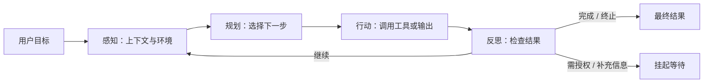

## Agent 与工作流

Agent（智能体）是当前 AI 产品的核心范式：**从回答你的问题到帮你把事情做完**。大模型解决了会说话，Agent 要解决会做事：围绕一个目标，自主地感知环境、调用工具、执行动作、观察反馈，直到任务完成。Agent 的基本机制、工作流与 Agent 的边界、常见架构与产品设计要点；工具调用与 MCP 协议的机制细节见 [工具调用与 MCP](agent-tools.md)，架构模式与多智能体编排见 [Agent 架构与多智能体](agent-architecture.md)。

## 什么是 Agent

Agent = LLM + 工具 + 循环决策。与普通对话相比，Agent 能：

-   **调用工具**：搜索、读文件、操作软件、调 API。
-   **自主规划**：把大任务拆成子任务，决定执行顺序。
-   **感知结果**：执行一步后看结果，再决定下一步。
-   **循环执行**：直到任务完成或达到终止条件。

大模型是 Agent 的大脑，工具是手脚，记忆是上下文连续性，规划是任务分解，权限与评估是工程落地的刹车系统。理解 Agent 的前提是分清模型与 Agent：模型是单次推理能力，Agent 是围绕目标持续行动的系统。

### 感知-规划-行动-反思循环

把 Agent 的运行展开看，是一个持续的循环：

| 阶段 | 做什么 | 产物 |
| --- | --- | --- |
| 感知（Observe） | 收集当前状态：用户目标、工具结果、环境信息 | 更新后的上下文 |
| 规划（Plan） | 决定下一步：直接回答、调用工具、拆解子任务 | 行动决策 |
| 行动（Act） | 执行工具调用或输出内容 | 动作与真实副作用 |
| 反思（Reflect） | 评估结果是否符合预期，决定继续、修正或终止 | 下一轮决策依据 |

工程上的典型流程是：用户提出目标 → 系统构造上下文（指令、历史、记忆、工具列表、环境状态）→ 模型生成下一步（回答、工具调用或计划更新）→ 工具执行器执行动作 → 系统收集工具结果 → 模型根据结果继续推理 → 达到停止条件后输出最终结果。



核心关系：Agent 通过感知、规划、行动与反思循环推进任务，并在完成、失败或需要人介入时离开循环。

**停止条件**是循环设计里常被忽略的一环，没有停止条件的 Agent 会无限烧 token。常见停止条件有：

-   任务完成，输出最终结果。
-   达到最大轮数/最大步数。
-   达到预算上限（token 数或金额）。
-   工具失败且不可恢复。
-   需要用户授权或补充信息（挂起等待，而非失败）。
-   触发安全策略。

一个具体的例子：用户让 Agent 调研三款竞品的定价策略。Agent 先规划为搜定价页 → 提取数字 → 对比汇总，然后循环执行：调用搜索工具（行动）→ 拿到网页摘要（感知）→ 判断信息是否足够（反思）→ 不够就换关键词再搜（规划）→ 信息齐了输出对比表（终止）。整个过程模型自主决定每一步，但每一步的权限与预算由产品预先设定。

### 与普通对话的本质差异

普通对话是一问一答：模型接收输入，输出文本，应用层只负责展示。Agent 的关键差异在于**模型主动决定下一步**：它可以选择调用某个工具、改变计划、请求澄清，甚至主动停止，而不只是回答。差异可以归纳为四点：

-   **控制权转移**：执行路径不再由代码预先写死，而由模型按上下文动态决定。工作流是代码调度模型，Agent 是模型调度工具。
-   **有真实副作用**：工具调用可能发消息、改数据、花钱，错误代价从说错升级为做错，安全边界比普通聊天产品重要一个量级。
-   **有状态**：多步任务需要记住中间进度、已尝试的路径与失败原因，不能每次从零开始；长任务还要跨会话恢复。
-   **需要边界**：没有权限、预算与停止条件约束的 Agent 会失控。自主度是产品光谱而非开关，要从辅助、半自主逐步放到全自主。

### Agent 循环的工程实现

把上面的循环落到工程上，需要四个组件配合：

-   **模型调用层**：把当前上下文（系统指令、历史、工具结果、记忆）打包发给模型，并解析模型输出：是普通文本、工具调用，还是终止信号。
-   **工具执行器（Tool Executor）**：模型只生成工具名 + 参数，真正执行的是宿主程序。执行器负责权限校验、超时控制、结果回填与错误归一化。
-   **上下文管理器（Context Manager）**：决定每一轮模型看到什么：历史怎么截断、工具结果要不要摘要、记忆怎么注入。上下文工程是 Agent 质量的重要变量，详见 [Agent 架构与多智能体](agent-architecture.md) 的记忆系统一节。
-   **循环控制器（Loop Controller）**：检查停止条件（最大步数、预算、超时）、处理重试与降级、在确认节点挂起等待人工。

工程实现里有两个容易踩的坑。一是**把模型的内部推理全部暴露给用户**：规划过程可以作为进度展示，但完整思维链既干扰阅读又增加安全风险，一般保存为 trace 或压缩成可解释摘要。二是**工具结果原样塞回上下文**：长输出会挤爆上下文，工具结果要先结构化、裁剪、摘要再回填。

### Agent 与 Chatbot、Copilot、Workflow 的区别

产品语境里四个概念经常混用，先分清定义再谈设计：

| 概念 | 核心特点 | 适合场景 | 主要风险 |
| --- | --- | --- | --- |
| Chatbot | 多轮问答，主要生成文本 | FAQ、客服、知识问答 | 不擅长真实执行 |
| Workflow | 预定义流程，步骤固定 | 审批、报表、数据处理 | 灵活性有限 |
| Copilot | 人机协作，用户主导 | 编码、写作、办公辅助 | 依赖用户判断 |
| Agent | 目标驱动，自主规划与工具执行 | 研究、编码、运营、自动化 | 不可控风险更高 |

判断标准：流程固定优先 Workflow；需要用户持续监督适合 Copilot；需要系统自主拆解、执行、迭代才需要 Agent；只是问答就不要过度设计成 Agent。很多产品失败在于把确定性工作流错误地做成了不可控 Agent。

```mermaid
flowchart TB
    task["新任务"] --> fixed{ "步骤能预先枚举？" }
    fixed -->|是| workflow["Workflow"]
    fixed -->|否| verify{ "结果能自动验证？" }
    verify -->|是| agent["Agent"]
    verify -->|否| fallback["先补验证与人工兜底"]
    workflow --> audit["固定路径、易审计"]
    agent --> guardrail["动态路径、需护栏"]
```

核心关系：能枚举的流程优先固定编排，只有在路径不可预知且具备验证与兜底时才释放 Agent 的自主决策。

### 核心技术栈

一个完整 Agent 系统可以拆成九层，产品经理不必懂每层的实现，但要在设计评审时能逐层检查是否有缺失：

| 层 | 职责 | 产品经理要关心的 |
| --- | --- | --- |
| 模型层 | 推理、工具选择、规划、自然语言交互 | 模型选型与评测（见 [模型能力与边界](capabilities.md)） |
| 提示词与指令层 | system prompt、工具说明、策略约束、输出格式 | 提示词版本管理与回归 |
| 工具层 | function calling、MCP、浏览器、代码执行器、业务 API | 工具清单、权限与质量 |
| 规划层 | ReAct、Plan-and-Execute、任务拆解、动态重规划 | 最大步数、计划可见性 |
| 记忆层 | 会话历史、任务状态、长期偏好、项目知识 | 隐私、遗忘、用户控制权 |
| 上下文工程层 | 哪些信息进上下文、如何压缩、裁剪、注入 | token 成本与上下文预算 |
| 权限与安全层 | 工具审批、沙箱、敏感数据检测、审计日志 | 确认节点与最小权限 |
| 执行与编排层 | 状态机、重试、超时、并发、持久化、回滚 | 失败恢复与断点续跑 |
| 评估与观测层 | tracing、日志、成本、延迟、成功率、人工验收 | 通过率基线与上线回归 |

这九层里，最容易被产品团队砍掉的是评估与观测层：没有 trace 和评测，Agent 的失败无法复现，信任也无从建立。九层是检查表，不是九篇专页。关键层映射：

| 层 | 展开页 |
| --- | --- |
| 模型层 | [模型能力与边界](capabilities.md) |
| 提示词与指令层 | [提示词工程](prompting.md)、[高级提示词技巧](prompt-advanced.md) |
| 工具层 | [工具调用与 MCP](agent-tools.md) |
| 规划层 | [Agent 架构与多智能体](agent-architecture.md) |
| 记忆层 | [Agent 架构与多智能体](agent-architecture.md) |
| 上下文工程层 | [高级提示词技巧](prompt-advanced.md)、[Agent 架构与多智能体](agent-architecture.md) |
| 权限与安全层 | [工具调用与 MCP](agent-tools.md)、[提示词安全](prompt-security.md) |
| 执行与编排层 | [Agent 架构与多智能体](agent-architecture.md) |
| 评估与观测层 | [评估与评测](evaluation.md) |

### 状态与记忆是 Agent 的隐含要求

Agent 的有状态来自记忆系统，产品经理至少要知道四类记忆的分工：

-   **会话记忆（短期）**：当前对话与最近的工具结果，维持单次任务的连续性。
-   **任务记忆（工作记忆）**：当前任务的目标、计划、进度、已完成步骤与失败尝试，任务结束可压缩成摘要。
-   **长期记忆**：跨会话的用户偏好、稳定事实与经验，支持个性化与连续任务（用户偏好正式语气这类信息）。
-   **工具记忆**：哪些工具过去有效、哪些经常失败，用于提高工具选择的成功率。

记忆不是记住越多越好：错误记忆比没有记忆更危险，隐私与遗忘机制是硬要求。记忆系统的设计展开见 [Agent 架构与多智能体](agent-architecture.md) 的记忆系统一节。

### 为什么 2025-2026 年 Agent 从 Demo 走向工程系统

几个因素的合流让 Agent 从演示好看变成生产可用：

-   **模型工具调用能力增强**：主流模型能更稳定地输出结构化工具调用、理解工具错误并修复计划。
-   **协议标准化**：MCP 标准化了应用如何接入工具与上下文，A2A 标准化了 Agent 服务之间如何通信，工具生态不再为每个应用写私有连接器。
-   **框架成熟**：OpenAI Agents SDK、LangGraph、CrewAI 等框架提供了 handoff、guardrails、tracing、记忆与持久化执行等工程能力。
-   **编码 Agent 证明价值**：Claude Code、Codex 等工具在真实代码仓库中读写文件、跑测试、提 PR，验证了 Agent 能独立完成有验收标准的任务。
-   **评测体系成形**：SWE-bench、WebArena、τ-bench 等基准让 Agent 不再只靠 demo 评估。

对产品经理的意义：Agent 的工程底座已经成熟到可以按产品逻辑设计，而不是赌模型能力。

## 工作流 vs Agent

工作流（Workflow）与 Agent 是两种不同的系统形态，Anthropic 官方（[Building Effective Agents](https://www.anthropic.com/engineering/building-effective-agents)）给出了业界最常用的定义：

-   **工作流**：LLM 与工具被**预先编排的代码路径**调度。每一步做什么、按什么顺序，由开发者在代码里写死，模型只在节点内部发挥作用。特点是步骤固定、输出可预期、可审计。
-   **Agent**：LLM **动态决定自己的执行过程**与工具使用。系统只给目标与工具集，模型自己决定先做什么、用什么工具、何时结束。特点是灵活、能处理开放任务，但结果不可完全预期。

### 对比

| 维度 | 工作流 | Agent |
| --- | --- | --- |
| 执行路径 | 预先编排，固定 | 模型动态决定 |
| 可控性 | 高，路径可审计 | 低，需要护栏与确认点 |
| 成本 | 可控，调用次数可预测 | 高，循环越多越贵，错误会累积 |
| 适用场景 | 步骤明确、要求稳定的任务 | 开放式问题、步骤不可预测 |
| 失败模式 | 节点失败，易定位、易重试 | 有状态地累积，难复现、难回滚 |
| 对用户的意义 | 可预测、可承诺 | 更强大，但需要信任机制 |

### 官方原则：先用工作流

Anthropic 的原则是「先找最简单的方案，只在评测证明必要的时候增加复杂度」。很多应用优化单次 LLM 调用（加检索、加上下文示例）就够了，不必上 Agent。判断一个任务是否值得 Agent 化，依次问三个问题：

1.  步骤能否预先枚举？——能，用工作流
2.  结果能否自动验证？——不能，先补验证闭环再谈自主
3.  出错能否恢复？——不能，先设计兜底与人工接管

三者都答否，才值得上 Agent。官方点名的两个已验证领域是客服（对话 + 工具，可测解决率）与编码 Agent（可用自动化测试验证结果）。反过来，报销审批、身份认证、支付转账这类强合规流程，天然属于工作流。

### 工作流 vs Agent 的决策表

把三个判断问题做成决策表，评审时可以直接对照：

| 任务特征 | 倾向 | 理由 |
| --- | --- | --- |
| 步骤固定、可枚举 | 工作流 | 无需模型决策，确定性更便宜更稳 |
| 步骤不可预测、需要探索 | Agent | 模型按上下文动态决策 |
| 工具固定 | 工作流 | 不需要动态选工具 |
| 需要动态选工具 | Agent | 工具选择本身就是决策 |
| 结果有清晰验证规则 | 工作流 + 评估节点 | 可自动校验，无需人工 |
| 结果难以自动验证 | Agent + 人工复核 | 需要人在关键节点兜底 |
| 高风险、强合规 | 工作流 + 审批 | 路径可审计，责任可追溯 |
| 低到中风险、可人工兜底 | Agent | 自主换效率，错误可控 |

经验原则一句话：**可枚举、可审计、强合规的任务优先工作流；需要探索、推理、动态选择工具的任务适合 Agent；生产系统里用工作流管大边界，让 Agent 处理局部不确定性。**

### 工作流的五类官方模式

Anthropic 总结了五类覆盖大多数确定性流程的工作流模式，复杂度与回报从低到高：

-   **提示词链（Prompt Chaining）**：固定顺序的步骤链，上一步的输出是下一步的输入，适合把复杂任务拆成可校验的小段（如先写大纲再成文）。
-   **路由（Routing）**：先分类再分流，把简单问题给快模型、复杂问题给强模型，或按任务类型分给不同的专门流程。
-   **并行化（Parallelization）**：扇出-扇入（任务切成多块同时做再合并）与投票（多个独立尝试取多数结果），适合可拆分、相互独立的工作。
-   **编排者-工作者（Orchestrator-Workers）**：主管模型拆任务、派发给子代理、汇总结果，适合无法预知子任务粒度的复杂任务。
-   **评估者-优化者（Evaluator-Optimizer）**：生成器产出 + 评估器反馈 + 迭代优化，适合能明确写出评估标准的生成任务（如翻译、润色、代码修改）。

这些模式的机制展开见 [Agent 架构与多智能体](agent-architecture.md) 的核心设计模式一节。选型的顺序建议：先确认是否真的需要 Agent，如果不需要，从五类模式里选最贴近需求的一类，跑通后再加自主度。

### 生产里的混合形态

真实产品很少纯工作流或纯 Agent，更多是混合：**工作流管大边界，Agent 处理局部不确定性**。例如企业客服：用工作流控制转人工、升级、结案的关键节点，用 Agent 负责理解意图与生成回复；数据报表：工作流固定取数步骤，Agent 只负责解释异常。先按工作流跑通，评测发现某段流程需要动态决策，再把那一段换成 Agent：这是官方推荐的演进路径，也是成本最低的路径。

## 常见架构

| 架构 | 说明 | 适用场景 | 代价 |
| --- | --- | --- | --- |
| 单 Agent | 一个模型 + 一组工具 | 任务边界清晰、中等复杂度 | 上下文有限，长任务易漂移 |
| 工作流 (Workflow) | 预先编排的步骤，每步调模型/工具 | 流程固定、要稳定 | 灵活性差，流程设计成本高 |
| 多 Agent 协作 | 多个 Agent 分工（写手+审稿+排版） | 复杂任务、质量要求高、可并行 | 成本 ×N、协调与调试难 |
| 人机协同 | Agent 执行 + 关键节点人工确认 | 风险高、结果不可逆 | 依赖人的响应时效 |

### 各类架构的适用场景与代价

-   **单 Agent**：一个模型实例 + 一组工具 + 一个循环。多数 Agent 产品的起点，也常常是终点：先单 Agent，评测证明收益后再复杂化。代价是单一上下文窗口有限，超长任务会忘掉早期信息。典型例子：单任务写作助手、单工具知识库问答。
-   **工作流**：把确定性流程固化成代码路径，确定性决策用规则，非确定性决策在节点内调模型。适合要稳定、要审计的场景；代价是流程设计成本高，需求一变就要改代码。典型例子：审批流、报表生成流水线、内容审核链路。
-   **多 Agent 协作**：多个角色分工，适合重度并行、信息量超出单一上下文窗口、需要隔离不同权限的场景；代价是成本成倍上升、上下文重复、错误跨 Agent 传播、调试难度大幅上升。典型例子：多角色研究团队（研究员 + 审稿人）、编码流水线（规划 + 实现 + 审查）。
-   **人机协同**：不是独立架构，而是横切在所有架构上的控制方式：关键节点让人确认、可回退。风险越高、结果越不可逆，人工介入点越多；代价是任务吞吐依赖人的响应时效。典型例子：代码提交前 review、营销文案发布前审批。

### 什么时候选多 Agent

多 Agent 不是能力放大器的免费午餐。适合的场景有三个特征：任务天然可拆（每个子任务边界清晰）、子任务可以并行、不同子任务需要不同工具或权限。官方实测表明多 Agent 的 token 消耗约为普通对话的 15 倍，且 token 用量单独解释了约 80% 的评测差异：收益本质是花钱买并行度与上下文隔离。反过来说，需要共享同一上下文、Agent 间强依赖的任务（多数编码任务属于此类）不适合多 Agent。

各架构模式的机制展开（提示词链、路由、并行化、编排者-工作者、ReAct、Plan-and-Execute、反思等）与多智能体编排的代价分析见 [Agent 架构与多智能体](agent-architecture.md)。

## 产品设计要点

Agent 产品的设计重心是**代理权、信任与失败恢复**：决定权、执行权与风险从人转移到系统，产品经理要设计的是系统能在多大范围内自主、在什么节点请人确认、出错后如何恢复。

-   **任务边界**：明确 Agent 能自主到什么程度：权限最小化。能读不能写、能草稿不能发送、能查自己的数据不能查别人的。边界是第一设计决定，不是工程细节：它决定了出事故时的责任范围与补救成本。
-   **进度可见**：展示正在做什么、用了什么工具，建立信任。执行中的当前步骤、调用的工具、依据都要可见，用户能中途插入、暂停、接管。Anthropic 把显式展示 Agent 的规划步骤列为透明度优先项。
-   **确认节点**：花钱、发消息、删数据等不可逆操作必须人工确认；可逆操作不打扰用户。确认点设在风险点而不是每个步骤：全量确认会毁掉 Agent 的体验，全不确认会毁掉信任。拒绝时把反馈回传给模型，让它在下一轮改进。
-   **失败兜底**：Agent 会卡住、会走弯路。设置最大步数、超时、人工接管；Agent 的错误会**有状态地累积**，不能靠无限重试：要区分可重试的瞬时错误与反复失败的系统性问题，后者立即降级或转人工，而不是继续烧 token。
-   **成本控制**：多轮循环 token 消耗大，需要预算上限与档位。成本公式 = 输入 token × 输入价 +（输出 + 思考）token × 输出价，再乘上循环轮数：一个 5 轮循环的任务，成本是单次调用的 5 倍以上。预算用尽要有显式降级路径：从全自主降为每一步确认或转人工。
-   **可观测性**：每次模型调用与工具调用都要有 trace：输入输出、工具参数与结果、耗时、token 消耗、错误与重试。没有 trace 就无法复现失败、审计权限、构造评测集，也就无法回答为什么这次它选错了工具。这是 Agent 与普通聊天产品最不同的工程要求。

### 成本预算算例

以自动生成行业调研报告为例：单任务平均 8 轮循环，每轮 3000 输入 token + 1500 输出 token。按输入 $2 / 百万 token、输出 $10 / 百万 token 计算：

```text
单轮 = 3000 × $2 / 10^6 + 1500 × $10 / 10^6 = $0.006 + $0.015 = $0.021
单任务 = 8 × $0.021 = $0.168
```

| 规模 | 算法 | 月成本量级 |
| --- | --- | --- |
| 每月 1000 个任务 | 1000 × $0.168 | 约 **$168** |
| 每月 10 万个任务 | 100000 × $0.168 | 约 **$1.68 万** |

到十万次调用量级，就要限制每任务轮数、降档模型，或把循环改成工作流。缓存命中、批处理、off-peak 可再降 50%–90%，先测真实命中率。单价以 [模型能力与边界](capabilities.md) 的官方定价快照为准，上线前用真实 prompt 重算。

预算设计三件套：**每任务预算上限**（超限降级）、**每用户档位**（免费档限制轮数与工具）、**全局告警**（成本异常时暂停并转人工）。成本控制的目标不是省钱，而是让成本与用户价值成正比：这需要每任务成本的可观测性，回到 trace。

### 自主度分级：辅助 → 半自主 → 全自主

| 级别 | 特征 | 产品设计含义 |
| --- | --- | --- |
| 辅助 | 建议、草稿、可覆写 | 无执行风险，重点是内容质量与上下文 |
| 半自主 | Agent 执行 + 关键节点人工确认 | 确认点设在风险点；不可逆操作必须确认 |
| 全自主 | 自动执行、自动纠错 | 必须有验证闭环与预算护栏（步骤上限、成本上限） |

分级不是一次性决定，而是随信任增长的动态过程：模型反复触发拦截或失败时，系统应自动回退到更保守的交互方式，避免无人值守运行静默失控。放行全自主之前，先回答一个问题：错误是否被约束在可回滚范围内？

### 设计评审清单

评审 Agent 产品时逐项过一遍，比凭感觉判断够不够智能可靠得多：

-   **权限**：工具清单是否最小？有没有工作目录/网络/数据边界？非白名单动作是否默认拒绝？
-   **护栏**：输入/输出/工具三层检查是否齐备？触发后是否快速失败且不产生副作用？
-   **恢复**：是否有持久化检查点？失败后能否从断点续跑？人工能否在任何节点接管？
-   **成本**：步骤预算（最大步数）、并发上限、超时、成本上限是否配置？预算用尽时的降级路径是什么？
-   **可观测性**：步骤日志、工具调用、token 消耗是否可见？规划步骤是否对用户透明？
-   **评测**：是否有评测集与通过率基线？模型/提示词/工具变更是否跑回归？
-   **信任基线**：回答带来源、失败透明、可回退：没有这三样，不要放大代理权。

### 代理权要赚取，不要授予

每多给系统一分代理权，就少一分控制：建议式回复可以覆写，自动发送就必须确保正确。常见错误是系统还没证明犯错时可控就直接上全代理：失去可见性、失去信任、动作无法追溯。正确姿势是**控制交接**：出错时人类能无缝接管，Agent 做错一步，用户能一键纠正并记录，信任和可恢复性从这一步开始。产品上的落地手法包括：回答带来源（可点击回到依据）、失败透明（如实展示失败路径）、可回退（checkpoint 让状态可回滚到任意历史点）。

## 与 RAG 的关系

Agent 经常包含检索能力（Agentic RAG），但两者不是一回事：

-   **RAG** 解决知识从哪来：把外部文档切块、索引、检索，让模型基于证据回答。检索流程通常是固定的先检索再生成。
-   **Agent** 解决事情怎么做：Agent **决定**要不要检索、检索什么、怎么利用结果，检索只是它可选的工具之一。

Agentic RAG 是把 RAG 融入 Agent 循环：模型根据问题动态决定是否检索、检索几次、检索结果不够时是否换关键词或换数据源、是否需要把多份证据交叉验证。它比固定 RAG 灵活，但也引入了检索失败的传播：检索质量差会直接污染后续所有步骤。

| 维度 | 固定 RAG | Agentic RAG |
| --- | --- | --- |
| 检索触发 | 固定流程，先检索再生成 | 模型按需决定是否检索 |
| 检索轮数 | 通常一轮 | 可多轮，可换查询与数据源 |
| 查询改写 | 无 | 模型根据结果改写查询 |
| 失败处理 | 检索不到就直接答 | 可换工具、换来源、请求澄清 |
| 复杂度 | 低 | 高，检索失败会沿循环传播 |

RAG 基础见 [RAG 基础](rag.md)，高级检索与 Agentic RAG 的展开见 [高级 RAG](rag-advanced.md)。

### 常见误区

-   **把 RAG 当 Agent**：只做了检索 + 生成，没有决策循环，遇到检索不到就直接答：这是工作流，不是 Agent。
-   **把 Agent 当 RAG**：给 Agent 挂了知识库工具就以为解决了事实性问题：检索质量、切块策略、引用溯源仍然决定答案质量，Agent 不改变检索本身的好坏。
-   **检索失败沿循环传播**：Agentic RAG 里第一步检索差，后续所有推理都建立在坏证据上。要给检索环节加验证：结果为空、置信度低时换查询、换数据源或如实承认不知道。
-   **来源不可信的内容当指令**：检索回来的网页与文档可能包含恶意提示词，要按不可信数据处理（见 [提示词安全](prompt-security.md) 与 [工具调用与 MCP](agent-tools.md) 的工具安全一节）。

## 当前边界（务实的预期管理）

-   复杂长程任务成功率仍有限。商用场景普遍是工作流 + 人工复核，不是全自动无人值守；演示场景可控，真实场景千变万化，上线前要用真实数据压测。
-   多 Agent 协作的成本与不稳定可能超过收益。Anthropic 官方实测：多 Agent 系统的 token 消耗约为普通对话的 15 倍，且 token 用量单独解释了约 80% 的评测差异：多 Agent 的收益本质是花钱买并行度与上下文隔离，先量化收益再决定值不值。
-   评测先行。放权前先有可量化的通过率/解决率基线，信任额度 = 评测证据；约 20 个代表性 query 就能发现早期大问题，人工测试会抓到自动评测抓不到的问题。对会改变状态的 Agent，要评测终态而非逐轮打分。
-   模型与框架迭代快。工具调用正确率、长程任务成功率都在快速提升，但当前边界是动态的：选型与架构决策要跟着评测结果刷新，而不是一次定终身。
-   工程差距大于模型差距。Anthropic 团队明确指出「原型到生产的差距往往比预想的大，最后一公里常常占了大部分旅程」：权限、护栏、持久化、可观测性这些工程补齐，才是 Agent 上线的真正门槛。

### Computer Use：从 API 工具到屏幕操作

通识 Agent 默认讨论的是结构化工具（函数、MCP、浏览器 API）。另一条已经产品化的路线是 **Computer Use**：模型看截图或无障碍树，输出点击、键入、滚动、拖拽。产品化要单独验收三件事：感知输入（分辨率、多显示器、暗色主题）、动作空间（坐标 vs 元素 ID）、不可逆操作的确认闸门。不要把 WebArena 成功率当成线上能力。机制与论文见 [Agent 与 Computer Use](agent-computer-use-frontier.md)。

上线顺序与下一节相同：只读 → 建议 → 受控写入 → 自动执行，屏幕操作尤其不能跳过确认。

### 上线路径：从只读到自动执行

Agent 上线不是开关，而是权限与自动化程度的渐进式释放，每一步都有对应的验证目标：

| 阶段 | 能力 | 验证目标 | 放行条件 |
| --- | --- | --- | --- |
| 只读 | 检索、分析、建议 | 回答质量、工具选择正确率 | 评测集通过率达标 |
| 建议 | 生成草稿、可覆写输出 | 采纳率、修改率 | 用户主动采纳且修改少 |
| 受控写入 | 执行 + 关键节点人工确认 | 确认准确率、误操作率 | 确认点覆盖全部不可逆操作 |
| 自动执行 | 全自主 + 护栏 | 终态正确率、人工接管率 | 错误可回滚、有止损机制 |

常见错误是跳过前两阶段直接上自动执行。放行条件不满足时，宁可维持半自主 + 人工复核：多数商用 Agent 长期停留在这个阶段，这本身就是务实的产品决策。

???+ example "练习"
    选一个你熟悉的重复性工作（如「汇总周报并生成摘要」），设计：它需要哪些工具、哪些步骤、哪些节点需要人工确认、成本上限怎么定。再回答：它是工作流还是 Agent？为什么？

## 来源说明

> 本文为原创整理，结论均引用以下权威来源，访问验证日期 2026-09-04：

1.  [Anthropic — Building Effective Agents](https://www.anthropic.com/engineering/building-effective-agents)：工作流与 Agent 的定义与取舍、「先简单后复杂」原则、五类工作流模式、透明度建议。
2.  [Anthropic — How We Built Our Multi-Agent Research System](https://www.anthropic.com/engineering/multi-agent-research-system)：多 Agent 实测数据、token 成本量级（15 倍）、错误累积与「最后一公里」。
3.  [OpenAI — Agents 指南](https://developers.openai.com/api/docs/guides/agents)：Agent 官方定义（规划、调用工具、保持状态完成多步工作）。
4.  [评估与评测](evaluation.md)：评测体系与评测先行原则的站内展开。
5.  [Agent 与 Computer Use](agent-computer-use-frontier.md)：GUI grounding 与屏幕操作的论文与产品化验收。
6.  AIGC-Interview-Book《AI Agent 基础》系列：仅供维护者交叉验证的本地预取材料，读者以 Anthropic / OpenAI 官方文档为准。
