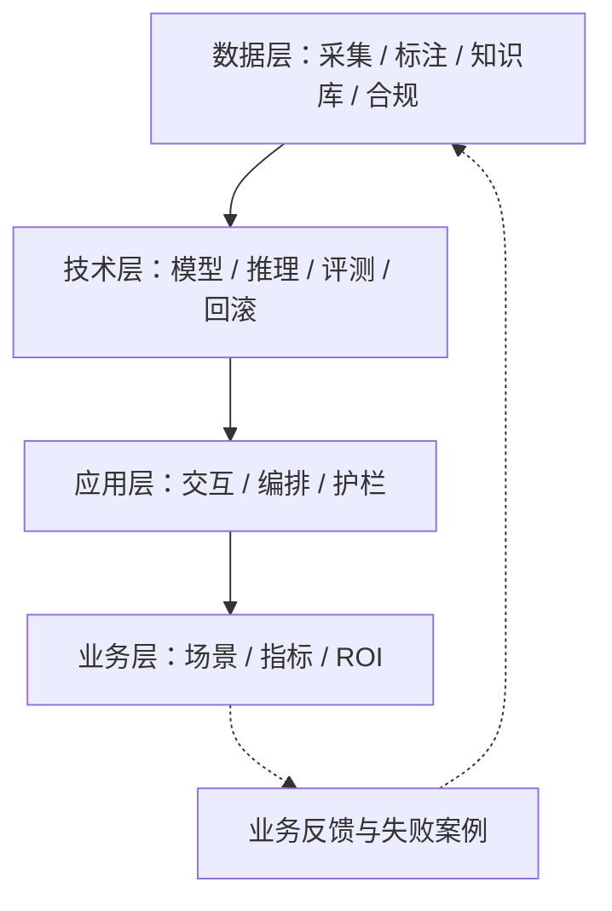

## AI 系统架构：给产品经理的四层地图

描述一个 AI 系统，不能停在「接了一个大模型 API」。立项前要说清：方案动哪些层、每层花多少钱、哪些层还没想清楚。本页是给产品经理的**业务 / 应用 / 技术 / 数据四层地图**；请求如何穿过网关、服务、数据库与队列，见 [系统架构基础](../tech/architecture.md)。两页互补，不要互相替代。

用**四层地图**：业务、应用、技术、数据。每一层回答不同的问题，产品经理在每一层有不同的动作：

-   **业务层**：为什么做、值不值
-   **应用层**：用户怎么用、越界怎么办
-   **技术层**：模型怎么跑、怎么不翻车
-   **数据层**：燃料从哪来、合不合规

核心关系：数据决定燃料与合规边界，技术决定能力与成本上限，应用承接用户体验，业务层用指标验证价值并把反馈送回数据层。

这张地图有三个典型使用时刻：

-   **讲清系统**：面试或汇报时，用四层描述你负责的 AI 系统
-   **判断落地**：拿到一个新 AI 方案，快速判断要动哪些层、哪些层没想清楚
-   **体检找薄弱**：对现有产品逐层过一遍，找出最薄弱的层

## 为什么 PM 要懂架构

架构不是技术同学的专利。不懂架构的 PM，会在三个时刻吃瘪：

-   **可行性**：拍脑袋要「AI 自动生成周报」，技术层却告诉你私有化部署的模型做不到：你需要在立项前就判断技术层能不能做。
-   **成本**：同样功能，用大模型 API 一个月几万块，还是微调小模型更划算？成本由每一层的选择决定，而选择需要 PM 参与。
-   **演进**：上线三个月后要「加一个场景」，动哪一层？要「换更强的模型」，又动哪一层？没有地图，每次改动都是盲盒。
-   **沟通**：跟工程师聊需求，你说「用户体验」，他说「参数规模」，中间缺的就是分层语言：四层是 PM 与技术的共同词汇。

| 层 | 系统里对应什么 | PM 关心什么 |
| --- | --- | --- |
| 数据 + 技术 | 燃料、模型、推理、评测、回滚 | 成本上限、能不能做、合不合规 |
| 应用 | 交互、编排、护栏 | 用户怎么用、越界怎么办 |
| 业务 | 场景、指标、ROI | 值不值得做 |

下层定上限，上层定方向。应用层是 PM 日常主战场。

## 四层地图

### 1. 业务架构：AI 嵌入在哪里

**它是什么**：AI 能力如何嵌入业务流程与价值链：在哪个环节取代人、在哪个环节增强人。它回答「这个 AI 用在流程哪一步、省了什么、如何量化」。

**PM 的动作**：

-   **选场景**：挑价值链上最痛、数据最多、容错率最高的环节切入
-   **定义业务指标**：工单平均处理时长下降多少
-   **算投入产出**：人力节省 × 单价 vs 模型调用成本。ROI 算不清，项目立不住

**典型问题**：「客服 80% 的工单是重复咨询，AI 放在自动回答环节，能省多少人力？」

**典型案例**：

-   **客服**：工单路由（判断转给哪个组）、回复建议（增强人工）、自动解决（取代人工）
-   **营销**：文案生成（增强）、投放策略（增强）、A/B 优化（取代人工试错）

**常见误区**：把 AI 当万能胶，想一次替代所有人工环节。正确姿势是从一个成本最高、路径最清晰的环节切入，跑通再扩。

### 2. 应用架构：用户看到什么

**它是什么**：用户接触的层：交互形态、能力编排、护栏三件套。

-   **交互形态**：对话、画布、Agent……不同形态决定用户的心智模型
-   **能力编排**：模型调用、工具调用、Agent 流程，决定 AI 能完成多复杂的任务
-   **护栏**：内容审核、兜底话术、限流与降级，决定 AI 越界时怎么办

**PM 的动作**：定义交互与能力边界、错误路径、控制权设计：用户何时接管、AI 何时让位。站内 Agent 机制见 [Agent 与工作流](agent.md) 与 [工具调用与 MCP](agent-tools.md)；怎么设计 Agent 产品、怎么做全生命周期管理，见 [Agent 产品](../practice/agent-product.md) 与 [AI 产品开发生命周期（CC/CD）](../pm/ai-lifecycle.md)。护栏与对齐见 [AI 安全与对齐](ai-safety.md)、[提示词安全](prompt-security.md)。

**典型问题**：「用户看到什么、AI 越界了怎么办？」——没有护栏的 AI 客服，会在用户骂人时对骂回去。

**常见误区**：只堆交互功能，不设护栏。护栏是交互设计的一部分：它决定 AI 的失败方式，而失败方式是用户体验。

### 3. 技术架构：模型怎么跑

**它是什么**：模型层（API / 微调 / 开源部署）+ 推理服务（延迟 / 吞吐 / 成本）+ 评测与监控（评测集 / 线上指标 / 回滚）。

**PM 的动作**：

-   **模型选型**：能力 × 成本 × 延迟的三角权衡，档位见 [模型能力与边界](capabilities.md)，怎么挑 API 见 [模型 API 选择](../tools/llm-api.md)
-   **评测体系建设**：没有评测集就换模型，等于闭眼开车，见 [评估与评测](evaluation.md)
-   **安全与回滚**：越权、注入与内容护栏见 [AI 安全与对齐](ai-safety.md)；新模型上线翻车，能不能 5 分钟退回旧版本？

**典型问题**：「换模型影响什么？」——不止效果，还有延迟、单价、评测集重跑、提示词重调。

**常见误区**：只盯模型能力榜单，不看延迟与成本。榜单第一的模型不一定是你这个产品的最优解：能力、成本、延迟永远三者权衡。

### 4. 数据架构：燃料从哪里来

**它是什么**：训练 / 评测 / 反馈数据闭环 + 知识库（私有知识怎么注入，见 [RAG](rag.md)）+ 隐私脱敏与合规。

**PM 的动作**：

-   **定义数据采集与标注需求**：什么数据值得标、谁来标、标准是什么
-   **设计数据飞轮**：用户行为 → 发现失败案例 → 回填评测集 → 改进模型 → 更好的用户行为
-   **合规前置**：数据从哪来、能用吗、脱敏了吗——见 [合规](../practice/compliance.md)

**典型问题**：「数据从哪来、怎么闭环、合规吗？」——很多 AI 项目死在「想用数据时发现没存」，或「合规没过、上线被叫停」。

**常见误区**：上线后再补数据。数据采集通道要从产品第一天就设计好：用户行为不记录，飞轮就永远转不起来。

## 四层关系与 PM 的抓手

四层是相互咬合的系统。这张表汇总每层的核心问题、PM 的抓手和站内延伸页，可以当速查卡用：

| 层 | 核心问题 | PM 关注点 | 相关站内页 |
| --- | --- | --- | --- |
| 业务 | AI 用在流程哪一步、省了什么？ | 选场景、业务指标、ROI | [AI 产品开发生命周期](../pm/ai-lifecycle.md) |
| 应用 | 用户看到什么、越界怎么办？ | 交互与能力边界、护栏、控制权 | [Agent 与工作流](agent.md)、[Agent 产品](../practice/agent-product.md)、[AI 安全与对齐](ai-safety.md)、[提示词安全](prompt-security.md) |
| 技术 | 模型怎么选、怎么不翻车？ | 模型选型、评测体系、回滚 | [模型能力与边界](capabilities.md)、[模型 API](../tools/llm-api.md)、[评估](evaluation.md) |
| 数据 | 数据从哪来、合规吗？ | 采集标注、数据飞轮、合规前置 | [RAG](rag.md)、[合规](../practice/compliance.md) |

两个关系要点：

-   **上层（业务）定方向，下层（技术、数据）定成本与上限**：业务层决定做什么，但技术层决定能不能做，数据层决定能做多好。方向再对，下层不给力也落不了地：这也是 AI 项目常见「业务画饼、技术背锅」的根源。
-   **改产品时从上层往下找影响，评估时从下层往上找风险**：加一个新场景，先看业务层影响，再顺藤摸瓜看应用、技术、数据要动什么；反过来评估一个方案，先查数据合规与技术可行性，风险从下层往上层排查。

## 典型 AI 产品的分层速览：AI 客服

用一个例子把四层串起来：AI 客服。

1.  **业务架构**：客服是成本中心，目标是降本（自动解决率）与体验（响应时长）；AI 放在「自动回答 → 解决不了转人工」的流程环节。
2.  **应用架构**：对话窗口 + 工单流转 + 人工接管按钮；护栏包括敏感内容拦截、兜底话术（转人工）、限流。
3.  **技术架构**：API 大模型 + 评测集（拿历史工单建种子集）+ 线上指标（自动解决率、转人工率、投诉率）+ 回滚预案。
4.  **数据架构**：历史工单做 RAG 知识库；用户点踩、转人工等行为回填错误案例，形成回答与路由的修正闭环；数据脱敏后再用。

一个「接个大模型 API」的需求，实际是四个层的系统工程。哪一层没想清楚，上线就会在哪一层出问题。

## 两张参考栈

对话 + RAG：用户请求 → 应用层编排（会话、引用、拒答）→ 检索服务读知识库 → 模型生成 → 护栏与引用校验 → 日志回填评测集。观测要打在检索命中、生成忠实度和转人工。

Agent + 工具：用户目标 → 规划与循环 → 工具网关（权限、确认、幂等）→ 外部系统 → 结果回填上下文 → 终态验收。观测要打在每一步 trace、工具选择和不可逆操作闸门。多模态输入只是多一路感知，栈仍落在应用层与数据层。

多租户时把密钥、知识库和日志按租户切开；追踪 id 从请求贯穿模型调用与工具调用。

## 各层反模式

| 层 | 反模式 | 检查问句 |
| --- | --- | --- |
| 业务 | 用模型能力代替场景与 ROI | 失败代价和省下的人工算过没有 |
| 应用 | 只做主路径，没有护栏与接管 | 越界时用户看到什么 |
| 技术 | 只盯榜单，没有评测集和 5 分钟回滚 | 换模型后谁跑回归 |
| 数据 | 上线后再补采集与合规 | 明天要标的数据今天有没有通道 |

## 收尾

开工前用四层地图做检查清单：哪一层填不出内容，哪一层就是薄弱点。

顺序是：**向上**定方向（业务），**向下**定成本（技术、数据），中间的应用层是 PM 的主战场。四层每一层都重要，差别只在有没有想到。

???+ example "练习"
    拿你正在做（或想象中）的 AI 产品，把四层各填一行：业务用在哪个环节、用户看到什么形态、技术跑了什么模型、数据靠什么闭环。哪一层填不出来，哪一层就是薄弱点。

## 来源说明

本文结构参考「人工智能产品经理最佳实践」课程（[zhangziliang04/aipm](https://github.com/zhangziliang04/aipm)）第 8–11 章的业务 / 技术 / 应用 / 数据四层框架，内容已按大模型时代的产品语境重写。引用日期：2026-09-04。站内互补页：[评估与评测](evaluation.md)、[AI 安全与对齐](ai-safety.md)、[Agent 与工作流](agent.md)、[AI 产品开发生命周期](../pm/ai-lifecycle.md)。
