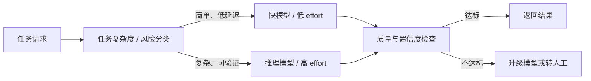

## 模型能力与边界

产品经理先回答「这件事模型做不做得了」，再回答「用哪一档、花多少钱」。机制（幻觉、窗口、温度）见 [大模型基础](llm-basics.md)；许可证与迁移见 [开源与闭源模型生态](model-ecosystem.md)；可变价格与供应商条款见 [LLM API 与供应商](../tools/llm-api.md)。本页后半的型号与价格是 2026-09-04 快照，按季度对照官方页刷新。档位名称以各模型页为准，不是全系全集。

### 做得到与做不到

大模型是条件概率续写器，不是数据库，也不是可靠执行器。下面这些边界决定需求能不能立项，提示词再精巧也跨不过去。

| 任务类型 | 判断 | 产品含义 |
| --- | --- | --- |
| 开放写作、摘要、草稿、解释 | 做得了 | 验收看可用率与返工，不看「一次完美」 |
| 数学、代码、多步规划 | 推理模型更强，仍会错 | 可验证任务接测试或规则；不可验证任务接人工 |
| 私有知识、实时事实 | 单靠参数做不到 | 必须 RAG、搜索或工具，见 [RAG 基础](rag.md) |
| 精确计数、逐字合规、固定字数 | 做不到 | 用程序校验、`max_tokens`、后处理，不靠提示词祈祷 |
| 不可逆操作（付款、删数据、发信） | 不能自动做完 | 权限与确认在宿主，见 [工具调用与 MCP](agent-tools.md) |
| 端侧 / 离线 / 数据不出域 | API 旗舰做不到 | 开源权重私有化，见 [模型推理与部署](llm-inference.md) |

**能力边界之外换方案，不继续调提示词。** 常见误区的展开见 [大模型基础](llm-basics.md) 的「常见误区」与「产品经理的必知结论」。

立项时写清三件事：不可接受的失败是什么、失败时降级到谁、用哪 20–50 条样本验收。评测方法见 [评估与评测](evaluation.md)。

### 通用模型与推理模型的差异

#### 机制：推理模型如何工作

-   **OpenAI**：推理模型在输出前先产生内部推理 token（reasoning tokens），「拆解提示词、考虑多种思路、检查中间结果」后再作答；推理 token 不直接可见，但占用上下文且按输出计费。`reasoning.effort` 参数（none/minimal/low/medium/high/xhigh/max）控制思考深度：档位越高质量越好、延迟与 token 消耗越大，官方建议为推理预留至少 25,000 token 缓冲。新模型还支持交错思考（interleaved thinking），可在思考步骤之间产出可见输出、在工具调用之间继续思考，适合多步 Agent 流程（[OpenAI Reasoning Guide](https://developers.openai.com/api/docs/guides/reasoning)）。
-   **DeepSeek**：Thinking Mode 把思维链直接暴露为 `reasoning_content` 字段，与最终答案 `content` 并列返回；思考默认开启（high 档），`reasoning_effort` 实际映射为 low→low、medium/high/xhigh→high、max→max。工具调用场景：开启 thinking 后每轮必须把 `reasoning_content` 原样传回，否则 API 报错；模型可在回答前执行多轮「思考 + 工具调用」子轮次（[DeepSeek Thinking Mode](https://api-docs.deepseek.com/guides/thinking_mode)）。
-   **Anthropic**：官方文档用「单次作答的模型必须一次全对」解释思考的价值：思考把中间试错变成显式过程，不再压缩进答案或直接跳过，因此在数学、编码、分析与长时间运行的 Agent 任务上显著提升质量。2026 年的 Claude 5 家族已改用自适应思考（adaptive thinking）：模型按请求自行决定是否思考、想多深，`effort` 参数调节整体工作量；思考 token 照常按输出计费，`display` 只控制是否返回摘要（省略摘要可降低延迟、不减成本）（[Anthropic Thinking](https://platform.claude.com/docs/en/build-with-claude/thinking)）。
-   **Google**：Gemini 3.x 全系默认开启动态思考，「根据请求复杂度自动调节推理预算」，可用 `thinking_level`（minimal/low/medium/high）手动控制；思考 token 计入输出价格。多轮对话与工具调用中需把思考块（含签名）原样回传，否则破坏推理连续性（[Gemini Thinking Mode](https://ai.google.dev/gemini-api/docs/thinking-mode)）。

#### 推理预算：四家的「思考旋钮」

| 厂商 | 参数 | 档位 | 关键点 |
| --- | --- | --- | --- |
| OpenAI | `reasoning.effort` | none/minimal/low/medium/high/xhigh/max | 低档偏速度与省 token；高档质量更高 |
| DeepSeek | `reasoning_effort` | low/medium/high/xhigh/max | medium/high/xhigh 实际均映射为 high；默认 high |
| Anthropic | `effort` | 按模型支持，默认 high | 思考默认开启；xhigh/max 下不允许关闭思考 |
| Google | `thinking_level` | minimal/low/medium/high | 默认动态思考，按请求复杂度自动调节 |

四家结论一致：推理预算本质是「质量-延迟-成本」的三角旋钮。档位应设计成可配置策略（按任务类型/用户层级分配），不写死在代码里。各模型支持的档位不同，上表是对照用的全集，落地以官方模型页为准。档位与思考开关的调整还会影响提示词缓存命中，变更时注意缓存前缀失效（[Anthropic Thinking](https://platform.claude.com/docs/en/build-with-claude/thinking)）。

核心关系：模型选型先按任务复杂度分配推理预算，再用质量检查触发升级，从而在能力、延迟与成本之间取得可观测的平衡。

#### 能力差异：强在哪、弱在哪

-   **强项：数学、代码、复杂规划与长链 Agent 任务**。DeepSeek-R1 模型卡显示，经 RLVR（R1-Zero 为纯 RL，R1 含 SFT 冷启动）训练的推理模型在 AIME 2024（79.8 vs o1 的 79.2）、MATH-500（97.3）、LiveCodeBench（65.9 vs 63.4）等基准上对齐甚至超过同代闭源推理模型（[DeepSeek-R1 README](https://github.com/deepseek-ai/DeepSeek-R1)）；Anthropic 文档点名思考改善数学、编码、分析与长时 Agent 任务（[Anthropic Thinking](https://platform.claude.com/docs/en/build-with-claude/thinking)）。
-   **代价：延迟与成本**。思考 token 按输出计费且不可省略；OpenAI 文档明确指出更高 effort 带来更高延迟与 token 用量，语音、分类、快速检索等低延迟交互建议用 none/low effort 或非推理模型（[OpenAI Reasoning Guide](https://developers.openai.com/api/docs/guides/reasoning)）；Gemini 文档同样建议事实检索/分类用 minimal/low 思考，深度编码、数学、多步规划才用最高档（[Gemini Thinking Mode](https://ai.google.dev/gemini-api/docs/thinking-mode)）。

#### 擅长与不擅长的产品场景

| 场景 | 推荐方向 | 依据 |
| --- | --- | --- |
| 数学证明、复杂编程与调试 | 推理模型（旗舰） | 官方基准与文档：DeepSeek-R1、Anthropic Thinking |
| 长链 Agent 规划（多工具、多步） | 推理模型（思考默认开） | OpenAI/Anthropic/Gemini 官方文档 |
| 实时语音、在线客服、低延迟交互 | 快模型或 low/none effort | OpenAI 官方建议；Gemini 文档建议 minimal/low |
| 事实问答、分类、抽取 | 快模型 + 检索/结构化约束 | Gemini 文档；成本与延迟优先 |
| 创意写作、日常闲聊 | 通用（非思考）或低 effort | 思考收益小，纯增成本与延迟 |

**看懂基准再对比**：AIME 与 MATH-500 是数学推理基准，GPQA 是研究生级科学问答，LiveCodeBench 与 SWE-bench 是代码生成与真实工程修复基准；DeepSeek-R1 模型卡上的数字即此类评测（[DeepSeek-R1 README](https://github.com/deepseek-ai/DeepSeek-R1)）。阅读时注意三点：是否官方自报（优先看第三方复测）、采样与温度设置（R1 模型卡注明推荐 temperature 0.6）、是否与自己任务同分布。基准只是初筛，最终以自建评测集为准。

### 主流模型能力速览(2026-08-23 现状)

2025 年，OpenAI o1 与 DeepSeek-R1 把推理模型推上台前；到 2026 年，「思考默认开启 + effort 可调」已成为旗舰模型的标准配置：Claude 5 家族、Gemini 3.x、DeepSeek V4 均默认开启思考，o 系列这类「纯推理专用」模型反而成为遗留选项。选型以各厂商官方文档与定价页为准，下表为概览。

| 厂商 | 代表模型 | 定位 | 参考价(输入/输出,美元/百万 token) |
| --- | --- | --- | --- |
| OpenAI | GPT-5.6 家族(sol/terra/luna) | 最新旗舰推理系列 | sol $4/$20；terra $2/$12；luna $0.20/$1.20 |
| OpenAI | GPT-5.5 / GPT-5-pro | 上代旗舰 / 增强推理 | $5/$30；$15/$120 |
| OpenAI | o3-pro / o4-mini | o 系列(早期推理线) | $20/$80；$1.10/$4.40 |
| Anthropic | Claude Fable 5.1 | 最强，面向长时 Agent | $10/$50 |
| Anthropic | Claude Opus 5 | 复杂编码与企业场景 | $5/$25 |
| Anthropic | Claude Sonnet 5 | 速度与智能的最佳平衡 | $2/$10 |
| Anthropic | Claude Haiku 4.5 | 最快，近前沿智能 | $1/$5 |
| Google | Gemini 3.1 Pro | 3.x 最强推理 | $2/$12（≤200k 输入） |
| Google | Gemini 3.7 / 3.6 Flash | 快模型，Agent 场景 | $0.75/$3.75 |
| DeepSeek | V4-Pro / V4-Flash | 旗舰 / 快模型，思考默认开 | Pro $0.66-1.32/$1.98-3.96；Flash $0.22-0.44/$0.66-1.32 |
| 开源 | Qwen3(0.6B-235B,含 Thinking 版) | 可本地部署，Apache 2.0 | 权重免费；自付推理成本 |
| 开源 | Llama 4(Scout/Maverick) | 开源旗舰，10M/1M 上下文 | 权重免费（许可门控） |
| 开源 | DeepSeek-R1 满血 / 蒸馏 1.5B–70B | 开源推理参照；蒸馏可本地部署，MIT | 权重免费 |

> 注：价格为各官方定价页 2026-09-04 快照，仅作量级参考；长上下文、批处理、缓存、高峰/错峰等另有折扣（OpenAI 缓存输入约省 90%，DeepSeek off-peak 为 peak 的一半），以官方页面为准。

-   **OpenAI**：GPT-5.6 家族为当前主线（sol 旗舰、terra 均衡、luna 低价），能力与价格拉开三个档位；o 系列（o3-pro、o4-mini）仍可调用，定位深度推理。官方思路是「按需分配 effort」而非在模型间手动切换；缓存输入价格约为原价 1/10，批处理再折半（[OpenAI Pricing](https://developers.openai.com/api/docs/pricing)、[Reasoning Guide](https://developers.openai.com/api/docs/guides/reasoning)）。
-   **Anthropic**：四档定价梯度本身就是选型工具：Haiku 4.5 最快最便宜，Sonnet 5 速度智能兼顾，Opus 5 面向复杂编码与企业工作，2026-09-01 发布的 Fable 5.1 为当前最强、面向长时运行 Agent（Fable 5 仍可调用，官方列为 legacy，输入输出同价）；全系支持文本与图像输入，1M 上下文（除 Haiku 4.5 为 200K）；Opus 5 起思考默认开启、effort 默认 high，另有 Mythos 5.1（邀请制，防御性网络安全场景）不在常规选型范围（[Anthropic Models Overview](https://platform.claude.com/docs/en/about-claude/models/overview)、[Fable 5.1](https://platform.claude.com/docs/en/models/fable-5-1/overview)）。
-   **Google**：Gemini 3.x 全系默认思考，分 Pro 与 Flash 两条线；3.1-pro-preview 为当前最强，3.6/3.7-flash 面向速度与 Agent 场景；思考 token 已含在输出价内，Flash 档有免费额度，付费档内容不用于改进产品（[Gemini Pricing](https://ai.google.dev/gemini-api/docs/pricing)）。
-   **DeepSeek**：V4 系列为 2026 年主线，1M 上下文、384K 最大输出，思考默认开启，另有 `deepseek-v4-flash-vision-exp` 实验性视觉模型；API 同时兼容 OpenAI 与 Anthropic 格式。**高峰（peak）** 为 01:00–04:00 与 06:00–10:00 UTC、周一至周五，按 peak 价计费；其余时段与周末为 **off-peak**，价格为 peak 的一半。北京时间周末全天 off-peak。不要把上述 UTC 窗口当成错峰（[DeepSeek Pricing](https://api-docs.deepseek.com/quick_start/pricing)）。
-   **开源代表**：Qwen3（0.6B-235B）支持思考/非思考双模式切换（同一模型内 `enable_thinking` 控制），全系 Apache 2.0 可商用，本地部署生态成熟（vLLM、SGLang、Ollama、llama.cpp）（[Qwen3 README](https://github.com/QwenLM/Qwen3)）；Llama 4 为 Meta 开源旗舰（Scout/Maverick，MoE 架构，上下文 10M/1M），权重需 Meta 许可门控，推理需 4 张 GPU 起步（[llama-models README](https://github.com/meta-llama/llama-models)）；DeepSeek-R1 用 RLVR 训出推理（R1-Zero 为纯 RL，产品化 R1 含 SFT 冷启动），并蒸馏出 1.5B-70B 小模型；32B 蒸馏版在 AIME/MATH 等数学基准上超过 o1-mini（R1 模型卡自报，须第三方复测）（[DeepSeek-R1 README](https://github.com/deepseek-ai/DeepSeek-R1)）。更多模型与研究索引见 [Awesome-LLM](https://github.com/Hannibal046/Awesome-LLM)（聚合索引，仅作入口）。

### 选型维度

-   **能力匹配**：先按任务复杂度选档，再用评测验证（见下文实操清单）。「旗舰一定最好」不成立：简单任务上快模型与旗舰差距极小，却要多付一个量级的钱。
-   **延迟**：思考模型首 token 时间显著更长，且思考量随 effort 档位非线性上升；实时交互场景把首 token 延迟当硬指标，必要时关闭思考或调低 effort。体感优化手段：流式输出、提前预生成、把「等思考」从用户关键路径上移开（如异步任务化）。
-   **成本**：思考 token 按输出计费，预算公式 = 输入 token × 输入价 + (输出 + 思考)token × 输出价；缓存命中、批处理、off-peak 时段可显著降本。算例：100 万次请求、每次 2000 输入 + 500 输出 token，用 GPT-5.6-luna 约 1000 美元，用 sol 约 1.8 万美元。先算量级再选档。
-   **组合策略**：多数产品的最优解是组合：快模型扛常规量、推理模型攻坚难题、检索与代码工具兜底事实与计算；单一模型包办所有任务的形态已基本退出主流（路由做法见下节）。
-   **上下文长度**：1M 上下文（Claude 5 系、DeepSeek V4、Llama 4 Scout）改变了长文档产品形态；但长输入按 token 计费，长上下文与 RAG 是互补关系，不是替代。
-   **多模态**：Claude 5 家族全系支持文本与图像输入；主流旗舰普遍支持视觉输入（以各官方页面为准），多模态输入同样按 token 计费。
-   **隐私与合规**：公共 API 的数据留存与地域策略各异（如 Gemini 付费档内容不用于改进产品）；敏感数据走私有化部署（见下节），并注意开源权重各自的许可证。
-   **生态与工具链**：函数调用/工具使用质量、Agent 框架支持、流式与批处理 API、可观测性。Agent 产品尤其要实测工具调用正确率，不要只看问答类基准。

**选型决策表**（场景 → 关键维度 → 推荐方向）：

| 产品场景 | 优先看 | 推荐方向 |
| --- | --- | --- |
| 数据分析、深度编码、长链规划 | 能力、思考深度 | 推理旗舰（Opus 5、GPT-5.6-sol、Gemini 3.1 Pro） |
| 实时对话、语音助手 | 延迟、成本 | 快模型或低 effort、关闭思考 |
| 意图识别、信息抽取、摘要 | 成本、延迟 | lite/nano 档或本地小模型 |
| 内部知识库、敏感数据 | 隐私、合规 | 开源模型私有化部署 |
| 长文档问答 | 上下文、检索 | 长上下文模型 + RAG |
| 截图/文档/视频理解 | 多模态 | 支持视觉输入的旗舰或快模型 |

### 多模型路由与混合部署

-   **路由思路**：Anthropic 官方工程博客给出可操作做法：简单/常见问题路由给便宜快模型（示例为 Claude Haiku 4.5），难/罕见问题路由给强模型（示例为 Claude Sonnet 4.5，博客写作时点模型，现为 Sonnet 5），并提醒「Agent 系统通常以延迟和成本换取任务表现，应评估这种取舍是否值得」，复杂度只在评测证明有效时引入（[Building Effective Agents](https://www.anthropic.com/engineering/building-effective-agents)）。
-   **两种路由粒度**：模型间路由（快模型 ↔ 推理模型，按任务分类或启发式规则）与模型内路由（同一模型调 `effort` / `thinking_level`，OpenAI none→max、DeepSeek low→max、Gemini minimal→high 各档均可映射为策略）；先做模型内调节，再做模型间路由，并尽量保持提示词与缓存前缀一致。
-   **简单的路由启发式**：输入信号取任务类型（意图识别结果）、输入长度、历史成功率、用户付费层级。示例：客服对话首轮走快模型；代码调试与数据分析走推理模型；用户连续追问两次或前一次低置信时自动升级；用评测集校准阈值，上线后监控每档位的命中率与成本占比。路由本身也需要评测，不要凭感觉切。
-   **何时不路由**：任务形态单一、调用量小、或评测证明两档无差异时，单一模型更简单可靠。「先找最简单的方案，只在评测证明必要时增加复杂度」是官方明确原则（[Building Effective Agents](https://www.anthropic.com/engineering/building-effective-agents)）。
-   **降级链**：路由与失败重试构成兜底：快模型失败或低置信 → 升级到推理模型重试 → 仍失败进人工处理或安全话术；这层逻辑应在产品架构里，而不是靠模型自觉。
-   **落地指标**：上线后持续监控各档位的请求占比、成本占比、延迟分位数与升级率；升级率异常升高说明路由阈值偏激进，成本占比异常说明偏保守。路由策略本身要按数据迭代。
-   **本地部署 vs API 的权衡**：
    -   **数据安全与合规**：开源权重可私有化部署，敏感数据不出域；Qwen3 全系 Apache 2.0、DeepSeek-R1 为 MIT，商用无授权障碍（[Qwen3 README](https://github.com/QwenLM/Qwen3)、[DeepSeek-R1](https://github.com/deepseek-ai/DeepSeek-R1)）；Llama 权重需 Meta 许可门控（[llama-models README](https://github.com/meta-llama/llama-models)）。
    -   **成本**：API 有缓存与错峰折扣，零运维；本地部署是固定算力成本，规模化后边际成本低，但需自担 GPU、运维与版本更新。模型迭代快，本地化意味着要自己跟进新版本。
    -   **能力差距**：开源与闭源旗舰仍有差距，但在收窄：R1 蒸馏证明推理能力可迁移到小模型，32B 蒸馏版在数学基准上超过 o1-mini（模型卡自报）；对分类、抽取、摘要、内部问答等多数任务，开源模型已够用。许可与迁移见 [开源与闭源模型生态](model-ecosystem.md)（[DeepSeek-R1 README](https://github.com/deepseek-ai/DeepSeek-R1)）。
    -   **结论**：数据敏感、调用量大、任务中等难度 → 本地开源；任务最难、需要前沿能力、调用量小 → API 旗舰；两者也可以混合：本地开源扛量大场景，API 旗舰兜底最难任务。起步路径：Ollama/llama.cpp 单机试用 → vLLM/SGLang 上线（均提供 OpenAI 兼容 API），Qwen3 官方文档列出全链路部署工具（[Qwen3 README](https://github.com/QwenLM/Qwen3)）。

### 产品经理评估模型能力的实操清单

本页只保留选型时多出来的步骤。评测集怎么建、线上指标、灰度回滚见 [评估与评测](evaluation.md)；许可证与迁移见 [开源与闭源模型生态](model-ecosystem.md)；合同与供应商条款见 [LLM API 与供应商](../tools/llm-api.md)。

1.  先用「做得到与做不到」表判断要不要上大模型。
2.  每个核心任务准备 20–50 条真实样本，同一评测集对比 2–3 个档位或厂商。
3.  记录正确率、幻觉、格式错误；推理模型另记「思考后仍错」。
4.  把思考 token 计入成本，测首 token 与端到端延迟。
5.  价格与型号以本页快照和官方定价页为准，决策记录里写日期。

**常见误区**：

-   只看公开 benchmark，不跑自己的任务分布：基准榜与你的用户分布几乎必然不同。
-   用提示词工程硬扛能力短板：同一任务反复调 prompt 仍失败时，换模型/换档位往往比继续调更有效。
-   不做上线后回归：模型侧更新会悄悄改变行为，评测集要常跑常新。
-   一次选型用到老：模型迭代按月计，档位、价格与能力每季度都会变，选型策略要跟着评测结果刷新。

## 来源说明

> 以上来源均为官方文档、官方博客或官方仓库，访问验证日期 2026-09-04。模型列表与价格变动频繁，以各官方页面为准。

1.  [OpenAI Reasoning Guide](https://developers.openai.com/api/docs/guides/reasoning)：推理模型机制、reasoning tokens 与 effort 档位。
2.  [OpenAI Pricing](https://developers.openai.com/api/docs/pricing)：GPT-5.6 家族及全线价格。
3.  [Anthropic Models Overview](https://platform.claude.com/docs/en/about-claude/models/overview)：Claude 5 家族定位、价格、上下文与思考机制；顶档以 [Fable 5.1](https://platform.claude.com/docs/en/models/fable-5-1/overview) 为准。
4.  [Anthropic Thinking](https://platform.claude.com/docs/en/build-with-claude/thinking)：自适应思考机制与计费规则。
5.  [Anthropic Building Effective Agents](https://www.anthropic.com/engineering/building-effective-agents)：Agent 设计原则与模型路由示例。
6.  [DeepSeek Thinking Mode](https://api-docs.deepseek.com/guides/thinking_mode)：Thinking Mode 机制与 effort 映射。
7.  [DeepSeek Pricing](https://api-docs.deepseek.com/quick_start/pricing)：V4 系列价格与错峰折扣。
8.  [DeepSeek-R1 GitHub](https://github.com/deepseek-ai/DeepSeek-R1)：R1 模型卡、基准与蒸馏方法。
9.  [Gemini Thinking Mode](https://ai.google.dev/gemini-api/docs/thinking-mode)：思考模式与 thinking_level。
10. [Gemini Pricing](https://ai.google.dev/gemini-api/docs/pricing)：Gemini 3.x 价格（思考 token 含在输出价内）。
11. [Qwen3 GitHub](https://github.com/QwenLM/Qwen3)：Qwen3 系列、思考/非思考双模式与本地部署生态。
12. [Meta llama-models GitHub](https://github.com/meta-llama/llama-models)：Llama 4 模型清单与许可。
13. [Awesome-LLM](https://github.com/Hannibal046/Awesome-LLM)：大模型资源聚合索引（仅作入口）。
