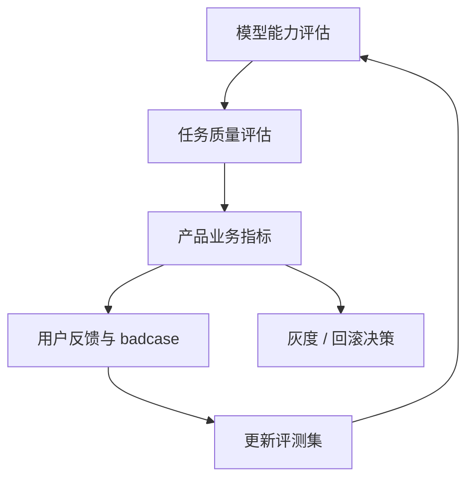
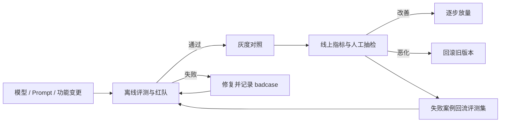

## 评估与评测

没有评估就没有迭代。评估回答模型能力够不够、任务质量稳不稳、业务指标好不好三层问题，是 AI 产品经理的基本功。

## 为什么评估难

-   模型输出是**概率性的**：同样输入，两次结果可能不同。评估必须容忍方差，用多次采样或足够多样本摊平噪声。
-   质量是**多维度的**：准确、流畅、相关、安全、风格很难一个分数说清。不同业务对维度的权重完全不同：医疗要准确与安全，营销要风格与相关性。
-   人工评测贵，自动评测不准：人工慢且主观，自动指标常抓不住语义质量。
-   评估对象在**漂移**：模型版本更新、提示词改动、用户行为变化，都会让旧评测集失真。评估不是一次性工程，是常跑常新的循环。
-   评估分三层：能力（模型本身）、任务（某个任务做得好不好）、产品（业务指标好不好）。三层混淆是 AI 评估最常见的错误。落地时分别对应下面的离线评测集、线上指标与定性体验，不要用一张榜单代替三层。

## 三层评估体系

三层问题与三套动作的对应：

| 决策问题 | 对应动作（下文三节） | 回答什么 |
| --- | --- | --- |
| 能力：模型本身行不行 | 评测集（离线） | 换模型/提示词后，固定样本是否回归 |
| 任务：这个任务做得好不好 | 线上指标（在线） | 真实流量下完成率、延迟、成本 |
| 产品：业务指标好不好 | 用户体验（定性） | 为什么失败、该改提示词还是改流程 |

### 1. 评测集(离线)

-   收集**代表性输入**：典型场景、边界场景、对抗场景；规模从 20 条种子集起步，随迭代扩充到几百上千条。
-   为每个输入标注**期望行为**（答案要点、禁止行为）；标注要写明「可接受的答案范围」，而非唯一答案：大模型输出天然多样。
-   每次改模型/提示词后跑一遍，作为回归防线。评测集要版本管理，并记录每次得分（模型、提示词、日期、得分），才能看出趋势。
-   **评测集污染**：测试用例一旦进入提示词或训练数据，该用例就失效。评测集要与生产链路隔离，定期轮换新增。展开见下节。

### 评测集污染

测试用例一旦进入提示词、few-shot 示例、微调数据或检索语料，该用例就失效：模型不是在泛化，而是在背题。隔离要求：

-   评测集不进生产提示词、不进训练/微调、不进 RAG 索引
-   用例 ID 与生产日志分开存储，访问权限比普通数据集更严
-   定期轮换：被产品文案或客服话术引用过的题优先替换
-   发现泄漏后整题作废，分数不计入趋势，并追溯是提示词、数据还是检索带进去的

公开基准的污染见下文「看榜单的四个坑」。自建评测集被内部文档引用，同样算污染。

### 2. 线上指标(在线)

| 指标 | 说明 |
| --- | --- |
| 任务完成率 | 用户请求最终是否达成 |
| 采纳率 | 生成结果被用户采用/修改的比例 |
| 错误率/投诉率 | 用户明确表示不满 |
| 重试率 | 用户是否反复追问同一问题 |
| 会话深度 | 多轮对话的比例与长度 |
| 转人工率 | Agent/客服场景：自动解决不了的占比；降本指标的核心 |
| 幻觉率代理 | 点踩、纠正、引用被质疑等行为的占比；没有直接幻觉标签时的代理指标 |
| 首 token 延迟 / 端到端延迟 | 体感指标；与完成率互为代价；快而差 vs 慢而好 |
| 成本 / 请求 | 与质量指标一起看，评估「质量换成本」的划算度 |

线上指标回答「真实用户下表现如何」，但噪声大、归因难（是模型问题还是入口问题？）。线上指标与离线评测集是**互为补充**的两条腿，不能只用其一。

### 3. 用户体验(定性)

-   用户访谈、可用性测试
-   把真实对话记录抽样复盘，注意脱敏
-   定性发现用于**生成假设**，再回到评测集与线上指标验证。定性不定量，定量不定性，两者闭环。

## 常见评测维度

| 维度 | 定义 | 怎么测 |
| --- | --- | --- |
| **准确率** | 事实正确性 | 对照标注的要点逐条打分；数字/日期/来源类错误单独记录 |
| **忠实度** | 是否忠于给定资料（RAG 场景） | 对照资料检查资料之外的信息是否被编造 |
| **相关性** | 回答是否切题 | 问题-回答语义匹配度打分 |
| **完整性** | 是否漏掉关键点 | 对照要点清单查漏 |
| **安全性** | 是否输出有害内容 | 安全评测集 + 红队测试（见下） |
| **风格** | 是否符合品牌与场景 | 人工盲评、风格 rubric |

每个维度单独打分（1-5 分），不要混成一个总分：混分之后不知道该修哪一维。

核心关系：离线能力、任务质量和线上业务指标逐层承接，用户反馈持续更新评测集，形成可回归的评测闭环。

## 常见评测基准与榜单

-   **知识**：MMLU（多任务理解，常识与学科知识）（[MMLU](https://arxiv.org/abs/2009.03300)）
-   **推理**：GPQA（研究生级科学问答）（[GPQA](https://arxiv.org/abs/2311.12022)）、AIME/MATH（数学竞赛）、MATH-500
-   **代码**：HumanEval（函数生成）（[HumanEval](https://arxiv.org/abs/2107.03374)）、LiveCodeBench（在线更新、抗污染）、SWE-bench（真实 GitHub 工程修复，Agent 级）（[SWE-bench](https://arxiv.org/abs/2310.06770)）
-   **多模态**：MMMU（大学级多模态理解）、MMBench、MM-Vet
-   **中文**：C-Eval、CMMLU
-   **Agent**：GAIA、τ-bench（工具调用）、SWE-bench（长程任务）

**看榜单的四个坑**：

1.  **污染**：热门基准可能混入训练数据，分数虚高。优先看 LiveCodeBench 这类「在线出新题」的基准，或第三方复测。
2.  **同分布问题**：基准分布 ≠ 你的用户分布。榜单只是初筛，最终以自建评测集为准。
3.  **官方自报 vs 第三方**：优先第三方评测（如 LMArena 匿名竞技场），官方自报分数作参考。
4.  **采样设置**：temperature 为 0 与多采样投票的分数没有可比性；对比时必须同设置。

## 人工评测与 LLM-as-Judge

-   **人工评测**：双盲标注（标记者不知道模型身份）、多人独立评分取一致性（Cohen's κ / Krippendorff's α）、评分标准（评分卡）先行。贵、慢，但最可靠，用于小规模高价值样本与争议裁决。
-   **LLM-as-Judge**：用一个强模型给另一个模型的输出打分/两两对比；原理是让评判模型按 rubric 打分，或 A/B 对比后投票。
-   **Judge 的校准**：
    - 位置偏差（先出现的答案被偏好）：两两对比时交换顺序各评一次
    - 长度偏差（长答案得分虚高）：提示词里明确「不考虑长度」
    - 自我偏好（judge 偏好与自己同源的模型）：混合多家模型做 judge
    - 用一小批人工标注样本校准 judge：judge 与人工一致性达到阈值（如 80%）才可放心批量使用
-   **适用边界**：结构化任务（摘要、分类、抽取）judge 很稳；创意写作、深度推理仍以人工为准。judge 适合做「过滤器」：先自动筛，低置信再人工。

## 红队测试

-   **红队（Red Teaming）** 指以攻击者视角主动探测模型的失败模式：越狱提示、有害内容诱导、隐私套取、注入攻击（见 [提示词安全](prompt-security.md)）、偏见与冒犯性输出。
-   红队不是一次性的：每个新模型版本、新提示词、新功能上线前都要跑一轮；红队用例沉淀进评测集成为长期回归项。
-   产出不是「有没有问题」而是「失败模式清单」：每种失败给触发条件、危害等级、缓解方向（提示词加固 / 内容过滤 / 人工兜底）。
-   大厂做法参考：官方系统卡（system card）里的红队方法论，如 OpenAI/Anthropic 的安全评测披露。

## 线上评估与灰度

-   **灰度发布**：新模型/新提示词按比例放量（如 10% → 50% → 100%），与旧版本对照线上指标；对照期间保证分组随机，排除时间因素。
-   **A/B 测试**：同一批用户随机分两组，比较任务完成率、采纳率等；大模型输出方差大，样本量要足够，并用统计检验而非拍脑袋。
-   **回滚预案**：新版本指标明显变差时，5 分钟退回旧版本。回滚是发布流程的一部分，不是事后补救。
-   **badcase 回流闭环**：线上失败案例 → 人工复盘 → 归纳错误模式 → 回填评测集 → 修复（改提示词/换模型/加护栏）→ 回归 → 再灰度。这是 AI 产品迭代的日常节奏，详见 [AI 产品开发生命周期（CC/CD）](../pm/ai-lifecycle.md)。

核心关系：变更必须先离线验证再灰度放量，线上指标决定放量或回滚，失败案例回流推动下一轮改进。

## 实操建议

-   **种子评测集从第一天建**：20 条就够了，边做边扩充。
-   **失败案例库**：每次上线后收集用户不满意案例，回填评测集。
-   **人工抽检常态化**：每周抽 20-50 条真实对话人工评分。
-   **版本对照**：新模型/新提示词上线前，同一评测集新旧对照。
-   **评估自动化**：评测集跑分脚本化（每次模型、提示词或检索配置变更触发），把评估变成 CI 的一环，而不是上线前的手工活动。

### 评测自动化、样本量与 Judge 校准

-   **CI 最小集**：种子集（20–50 条）每次变更全跑；扩展集（几百条）每日或每周跑；红队集发版前跑。记录模型版本、提示词哈希、日期和分数。
-   **A/B 样本量**：大模型输出方差大，不要用十几条对话定胜负。先定最小可检测差异（如完成率 +3 个百分点），再按二项或比例检验估样本量；跑不够就只报方向，不报「显著」。
-   **标注一致性**：双人独立打分，先算 Cohen's κ 或百分一致率；低于约 0.6 先改评分卡，再扩样本。
-   **LLM-as-Judge**：用一小批人工标注校准，一致性达到阈值（如 80%）再批量用；位置对调、长度偏差见上文「人工评测与 LLM-as-Judge」。
-   **公开榜单怎么用**：MMLU、GPQA、SWE-bench、LMArena 只做初筛。HELM 类报告看分项而不是总分。最终以自建评测集为准。

### 评测会失效：持续校准(CC)

评测集基于预期用户行为设计，而 AI 用户的真实行为是非确定的。**评测失效、需要重做，完全正常**，通常要跑多轮。CC（持续校准）阶段的做法：运行评测 → 人工审查最弱环节（每部门抽 20~50 条低分样本）→ 归纳错误模式（表格：模式/触发条件/影响/修复方向）→ 数据驱动修复。

完整的 CC/CD 生命周期见 [AI 产品开发生命周期（CC/CD）](../pm/ai-lifecycle.md)。

## 按产品形态选指标

本页给通用闭环。具体产品形态的必测指标在子页，验收时按表选型，不要只用榜单总分。

| 产品形态 | 离线必测 | 线上必看 | 延伸 |
| --- | --- | --- | --- |
| RAG / 知识库问答 | hit rate、recall@k、MRR；忠实度与引用正确率 | 无命中率、点踩、拒答、检索延迟 | [RAG 基础](rag.md)、[检索技术](rag-retrieval.md)、[高级 RAG](rag-advanced.md) 的 RAGAS 四件套 |
| Agent / 工具调用 | 工具选择准确率、参数准确率、终态成功率、pass@k | 转人工率、步数、危险动作拦截率 | [Agent 架构与多智能体](agent-architecture.md) AgentOps；[Agent 与 Computer Use](agent-computer-use-frontier.md) |
| 多模态理解 | 任务级准确/定位，不要只用描述流畅度 | 延迟、误识别、人工复核率 | [多模态理解](multimodal.md) |
| 图像 / 视频生成 | 业务可用率优先于 FID/FVD | 返工率、审核拒绝率、时长成本 | [图像生成](image-generation.md)、[视频生成](video-generation.md) |
| 对话 / 语音 | 任务完成、安全拒答、首 token / 端到端延迟 | 重试、打断、转人工 | [语音与音频](audio.md) |
| 安全与越狱 | 红队用例回归、注入与越权 | 拦截率、误伤率、事故响应时延 | [提示词安全](prompt-security.md)、[AI 安全与对齐](ai-safety.md) |

决策顺序：先定产品形态与不可接受失败 → 选上表离线指标建 20–50 条种子集 → 上线后用线上指标灰度 → 定性复盘回流评测集。模型档位对比见 [模型能力与边界](capabilities.md)，系统分层见 [AI 系统架构](architecture.md)。

最小操作规程（细节在子页）：

1.  **RAG**：先标「问题 → 应命中块 id」，报 hit rate 与 recall@k；再抽查忠实度与引用是否指到真块。见 [检索技术](rag-retrieval.md)。
2.  **Agent**：固定任务终态（测试通过、工单关闭），报工具选择准确率、参数准确率、pass@k 与危险动作拦截。见 [Agent 架构与多智能体](agent-architecture.md)。
3.  **生成类**：业务可用率优先于 FID/FVD；上线看返工率与审核拒绝率。
4.  **安全**：红队用例进回归集；同时报拦截率与误伤率。

## 来源说明

本文为原创整理，引用日期：2026-09-04。三层评估与灰度闭环为栏目归纳；基准论文见上文链接。RAG 自动指标见 [RAGAS](https://arxiv.org/abs/2309.15217) 与 [RAGAS 文档](https://docs.ragas.io)；Agent 终态评测见 [SWE-bench](https://arxiv.org/abs/2310.06770)；Judge 偏差与校准见各厂商系统卡及站内 [提示词安全](prompt-security.md)。既有 H2/H3 标题保持稳定，供岗位页引用。

???+ example "练习"
    为你正在做的 AI 产品定义：① 10 条种子评测集；② 3 个线上核心指标；③ 每周抽检的方式；④ 一个新模型上线时的灰度与回滚方案。
