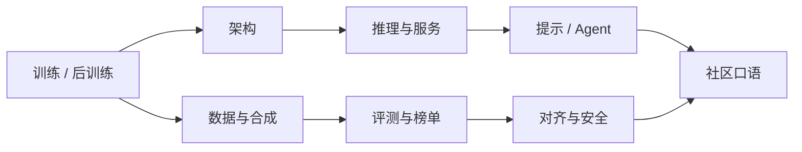

## AI 黑话速查

本页收 **AI 研究、训练、推理与产品协作**里的高频黑话。产品、指标和通用工程词见[产品经理黑话速查](../intro/glossary.md)；设计师侧见[设计师黑话速查](../pm/design-jargon.md)。规模、学习与评测规律见[AI 定理与经验定律](theorems.md)。

**黑话 ≠ 能力**。会说词要能追问口径：测的是哪项任务、哪个模型版本、训练还是推理、总参数还是激活参数。

???+ note "怎么查"
    开会听到生词，先按主题定位，再跟进站内通识页。

    Token、上下文窗口、RAG、Agent、幻觉、微调等产品基础词，以[产品经理黑话速查](../intro/glossary.md)的 AI 节为准，本页补研究圈口径与容易混用的变体。

查词顺序：先分清说话人在谈训练、推理还是评测，再看架构与数据，最后才是口语和潜台词。

## 训练与后训练

模型怎么炼、炼完怎么听话。流程与取舍见[模型训练与对齐](llm-training.md)。

| 黑话 | 含义 |
| --- | --- |
| 预训练 / Pretraining | 在海量无标注文本上做语言建模，产出**基座模型**；知识截止日期由此阶段决定 |
| 后训练 / Post-training | 预训练之后的 SFT、偏好优化、RL 等，改变的是**行为**（听不听人话），不是知识库存本身 |
| 继续预训练 / CPT / Mid-training | 在基座上再用领域或高质量语料接着做语言建模，介于预训练与 SFT 之间 |
| 基座 / Base | 未做指令对齐的续写模型；基准评测常报基座分，产品上的是 Chat / Instruct |
| Instruct / Chat / Aligned | 经过指令与偏好对齐、按对话格式回答的模型；同一家族的 Base 与 Chat 不可混比 |
| 推理模型 / Reasoning model | 后训练含长链思考或 RLVR，推理时额外花 test-time compute；延迟和成本高于同尺寸快模型 |
| SFT | Supervised Fine-Tuning，用指令-回答对做监督微调，学会对话格式与基本服从 |
| 冷启动 / Cold start | DeepSeek-R1 等路线里，先用少量思维链样本做 SFT 种子，再大规模 RL |
| RLHF | Reinforcement Learning from Human Feedback：奖励模型 + PPO 等，用人类偏好继续塑形 |
| RM / Reward Model | 奖励模型，给回答打分，供 RL 使用；分数被优化后会过时，要防奖励黑客 |
| PPO | Proximal Policy Optimization，RLHF 里常见的策略优化算法 |
| DPO | Direct Preference Optimization，直接用偏好对更新模型，省掉单独的 RL 循环 |
| GRPO | Group Relative Policy Optimization，组内相对优势估计，DeepSeek 推理训练常用 |
| RLVR | Reinforcement Learning with Verifiable Rewards，用可自动验证的奖励（代码通过、数学答案）做 RL |
| 对齐 / Alignment | 让模型行为符合意图与约束；开放问题，做不到穷举保证 |
| 对齐税 / Alignment tax | 对齐后某些能力或基准分下降；要在安全、服从与能力之间记账 |
| PEFT | Parameter-Efficient Fine-Tuning，只训少量参数的微调总称 |
| LoRA / QLoRA | 低秩适配；QLoRA 在量化权重上做 LoRA，显存更省 |
| 全量微调 / Full FT | 更新全部参数；效果上限高，成本、遗忘风险和部署版本管理都更重 |
| 冻结 / Freeze | 训练时不更新部分层；常见于只训适配器或最后几层 |
| Warmup | 学习率从接近 0 爬升到峰值，稳定训练初期 |
| Loss spike | 训练损失突然飙高；常与坏 batch、学习率、数值溢出有关 |
| 欠训练 / Undertrained | 参数相对数据或算力过多，还没训够就停；Chinchilla 视角下许多早期大模型属于此类 |
| Overtraining | 同一算力下把较小模型训过计算最优点，换更便宜的推理；部署导向的理性选择 |
| 蒸馏 / Distillation | 教师模型的输出或轨迹训练学生模型，降成本；压缩不等于能力密度一定上升，见[Densing Law](theorems.md#densing-law) |
| 教师 / 学生 | 蒸馏里的大模型与小模型角色 |
| Checkpoint | 某一训练步保存的权重快照；产品版本应对齐具体 checkpoint，而不是模型家族名 |
| 炼丹 | 训练与调参的口语；成功依赖数据、算力、配方和运气，过程难完全复现 |

## 数据与合成

| 黑话 | 含义 |
| --- | --- |
| 语料 / Corpus | 训练用的文本、代码、多模态数据集合 |
| 数据配比 / Mixture | 各来源、语言、领域在训练中的权重；配比变化会改变能力形状 |
| Token packing | 把短样本拼进同一序列，减少 padding 浪费 |
| Dedup | 去重；重复数据会浪费算力并抬高记忆、污染评测的风险 |
| 数据污染 / Contamination | 评测题或其改写入了训练集，榜分虚高 |
| Decontamination | 训练前把评测集及近重复从语料里抠掉 |
| 合成数据 / Synthetic data | 模型生成再用于训练；要质检，否则幻觉会写进下一轮权重 |
| Self-Instruct | 用模型批量造指令数据的方法；扩展快，空泛和重复也快 |
| 偏好对 / Preference pair | chosen / rejected 两条回答，供 DPO 或 RM 学习 |
| 过程监督 / PRM | Process Reward Model，给推理步骤打分，不只看最终答案 |
| 结果监督 / ORM | Outcome Reward Model，只按最终对错给奖励 |
| Rejection sampling | 采样多条、用规则或 RM 留下最好的，再拿去 SFT 或偏好学习 |
| Gold / 金标 | 视为正确答案的标注；金标错了，评测和训练会一起偏 |
| 标注一致性 | 多人标注的同意程度；低一致性说明任务定义不清，模型再强也学不稳 |

## 架构

机制展开见[Transformer 架构](transformer.md)、[混合专家模型](llm-frontier-moe.md)。

| 黑话 | 含义 |
| --- | --- |
| Decoder-only | 只堆解码器的自回归模型，今日 LLM 主流形态 |
| Encoder-only | BERT 一类双向编码，偏理解、检索表示，不直接做长文本生成 |
| Encoder-Decoder | T5、翻译模型一类；输入编码、输出解码 |
| Tokenizer | 文本切成 token 的规则与词表；中英、代码的压缩率不同，直接影响成本 |
| BPE / SentencePiece | 常见分词算法；词表大小和特殊符号是产品成本与多语言表现的隐变量 |
| Chat template | 对话角色、特殊符号的拼接格式；训练与推理必须一致，否则模型「不认人」 |
| 上下文窗口 | 一次能吃进去的 token 上限；窗口大不等于长期记忆，也不等于检索已解决 |
| RoPE | Rotary Position Embedding，旋转位置编码，长上下文外推常从它改起 |
| MHA / MQA / GQA / MLA | 多头 / 多查询 / 分组查询 / 多头潜在注意力，主要改 KV Cache 体积与质量 |
| KV Cache | 推理时缓存历史 Key/Value；长上下文和并发的显存大头 |
| MoE | Mixture of Experts，每个 token 只激活部分专家；**总参数 ≠ 单次算力** |
| 激活参数 | 一次前向真正用到的参数量；报 MoE 规格时要同时看总参数与激活参数 |
| 路由 / Router | 决定 token 去哪些专家；负载不均会浪费专家或打满少数专家 |
| SSM / Mamba | 状态空间序列模型，线性复杂度路线，与注意力混合出现 |
| Residual / 残差 | 把输入加回层输出，保证深度可训练 |
| RMSNorm | 常见归一化；和 Pre-Norm / Post-Norm 一样属于训练稳定性细节 |
| 注意力汇 / Attention sink | 注意力大量落到初始 token 等位置的现象，影响长上下文与流式处理 |
| 词表膨胀 | 为语言或领域加 token；可能降序列长度，也可能弄乱旧权重的嵌入空间 |

## 推理、服务与成本

延迟、吞吐和部署见[模型推理与部署](llm-inference.md)、[推理系统与量化](llm-inference-systems-quantization.md)。

| 黑话 | 含义 |
| --- | --- |
| Prefill | 并行吃完输入、建立 KV Cache 的阶段；长提示时 TTFT 的主因 |
| Decode | 逐 token 生成；常受显存带宽限制 |
| TTFT | Time To First Token，首 token 延迟 |
| TPOT / TPS | 每输出 token 耗时 / 每秒生成 token 数；口径要写清含不含排队 |
| 连续批处理 | 按 token 进度动态进出批次，比静态 batch 更能打满 GPU |
| PagedAttention | 分页管理 KV Cache，减少显存碎片 |
| 投机解码 / Speculative decoding | 小模型草稿、大模型一次性验证，换更高 decode 速度 |
| 量化 | 用更低精度存权重或激活；INT8/INT4/FP8 的速度与掉点必须实测 |
| AWQ / GPTQ | 权重量化常用算法名；「4bit 了」不等于产品指标不变 |
| 满血版 | 未量化或接近原精度的部署；口语，没有统一定义 |
| 蒸馏版 / 量化版 | 为降成本得到的变体；要对同一评测集分别验收 |
| Tensor / Pipeline parallel | 张量并行拆层内矩阵，流水线并行拆层间；影响延迟和故障域 |
| MFU | Model FLOPs Utilization，实际达到的算力利用率；低 MFU 等于钱烧在等待上 |
| Compute-bound / Memory-bound | 算力瓶颈 vs 显存带宽瓶颈；Prefill 与 Decode 常常不在同一侧 |
| TPM / RPM | 供应商配额：每分钟 token / 请求；不是你自己的吞吐上限 |
| 降智 | 用户感知模型变笨；可能是路由到小模型、量化、超时截断、提示被压缩，不一定是权重被换 |

## 提示、推理行为与 Agent

写法见[提示词工程](prompting.md)、[Agent 与工作流](agent.md)、[工具调用与 MCP](agent-tools.md)。

| 黑话 | 含义 |
| --- | --- |
| Zero / Few-shot | 不给或只给少量示例就做任务；示例质量比数量更重要 |
| ICL / 上下文学习 | 不更新参数，只靠提示里的说明和例子临时适配任务 |
| CoT / 思维链 | 先写中间推理再给答案；对数学、逻辑有用，对开放写作不是万金油 |
| ToT / 思维树 | 在多条推理分支上搜索，比单链 CoT 更贵 |
| ReAct | 推理与行动交替：想一步、调工具、看结果、再想 |
| Self-consistency | 采样多条思维链再投票；适合最终答案可对齐的题 |
| Temperature / Top-p / Top-k | 采样随机性旋钮；评测对比时必须锁死，否则分数不可比 |
| Greedy | 每步取最高概率 token；更稳、更死板 |
| 上下文工程 | 选什么放进窗口、如何压缩、如何引用，比单句 prompt 技巧更决定系统质量 |
| Grounding | 回答锚定在检索、工具或用户文档上；有引用仍可能错引 |
| RAG | 先检索再生成；解决的是时效与可追溯，不是推理本身 |
| 工具调用 / Function Calling | 模型产出结构化调用，应用执行后再回传；模型通常不直接碰生产系统 |
| MCP | Model Context Protocol，发现和调用外部工具、资源的协议 |
| Computer Use / GUI Agent | 看屏幕、点控件完成任务；失败模式是认错 UI 与不可逆操作 |
| Thinking / 思考 token | 推理模型在最终答案前花的内部 token；用户可能看不见，但账单看得见 |
| Test-time compute | 答题时额外花的搜索、采样、验证预算；见[推理时扩展](llm-reasoning-scaling.md) |
| Best-of-N | 生成 N 个候选再挑；没有可靠选择器时，N 变大只增加自信错误 |
| Verifier / 验证器 | 给候选打分或验算的模型或程序；可验证任务上它比盲目加 N 更值钱 |
| HITL | Human-in-the-Loop，人确认、修改或接管高风险步骤 |
| Guardrail / 护栏 | 输入、输出、工具权限和成本的拦截；不是对齐的替代品 |
| 工作流 vs Agent | 步骤可枚举时用工作流；状态开放、要多步决策时才上 Agent |

## 评测与榜单

方法见[评估与评测](evaluation.md)。

| 黑话 | 含义 |
| --- | --- |
| SOTA | State of the Art，当前公开最好；必须标明任务、数据切分和是否用工具 |
| Baseline | 对照系；没有强基线的「提升」无法解释 |
| Ablation | 逐项拆掉模块看贡献；论文里的消融，评审里要问有没有拆你真正关心的那项 |
| Benchmark | 固定题集与计分规则；饱和后区分度消失 |
| Leaderboard / 榜 | 公开排行；激励刷榜和污染 |
| Arena / 对战 | 人类或模型两两投票，产出 Elo；偏对话体感，不代替任务评测 |
| Elo | 对战胜率换算的相对分；样本量和对手池决定稳不稳 |
| Pass@k | k 次尝试里至少一次通过；代码生成常用，k 要写明 |
| Exact match | 字符串级完全匹配；格式差一点就零分，模型「会做但不会填空」会被低估 |
| LLM-as-Judge | 用模型给模型打分；要校准位置偏差、自偏好和与人类一致率 |
| 能力引出 / Elicitation | 换提示或加计算后分数跳升：模型「会」和「被问出」不是一回事 |
| Eval hacking | 为榜而优化，指标与真实任务脱节；对应[Goodhart 定律](theorems.md#goodhart-定律) |
| Saturated | 基准被刷满，大家分数挤在天花板，难以比较 |
| MMLU / GPQA / HumanEval / SWE-bench | 知识、难题、代码、软件工程等常见基准名；内部决策仍要用自己的集 |
| Live 基准 | 题面持续更新，降低记忆与污染；成本是不可完全复现历史分数 |

## 对齐、安全与可解释

见[AI 安全与对齐](ai-safety.md)、[提示词安全](prompt-security.md)、[可解释性与安全前沿](interpretability-safety-frontier.md)。

| 黑话 | 含义 |
| --- | --- |
| Refusal | 拒答；过拒会伤效用，欠拒会出事 |
| Jailbreak / 越狱 | 用角色扮演、编码、多轮把模型绕过拒答 |
| Prompt injection | 在用户数据或工具返回里塞指令，劫持系统提示 |
| Sycophancy / 谄媚 | 顺着用户错误观点说话，讨好重于求真 |
| Reward hacking | 钻奖励空子，指标好看、任务没完成 |
| Specification gaming | 满足字面规格、违背意图 |
| Constitutional AI | 用书面原则加 AI 反馈做对齐的一路方法 |
| Red team | 主动攻击自己的模型与产品，找越权和失败 |
| Mech interp | 机械可解释性：找内部电路与特征，而不是只看输入输出 |
| SAE | Sparse Autoencoder，把激活拆成较稀疏的特征 |
| Superposition | 模型用同一神经元叠加多个特征；解释时不能一对一读神经 |
| Probe | 用小分类器读隐藏态里有没有某种信息 |
| Activation steering | 推理时加减激活方向，临时改变行为；实验手段，不是产品开关 |

## 社区口语与产品黑话

| 黑话 | 含义 |
| --- | --- |
| 大力出奇迹 | 堆数据、参数、算力换能力；对应[Bitter Lesson](theorems.md#the-bitter-lesson)的通俗版，忽略配方与数据质量时会变成浪费 |
| 涌现 | 规模上去后任务突然会做；测量方式会造成假突变，见[涌现](theorems.md#涌现)与[大模型基础](llm-basics.md#涌现的正确理解) |
| 套壳 / Wrapper | 在别人的模型 API 外包一层 UI 或提示词；要说清自有数据、评测、工作流和责任边界 |
| Copilot | 旁路辅助、人最终负责；与自动执行的 Agent 不是同一产品形态 |
| 开源套壳 | 把开源模型稍改名称或量化后当自研；许可、评测和安全声明都要核对原模型 |
| 幻觉 | 流畅但与事实、输入或检索不符；要分类型处理，见[大模型基础](llm-basics.md#幻觉深入) |
| AGI / ASI | 泛化通用智能 / 超人类智能；口号不是验收标准，产品仍按任务、成本和失败定义 |
| 端侧 / On-device | 模型跑在手机或 PC 本地；受显存、电量和更新节奏约束，密度比绝对分数更关键 |
| 智能体洗稿 | 把工作流、定时脚本或单次工具调用都叫 Agent，方便讲故事 |

### 评审与协作潜台词

多为夸张演绎，请勿对号入座。

| 黑话（表面说法） | 真实含义 |
| --- | --- |
| 我们有自己的大模型 | 可能是微调、LoRA、蒸馏或套 API；追问基座、数据、评测和许可 |
| 效果已经 SOTA | 看的是哪个榜、是否污染、有没有内部集 |
| 上下文 128K 完全够 | 窗口标称值和有效利用长度不是一回事 |
| 上了 Agent | 可能只是多了一次搜索或函数调用 |
| 再 prompt 一下就行 | 系统问题被说成写提示；该补检索、工具、评测或换模型 |
| 开源模型追平闭源 | 某些基准接近，产品任务、稳定性和安全策略仍要分测 |
| 量化无损 | 平均分还在，长尾任务或拒绝行为已经变 |
| 用户说模型降智了 | 先查路由、配额、截断和提示压缩，再查是否换了权重 |

## 相关页面

- [AI 定理与经验定律](theorems.md)：Scaling Law、Bitter Lesson、Densing Law、莫拉维克悖论等
- [产品经理黑话速查](../intro/glossary.md)：产品、指标与工程基础词
- [大模型基础](llm-basics.md)、[模型训练与对齐](llm-training.md)、[模型推理与部署](llm-inference.md)
- [评估与评测](evaluation.md)、[AI 安全与对齐](ai-safety.md)

## 来源说明

本文为原创整理，引用日期：2026-09-05。术语口径对照站内通识页，以及 Kaplan 等 Scaling Laws、Hoffmann 等 Chinchilla、Sutton *The Bitter Lesson*、Xiao 等 Densing Law、OpenAI / DeepSeek 推理模型技术说明中的通行用法。具体模型名、基准和协议以官方页面为准。
