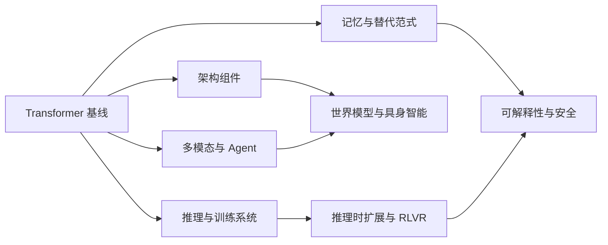

## 大模型前沿论文

本页是 AI 前沿论文的**导读入口**，不是通识课：专题页按代表论文讲机制、失败模式和不可外推边界，篇幅短于 [大模型基础](llm-basics.md) 一类地基页。建立概念依赖请先读 [AI 经典论文](classic-papers.md)，再按下面的瓶颈地图进专题。它不追求收录所有论文，而是用研究问题组织一组可以互相对照的路线：模型如何表示位置，如何在长上下文中访问信息，如何分配训练和推理计算，如何从语言走向多模态、Agent、环境预测和物理行动。

文章默认读者已经掌握向量、矩阵乘法、概率分布、梯度下降和基本 Transformer 结构。基础概念见 [Transformer 架构](transformer.md)、[模型训练与对齐](llm-training.md)、[模型推理与部署](llm-inference.md) 和 [多模态理解](multimodal.md)。

## 研究范围与阅读方式

前沿论文的价值不在于背诵缩写，而在于回答五个问题：

- 研究者试图消除哪个瓶颈？
- 方法改变了模型的信息流、记忆位置还是系统执行方式？
- 实验是在什么模型规模、数据、硬件和预算下进行的？
- 质量收益是否伴随显存、带宽、通信、延迟或安全代价？
- 论文结论能否外推到目标产品的真实任务？

专题页按「研究问题 → 代表论文 → 核心机制 → 系统代价与不可外推边界 → 产品判断」组织；机制正文只维护在专题页。本页只提供瓶颈地图、记号、勘误与阅读顺序。基础页负责落地方法。



核心关系是：现代 AI 研究同时在改变模型结构、计算预算、外部记忆和交互环境。单项 benchmark 提升不能替代对数据、硬件、任务终态和失败代价的分析。

## 按瓶颈组织的研究地图

| 研究瓶颈 | 主要路线 | 进入专题 |
| --- | --- | --- |
| 位置表达与长度外推 | PE、RoPE、NoPE、YaRN | [架构组件与训练稳定性](llm-frontier-architecture.md) |
| 深层优化与数值稳定 | LayerNorm、RMSNorm、QK-Norm、Pre-Norm、残差变体 | [架构组件与训练稳定性](llm-frontier-architecture.md) |
| KV Cache 与解码带宽 | MHA、MQA、GQA、MLA、CSA、HCA | [注意力与 KV Cache](llm-frontier-attention.md) |
| 注意力计算随长度平方增长 | Sparse Transformer、SWA、DSA、局部—全局交错 | [稀疏与局部注意力](llm-frontier-sparse-attention.md) |
| 长序列状态成本 | Lightning Attention、Mamba、DeltaNet、KDA | [线性注意力与状态空间](llm-frontier-sequence-models.md) |
| 模型容量与单 token 计算绑定 | MoE、Switch、DeepSeekMoE | [混合专家模型](llm-frontier-moe.md) |
| 固定残差流缺少选择性 | RC、HC、mHC、AttnRes | [架构组件与训练稳定性](llm-frontier-architecture.md) |
| 固定推理预算不足以解决难题 | Best-of-N、搜索、验证器、test-time scaling | [推理时扩展](llm-reasoning-scaling.md) |
| 偏好奖励难以验证复杂正确性 | RLVR、过程监督、GRPO | [RLVR 与 GRPO](llm-rlvr-grpo.md) |
| 理论复杂度无法转化为线上吞吐 | FlashAttention、PagedAttention、量化、投机解码 | [推理系统与量化](llm-inference-systems-quantization.md) |
| 工具调用无法覆盖真实界面 | GUI grounding、浏览器 Agent、Computer Use | [Agent 与 Computer Use](agent-computer-use-frontier.md) |
| 模态之间难以对齐和统一生成 | CLIP、Flamingo、BLIP-2、LLaVA、原生多模态 | [多模态前沿论文](multimodal-frontier-papers.md) |
| 上下文窗口不等于长期记忆 | RETRO、Memorizing Transformers、模型编辑 | [外部记忆与模型编辑](llm-memory-model-editing.md) |
| 自回归生成的串行限制 | Diffusion LM、Masked Diffusion | [Diffusion Language Model](diffusion-language-models.md) |
| 固定 tokenizer 的语言和符号偏差 | ByT5、CANINE、Charformer、MegaByte | [Tokenizer-free 模型](tokenizer-free-models.md) |
| 模型内部行为难以定位和监控 | 因果追踪、SAE、Activation Steering、Scalable Oversight | [可解释性与安全前沿](interpretability-safety-frontier.md) |
| 缺少环境预测和物理行动 | World Models、DreamerV3、VLA | [世界模型与具身智能](world-models-embodied.md) |

## 主题索引

### 架构与序列

- [架构组件与训练稳定性前沿论文](llm-frontier-architecture.md)：位置编码、归一化、激活函数、残差连接与深层优化。
- [注意力与 KV Cache 前沿论文](llm-frontier-attention.md)：MHA、MQA、GQA、MLA、CSA/HCA 及缓存压缩。
- [稀疏与局部注意力前沿论文](llm-frontier-sparse-attention.md)：结构化稀疏、滑动窗口、局部—全局注意力与 DSA。
- [线性注意力与状态空间前沿论文](llm-frontier-sequence-models.md)：Lightning Attention、Mamba、DeltaNet、KDA 与 Mamba-3。
- [混合专家模型前沿论文](llm-frontier-moe.md)：稀疏路由、专家专业化、负载均衡与分布式代价。
- [世界模型与具身智能前沿论文](world-models-embodied.md)：环境动力学、潜在 rollout、VLA 和机器人闭环。

### 推理与训练

- [推理时扩展前沿论文](llm-reasoning-scaling.md)：采样、搜索、验证器、自适应预算和 test-time compute。
- [RLVR 与 GRPO 前沿论文](llm-rlvr-grpo.md)：可验证奖励、过程监督、DeepSeekMath 与 DeepSeek-R1。
- [推理系统与量化前沿论文](llm-inference-systems-quantization.md)：IO、调度、缓存、投机解码、量化和端到端成本。

### Agent 与多模态

- [Agent 与 Computer Use 前沿论文](agent-computer-use-frontier.md)：GUI grounding、浏览器、桌面、移动端和软件工程 Agent。
- [多模态前沿论文](multimodal-frontier-papers.md)：视觉语言模型、原生多模态、视频音频与视觉 grounding。

### 记忆与替代范式

- [外部记忆与模型编辑前沿](llm-memory-model-editing.md)：检索式模型、测试时记忆、参数编辑与遗忘。
- [Diffusion Language Model 前沿论文](diffusion-language-models.md)：离散扩散、Masked Diffusion、infilling 与并行生成。
- [Tokenizer-free 模型前沿论文](tokenizer-free-models.md)：字节级、字符级、多尺度压缩与多语言成本。

### 可信前沿

- [可解释性与安全前沿论文](interpretability-safety-frontier.md)：内部表征、因果干预、SAE、监督和安全监控。

## 读论文前先固定一套记号

对 decoder-only Transformer，设输入隐藏状态为 `X ∈ R^(L×d)`，其中 `L` 是序列长度，`d` 是隐藏维度。标准注意力可以写成：

```text
Q = X W_Q，K = X W_K，V = X W_V
Attention(Q, K, V) = softmax(QKᵀ / √d_k) V
```

`Q` 表示当前 token 的查询，`K` 用于匹配，`V` 携带被读取的信息。论文改变 MHA、KV Cache、稀疏选择或有限状态时，本质上都在重新安排这三类信息的生成、保存和读取。

## 模型架构拆解顺序

阅读任何模型技术报告，可以依次检查：

1. **输入与位置**：token 如何构造，位置在哪里注入，训练长度和推理长度是否相同；
2. **Block**：归一化位于子层之前还是之后，注意力与 FFN 如何连接，残差是否缩放或动态聚合；
3. **Attention**：Q/K/V 头数、KV 头数、缓存形式，是否使用局部或稀疏模式；
4. **FFN 与容量**：稠密还是 MoE，激活参数和总参数是多少，路由如何均衡；
5. **序列记忆**：完整注意力、压缩 KV、有限状态或混合层如何分工；
6. **系统实现**：训练并行、通信、kernel、量化、显存和服务吞吐；
7. **能力边界**：长距离检索、代码、数学、多模态和 Agent 任务是否分别退化。

## 论文证据与来源维护

论文页中的结论分为三类：

- **机制事实**：论文明确提出的结构、公式和训练目标；
- **实验结果**：在指定模型、数据、硬件和 benchmark 设置下报告的数字；
- **工程推断**：基于机制对成本、风险和产品的解释。

三类内容不能混写。尤其是 2025—2026 年 arXiv 预印本，应标注版本和引用日期。链接优先使用 arXiv、正式会议或 DOI，其次使用作者/机构的官方仓库和技术报告。Hugging Face 的 `blob/main` 文件可能随仓库变化，不能作为唯一来源。

常见来源误写（核对 arXiv 时注意）：

- `1911.02150` 的方法是 MQA，不是 MOA；如果讨论 Mixture-of-Agents，应另查 [Mixture-of-Agents](https://arxiv.org/abs/2406.04692)；
- `2305.13245` 的方法是 GQA，不是 GOA；
- `2010.04245` 讨论 QK-Norm，不是 KV-Norm；
- RMSNorm 使用 [arxiv.org/abs/1910.07467](https://arxiv.org/abs/1910.07467)，不是错误的 `arxwv.org` 域名；
- Switch Transformer 使用 [2101.03961](https://arxiv.org/abs/2101.03961)，不是包含逗号的编号；
- `1710.05941` 的正式标题是 *Searching for Activation Functions*，论文研究并提出后来称为 Swish 的自门控激活；
- DeepSeek-V4 的 CSA/HCA 使用 [arXiv:2606.19348](https://arxiv.org/abs/2606.19348) 核对，不使用当前不可访问的 Hugging Face PDF；
- DSA 的 Lightning Indexer 做 token 级 top-k 选择，不能写成块级选择；核心注意力的稀疏收益也不能直接等同于整个系统复杂度。

## 建议阅读路线

1. 需要概念依赖时先读 [AI 经典论文](classic-papers.md)，再读 [Transformer 架构](transformer.md)，理解 MHA、位置编码、残差、归一化和三种模型形态；
2. 读 [架构组件与训练稳定性](llm-frontier-architecture.md)，建立对位置、尺度、激活和残差的研究谱系；
3. 根据长上下文问题选择 [注意力与 KV Cache](llm-frontier-attention.md)、[稀疏与局部注意力](llm-frontier-sparse-attention.md) 或 [线性注意力与状态空间](llm-frontier-sequence-models.md)；
4. 需要理解规模化容量时读 [混合专家模型](llm-frontier-moe.md)，需要理解真实成本时读 [推理系统与量化](llm-inference-systems-quantization.md)；
5. 需要理解推理模型时读 [推理时扩展](llm-reasoning-scaling.md) 与 [RLVR 与 GRPO](llm-rlvr-grpo.md)；
6. 需要理解环境交互时读 [世界模型与具身智能](world-models-embodied.md)、[Agent 与 Computer Use](agent-computer-use-frontier.md)；
7. 最后用 [评估与评测](evaluation.md)、[AI 安全与对齐](ai-safety.md) 和 [AI 系统架构](architecture.md) 把论文结论转化为产品验收。


## 专题页读什么

- [架构组件与训练稳定性](llm-frontier-architecture.md)：PE / RoPE / YaRN、归一化、激活、残差，决定长度外推和训练能不能稳住。
- [注意力与 KV Cache](llm-frontier-attention.md)：MHA / MQA / GQA / MLA / CSA / HCA，决定解码带宽和长上下文并发。
- [稀疏与局部注意力](llm-frontier-sparse-attention.md)、[线性注意力与状态空间](llm-frontier-sequence-models.md)：用稀疏或有限状态换长度，理论 `O(L)` 不等于线上吞吐。
- [混合专家模型](llm-frontier-moe.md)：总参数与激活参数解耦后的路由、负载均衡和通信代价。
- [推理时扩展](llm-reasoning-scaling.md)、[RLVR 与 GRPO](llm-rlvr-grpo.md)、[推理系统与量化](llm-inference-systems-quantization.md)：把思考预算和 serving 成本写成可验收指标。相对 [模型训练与对齐](llm-training.md) 的增量是验证器、reward hacking 与系统论文。
- [Agent 与 Computer Use](agent-computer-use-frontier.md)、[多模态前沿论文](multimodal-frontier-papers.md)、[世界模型与具身智能](world-models-embodied.md)：从 API 工具走到屏幕、视频和物理闭环。
- [外部记忆与模型编辑](llm-memory-model-editing.md)、[Diffusion Language Model](diffusion-language-models.md)、[Tokenizer-free 模型](tokenizer-free-models.md)：窗口之外的记忆，以及非自回归、非 subword 输入。
- [可解释性与安全前沿](interpretability-safety-frontier.md)：内部表征、过程监督与可扩展监督，接到 [AI 安全与对齐](ai-safety.md)。

## 给 AI 产品经理的结论

- **模型名称不能替代架构分析**：同样叫长上下文，可能依靠 RoPE 扩展、滑动窗口、稀疏选择、KV 压缩或有限状态；成本和失败模式完全不同。
- **理论复杂度不能替代系统指标**：`O(L)` 只有在 kernel、内存访问和并行通信匹配时才会转化为真实吞吐。
- **推理预算是产品资源**：更长思考、更大采样数和更多验证调用会提高质量，也会增加延迟、成本和失败重试。
- **记忆位置决定治理方式**：上下文、外部数据库、Agent 状态和模型参数需要不同的权限、更新和删除策略。
- **世界模型不能替代控制系统**：预测环境、规划动作、执行控制和安全回退必须分层验收。
- **闭环成功才是 Agent 和具身智能的最终指标**：离线语言或视觉分数只是先决条件，真实环境中的成功率、恢复率、延迟、碰撞率和人工接管率才是产品指标。

## 来源说明

本文为原创研究地图，引用日期：2026-09-04。机制与论文列表以各专题页为 canonical 来源；本页只维护地图、记号、勘误与阅读顺序。动态论文信息以对应官方页面和指定版本为准。
