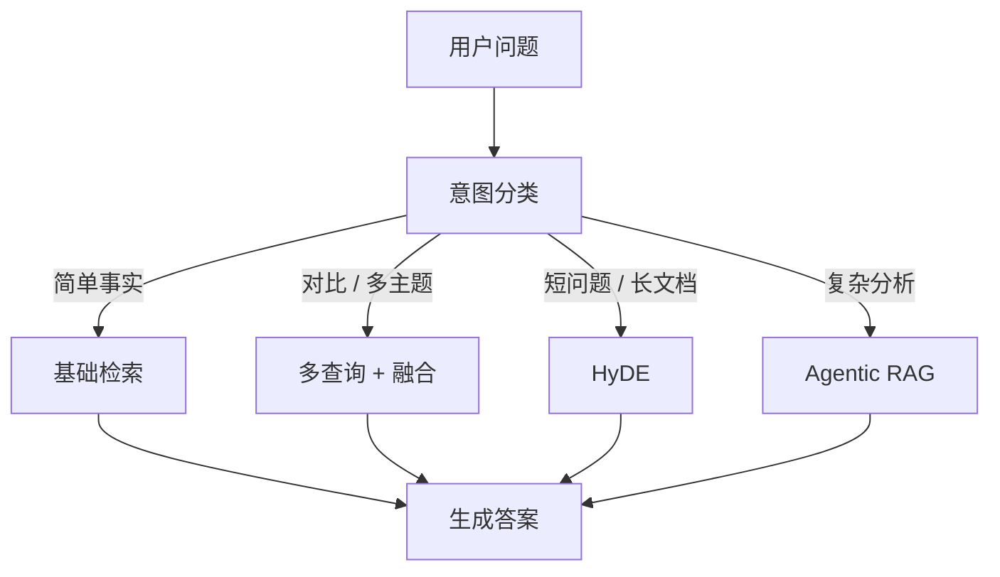
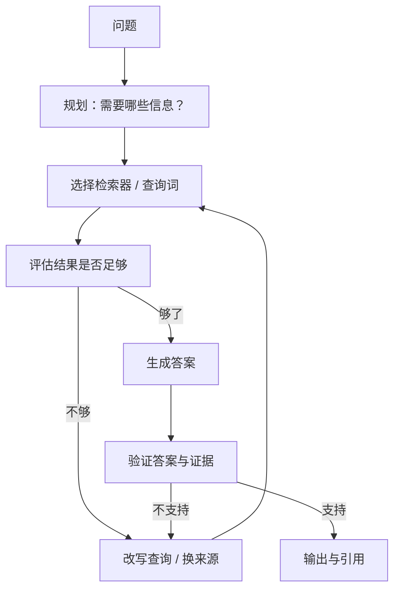

## 高级 RAG

Naive RAG（检索一次 → 生成，也称单次检索 RAG）在简单问答上够用，但面对复杂问题（问得不清、跨多文档、需要多跳推理、多轮追问）就开始失灵。高级 RAG 的五个发力方向：**查询处理、多路召回、知识图谱（GraphRAG）、Agentic RAG、多轮对话检索**，以及支撑它们取舍的 **RAG 评测体系**。检索技术原理见 [检索技术](rag-retrieval.md)。起步基线（L0：BM25 + 向量 + RRF）与生产标配（L1：+ rerank）的定义见 [RAG 基础](rag.md)。

## 查询处理

检索的第一步是**把问题处理成好检索的问题**。用户的问题往往简短、含混、带口语，直接拿去检索经常搜不中：

-   **查询改写**：把问题变清晰：展开缩写（报销 → 费用报销流程）、纠错（错别字、大小写）、补全意图（报销怎么走 → 公司差旅费用报销的申请流程是什么）。做法可让 LLM 先改写再检索（多一次生成调用），或内置规则（术语表、同义词表，零延迟但维护成本高）。
-   **多查询（multi-query）**：一个问题拆成多个检索式，分别检索再合并结果。例：对比 A 和 B 方案拆成 A 方案的优缺点、B 方案的优缺点：单次检索很难同时命中两边。
-   **HyDE**：先让 LLM 基于问题**生成一段假设答案**，再用这段答案去检索。假设答案比问题更长、更接近文档语言，往往能命中更相关的块（[HyDE 论文](https://arxiv.org/abs/2212.10496)）；代价是多一次生成调用，且假设答案本身可能编造，适合问题短、文档长的场景。

### 意图分类与检索路由

查询处理的高级形态是**先分类意图，再按意图选检索策略**：简单事实问题直接基础检索；对比问题走多查询；有没有/是不是类确认问题可以轻检索 + 快模型；深层分析问题才升级 Agentic 循环。意图分类可用小模型或规则做，分类准确率本身要评测：分类错了，后面全白搭。这也呼应产品视角里的复杂度只出现在值得的地方：路由让简单问题保持便宜，把预算留给难题。



核心关系：先按问题类型路由检索策略，让简单请求保持低成本，把多查询、HyDE 和 Agentic 循环留给确有收益的复杂问题。

### 改写示例

| 原问题 | 改写后 | 为什么有效 |
| --- | --- | --- |
| 报销 | 公司费用报销流程与标准 | 补全意图，检索词更接近文档语言 |
| TS-88 咋用 | TS-88 型号设备的使用说明 | 纠错补全，展开缩写 |
| 那个表填错了怎么办 | 费用报销单填写错误如何修改 | 消除指代，明确对象 |
| 对比 A 和 B 方案 | A 方案优缺点、B 方案优缺点（多查询） | 拆解对比问题，两边分别命中 |

### 三种方法的成本与收益

| 方法 | 机制 | 额外成本 | 适合的问题 | 风险 |
| --- | --- | --- | --- | --- |
| 查询改写 | LLM/规则把问题改清晰 | 一次 LLM 调用或规则维护 | 口语化、含缩写、意图含混 | 改偏方向、过度改写 |
| 多查询 | 拆成多个检索式并行 | 多次检索 + 融合 | 对比类、多主题问题 | 查询爆炸、噪声候选增多 |
| HyDE | 生成假设答案再检索 | 一次生成调用 | 问题短、文档长、术语跨度大 | 假设答案编造、方向带偏 |

### 组合与取舍

三者可以组合（改写 + 多查询是常见搭配），但每加一层都要用评测集验证收益。何时值得加：**先测基线**：如果评测集显示直接检索的命中率已经够高，查询处理就是纯增成本；如果 badcase 大量集中在问得不清、搜不中，优先上查询改写与多查询，HyDE 按延迟预算再决定。

???+ example "查询处理案例"
    用户问那个新规里说的额度是不是调了：直接检索几乎必然失败。

    -   改写：新规 → 结合会话状态（上轮在讨论报销制度）补全为最新版差旅费用管理规定；额度 → 报销额度；调了 → 事实性问题，改写后检索最新版差旅费用管理规定的报销额度
    -   多查询：拆成最新差旅规定报销额度与差旅规定修订变化两条，分别命中额度条款与修订说明
    -   检索命中 2026 版差旅规定第 8 条：住宿上限调整，生成时引用该块：一次典型的三段式处理

## 多路召回与融合

单检索器有固有盲区，**多路召回 = 多个异质检索器各跑各的，融合排序**，让一路的盲区被另一路补上：

-   **向量检索**：语义相似，覆盖换说法。
-   **BM25 关键词**：精确术语，覆盖型号/编号/人名。
-   **知识图谱检索**：实体与关系，覆盖关联类问题（见下节）。
-   **元数据过滤**：按权限、时间、文档类型预过滤，缩小候选集：不是打分路，但能大幅提升融合质量。

### 为什么多路能救单路盲区

不同路的**错误相关性几乎不重叠**：向量路对 A1000 和 A100 的混淆，关键词路不会犯；关键词路对同义词的盲区，向量路不会犯。融合后至少一路命中的概率远高于任何单路。直觉例：问题 SOP-42 号文件规定的最长审批时限：向量路命中审批时限管理规定的语义块，关键词路精确命中 SOP-42，两路合并后答案来源齐全；只跑任何一路都会缺一半。

### 融合后处理：去重与多样性

多路融合后、进入生成前，还有两道常规处理：

-   **去重**：不同路可能召回同一个块（向量路与关键词路都命中），融合排序后按块 id 去重，避免同一内容占多个上下文席位。
-   **多样性控制**：若 top-k 被同一文档/同一主题的块霸占，按文档或章节做至少保留 N 个不同来源的配额，防止生成只看到单一视角：尤其回答对比/总结类问题时，多样性直接决定覆盖度。

### 融合评分示意（RRF）

候选块同时被向量路（第 2 名）与关键词路（第 5 名）命中：

```text
score = 1/(2+2) + 1/(5+2) = 0.25 + 0.143 ≈ 0.39
```

只有一路命中（第 10 名）的块：`score = 1/(10+2) ≈ 0.083`。两路都命中的块显著胜出：多路双保险的优势直接体现在融合分数上。本页示例用 \(k=2\) 便于心算；Cormack 等论文常用 \(k=60\)，Qdrant 等实现也常见 \(k=2\)。上线前在评测集上扫 \(k\)，不要直接抄数字。

### 各路配置参考

| 路 | 召回数量 | 融合权重起点 | 维护成本 |
| --- | --- | --- | --- |
| 向量路 | top-50 | 1.0 | embedding 模型 + 向量索引 |
| 关键词路 | top-50 | 1.0 | 分词器 + 倒排索引 |
| 图谱路（如启用） | top-20（实体子图） | 0.5 起 | 图谱建库与增量更新 |
| 元数据过滤 | 前置过滤，不参与打分 | - | 元数据设计 |

代价：每路都要建索引、每次查询多跑一路，延迟与维护成本上升。所以多路召回与查询处理一样，**要用评测集证明单路确实不够再加**：先单路出基线，badcase 归类后，哪类盲区明显再补哪一路。

## 知识图谱与 GraphRAG

向量检索把文档看成语义块流，但**块与块之间的关联是隐性的**：A 依赖 B、C 由 D 负责这类关系，跨块检索经常答不出来。知识图谱把知识显式化为实体-关系-实体三元组（如差旅费—归属—财务部），检索时沿关系行走，天然支持关联与多跳问题。

-   **实体/关系抽取**：从文档中抽实体（人、组织、产品、术语）与关系，可让 LLM 批量抽取，人工/规则校验；抽取质量决定图谱质量，实体对齐（财务部与财务管理部是不是同一个）是主要工作量。
-   **图检索**：命中一个实体后，检索其周围（一跳/两跳邻居及其上的文档块），把相关子图对应的原文块送进生成：差旅费命中后沿关系找到财务部、报销流程、预算科目，比向量路单点命中信息量大得多。
-   **微软 GraphRAG**：面向全局性问题（这套系统的整体架构是怎样的、各部门职责怎么划分）：先抽取实体关系建图，再用**社区检测**把图分成社区、为每个社区生成摘要，查询时先定位相关社区再取其摘要（[GraphRAG 论文](https://arxiv.org/abs/2404.16130)、[微软 GraphRAG 仓库](https://github.com/microsoft/graphrag)）。

### 建图流程（GraphRAG 风格）分四步

1.  **实体关系抽取**：LLM 从每个文档块抽三元组（实体、关系、属性），带来源引用。
2.  **实体对齐融合**：合并指称同一实体的不同写法（财务部、财务管理部 → 一个实体），去重。
3.  **社区检测**：在图结构上做社区划分（如 Leiden 算法），把关联紧密的实体聚成社区。
4.  **社区摘要**：为每个社区生成摘要文本（本地/全局两级），检索时按问题定位社区。

### 社区摘要的粒度

GraphRAG 的摘要分两级：**本地（local）**：每个社区一个摘要，回答社区内部的问题（某部门内部职责）；**全局（global）**：跨社区聚合摘要，回答整体的问题（整个公司怎么运转）。粒度选择决定回答颗粒度与成本：全局摘要更贵（一次要聚合所有社区），只在全局性问题触发时用；日常查询走本地摘要 + 实体子图即可。

### 与向量检索的对比

| 维度 | 向量检索 | 知识图谱 / GraphRAG |
| --- | --- | --- |
| 问题类型 | 事实查询、语义匹配 | 关联、多跳、全局总结 |
| 建库成本 | 切块 + 嵌入，轻 | 抽取 + 对齐 + 建图，重 |
| 增量更新 | 刷新向量即可 | 图谱要增量更新，复杂 |
| 查询延迟 | 毫秒级 | 图遍历 + 摘要检索，较重 |
| 可解释性 | 低 | 高（能看到关系路径） |
| 适合规模 | 任意 | 数据量大、关系密集才划算 |

### 适用判断

**适合关联 / 多跳问题**（依赖关系、对比、影响分析），**成本明显高于向量检索**（建图要抽取与校验，图存储与检索要额外组件，增量更新也比向量索引复杂）。问题形态以孤立事实查询为主的知识库，先不要上 GraphRAG：评测集里出现稳定的跨实体关联类问题时再引入。增量更新要点：文档变更时只重抽受影响文档的三元组，别全图重建。

### GraphRAG 的代价明细

-   **建图成本**：每篇文档都要过一遍 LLM 抽取（token 成本 × 文档数），实体对齐还需人工/规则校验。
-   **存储与查询**：图数据库或图存储组件，社区摘要也要占存储；查询走定位社区 + 取摘要，比纯向量检索多一跳。
-   **维护成本**：文档更新要增量重抽、重新对齐；实体错抽会以错误关系的形式污染后续所有查询：**建图质量直接决定 GraphRAG 生死**，比向量库的错块严重得多。
-   **评估成本**：多跳/全局问题的答案标注比单事实难，评测集建设更贵。

这些成本只有在关联类问题占比高时才划算；占比低时，向量检索 + 查询改写通常够用。

## Agentic RAG

Naive RAG 是检索一次 → 生成的直线；Agentic RAG 把检索变成**决策循环**：检索什么、检索结果够不够、要不要换个方式再检，由模型（或路由逻辑）动态决定。



核心关系：Agentic RAG 让检索、评估与重检索形成受预算约束的循环，只有证据足够且回答被支持时才输出。

-   **先查目录再查章节**：文档量大时，先检索目录/大纲定位到章节，再深入检索该章节：把一次大海捞针变成两次定位，命中率与成本都更优（检索规划器把大任务拆成子检索）。
-   **检索-反思-重检索**：第一轮检索结果进入生成前，先判断这些资料够不够回答问题：不够就换查询词、换检索器重检（Corrective RAG 的思路：训练/构造一个检索质量评估器，低质结果触发修正检索，见 [CRAG 论文](https://arxiv.org/abs/2401.15884)）；生成后反思回答是否被资料支持，不支持则修正或注明不确定性（Self-RAG 的思路：模型生成时对检索到的内容是否相关、回答是否被支持自评，见 [Self-RAG 论文](https://arxiv.org/abs/2310.11511)）。
-   **结合工具调用**：检索作为工具之一，与计算器、数据库查询、API 调用等组合：Agent 框架把检索接入决策循环，与 [Agent 架构与多智能体](agent-architecture.md) 的规划-执行模式同构；多智能体形态下还可以拆检索规划器 + 检索执行器 + 答案合成器分工，各司其职、各自可测。

???+ example "工具调用示例"
    用户：上季度各 BU 的成本变化，按降序给个表

    1.  规划：需要成本数据、BU 组织架构、上季度时间范围
    2.  检索：检索成本报表、BU 组织架构 → 命中财务制度与组织文档
    3.  工具调用：调成本查询 API 取上季度数据、用计算器算环比
    4.  评估：资料 + 数据够了吗 → 够，进入生成
    5.  生成：汇总表格 + 引用制度条款

    这个工作流里检索只是其中一环：Agent 的价值在编排各环节，而不只是多检几次。

### Naive RAG vs Agentic RAG

| 维度 | Naive / 单次检索 RAG | Agentic RAG |
| --- | --- | --- |
| 检索次数 | 固定一次 | 决策循环，1-N 次 |
| 查询处理 | 无/简单改写 | 规划、改写、重检索 |
| 问题类型 | 单跳事实问答 | 多步、多文档、对照分析 |
| 延迟 | 稳定可预期 | 随轮次波动，需设上限 |
| 失败点 | 检索 + 生成 | 检索 + 评估器 + 规划 + 生成（更多） |
| 复杂度 | 低 | 高，需评测证明收益 |
| 适合场景 | 大多数知识库问答 | badcase 显示「一次检索不够」时 |

### 循环的预算与失败模式

-   **设上限**：最大检索轮数（如 2-3 轮）、单轮超时、总延迟预算：防止检索不到就无限重试把延迟拖爆。
-   **失败模式**：循环本身会累积错误：每轮评估判错（把够的当不够、把不够的当够）都会带偏结果；评估器（LLM-as-judge）的准确率要单独测。
-   **可观测性**：记录每轮规划 → 检索 → 评估的决策轨迹，badcase 归因时能回放。

### 什么时候值得

-   **值得**：复杂多步问题（按季度汇总各团队成本变化）、多文档对照、需要多轮工具交互的深度问答：一次检索拿不全，循环有收益。
-   **不值**：简单问答（报销流程是什么）：检索一次就够，Agent 化只是纯增延迟与失败点。

???+ tip "判断口诀"
    Agentic RAG 的收益来自跳过无效检索，代价是循环变慢、错误累积。先判断 badcase 是否属于资料里有但一次检索拿不到：是，才值得让模型多决策几轮。

## 多轮对话中的检索

多轮场景下，用户第 N 轮的问题往往依赖前 N-1 轮的上文（那它呢？具体多少钱？）。检索如果只拿本轮问题去搜，必然失焦：

-   **历史压缩**：把上文对话摘要进检索上下文：用户是 HR、一直在问报销制度、本轮问那它呢 → 展开为 HR 询问报销制度中提到的某条款的细节。压缩用 LLM 做，注意控制摘要成本；简单场景也可只拼接最近几轮的问题文本（最近 2-3 轮通常信息量最大）。
-   **检索上下文追踪**：监控话题漂移：用户从报销跳到年假，检索应该以新话题为准，而不是继续沿用旧话题的上下文；实现上可显式维护当前话题 + 关键实体状态，每轮更新。话题切换的检测信号：本轮问题的实体与上文完全不重叠、用户用了新的主题词。

### 引用在多轮中的连续性

第 1 轮引用了第 34 条，第 2 轮说那它的例外呢：理想体验是引用编号延续（仍是第 34 条），不要每轮从零编号；跨轮引用要能回溯到最初的那次检索来源。呈现层把「本轮依据」写进回答，编号与块 id 绑定，而不是每次重新排 1、2、3。

### 会话状态与检索记忆

多轮对话的检索质量，本质上取决于**会话状态管得好不好**：

-   **维护当前话题 + 关键实体状态**：每轮更新（用户提到新实体 → 状态更新；话题切换 → 重置），检索输入 = 本轮问题 + 状态摘要。
-   **引用上轮检索结果**：把上一轮命中的文档作为本轮的候选优先项：追问通常围绕上一轮的内容展开，直接复用能省一次检索。
-   **状态过期与清理**：超过 N 轮或话题明显切换后，旧状态要丢弃，避免十轮前的检索结果还在污染当前问题。
-   **状态可视化**：把系统理解你正在问什么展示给用户（当前话题：报销制度），既改善体验，也让话题漂移可发现。

???+ example "多轮案例"
    用户：报销流程是什么？→ 检索报销流程，回答并引用制度第 12 条。

    用户：那差旅费标准呢？→ 话题仍属报销制度，检索差旅费标准 + 上轮命中文档，回答引用第 15 条。

    用户：改个话题，年假怎么算？→ 检测到实体完全不重叠（差旅 → 年假），重置话题状态，检索年假，不再沿用报销上下文。

### 实现方案对比

| 方案 | 思路 | 优点 | 缺点 |
| --- | --- | --- | --- |
| 拼接最近 N 轮 | 把最近几轮问题文本直接拼进检索查询 | 零成本、零延迟 | 上下文一长就稀释，指代仍可能含糊 |
| LLM 摘要压缩 | 把上文压缩成一段摘要再拼接 | 保留关键实体与话题 | 每次多一次生成调用 |
| 显式话题状态 | 维护「当前话题 + 实体」，每轮更新 | 可控、可监控 | 状态维护逻辑要自己写 |

产品侧建议与 [RAG 基础](rag.md) 一致：**把本轮问题 + 上文摘要 + 上轮命中的文档一起作为检索输入**，并限制轮次内的话题漂移；多轮对话是检索失焦的重灾区，评测集里必须包含多轮追问样本（追问、改问、指代三类各配几条）。

### 多轮评测样本怎么设计

多轮检索的评测比单轮难：样本不是问题 → 应命中块，而是对话历史 + 本轮问题 → 应命中块。建议三类各配几条：

-   **追问**（那额度呢 → 应沿用上轮话题，命中额度相关块）。
-   **改问**（换话题 → 应命中新话题的块，且不再命中旧话题块）。
-   **指代**（它、那个条款 → 应解析回上轮实体）。

每类都标注应命中的块与应丢弃的旧话题块：后者衡量话题切换是否正确重置，这是多轮检索最容易静默失败的点。

## 多模态与检索

资料库不只有文本：产品手册里的截图、制度里的流程图、培训视频。**多模态检索**让检索直接作用在图像与视频内容上：

-   **图文混合库**：图片先经视觉模型生成描述（caption），描述文本进向量库参与检索；命中后把图片原文连同描述一起给模型：图搜文字描述、答时看图是最易落地的形态。
-   **多模态 embedding**：CLIP 类模型把图像与文本映射到同一向量空间，可用文本直接检索图像（找一张报销流程图）；代价是多模态 embedding 的文本侧效果通常弱于专用文本模型，常需与文本路混合。
-   **视觉问答（VQA）化**：检索命中图片后，多模态模型直接看图回答：这张图里报销限额是多少，能力边界见 [多模态理解](multimodal.md)。
-   **适用判断**：资料库图片占比低时，人工补描述即可，不值得建多模态管线；图片是核心资产（设计规范、流程图、票据样本）才考虑。

多模态检索同样遵守本页所有取舍原则：先测基线，badcase 归因，评测证明必要再上。

## RAG 评测体系

### 端到端指标：RAGAS 四件套

RAGAS 是面向 RAG 系统的自动评测框架（[RAGAS 论文](https://arxiv.org/abs/2309.15217)、[RAGAS 文档](https://docs.ragas.io)），经典四件套从检索 → 生成全链路打分：

| 指标 | 衡量什么 | 直觉 |
| --- | --- | --- |
| 忠实度（faithfulness） | 回答是否忠于检索上下文 | 回答里的事实是否都能在检索到的资料里找到：幻觉的直接度量 |
| 答案相关性（answer relevancy） | 回答是否切题、答所问 | 有没有绕开问题自说自话 |
| 上下文召回（context recall） | 检索上下文是否覆盖问题所需 | 该检到的资料检没检到 |
| 上下文精度（context precision） | 检索结果里的噪声比例 | 无关块混进上下文的程度 |

计算直觉：以忠实度为例：把回答拆成若干论断，逐一问 judge 这个论断能否由检索上下文支持，支持的占比即忠实度；其余指标同理，由 LLM-as-judge 在问题 + 检索上下文 + 回答上批量打分。所以四件套是**同一批样本**上算出来的，检索与生成两个环节的错误被拆开定位：忠实度低说明生成侧问题（模型无视资料），上下文指标低说明检索侧问题（召回差）。

### 组件级评测

端到端指标不能告诉你坏在哪一环，组件级评测补上定位能力：

-   **检索组件**：命中率、召回@k、MRR、NDCG（定义见 [检索技术](rag-retrieval.md) 的检索评估一节）。
-   **生成组件**：把固定检索结果喂给不同提示词/模型，测忠实度与答案相关性：隔离生成侧变量。
-   **引用组件**：引用正确率（引用的来源是否真的支撑论断），单独统计。

组件级与端到端的关系：**端到端看整体好不好，组件级看哪一环坏了**：每次改动先跑端到端看有没有变好，再跑组件级定位变化来源。两者对不上（端到端变差但组件级都好的时候），往往是评测集样本本身的问题（标注质量、分布漂移）。

### 评测集构建要点

-   覆盖五类：常见问题、长尾问题、应拒答问题、跨文档问题、多轮追问（与 [RAG 基础](rag.md) 的评测集口径一致）。
-   每条样本的标注分三层：标准答案（人工）、应命中的块 id（人工）、引用应指向的文档（人工）：三层标注对应三条指标线。
-   规模 30-50 条起步，随反馈闭环扩充；LLM-as-judge 定期人工抽检校准（判断器可能偏爱冗长或自带立场）。

### 指标怎么选、阈值怎么定

-   **指标选择看产品形态**：客服问答主看忠实度（幻觉代价高）；资料检索工具主看上下文指标（检索是全部价值）；深度分析助手还要盯答案相关性（答所问）。
-   **阈值从基线来**：先把当前版本在评测集上跑一遍，取各指标分数作为基线；新改动与基线对比，设定下降超过 X 个点就拦截的回归红线（如忠实度 -0.05 拦截）。
-   **指标之间要会读**：忠实度与 context recall / context precision 同时低 → 检索没喂对；忠实度低但上下文高 → 生成无视资料；都高但答案相关性低 → 问题理解或提示词问题。四件套一起看才能定位。
-   **警惕单一指标的过拟合**：只盯忠实度可能换来复读机式回答：所以相关性类指标必须同时看。

### 失败模式枚举与修复对照表

| 失败模式 | 症状 | 原因 | 修复方向 |
| --- | --- | --- | --- |
| 检索失败 | 上下文指标低，top-k 无相关块 | 切块断裂、embedding 不匹配、查询失焦 | 重切块、换 embedding、加查询改写 |
| 切块失败 | 相关块存在但被切碎/切偏 | 块边界切断语义、块太小无上下文 | 递归/语义切块、父子块、加 overlap |
| 生成无视资料 | 忠实度低，回答用上了资料外知识 | 提示词未约束、模型太强太自信 | 强化只基于资料指令、资料不足拒答、换模型 |
| 引用错误 | 引用正确率低，张冠李戴 | 生成未强制使用真实块编号、块太碎无来源可指 | 强制编号约束、块级来源元数据、单独评估引用 |
| 召回对但排序差 | 答案在 top-20 里但没进 top-3 | 无 rerank 或 rerank 模型弱 | 加 cross-encoder rerank |
| 多轮失焦 | 追问后上下文指标骤降 | 检索只用本轮问题、话题漂移 | 历史压缩、话题状态追踪 |
| 知识陈旧 | 答案停留在旧版 | 索引未同步、旧块未删 | 增量更新、同步延迟监控（见 [RAG 产品化实战](../practice/rag-practice.md)） |

### 阈值与监控

-   上线前：评测集跑出基线（如 faithfulness ≥ 0.85、hit rate ≥ 0.8），作为回归红线。
-   上线后：抽样监控端到端指标 + 无命中率（检索空结果比例）+ top-1 相关率（人工抽检），低于阈值报警。
-   每次改组件（换模型、改提示词、调切块）都跑评测集对比：**感觉变聪明了不算数，指标曲线才是**。

???+ example "评测案例：一次改动的完整流程"
    假设要评估给检索加查询改写值不值得：

    1.  基线：在 50 条评测集上跑当前版本，记录四件套 + 检索命中率
    2.  实现：加查询改写（LLM 改写 + 多查询），跑同一评测集
    3.  对比：命中率 0.72 → 0.81（+0.09），忠实度 0.80 → 0.84（+0.04），延迟 +150 ms
    4.  结论：收益明显、延迟可接受 → 上线；同时把改写效果差的样本（改写后反而变差）补进评测集，迭代改写提示词
    5.  上线后灰度：小流量对比线上无命中率，确认与评测集结论一致再全量

## 演进路径与选型决策

把本页所有方案收拢成一张演进地图：

```text
第 0 级：起步基线 L0（BM25 + 向量 + RRF + 提示词约束，无 rerank）→ 建评测集，出基线
第 1 级：切块/embedding/索引调参 → rerank 精排（生产标配 L1）→ 大多数产品到此为止
第 2 级：查询处理（改写/多查询/HyDE）→ 多路召回          → 「问不清/搜不中」类问题
第 3 级：多轮检索（历史压缩/话题状态）                    → 对话型产品
第 4 级：GraphRAG / Agentic RAG                          → 关联多跳/复杂多步问题
第 5 级：多模态检索                                       → 图文混合资料库
```

决策要点回顾：

-   每级升级的前提是**上一级 badcase 归因明确**，且**评测集验证本级的收益**。
-   层级越高，延迟、成本、失败点越多：只在评测证明必要时增加复杂度（[Building Effective Agents](https://www.anthropic.com/engineering/building-effective-agents)）。
-   产品形态决定终点：客服问答做到第 2 级即可；企业知识分析助手可能走到第 4 级；第 5 级只在资料确实多模态时考虑。

## 常见问题 FAQ

-   **HyDE 会不会把假设答案的幻觉带进检索？** 会，所以 HyDE 生成的答案只用于检索、不直接进回答；评测发现检索被带偏时就回退。
-   **GraphRAG 和知识图谱是同一个东西吗？** 知识图谱是数据结构，GraphRAG 是微软提出的建图 + 社区摘要 + 全局问答方法论；可以只做图检索不做社区摘要。
-   **Self-RAG 和 CRAG 选哪个？** 两者都做检索质量自评：Self-RAG 偏生成侧自反思，CRAG 偏检索侧修正（重检/降级）；实践上常取其思路而不是整套框架。
-   **多轮检索必须用 LLM 压缩历史吗？** 不一定：拼接最近几轮 + 显式话题状态是零成本方案，先试简单的。
-   **Agentic RAG 的评估器怎么测？** 把检索结果 + 判断做成小评测集，单独测评估器准确率；评估器不准，整个循环都是空中楼阁。
-   **RAGAS 分数低说明产品差吗？** 不一定：RAGAS 是相对评测工具，分数用于对比与回归；先定基线再谈好坏。

## 产品视角

-   **复杂度的代价**：查询改写、多路召回、GraphRAG、Agentic RAG……每一层都带来延迟、成本与新的失败点。Anthropic 官方工程博客的原则值得写进团队规范：**只在评测证明必要时增加复杂度**（[Building Effective Agents](https://www.anthropic.com/engineering/building-effective-agents)）：先做最简单的检索基线，badcase 在评测集上归类，哪类失败占比高才上对应的那一层复杂度，每加一层都用评测集验证收益。

    复杂度分层决策：

    1.  基线：BM25 + 向量检索 + RRF，出评测集基线
    2.  badcase 归类：检索不到？答非所问？引用错？多轮失焦？
    3.  按占比逐层加：切块/embedding 调参 → rerank → 查询处理 → 多路/图谱 → Agentic
    4.  每层验证：同评测集前后对比，收益不显著就回退

-   **知识新鲜度与权限的放大效应**：高级 RAG 组件越多，知识治理的杠杆越大：查询改写会把问题引向新知识，GraphRAG 会沿关系链把权限边界外的实体牵出来，Agentic 循环可能把多个权限级别的资料同时拉进上下文。**权限过滤必须在每一路检索前生效**，新鲜度要按组件监控（索引同步时间、图更新周期），层级越多越要审计谁看到了什么。

    ???+ warning "权限放大案例"
        员工问公司今年的成本预算：查询改写把它展开成各部门成本预算明细；多路召回里图谱路沿成本预算—归属—部门关系链，把包含薪酬数据的内部文档也拉进了候选；若图谱路检索前没做权限过滤，回答就可能泄露高权限内容。**每一路检索都要过滤，不是只有主向量路过滤**：高级 RAG 的每一层复杂度，都要配一层权限与审计。
-   **评测先于扩展**：上高级方案之前，先建评测集跑通基线指标；高级方案上线后，端到端 + 组件级指标都要回归。复杂问题可以分级路由：简单问答走 L0/L1 检索管线（快、便宜），评测显示一次检索明显不够的问题才升级到 Agentic/图谱路线：让复杂度只出现在值得的地方。

## 来源说明

本文为原创整理，主要依据以下权威来源（截至 2026-08-23 均已核实可达，引用日期 2026-08-23）：

1.  [HyDE 论文（arXiv 2212.10496）](https://arxiv.org/abs/2212.10496)——假设文档嵌入，先生成假设答案再检索
2.  [GraphRAG 论文（arXiv 2404.16130）](https://arxiv.org/abs/2404.16130)与[微软 GraphRAG 仓库](https://github.com/microsoft/graphrag)——实体关系建图、社区检测与摘要
3.  [Self-RAG 论文（arXiv 2310.11511）](https://arxiv.org/abs/2310.11511)——检索-反思-生成的自反思机制
4.  [Corrective RAG 论文（arXiv 2401.15884）](https://arxiv.org/abs/2401.15884)——检索结果质量评估与修正检索
5.  [RAGAS 论文（arXiv 2309.15217）](https://arxiv.org/abs/2309.15217)与 [RAGAS 文档](https://docs.ragas.io/en/stable/concepts/metrics/)——端到端评测指标（faithfulness、answer relevancy、context_recall、context_precision）
6.  [Anthropic 官方工程博客：Building Effective Agents](https://www.anthropic.com/engineering/building-effective-agents)——「只在评测证明必要时增加复杂度」原则
