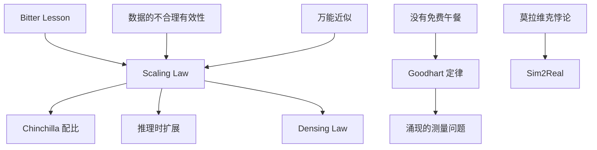

## AI 定理与经验定律

本页收 AI 与机器学习里常被当成「定律」的结果。多数是**经验规律**或特定假设下的定理：先看出处和成立条件，再谈产品用法。黑话与会议用词见[AI 黑话速查](jargon.md)；扩展定律的训练细节见[模型训练与对齐](llm-training.md)。

交互设计里的 Fitts、Hick、Tesler 复杂度守恒见[交互设计基础](../pm/design-interaction.md#交互设计定律)。本页的 Tesler 定理指 AI 效应，与复杂度守恒不是同一条。

???+ note "读法"
    每条固定四段：出处、含义、产品用法、边界。

    经验规律会随基准、数据质量和硬件改斜率；把数字当物理常数用会误判预算。

规模律回答「堆什么会变好」；学习理论回答「为什么没有万能配方」；莫拉维克回答「哪类能力天然贵」；Goodhart 回答「榜分为什么会骗你」。

## 速查

| 名称 | 一句话 | 产品上先记住 |
| --- | --- | --- |
| [Scaling Law](#scaling-law) | 损失随参数、数据、训练算力近似幂律下降 | 规模是杠杆，预测的是损失不是体验 |
| [Chinchilla 配比](#chinchilla-计算最优配比) | 固定训练算力下参数与数据要一起加 | 计算最优 ≠ 推理最优 |
| [推理时扩展](#推理时扩展) | 答题时多花计算也能换质量 | 要有验证信号，否则只增加延迟 |
| [Densing Law](#densing-law) | 开源基座的能力密度约每数月翻倍 | 同等能力的小模型与推理成本在快速下移 |
| [Bitter Lesson](#the-bitter-lesson) | 能吃算力的通用方法长期赢过精雕人类知识 | 别把专家规则写成不可扩展的上限 |
| [数据的不合理有效性](#数据的不合理有效性) | 足够多的数据常常压过更聪明的模型 | 覆盖、质量和反馈闭环决定上限 |
| [莫拉维克悖论](#莫拉维克悖论) | 对成人容易的推理对机器相对容易，感知与运动相反 | 机器人与多模态落地成本在身体，不在聊天 |
| [AI 效应](#ai-效应与-tesler-定理) | 一旦会做就被降级为「不算智能」 | 验收写任务，不写「够不够智能」 |
| [没有免费午餐](#没有免费午餐定理) | 全任务平均下没有永远最好的算法 | 必须声明任务分布再谈选型 |
| [丑小鸭定理](#丑小鸭定理) | 没有无偏的相似度 | 特征与度量是产品选择，不是自然真理 |
| [万能近似定理](#万能近似定理) | 足够宽的网络能逼近常见连续函数 | 「能表示」不等于「能训练、能泛化、能部署」 |
| [偏差-方差与双重下降](#偏差-方差权衡与双重下降) | 过参数化后误差可能再次下降 | 参数多不是过拟合的同义词 |
| [维度灾难](#维度灾难) | 维数升高后空间迅速变空 | 检索、样本量和距离度量会一起失效 |
| [彩票假设](#彩票假设) | 稠密网里存在可单独训练的稀疏子网 | 压缩要看可训练性，不只看稀疏率 |
| [Goodhart 定律](#goodhart-定律) | 指标成为目标后不再是好指标 | 榜分、RM 分数、自动评测都会被优化穿 |
| [涌现](#涌现) | 规模增大后某些任务突然会做 | 先怀疑离散指标，再谈神秘突变 |
| [对齐税](#对齐税) | 对齐可能换走部分能力或分数 | 安全与能力要分开记账 |
| [灾难性遗忘](#灾难性遗忘) | 学新的挤掉旧的 | 连续更新要留旧任务评测 |
| [Jevons 悖论](#jevons-悖论) | 效率提升会推高总消耗 | 单价下降往往带来更多调用 |

## 规模、算力与效率

### Scaling Law

- **出处**：Jared Kaplan 等，2020，[*Scaling Laws for Neural Language Models*](https://arxiv.org/abs/2001.08361)；同系列还有 Henighan 等 2020 的生成模型扩展定律。站内论文条目见[AI 经典论文](classic-papers.md)第 34 条
- **含义**：在架构和数据分布大致稳定时，预训练损失随参数量 $N$、数据量 $D$、训练计算量 $C$ 增大，按幂律下降。更大仍然有收益，但边际递减。它描述的是**语言建模损失**，不是某一项产品指标
- **产品用法**：用小规模拟合曲线，外推大训练的成本与收益；识别「再加数据收益已经很平」或「模型明显欠训练」。升级模型档位常常能白嫖能力，但延迟和单价同步上升，要用[模型能力与边界](capabilities.md)的任务集重测
- **边界**：数据重复、质量下降、过训练区间会让曲线拐弯；下游事实性、工具使用和用户体验不跟损失一一对应。换架构、换配比或换后训练后，旧拟合不能直接沿用

### Chinchilla 计算最优配比

- **出处**：Jordan Hoffmann 等，2022，[*Training Compute-Optimal Large Language Models*](https://arxiv.org/abs/2203.15556)，DeepMind，俗称 Chinchilla
- **含义**：固定训练算力时，参数和训练 token 应同步扩大。论文设定下，计算最优大约是 **1 参数配约 20 token**（例如 70B 配 1.4T token）。此前不少大模型参数过大、数据不足，属于欠训练
- **产品用法**：看开源模型说明书时，同时看参数和训练 token，避免只比较「B 数」。部署导向的团队经常故意 overtrain 小模型：训练更贵，推理更便宜
- **边界**：计算最优 ≠ 经济最优 ≠ 对齐最优。InstructGPT 证明小参数对齐模型可以胜过更大的未对齐 GPT-3，讲的是后训练，不要和 Chinchilla 配比写进同一句结论。后续 Llama 等模型远超 20× token，说明推理成本和数据质量会改写「最优」

### 推理时扩展

- **出处**：OpenAI o1 技术说明；Charlie Snell 等，2024，[*Scaling LLM Test-Time Compute Optimally can be More Effective than Scaling Model Parameters*](https://arxiv.org/abs/2408.03314)；DeepSeek-R1 把长思考与 RLVR 产品化。通识见[推理时扩展](llm-reasoning-scaling.md)
- **含义**：除了预训练的 $N$、$D$、$C$，还可以在**回答一个问题时**增加采样、搜索、验证器和思考 token。质量依赖「额外计算能否碰到可验证信息」，不是思考越长越好
- **产品用法**：实时对话用快模型，可验证难题再开 Thinking。把 test-time compute 写成预算：延迟、GPU 时间和错误能否被规则或验证器抓住。Best-of-N 没有选择器时，只增加自信幻觉
- **边界**：开放写作、无标准答案的咨询，多采样难以投票。思考 token 会计入账单，用户未必看得到。训练阶段的 RLVR 与推理阶段的加预算是两笔账

### Densing Law

- **出处**：肖超君、蔡杰、赵伟林等，2024 预印本 [arXiv:2412.04315](https://arxiv.org/abs/2412.04315)；期刊版 Chaojun Xiao 等，2025，[Densing law of LLMs](https://doi.org/10.1038/s42256-025-01137-0)，*Nature Machine Intelligence*
- **含义**：先给参考模型拟合「参数 → 下游表现」，再把目标模型的表现换算成参考模型要多少参数才能打平，称为**有效参数量**。**能力密度** = 有效参数量 / 实际参数量。经验规律：开源预训练基座的**最大能力密度随时间指数增长**。期刊版在常用基准上观测到约每 **3.5 个月**翻倍（预印本在 MMLU、BBH、MATH、HumanEval、MBPP 上约为 3.3 个月）。直观说法：数月后，大约一半参数的新模型可以追到当前同等下游表现
- **产品用法**：
    - 同等能力的推理成本在下移，端侧和低价档位每过一个季度都要重新报价
    - 选型不要锁死「只有 70B 才够用」；锁任务评测集，定期用新的小模型打同一集
    - 论文推论：剪枝和蒸馏经常得到**更小但密度更低**的模型，压缩成功要以密度和任务分一起验收
    - 与摩尔定律叠加：同面积芯片上可跑的「有效参数」涨得比单看硬件更快
- **边界**：密度相对参考模型和基准；换一套题，斜率会变。测的是开源**基座**在特定榜上的相对效率，不是 Chat 模型、工具增强系统或闭源 API 的用户体验。指数外推不能无限延伸到数据耗尽或评测饱和之后

### The Bitter Lesson

- **出处**：Rich Sutton，2019-03-13，随笔 [*The Bitter Lesson*](http://www.incompleteideas.net/IncIdeas/BitterLesson.html)
- **含义**：七十年 AI 研究里，长期最有效的是**能随算力扩展的通用方法**（主要是搜索与学习），而不是把人类领域知识写进系统。苦涩处在于：研究者更希望「我们理解的智能」获胜，但棋类、语音、视觉一次次被可扩展方法超过。Sutton 的结论是：只内建能发现复杂度的元方法，不要把已发现的知识焊死成上限
- **产品用法**：特征工程、专家规则、精巧工作流仍有短期价值，尤其在数据少、必须可解释、必须可控的环节。做平台与中长期技术选型时，优先可随数据、算力和测试时计算扩展的路径：通用模型 + 评测 + 工具，而不是把业务规则写成不可学习的塔
- **边界**：随笔不是定理，没有给出公式。安全约束、权限、合规和品牌语气仍然要写死。Sutton 后来也强调世界模型与持续学习；可扩展方法不限定于某一种架构

### 数据的不合理有效性

- **出处**：Alon Halevy、Peter Norvig、Fernando Pereira，2009，[*The Unreasonable Effectiveness of Data*](https://static.googleusercontent.com/media/research.google.com/en//pubs/archive/35179.pdf)
- **含义**：在真实网页与用户数据上，简单方法配足够多、足够乱的数据，常常胜过更精致但数据更少的模型。与 Bitter Lesson 同方向：可扩展的统计结构，压过手工语言学
- **产品用法**：先问覆盖面、标注质量和反馈是否闭环，再问换模型。垂直领域没有数据时，RAG 与合成数据是补覆盖，不是炼丹仪式
- **边界**：脏数据会放大偏见和污染。2009 年的「简单方法」不等于今天可以不做 Transformer；它提醒的是数据杠杆，不是架构已经结束

## 认知、感知与具身

### 莫拉维克悖论

- **出处**：Hans Moravec，1980 年代论述，系统写入 1988 年 *Mind Children*。Rodney Brooks 等同时期也有相近观察
- **含义**：对人类而言，高阶推理（棋、定理、考试题）显得难，感知与运动显得容易；对机器则相反。给计算机成人级的智力测验或下棋相对容易，给一岁婴儿级的感知与移动极难。进化把感知运动压进了海量计算，符号推理反而是晚近、薄薄一层
- **产品用法**：聊天、解题、写代码的体验，不能外推到机器人、驾驶、仓储抓取。多模态产品里，「看懂界面 / 看懂仓库」往往比「会说」更贵、更慢、更脆。具身与世界模型见[世界模型与具身智能](world-models-embodied.md)
- **边界**：大模型出现后，语言推理的难度曾被低估；长程规划、工具使用和诚实校准仍然难。悖论比较的是**技能类型的相对难度**。传感器噪声、延迟和安全约束会把感知问题再放大

### AI 效应与 Tesler 定理

- **出处**：Larry Tesler 1970 年代起的口头定理，常表述为 *AI is whatever hasn't been done yet*。相关现象称 **AI 效应**：一旦系统可用，就被排除出「真正的智能」
- **含义**：国际象棋、搜索、语音识别、翻译都经历过「这只是搜索 / 只是统计，不算 AI」。目标会随能力上移。与设计里的 [Tesler's Law](../pm/design-interaction.md#teslers-law)（复杂度守恒）同名不同义
- **产品用法**：路线图和验收写**可观测任务**（准确率、延迟、人工接管率），不要写「具备智能」。对外沟通时，用户会迅速把去年的奇迹当成基础设施
- **边界**：这是社会认知，不是性能定律。不能用它否定评测；它提醒预期管理

### 灾难性遗忘

- **出处**：McCloskey 与 Cohen，1989；持续学习文献中的稳定性-可塑性困境（Carpenter 与 Grossberg 的 ART 等）
- **含义**：神经网络在学新分布时，容易覆盖旧任务所需的权重。可塑性（学会新的）与稳定性（记住旧的）互相拉扯
- **产品用法**：领域微调、定期热更新、用户个性化写入权重前，必须留一份旧任务回归集。不想遗忘就用 RAG、适配器分任务加载，或把新知识放在上下文，而不是每次全量覆盖
- **边界**：重放旧数据、正则、专家混合都能缓解，很少彻底消失。产品表现的「回退」也可能来自路由、量化、提示变化，先做归因

### Sim2Real

- **出处**：机器人与强化学习社区的惯用名，指仿真到真机的迁移差距
- **含义**：仿真里最优的策略，到真实传感器、摩擦、延迟和安全限制下会失效。差距来自物理建模误差与分布偏移
- **产品用法**：具身、驾驶、工业控制必须把真机评测当验收，仿真分数只是筛子。语言 Agent 的「浏览器仿真」同样有 Sim2Real：无头环境和真实 DOM、登录态、验证码不是同一分布
- **边界**：域随机化、系统识别、真机微调可以缩小差距，不能假设已为零

## 学习理论

### 没有免费午餐定理

- **出处**：David Wolpert 与 William Macready，1997，*No Free Lunch Theorems for Optimization*
- **含义**：在全部可能的任务上平均，没有任何优化或学习算法全面胜出。算法的优势来自与**任务分布**的匹配，来自归纳偏置
- **产品用法**：不存在「永远该上的模型」。先写清任务、数据、失败成本和延迟，再比较。通用大模型赢在自然分布与规模，不赢在「定理保证处处最优」
- **边界**：NFL 的「全部任务均匀平均」与现实（语言、视觉高度非均匀）不同。它禁止的是无条件排行，不是迁移学习

### 丑小鸭定理

- **出处**：Satosi Watanabe，1969 / 1985，*Ugly Duckling Theorem*
- **含义**：若所有特征同等看待，任意两个对象的共享特征数相同。没有先天的「客观相似」；相似度取决于你选哪些特征、忽略哪些
- **产品用法**：推荐、检索、风控里的「相似用户 / 相似文档」是产品定义。换 embedding 就是换一种丑小鸭的特征加权。出现争议个案时，先暴露相似度用的特征，再调模型
- **边界**：定理是组合论陈述。选定任务相关特征后，相似当然可以很有用

### 万能近似定理

- **出处**：George Cybenko，1989（sigmoid 隐层）；Kurt Hornik，1991 等后续推广
- **含义**：足够宽的单隐层前馈网，能以任意精度逼近一大类连续函数
- **产品用法**：用来挡住「神经网络表达能力不够所以这个需求做不了」。真正的约束在数据、优化、泛化、延迟和安全
- **边界**：能逼近 ≠ 能用有限数据学到，≠ 对分布外成立，≠ 推理成本可接受。深度、注意力和规模讨论的是可学习性与归纳偏置，不是「函数够不够表示」

### 偏差-方差权衡与双重下降

- **出处**：经典偏差-方差分解；双重下降见 Mikhail Belkin 等 2019，以及 Preetum Nakkiran 等 *Deep Double Descent*
- **含义**：传统图像是模型变复杂则偏差降、方差升，U 形误差。深度网络在插值阈值附近误差升高后，继续加参数或加数据，误差可能**再次下降**（双重下降）
- **产品用法**：不要用「参数已经比样本多，一定会过拟合」一票否决大模型。过拟合仍然存在，要用独立验证和分布外集看，而不是只看参数个数
- **边界**：双重下降依赖噪声、正则和任务。它解释现象，不给你一张「再大一定更好」的空白支票。产品仍要看[Scaling Law](#scaling-law)的边际收益和成本

### 维度灾难

- **出处**：Richard Bellman，动态规划语境，后成为高维统计与机器学习的通名
- **含义**：维数升高后，体积集中在表面，距离趋同，要覆盖空间所需样本指数增长
- **产品用法**：高维 embedding 检索必须靠 ANN、分片和评测召回，不能假设「向量近就是业务近」。特征堆得很多但样本很少时，先降维或换模型，再谈上线
- **边界**：流形假设下数据并不填满整个高维立方体，深度学习依赖这一点。灾难描述的是朴素全空间，不是「向量检索无效」

### 彩票假设

- **出处**：Jonathan Frankle 与 Michael Carbin，2019，[*The Lottery Ticket Hypothesis*](https://arxiv.org/abs/1803.03635)，见[AI 经典论文](classic-papers.md)第 30 条
- **含义**：稠密网络里存在稀疏子网络，单独训练可达到与原网相近的精度。像彩票：初始化时已经「中签」
- **产品用法**：压缩和剪枝要验证**再训练后的任务分、延迟、硬件内核是否真加速**。稀疏率好看但不可训练或不可加速，等于没压
- **边界**：中签子网往往靠「先训稠密再剪」找到，不是随机稀疏从零就稳。与 Densing Law 一致：压缩算法不自动提高能力密度

### 奥卡姆剃刀与最短描述

- **出处**：哲学原则；机器学习里常落到最小描述长度（MDL，Jorma Rissanen）
- **含义**：能同等解释数据时，优先更短的描述。正则、早停、小模型偏好都是它的工程亲戚
- **产品用法**：两套方案指标接近时，选更少状态、更少工具、更短链路的那个。复杂 Agent 要先证明简单工作流不够
- **边界**：最短的假设可能欠拟合。大模型看起来违反剃刀，是因为「短」算的是对数据的压缩，不是参数个数表面上更小

### Grokking

- **出处**：Alethea Power 等，2022，[*Grokking: Generalization Beyond Overfitting on Small Algorithmic Datasets*](https://arxiv.org/abs/2201.02177)
- **含义**：小算法任务上，模型先记住训练集，在远超过拟合点的继续训练后，测试性能突然泛化。记忆和理解在时间上可以错开
- **产品用法**：「训练损失已经很低」不是停训的充分理由，要看验证与下游。小数据封闭任务上，多训一会儿有时会换来真正规则，而不是只会背
- **边界**：现象在小算法数据上清晰，不能外推到所有 LLM 预训练。产品停训仍以验证集和成本为准

## 评测、对齐与治理

### Goodhart 定律

- **出处**：Charles Goodhart，1975；常用表述来自 Marilyn Strathern：*When a measure becomes a target, it ceases to be a good measure*
- **含义**：指标一旦成为优化目标，就会被钻空子，不再反映你原来想要的东西
- **产品用法**：公开榜、内部单一总分、奖励模型分、LLM-as-Judge 分都会被刷。保留人工抽检、对抗集、业务指标和**不可对训练可见**的切片。Agent 的「任务完成率」若只看轨迹长度或工具调用次数，会奖励空转
- **边界**：不是反对量化。要多指标、轮换探针、把指标当仪表而不是奖金函数本身

### 涌现

- **出处**：Jason Wei 等，2022，*Emergent Abilities of Large Language Models*；Rylan Schaeffer 等，2023，[*Are Emergent Abilities of Large Language Models a Mirage?*](https://arxiv.org/abs/2304.15004)。通识见[大模型基础](llm-basics.md#涌现的正确理解)
- **含义**：某些任务在小模型上近乎为零，到某一规模突然可用。后续工作指出：用对/错这类离散指标时，平滑的对数概率提升会看起来像台阶
- **产品用法**：不要用「还没涌现所以永远做不了」停掉小模型方案；也不要用「已经涌现」跳过评测。换连续指标、看校准、看是否只在提示工程后出现
- **边界**：测量假象不等于能力不随规模增长。规模、数据、后训练仍然在改能力形状，只是「开关」叙事不可靠

### 对齐税

- **出处**：对齐文献中的工程观察，InstructGPT / RLHF 报告里多次出现能力或基准分的取舍；不是单篇定理
- **含义**：让模型更安全、更服从、更少胡话，可能降低某些基准、创造性或主动性。税可正可负，取决于你怎么测
- **产品用法**：安全策略、拒答、系统提示改版都要走同一套能力回归，加上安全集。对外说「更安全」时准备好能力变化说明
- **边界**：税不是物理常数。更好的数据与 RLVR 可以在部分任务上同时提高能力与可控性。不要用对齐税当拒绝做安全的理由

## 系统与成本

### 摩尔定律与黄氏定律

- **出处**：Gordon Moore，1965，芯片上晶体管密度约每两年翻倍（表述后来有修正）。**黄氏定律**是对 NVIDIA GPU 深度学习算力增速快于摩尔定律的业界说法，不是对等的同行评审定律
- **含义**：Bitter Lesson 的背景是算力变便宜。GPU 的训练与推理吞吐另有自己的曲线，还受显存、互联和软件栈限制
- **产品用法**：三年成本模型不要假定硬件单价冻结，也不要假定软件栈吃满理论 FLOPS。看 MFU 和端到端 token 成本
- **边界**：摩尔定律已放缓。黄氏定律口径（哪一代卡、训练还是推理、含不含稀疏与低精度）必须写明

### Amdahl 定律

- **出处**：Gene Amdahl，1967
- **含义**：系统加速比受不可并行部分限制。把 90% 的时间优化到无穷快，整体最多快约 10 倍
- **产品用法**：只加速模型推理、不处理检索、网络、鉴权、前端水合，用户体感不动。先画端到端时间饼图，再决定买更贵的 GPU 还是改 Prefill、缓存、UI 流式
- **边界**：可并行比例本身会随架构变化（例如连续批处理提高 GPU 有效利用率）

### Little's Law

- **出处**：John Little，排队论，$L = \lambda W$（在制数 = 到达率 × 停留时间）
- **含义**：并发请求数、QPS 与延迟绑在一起。要提高吞吐又不加延迟，必须改服务时间或改排队结构
- **产品用法**：长上下文、Thinking 模式会拉长 $W$，同样 GPU 下并发 $L$ 立刻下降。配额、排队和超时要按新的 $W$ 重算，不能沿用短问答的容量模型
- **边界**：定律在稳态到达过程下成立。突发流量、抢占和优先级队列要另建模型

### Jevons 悖论

- **出处**：William Stanley Jevons，1865，*The Coal Question*：提高煤炭利用效率后，总消耗上升
- **含义**：推理单价下降、速度变快后，产品会开通更多功能、用户会问更多更长的问题，**总 GPU 账单不一定降**
- **产品用法**：降价或上更快模型时，同步做配额、缓存、分级路由和「哪些任务值得用推理模型」。成本规划按调用量弹性来，不要按当前 QPS 线性外推
- **边界**：悖论描述的是反弹方向，弹性系数要自己测。有些内部工具需求刚性，降价就是省钱

## 相关页面

- [AI 黑话速查](jargon.md)
- [模型训练与对齐](llm-training.md)、[大模型基础](llm-basics.md)、[模型能力与边界](capabilities.md)
- [推理时扩展](llm-reasoning-scaling.md)、[评估与评测](evaluation.md)
- [AI 经典论文](classic-papers.md)第 30、34、35 条
- [世界模型与具身智能](world-models-embodied.md)

## 来源说明

本文为原创整理，引用日期：2026-09-05。Scaling Law、Chinchilla、推理时扩展、Densing Law、彩票假设、涌现批判等以对应论文或期刊版为准；Bitter Lesson 以 Sutton 原文为准；莫拉维克悖论以 Moravec *Mind Children* 及同期论述为准。Densing Law 翻倍周期：期刊版约 3.5 个月，预印本在五套基准上约 3.3 个月，随基准与参考模型变化。事实以官方页面和原始论文为准。
