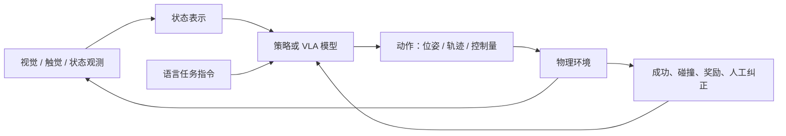

## 世界模型与具身智能前沿论文

本页把“预测环境”和“执行动作”分开讨论：世界模型学习环境动态，策略模型选择动作，控制器负责低延迟执行。多模态基础见 [多模态理解](multimodal.md)，Agent 产品闭环见 [Agent 与工作流](agent.md)。

## 世界模型：从预测 token 到预测环境

### 1. 世界模型的定义

[World Models](https://arxiv.org/abs/1803.10122) 将世界模型描述为能够学习环境空间结构与时间动态的生成式模型。对强化学习智能体而言，模型不只预测下一个文字 token，而是预测在动作影响下环境如何变化：

```text
观测 o_t + 动作 a_t → 潜在状态 z_t
z_t + a_t → 预测 z_(t+1)、奖励 r_(t+1) 和终止信号
```

世界模型通常包含：

- **表示模型**：把图像、传感器或环境观测压缩为潜在状态；
- **动力学模型**：预测状态在动作作用下如何演化；
- **奖励或价值模型**：估计未来收益；
- **策略或规划器**：在模型内部模拟候选动作，再选择行动。

它的价值在于减少真实环境试错，让策略可以在内部生成的未来轨迹中训练或规划。这里的「想象」是可计算的模型 rollout，不是对系统能力的拟人化描述。

### 2. DreamerV3：在潜在空间中想象未来

[Mastering Diverse Domains through World Models](https://arxiv.org/abs/2301.04104) 介绍 DreamerV3。它学习环境的潜在动态，在潜在空间中预测未来并改进策略，而不是每一步都依赖真实环境采样。

DreamerV3 的研究意义在于把世界模型方法推进到更多任务和不同奖励尺度。其训练配方包含归一化、平衡和变换等机制，减少不同环境之间的超参数敏感性。论文展示了从像素和稀疏奖励出发完成复杂任务的能力。

世界模型的关键风险是模型误差累积：规划步数越长，预测偏差越可能把策略带到真实环境不存在的状态。产品化时需要同时测量短期预测准确率、长 rollout 稳定性、策略迁移和真实环境中的安全回退。

### 3. 生成式环境与可交互模拟

世界模型与视频生成模型存在交集，但二者目标不同：视频生成追求视觉上合理的帧序列，世界模型还要保证动作、状态、奖励与未来结果之间具有决策一致性。一个只会生成漂亮视频的模型，未必适合控制机器人或规划任务。

研究一个世界模型时，应分别问：

1. 它是否建模动作条件，而不是只做无条件预测？
2. 预测的潜在状态是否足以支持价值估计或规划？
3. 模型误差是否可检测，是否存在短 horizon 或安全边界？
4. 训练数据覆盖的环境变化，是否包含部署时的长尾状态？


## 具身智能：把模型输出接到物理世界

### 1. 具身智能的闭环

具身智能研究能够通过身体、传感器和环境交互完成任务的智能体。它的基本闭环不是「输入问题 → 输出文字」，而是：



具身系统的难点来自闭环约束：动作有延迟，观测有噪声，环境会变化，错误可能造成碰撞或设备损坏。语言模型的离线 benchmark 不能替代控制频率、轨迹误差、成功率、恢复策略和安全测试。

### 2. RT-2：视觉语言模型迁移到机器人动作

[RT-2: Vision-Language-Action Models Transfer Web Knowledge to Robotic Control](https://arxiv.org/abs/2307.15818) 提出视觉—语言—动作模型（VLA）RT-2。它把机器人动作离散化并编码成 token，使模型可以用生成文本的方式输出控制动作。

RT-2 将互联网规模视觉语言数据与机器人轨迹数据放进统一的序列化格式中联合训练。这样，模型从视觉语言预训练中获得的对象、属性和语义知识有机会迁移到机器人操作任务。

这个方法展示了「通用视觉语言知识 → 物理动作」的接口，但迁移不等于自动获得可靠控制。部署仍需处理：

- 动作 token 的时间分辨率和控制频率；
- 视觉观测与真实位姿的对齐；
- 训练数据中未覆盖的物体、光照和摩擦；
- 低延迟推理与动作平滑；
- 碰撞检测、急停和人机协作安全。

### 3. Open X-Embodiment：跨机器人数据与动作接口

[Open X-Embodiment: Robotic Learning Datasets and RT-X Models](https://arxiv.org/abs/2310.08864) 汇集多种机器人平台和任务，研究跨 embodiment 数据训练通用策略。它要解决的不是单个机器人动作精度，而是不同机械臂、相机、动作空间和任务数据如何共享。

跨机器人学习需要显式处理：

- 机器人本体差异；
- 坐标系、动作空间和控制频率差异；
- 任务标签与语言指令的统一；
- 失败轨迹、人工演示和自动数据的质量差异。

对产品经理而言，这类工作说明具身智能的规模化瓶颈不只有模型参数，还包括数据接口、仿真环境、机器人硬件和安全运营体系。

### 4. 具身智能与世界模型的关系

世界模型回答「环境接下来可能如何变化」，具身策略回答「在当前目标下应该采取什么动作」，VLA 负责把多模态观测和语言任务映射到动作表示。三者可以组合，但不应混为一谈：

| 模块 | 主要问题 | 典型输出 |
| --- | --- | --- |
| 世界模型 | 执行动作后环境如何变化？ | 下一状态、未来观测、奖励 |
| 策略模型 | 当前状态下选择什么动作？ | 动作、轨迹、价值 |
| VLA | 如何把视觉与语言任务映射到动作？ | 离散动作 token 或连续控制 |
| 控制器 | 如何在毫秒级闭环中执行动作？ | 电机指令、位姿跟踪 |

如果产品只需要看图和回答问题，VLA 或世界模型可能是过度设计；如果产品要在物理世界长期运行，模型预测、策略规划、低层控制和安全机制必须作为一个系统验收。

## 生成式环境与预测式表征

[Genie: Generative Interactive Environments](https://arxiv.org/abs/2402.15391) 探索从无标注视频和动作序列中学习可交互环境。它代表一条重要路线：模型不仅生成看起来合理的画面，还要让动作改变后续状态，使生成结果可以被策略用于训练或规划。

[V-JEPA](https://arxiv.org/abs/2402.15415) 则在潜在表征空间中预测被遮挡或未来的表示，而非追求像素级重建。预测式表征更关注可用于理解和决策的环境结构，但 V-JEPA 本身不是完整世界模型：还需要动作条件、奖励、策略或控制器才能形成闭环。多模态侧的同一条论文见 [多模态前沿论文](multimodal-frontier-papers.md)。

评估生成式环境时要分开看三件事：

- **视觉合理性**：未来帧是否像真实环境；
- **动力学一致性**：动作是否带来符合物理和任务规律的状态变化；
- **决策有效性**：策略在模型中成功，迁移到真实环境后是否仍成功。

只验证第一项，不能证明模型适合规划。

## 策略模型与连续动作

RT-2 代表把动作离散化为 token 的 VLA 路线。另一类方法直接预测连续动作轨迹。[Diffusion Policy](https://arxiv.org/abs/2303.04137) 使用条件扩散模型生成动作序列，适合表达多峰的连续控制分布：同一个语言目标可能存在多种有效轨迹，模型不必过早平均成一条动作。

[Octo](https://arxiv.org/abs/2405.12213) 研究通用机器人策略和多任务、多本体数据；[π0](https://arxiv.org/abs/2410.24164) 探索将视觉语言模型的语义能力与连续机器人动作结合。不同动作表示的比较如下：

| 路线 | 动作输出 | 适合的问题 | 主要风险 |
| --- | --- | --- | --- |
| VLA 自回归 | 离散动作 token | 语言知识迁移、符号任务 | 时间分辨率和动作离散误差 |
| Diffusion Policy | 连续动作轨迹 | 平滑控制、多模态轨迹 | 多步采样和实时性 |
| 世界模型 + Planner | 未来状态与奖励 | 长程规划、环境变化 | rollout 误差累积 |
| 低层控制器 | 位姿、速度或力 | 毫秒级稳定执行 | 泛化能力有限，需要上层策略 |

## Sim-to-Real 与跨具身泛化

世界模型和机器人策略通常先在仿真或离线数据中训练，再迁移到真实设备。sim-to-real 的误差来源包括相机畸变、摩擦、动力学、延迟、遮挡、物体材质和执行器误差。

跨机器人数据还需要统一：

- 观测空间与坐标系；
- 机械臂自由度和动作空间；
- 控制频率与轨迹时间尺度；
- 语言任务和成功标准；
- 演示、失败轨迹和人工纠正的质量。

[Open X-Embodiment](https://arxiv.org/abs/2310.08864) 的价值在于把跨本体数据和迁移作为主要研究问题，而不是把单一机器人实验的成功率直接外推为通用具身能力。

## 闭环评测

具身智能应至少分四层验收：

1. **感知**：物体、位置、状态和语言指令是否理解；
2. **策略**：动作选择是否完成目标，是否能够恢复；
3. **控制**：轨迹误差、延迟、平滑性和执行稳定性；
4. **安全**：碰撞、越权、急停、人工接管和长时间运行。

建议记录以下指标：

| 指标 | 说明 |
| --- | --- |
| 任务成功率 | 达到机器可判定终态的比例 |
| 恢复率 | 初次动作失败后仍完成任务的比例 |
| 碰撞率 | 与人、设备或环境发生危险接触的比例 |
| 轨迹误差 | 实际轨迹与目标轨迹的偏差 |
| 控制延迟 | 观测、推理、通信和执行的总延迟 |
| 人工接管率 | 需要人类介入的任务比例 |
| 长时稳定性 | 长时间连续运行中的故障和退化 |

世界模型、策略模型和控制器必须在同一任务协议下联合评估。模型在想象环境中成功，不能替代真实设备上的安全测试。

## 给 AI 产品经理的结论

世界模型适合需要预测、规划和环境反馈的任务；VLA 适合把视觉与语言知识映射到动作；Diffusion Policy 更适合连续轨迹；低层控制器负责实时执行。产品立项时应先确定闭环中缺的是环境预测、策略泛化还是控制稳定性，再选择模型路线。

## 来源说明

本文为世界模型与具身专题独立页，引用日期：2026-09-04。论文与实验结论以原始来源为准。主要来源包括 [World Models](https://arxiv.org/abs/1803.10122)、[DreamerV3](https://arxiv.org/abs/2301.04104)、[Genie](https://arxiv.org/abs/2402.15391)、[V-JEPA](https://arxiv.org/abs/2402.15415)、[RT-2](https://arxiv.org/abs/2307.15818)、[Open X-Embodiment](https://arxiv.org/abs/2310.08864)、[Diffusion Policy](https://arxiv.org/abs/2303.04137)、[Octo](https://arxiv.org/abs/2405.12213) 与 [π0](https://arxiv.org/abs/2410.24164)。
