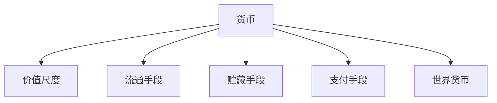

## 货币的职能

职能是人们使用货币的客观依据。货币的五大职能是价值尺度、流通手段、贮藏手段、支付手段、世界货币。

五大职能从国内计价、交换、保存和延期支付，逐步延伸到跨国交易场景。

## 五大职能

**价值尺度**：用货币衡量商品价值量的大小。行使该职能只需要观念的或想象的货币——商场电视机标价 3000 元，一张标价签即可，不必摆放现金。

**流通手段**：货币充当商品交换的媒介，使物物交换（商品—商品）演变为商品—货币—商品。两点要求：必须是现实的货币；不一定是足值的货币，价值符号完全可以——得到货币不是最终目的，有强制性的价值符号人人接受即可。

**贮藏手段**：货币退出流通、保存价值。两点要求：须是现实的货币；须是足值的货币——不足值的价值符号遇通货膨胀会贬损，物价长期稳定时纸币也有一定贮藏职能但不如足值货币理想。

**支付手段**：货币作为交换价值的独立形态进行单方面转移，货币运动与商品运动相分离。典型场景是发工资、缴水电费。突破一手交钱一手交货的即时性，大大拓展交易空间，企业大量应收账款、应付账款源于此。

**世界货币**：货币超越国界，到国际市场行使前述职能。能充分行使的是美元、欧元等关键货币；人民币目前只具备世界货币雏形。

## 人民币国际化

人民币国际化是让人民币到国际市场发挥一般等价物作用，四个层面：

**跨境贸易人民币结算**：2012 年 3 月起所有具有进出口经营资格的企业均可使用人民币跨境结算。2024 年货物贸易项下跨境人民币结算量约 12.4 万亿元；2025 年 3 月人民币在全球支付中占 4.13%，为全球第 4 大支付货币。两个清醒认识：与美元（约 47%）、欧元（约 22%）差距大；份额主要靠我国自身庞大的进出口贸易支撑，其他国家之间的贸易用人民币结算很少。

**跨境金融交易（投融资货币）**：2024 年对外直接投资人民币跨境收付 3.01 万亿元，外商直接投资 5.24 万亿元；境外机构和个人持有境内人民币金融资产 9.77 万亿元。支撑渠道是金融市场持续开放：沪港通、深港通、债券通、沪伦通、跨境理财通、互换通、跨境支付通相继开通。

**储备货币**：截至 2025 年 3 月，全球官方外汇储备中人民币资产占比 2.12%，超 80 个国家的央行将人民币作为外汇储备一部分，人民币为全球第 7 大储备货币。

**定价货币**：国际市场黄金、大宗商品、各国汇率普遍以美元标价，美元是标杆。人民币在更多定价场景出现，世界货币职能才能上台阶。

人民币具备世界货币雏形，货币地位与我国经济贸易地位（世界第二大经济体）仍不匹配；实现与经济贸易地位相匹配的货币地位需要一个过程。
