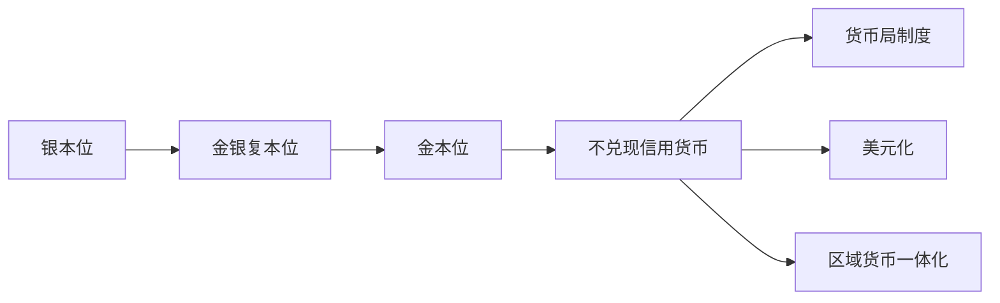

## 货币制度

## 概念与构成要素

**货币制度**是一个国家以法律形式规定的货币流通的组织形式，简称币制。三大核心构成要素：

货币制度的演变主线由贵金属约束转向信用货币，后续制度是在信用货币框架下对稳定性与自主性的不同取舍。

1. **货币金属与货币单位**：规定哪种材料作为币材，规定单位及其等分（元、角、分）。
2. **各种通货的铸造、发行与流通程序**：明确货币由谁铸造、如何投入流通，如自由铸造还是垄断铸造。
3. **金准备制度**：货币发行的保证制度——发行货币时背后有没有东西作保证，可以是黄金，也可以是战略物资或某种强势货币（外汇储备）。

## 货币制度的演变

**银本位制**：以白银作为本位货币，本位货币是足值货币。三个运行特点：自由铸造、无限法偿（不论支付额多大，出售者不得拒绝接受）、自由输出输入。16 世纪流行因当时以小额交易为主、白银适合小额支付。局限随大宗交易增多而暴露，过渡到金银复本位制。

**金银复本位制**：同时以黄金和白银作为本位货币。三种形式：

- **平行本位制**：金币银币比价由市场生金生银价格决定，比价不断变化，商品价格混乱。
- **双本位制**：金币银币按法定比价流通，法定比价固定而市场比价多变，两者常发生偏离。
- **跛行本位制**：金币可自由铸造、银币不可，流通主要靠金币，是向金本位过渡的形式。

复本位制下会出现**劣币驱逐良币（Gresham's Law）**：法定比价与市场比价偏离后产生良币（实际价值高）与劣币（实际价值低），人们优先支付劣币、留下良币，良币退出流通。例：法定比价 1:20、市场比价 1:22 时，金币实际值 22 个银币、法定只值 20 个，金币为良币，银币为劣币。

**金本位制**：以黄金作为本位货币。三种形式：

- **金币本位制**：实行金币流通，是典型形态。三个自由：金币自由铸造自由熔化（自动调节货币数量、稳定物价）、辅币与银行券可按面值自由兑换金币（节省流通费用且约束滥发）、黄金自由输出输入（汇率稳定在铸币平价，即两国货币含金量之比；汇率偏离铸币平价超过黄金运输成本时，人们改用运送黄金，迫使汇率回归）。英国 1816 年成为第一个实行金币本位制的国家。局限：黄金磨损费高、供应有限且分布不均。
- **金块本位制**：以金块作准备的纸币流通，不铸金币，兑换须达到一定数额（英国规定每次至少 400 盎司），一般百姓难以兑换，称"富人本位制"。
- **金汇兑本位制**：通过外汇间接兑换黄金。殖民地国家本币与宗主国货币挂钩、固定汇率，兑换过程迂回，称"虚金本位制"。1935 年国民政府推出法币，法币与美元挂钩而美元与黄金挂钩，也是一种虚金本位制。

**不兑现的信用货币制度**：以不兑换黄金的纸币作为本位货币。三个特征：纸币是价值符号但无限法偿、依法强制流通；货币供应量不受黄金白银约束、弹性很大（可据经济需要供应，政府也可能滥发导致通货膨胀）；纸币对内价值（物价）与对外价值（汇率）的稳定取决于政府对货币供应的管理。

## 货币局制度

**货币局制度**是在不兑现信用货币制度框架下的特殊形式，典型是我国香港。两大运行特点：本币钉住一种强势货币（锚货币，港元钉住美元 1:7.8）；本币发行以 100% 外汇储备为保证（每发行 7800 万港元须有 1000 万美元储备）。

适用情形：反复出现严重通胀、政府公信力受损的国家；地理或经济规模小、开放程度高的经济体。优越性：严格财政纪律抑制通胀；确保本币自由兑换；增强本币国际信誉；对国际收支提供自动调节机制。主要代价：**丧失货币政策自主权**——利率须与储备货币国保持一致，美国加息香港也要加息。

## 美元化

**美元化**指以美元（或泛指任何一种强势外币）代替本币流通。按程度分三种：

- **非官方美元化**：政府仍规定本币为法定货币，民间已广泛接受外币流通。常见于恶性通胀时民众的自我保护。
- **半官方美元化**（二重货币体系）：本币与某种外币同时为法定货币。
- **官方美元化**：废除本币、以外币替代，放弃货币主权，没有严格意义的中央银行。

美元化的三大成本：损失铸币税收入；失去独立的货币政策与汇率政策工具；央行不能发挥最后贷款人作用（危机时无法开动印钞机注入流动性）。收益：有利于控制通胀；降低汇率风险与交易成本；相对货币局制度可防范国际资本投机冲击（直接使用美元，不存在本币汇率被攻击的标的，1998 年索罗斯冲击香港货币局制度即反例）。

## 区域货币一体化

**区域性货币一体化**是区域内国家在货币金融领域协调、形成统一货币体系。代表是欧元（2002 年推出，欧元区现有 19 国）。理论依据是蒙代尔的最适通货区理论——符合一定条件的区域放弃本国货币、采用单一区域货币，有利于实现充分就业、物价稳定、国际收支平衡等宏观目标。

收益：节约成员国外汇储备；促进区域资本配置；货币职能更有效；统一央行提升反通胀信誉（承诺机制）。成本：丧失独立货币政策；放弃汇率政策工具；新旧货币转换成本。

**欧元区的困境**：2010 年欧债危机后欧元面临诞生以来最严重困境。两大成因：个别成员国债务危机引发整体信任危机（传染效应）；货币政策统一与财政政策分割的矛盾——有统一的欧洲中央银行却无统一财政机构，成员国出问题只能靠本国财政担保，成为投机资本打压欧元的突破口。出路是在集体稳定与个体自主之间取舍，构成两难。
