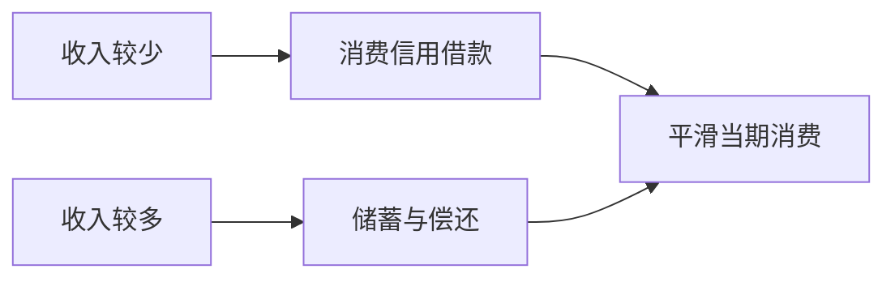

## 消费信用与金融风险

## 消费信用的形式与理论基础

**消费信用**是银行或大的商店、企业以货币形式或商品形式向消费者个人提供的信用。四种具体形式：

- **赊销**：零售商对消费者延期付款销售，期限短。
- **分期付款**：先付一部分货款，再按合同分期加利息支付剩余货款，属中长期信用。
- **消费贷款**：银行面向消费者个人发放的用于消费的贷款。二战后快速发展，目前发达国家消费贷款约占银行全部贷款的 30%–50%。
- **信用卡**：银行或信用卡公司对信用合格的消费者发放的信用证明，本质是循环授信工具。运作流程：发卡机构发卡 → 消费者消费 → 发卡机构先垫付 → 消费者在免息期内（我国最长不超过 60 天）偿还。银行卡按是否具备透支功能分为信用卡与借记卡。我国截至 2024 年末信用卡 7.27 亿张，授信总额 22.90 万亿元。

微观理论基础是莫迪利安尼的**生命周期理论**：消费取决于一个人整个生命周期的收入与财产总和，人追求一生消费效用最大化，通过消费信用**跨期平滑消费**——收入少时借钱消费、收入多时储蓄偿还。

生命周期理论把消费信用解释为跨期调剂工具，但过度借贷会把未来偿还压力集中到当前繁荣之后。

## 消费信用的弊端与次贷危机

消费信用是对未来购买力的预支，本质是以将来消费需求的萎缩换取现在消费需求的扩张。适当预支没有问题，过量则表现为**信用膨胀**，造成市场虚假繁荣、掩盖真实供求；贷款涌入的领域（如房地产）形成泡沫，泡沫破灭冲击消费者、银行与供应商。

**美国次贷危机**是滥发消费信用的警钟：

- **次优按揭贷款**是按揭贷款中信用等级较低者可获得的贷款。美国房贷申请人按征信记录信用评分（300–850 分），660 分以上可获优惠利率贷款，以下只能获次贷。
- 成因：银行侧为追逐高收益低标准放贷（零首付、不核验还款能力）；宏观侧 2001–2004 年美联储持续降息刺激房价走高，2005 年后利率走高、房价回落刺破风险。基本原因是银行不审慎的贷款行为、滥发信用。
- 危机演进：发放次贷较多的银行先破产 → 波及购买次贷衍生品的基金、保险公司、投行 → 信贷紧缩 → 股市大幅波动 → 美国经济整体下行，美联储推出多轮量化宽松。

**我国居民杠杆率**（居民债务 ÷ GDP）目前 60% 出头，处国际中等水平；2007 年不到 20%、不到 10 年就突破 40%，加杠杆速度远超美国，值得关注。局部风险隐患：首付贷、校园网贷、信用卡大额授信、网络小额借贷平台。

## 民间金融诈骗与庞氏骗局

民间信用起正反两面作用：既解决临时性资金困难，又大量滋生金融诈骗，尤其是依托互联网之后。集资诈骗的**五大套路**：

1. 以经营高利润项目为借口（打高科技、区块链、稳定币旗号）。
2. 舆论宣传造势，制造资金雄厚的假象（高调慈善、赞助节目、名人代言）。
3. 以支付高额利息为诱饵。
4. 熟人牵线搭桥，用熟人关系作信用背书。
5. 连环集资支付利息——用后来者的钱付前面投资者的利息，制造"利息能兑现"的假象。

第五点是**庞氏骗局**的本质：新投资者资金支付旧投资者收益，拆东墙补西墙。查尔斯·庞兹 1919 年许诺三个月 40% 回报，以新钱付旧息，吸引约 3 万名投资者。

**P2P 网贷重灾区**：2016 年前全国 P2P 机构一度约 5000 家，大量假借 P2P 之名非法集资。e 租宝一年半内非法集资 500 多亿，靠假项目、假三方、假担保运作。2016 年起整顿，到 2020 年 11 月 P2P 完全归零。

**温州乐清抬会**是合会演变为诈骗的典型：会员入会交 11600 元，会主第一年每月付 9000 元（年收益率约 831%），第十三个月起会员每月付 3000 元连付 88 个月。会主维持运转只有两条路——搞真实经营（月收益率须达 77.6%，常规项目不可能）或不断吸收新会员（所需人数按几何级数增长，县域人口很快触顶）。会主在资金富余时卷款跑路，引发连锁崩盘。

**治理思路**：一方面发挥民间信用功能；另一方面老百姓增强风险意识（不贪图高收益），政府监管对涉及面广、单笔额度大的民间信用要求备案登记、签订规范合同。
