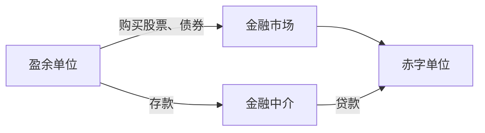

## 金融市场

## 概念与特征

**金融市场**是以金融资产作为交易对象而形成的供求关系及其机制的总称，通俗理解是融通资金的场所。

理解要点：**有形市场**有固定场所与专门机构（证券交易所），**无形市场**靠电话、网络联系交易（外汇、银行间拆借）；**狭义金融市场**指货币市场与资本市场，**广义**还包括外汇市场和黄金市场。

**直接融资**是赤字单位与盈余单位直接发生资金往来（发行股票、债券）；**间接融资**通过金融中介完成（银行集中存款再贷款）。两种途径各有优缺点，我国目前以间接融资为主导，今后趋势是提高直接融资比重。

直接融资让资金供需双方通过市场连接，间接融资则由金融中介承担期限转换、风险分散与信用筛选。

与商品市场相比的**四大特征**：交易对象特殊（金融商品同质，都是货币资金）；交易目的特殊（获得资金使用权或规避风险）；交易方式特殊（典型表现为借贷）；交易价格特殊（典型表现为利率）。

## 金融市场的分类

**按期限**：**货币市场**（一年以下短期资金融通，期限短、流动性强、风险低，用于短期资金周转）与**资本市场**（一年以上长期资金融通，用于固定资产投资，期限长、风险大但预期收益高）。

**按交易对象**：商业票据市场、大额存单市场、国库券市场、同业拆借市场、债券市场、股票市场、存贷款市场、黄金市场、外汇市场、金融衍生工具市场。

**按交易性质**：**发行市场**（一级市场，新证券从发行者出售给投资者）与**流通市场**（二级市场，买卖已发行证券）。二者不可分割：发行是流通的基础环节，流通的发达程度反过来促进发行；只重一方都不可持续。

**按地域**：国内金融市场与国际金融市场。

## 金融衍生工具

**金融衍生工具**是在基础金融工具（股票、债券、票据）之上派生的金融工具，20 世纪 70 年代初开始发展，归为四大类：

**远期合约**：双方约定将来特定时间、按特定价格买卖某种资产的协议。购买方为多头，出售方为空头。场外一对一交易，到期交割，用于锁定价格。

**期货**：在远期基础上发展的标准化场内衍生工具。与远期的差异：交易所集中交易 vs 场外；集中竞价 vs 一对一；交易商品须标准化 vs 理论上任何商品；用于投资或套期保值 vs 锁定价格；保证金制度 vs 合同违约条款；经常通过对冲了结 vs 按期交割。品种有利率期货、外汇期货、股指期货。

**期权**：持有者在将来一定期限内按一定价格购买或出售某种资产的权利，可行使也可放弃。买权（看涨期权）是购买的权利，卖权（看跌期权）是出售的权利；欧式期权只能在到期日行使，美式期权到期前任何一天均可行使。

**互换**：双方按共同商定的条件在将来一定期限内相互交换现金流。典型形式：利率互换（固定与浮动利率互换）、货币互换（不同币种互换）。理论基础是比较优势原理。

## 证券的价格与收益

**理论价格**：P = D / r（D 为股息或利息，r 为市场利息率）。证券理论价格是证券收益的资本化价值，与收益成正比、与市场利息率成反比。**市场价格**（行市）短期受供求影响，长期受公司基本面影响。市场以动物名称形容行情：牛市、熊市、鹿市、猴市。

**债券定价**（收益资本化思想的四种情形）：

- 贴现债券：P = A/(1+r)ᵗ（A 为面额）。
- 一次性还本付息债券：P = S/(1+r)ᵗ（S 为到期本利和）。
- 分期付息定期债券：P = C/(1+r) + C/(1+r)² + … + C/(1+r)ᵗ + A/(1+r)ᵗ。
- 无到期日债券（永续债券）：P = C/r。

**债券收益率五个指标**：票面收益率（年利息 ÷ 面值）、即期收益率（年利息 ÷ 市场价格）、认购者收益率（发行时认购并持有到期）、持有期收益率（持有期间买卖差价加利息）、到期收益率（从流通市场买入并持有到期）。期限短的债券多按单利，期限长的考虑复利。

**股票价格指数**：衡量股票市场行情变动程度的指数。四项作用：反映宏观经济景气状况（股市是国民经济晴雨表）；为判断资产组合收益提供比较基准；预测市场变化供投资决策参考；为衍生产品提供交易标的（股指期货以指数为基础）。编制方法：以基期某整数（100 或 1000）为基期指数，用平均方法计算报告期股价相对基期股价的变动比例。四种平均方法：相对平均法、综合平均法、加权平均法（最常用，以样本股票股份数量为权重）、几何平均法。世界主要指数：道琼斯工业平均指数、标准普尔 500、纳斯达克综合指数、日经 225、恒生指数、上证综指、沪深 300。
