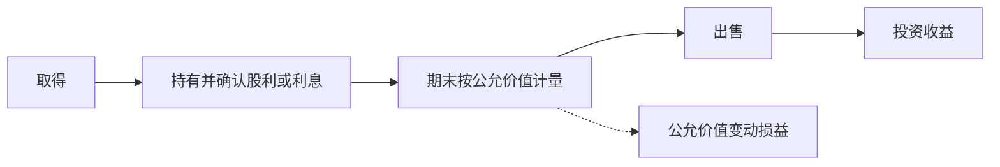

## 货币资金与交易性金融资产

**货币资金（Money Funds）**：企业生产经营过程中处于货币形态的资产，是流动性最强的资产，企业持有它是经营正常运转的"血液"。核算上分三个账户：库存现金、银行存款、其他货币资金。狭义现金仅指库存现金（硬币、纸币）；广义现金即货币资金，含银行存款与其他货币资金。

## 库存现金的限额管理

库存现金管理三大制度：

**限额管理**：企业给库存现金设一个上限，超过限额的多余现金必须存入银行。现金只用于小额、特定用途：按我国规定，工资奖金类、差旅费及 1000 元以下的零星支出可用现金；1000 元以上开支须用支票或银行转账，便于国家监控。

**日常收支管理**：要点一是日清月结——当天现金收入及时送存银行、不留在手里过夜，同时每天清点，保证账面与柜面现金一致、账实相符；要点二是禁止白条——禁止以不合规的手写欠条等凭证顶替库存现金。

**内部控制制度**：钱账分管——出纳只管钱并登记现金、银行存款日记账，会计管账不管钱，互相牵制。

## 备用金制度与现金清查

**备用金（Petty Cash）**：预付给企业内部部门或个人的零星开支周转金，分两类。

**定额备用金**：给部门一个固定额度。拨付时借其他应收款—备用金、贷库存现金；平时使用不作分录；月末报销时按实报金额补足定额——借管理费用（发票金额）、贷库存现金，不冲减其他应收款。例：授权管理部门 5 万元备用金，月末报销 3 万元：借管理费用 30000、贷库存现金 30000，补足至 5 万。

**非定额备用金**：适用范围更广，典型如员工出差预支。预支时借其他应收款、贷库存现金；报销时多退少补：实报小于预支，借管理费用（实报）、库存现金（退差额）、贷其他应收款（原额）；实报大于预支，借管理费用（实报）、贷其他应收款（原额）、库存现金（补差额）。

**现金清查**：定期盘点，通过待处理财产损溢账户过渡（临时账户，期末前应查明并处理完毕）。

盘盈：借库存现金、贷待处理财产损溢；查明应支付给单位或个人的，借待处理财产损溢、贷其他应付款；无法查明原因的，贷营业外收入。

盘亏：借待处理财产损溢、贷库存现金；由责任人赔偿的，借其他应收款、贷待处理财产损溢；无法查明原因的，借管理费用、贷待处理财产损溢。

## 银行存款

**银行存款（Bank Deposits）**：存放在银行或其他金融机构的货币资金。企业须在银行开立账户（基本存款账户、一般存款账户、临时存款账户、专用存款账户），超过现金限额的货币资金都应存入银行。

结算方式：票据类——银行汇票、商业汇票（商业承兑汇票、银行承兑汇票）、银行本票、支票（现金支票、转账支票）；转账类——汇兑、托收承付、委托收款、信用卡、信用证。

银行存款日记账逐日逐笔登记、每日结出余额，定期（至少每月一次）与银行对账单核对。

### 银行存款余额调节表

日记账与对账单不一致的原因只有两类：记账错误与未达账项。

**未达账项（Outstanding Items）**：企业与银行一方已入账、另一方因未收到凭证尚未入账的款项。四种情形：企业已收银行未收、企业已付银行未付、银行已收企业未收、银行已付企业未付。

**银行存款余额调节表（Bank Reconciliation Statement）**：左右两栏分别从企业日记账余额和对账单余额出发调整：

- 左栏 = 企业日记账余额 + 银行已收企业未收 − 银行已付企业未付。
- 右栏 = 对账单余额 + 企业已收银行未收 − 企业已付银行未付。

调整顺序先调节未达账项、再调错账，调节后两边余额应相等。调节表只作对账工具，不能作为记账依据——未达账项要等凭证到达后再入账，错账须另行编制调整分录更正。例：华丰公司账面余额 52373 元、对账单余额 57080 元，逐项调整未达账项与错账后两边均为 58200 元；对多记水电费 27 元编制调整分录：借银行存款 27、贷管理费用 27。

## 其他货币资金

**其他货币资金（Other Monetary Funds）**：性质与银行存款一样、属于企业可用作支付手段的货币，但存在形式与支付方式特殊，单独核算。种类：外埠存款（汇往采购地银行开立采购专户、用于临时或零星采购）、银行汇票存款、银行本票存款、信用卡存款、信用证保证金存款、存出投资款（已存入证券公司但尚未进行短期投资的款项）。将银行存款划入专户时：借其他货币资金—××、贷银行存款。

## 交易性金融资产

**交易性金融资产（Trading Financial Assets）**：为了近期内出售而持有的金融资产，通常是以赚取差价为目的从证券市场购入的股票、债券等。特征：有较强的变现能力；持有的目的在于赚取差价。账户设置：设交易性金融资产总账，按类别和品种分别设成本与公允价值变动两个明细账。

交易性金融资产先按成本进入账簿，持有期确认未实现变动，出售时再把账面价值与现金收入的差额落到投资收益。

### 取得

购入股票或债券时：借交易性金融资产—成本（公允价值）、投资收益（支付的交易费用，直接计入当期损益、不计入成本）、应收股利/应收利息（价款中包含的已宣告但尚未发放的现金股利或已过付息期未付的利息），贷银行存款（实际支付的全部价款）。

例：甲公司购入乙公司股票 10 万股，每股 10.6 元（含已宣告未发放现金股利 0.6 元），另付交易费用 1000 元。借交易性金融资产—成本 1000000（10 万股 × 10 元）、投资收益 1000、应收股利 60000，贷银行存款 1061000。

### 持有期间

被投资单位宣告发放现金股利、或资产负债表日确认债券利息时，借应收股利/应收利息、贷投资收益；实际收到时，借银行存款、贷应收股利/应收利息。买入时价款中已含的股利在收到时直接冲销应收股利，与投资收益无关；持有期间新产生的股利才是投资收益。

### 期末计量

资产负债表日按公允价值重新计量，差额计入公允价值变动损益。上涨：借交易性金融资产—公允价值变动、贷公允价值变动损益；下跌：借公允价值变动损益、贷交易性金融资产—公允价值变动。这是未实现损益（"纸面富贵"），真正落袋要等出售。

例：6 月 30 日股价涨至每股 30 元（账面成本 100 万 → 公允 300 万），借交易性金融资产—公允价值变动 2000000、贷公允价值变动损益—交易性金融资产 2000000。

### 出售

将出售净收入与账面价值（成本 + 公允价值变动）比较，差额计入投资收益。出售收入大于账面价值：借银行存款（出售净收入），贷交易性金融资产—成本、—公允价值变动（账面余额）、投资收益（差额）；出售收入小于账面价值：借银行存款（出售净收入）与投资收益（差额），贷交易性金融资产—成本、—公允价值变动。部分出售时按加权平均法计算结转成本。新会计准则不要求出售时把公允价值变动损益转入投资收益。

例：8 月 15 日以每股 15 元全部售出（收入 150 万元，小于账面 300 万）：借银行存款 1500000、投资收益 1500000，贷交易性金融资产—成本 1000000、—公允价值变动 2000000。

全流程勾稽：累计计入损益的金额 = 持有期公允价值变动损益 + 各笔投资收益 = 实际赚到的钱（出售净收入 + 持有期现金股利 − 全部投入支出）。上例累计影响损益 = +200 万（公允价值变动）− 150.1 万（投资收益合计）= +49.9 万元，恰等于出售 150 万 + 股利 6 万 − 投入 106.1 万。

## 利润质量视角

恒生电子 2019 年一季度营业利润 4.42 亿元，其中公允价值变动损益 3.61 亿元 + 投资收益 0.49 亿元，约 4.1 亿元几乎全部来自投资（浮盈 + 落袋收益）而非主业；恒生电子约 1/3 资产是交易性金融资产。2020 年一季度营业总收入 5.14 亿元与上年差别不大，公允价值变动损益转为 −1.06 亿元，营业利润随之变为 −5202 万元、净利润 −4674 万元，由盈转亏。

靠公允价值浮盈撑起来的利润不可持续。分析利润表须穿透利润来源，区分纸面浮盈与已实现收益。
