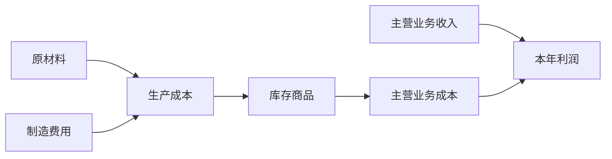

## 收入、费用与利润

## 收入的三种特殊情形

### 销售退回

商品售出后发生退货时，在退回购货方货款的同时冲减退货当期的收入与成本（配比原则），不追溯调整销售当期。分录：借主营业务收入、借应交税费—应交增值税（销项税额），贷银行存款（或应收账款）；同时把已结转的成本冲回：借库存商品、贷主营业务成本。

例：5 月 20 日赊销价款 350000 元、销项税额 45500 元，9 月 16 日购货方退货并退款。第一步冲减收入与税款：借主营业务收入 350000、应交税费—应交增值税（销项税额）45500，贷银行存款 395500；第二步冲回成本：借库存商品 382000，贷主营业务成本 382000。

### 已发货但不符合收入确认条件

商品虽已发出，但因未满足履约义务（控制权未转移、预计很可能退货等）暂不确认收入，转入发出商品账户（存货性质）：借发出商品、贷库存商品。后续满足确认条件时，借应收账款，贷主营业务收入、应交税费—应交增值税（销项税额），同时借主营业务成本、贷发出商品。

### 现金折扣

**现金折扣（cash discount）**：债权人为鼓励债务人尽早付款而给予的价格减让，习惯用 2/10、1/20、N/30 的方式表达（10 天内付款打 2% 折扣、20 天内付 1% 折扣、30 天内付全额，N 即 net、无折扣）。现金折扣与商业折扣不同，是交易价格的不确定性，按可变对价处理：按最可能发生金额（或期望值）确认收入，每一资产负债表日重新估计、调整收入金额。

例：赊销 100 万元、期限 90 天，条件为 2/30、1/60、N/90，企业判断客户很可能 30 天内付款，按 100 ×（1 − 2%）= 98 万元确认收入；资产负债表日改判客户 60 天内付款，交易价格调整为 99 万元，调增收入 1 万元（借应收账款、贷主营业务收入）。

## 费用的核算

**费用（expense）**：企业在日常活动中形成的、会导致所有者权益减少的、与向所有者分配利润无关的经济利益的总流出。三大分类：

**营业成本（operating cost）**：与产品销售收入可配比的费用及成本，包括主营业务成本与其他业务成本，遵循配比原则——主营业务成本与主营业务收入匹配，其他业务成本与其他业务收入匹配。例：出售原材料，借银行存款、贷其他业务收入、应交税费；借其他业务成本、贷原材料。

**税金**：税金及附加与所得税费用。税金及附加核算经营活动应负担的除增值税、所得税之外的各种税金及附加费（消费税、城市维护建设税、教育费附加等），是费用类账户：借税金及附加、贷应交税费—应交消费税/应交城市维护建设税/应交教育费附加。增值税是价外税、所得税单设所得税费用，都不在税金及附加中。

**期间费用（period expenses）**：与产品生产不存在因果关系、难以按产品归集、必须从当期收入中得到补偿的费用，包括管理费用、销售费用、财务费用。发生时记入相应账户借方。

财务费用具有双重损益性质：除借款利息等支出外，利息收入、汇兑收益会冲减财务费用，财务费用可能出现贷方余额（净收益），结转本年利润时按净额结转。

## 成本核算

**直接成本**：直接材料成本（生产产品耗用的原材料成本）、直接人工成本（应支付给生产工人的薪酬）。

**间接成本（indirect cost）**：生产部门在组织和管理生产中发生的费用，如车间管理人员薪酬、车间固定资产折旧费、车间水电费。

账户设置：生产成本按产品开设明细账；制造费用按车间开设明细账。直接成本发生时直接计入生产成本：借生产成本—A 产品、贷原材料（直接材料）或应付职工薪酬（直接人工）；间接成本发生时先计入制造费用：借制造费用、贷原材料/应付职工薪酬/累计折旧等，月末按一定标准分配转入生产成本。制造费用月末结转后没有余额。

成本流转链：原材料 → 生产成本（汇集直接成本 + 分配来的制造费用）→ 完工转库存商品 → 销售时转主营业务成本 → 月末结转本年利润。生产成本期末可以有借方余额，代表尚未完工的在产品、半成品，属于存货的一部分，列入资产负债表存货项目。

生产投入先形成资产，待商品销售时才与收入配比结转为成本，最终共同影响利润。

## 利润的三大概念

**利润（profit）**：企业在一定会计期间的经营成果，包括收入减去费用后的净额、直接计入当期利润的利得和损失。分类为营业利润、利润总额、净利润三级，层层递进。

**营业利润（operating profit）** = 营业收入 + 其他收益 − 营业成本 − 税金及附加 − 销售费用 − 管理费用 − 财务费用 ± 信用减值损失 ± 资产减值损失 ± 公允价值变动损益 ± 投资收益 ± 资产处置损益。

**其他收益（other income）**核算与日常经营活动相关、与主营业务挂钩的政府补助，计入营业利润；与日常活动无关的利得属于营业外收支。

**利润总额（total profit）**，也称税前利润：利润总额 = 营业利润 + 营业外收入 − 营业外支出。营业外收支是与企业日常活动无直接关系的利得与损失，如捐赠收入、罚款支出、自然灾害损失。

**净利润（net profit）** = 利润总额 − 所得税费用。无纳税调整时，净利润 = 利润总额 ×（1 − 25%）。应纳税所得额 ≠ 利润总额：以前年度亏损可在税法规定的 5 年宽限期内税前弥补，抵减当期应纳税所得额。

## 五类±损益科目

五个带"±"的损益科目按性质分三组：三费一组（必减）；信用减值损失与资产减值损失一组（损失在借方）；公允价值变动损益、投资收益、资产处置损益一组（可增可减）。

**信用减值损失（credit impairment loss）**：对应收款项、债权投资和其他债权投资等资产计提减值准备所形成的损失。借方为损失确认（增加）、贷方为损失冲回（减少）；计提时借信用减值损失、贷坏账准备。

**资产减值损失（asset impairment loss）**：对存货、固定资产、无形资产及长期股权投资等资产计提减值准备所形成的损失。计提时借资产减值损失、贷各减值准备账户。

**公允价值变动损益**：交易性金融资产等按公允价值计量，期末公允价值变动计入该科目——借方为公允价值下跌、贷方为上涨，是"纸面富贵"，浮盈浮亏并未落袋。

**投资收益（investment income）**：处置投资、收到分红、利息等已实现的损益，"落袋为安"，与公允价值变动损益形成对照。

**资产处置损益**：处置固定资产、无形资产等（非日常经营）时，处置收入与账面价值的差额，固定资产转卖的盈亏记在这里。

## 本年利润的结转与利润分配

**本年利润（current year profit）**是损益的临时归集账户。结转收入——借各收入类账户（主营业务收入、其他业务收入、营业外收入等），贷本年利润；结转费用——借本年利润，贷各费用类账户（主营业务成本、其他业务成本、税金及附加、三费、减值损失、所得税费用等）。本年利润余额在借方为亏损、贷方为盈利；期末转入利润分配—未分配利润，盈利时借本年利润、贷利润分配—未分配利润，此后本年利润无余额。

结转规则：制造费用月末无余额；生产成本不结转本年利润（期末余额为在产品）；长期待摊费用不结转；只有收入、费用类账户才结转到本年利润。

结转与分配流程（例：净利润 660 万元）：

1. 结转收入类账户至本年利润（贷方）。
2. 结转费用类、损失类账户至本年利润（借方），本年利润净额为贷方 660 万元。
3. 结转净利润：借本年利润 660 万，贷利润分配—未分配利润 660 万。
4. 提取法定盈余公积 660 × 10% = 66 万元：借利润分配—提取法定盈余公积 66 万，贷盈余公积—法定盈余公积 66 万。
5. 宣告现金股利 100 万元：借利润分配—应付现金股利 100 万，贷应付股利 100 万。
6. 结转已分配利润：借利润分配—未分配利润 166 万，贷利润分配—提取法定盈余公积 66 万、—应付现金股利 100 万。

结转后利润分配—未分配利润贷方余额 = 660 − 166 = 494 万元，即年末未分配利润。

## 财务报表的编制

三大报表：利润表是"面子"（一定期间经营成果，动态报表，权责发生制），资产负债表是"里子"（特定时点财务状况，静态报表），现金流量表是"日子"（现金收支）。利润表采用多步式：先计算营业利润，再算利润总额，最后算净利润。

### 资产负债表编制六种情形

1. **直接抄写总账余额**：如短期借款、应付职工薪酬、实收资本、资本公积、盈余公积、其他综合收益、应收票据。
2. **扣除被抵账户**：固定资产 = 固定资产原值 − 累计折旧 − 固定资产减值准备；应收账款 = 应收账款明细 − 坏账准备；存货、无形资产、长期股权投资同样减减值准备。
3. **多科目压缩填列**：货币资金 = 库存现金 + 银行存款 + 其他货币资金；存货 = 原材料 + 在途物资 + 生产成本 + 库存商品 + 发出商品 − 存货跌价准备。
4. **按明细账分析填列**：应收账款项目 = 应收账款借方明细 + 预收账款借方明细；预收账款项目 = 预收账款贷方明细 + 应收账款贷方明细；应付账款项目 = 应付账款贷方明细 + 预付账款贷方明细；预付账款项目 = 预付账款借方明细 + 应付账款借方明细。口诀：借对借、贷对贷。
5. **一年内到期的非流动负债分拆**：长期借款、应付债券中将于一年内到期的部分，从原项目剔除，单列"一年内到期的非流动负债"。例：长期借款 500 万元中 300 万元 4 个月后到期，单列一年内到期的非流动负债，其余 200 万元列示于长期借款。
6. **未分配利润的特殊处理**：年末直接填利润分配—未分配利润账户余额（贷方余额正数填列，借方余额以负数列示）；月报（利润分配尚未结转）则等于利润分配—未分配利润余额 ± 本年利润余额。例：利润分配—未分配利润借方 12.5 万元 + 本年利润贷方 20 万元，填列 7.5 万元（贷方）。

**流动比率（current ratio）** = 流动资产 ÷ 流动负债，衡量短期偿债能力，是银行放贷的重要依据。

### 资产负债表填列例题

甲公司 2018 年 12 月 31 日部分项目：应收账款借方明细 300 万元、200 万元，坏账准备 50 万元，填列 450 万元；存货 = 原材料 35 万 + 生产成本 8 万（在产品，必须纳入）+ 在途物资 2 万 + 库存商品 1 万 − 存货跌价准备 0.8 万 = 45.2 万元；固定资产 = 65 万元 − 累计折旧 15 万元 = 50 万元。
