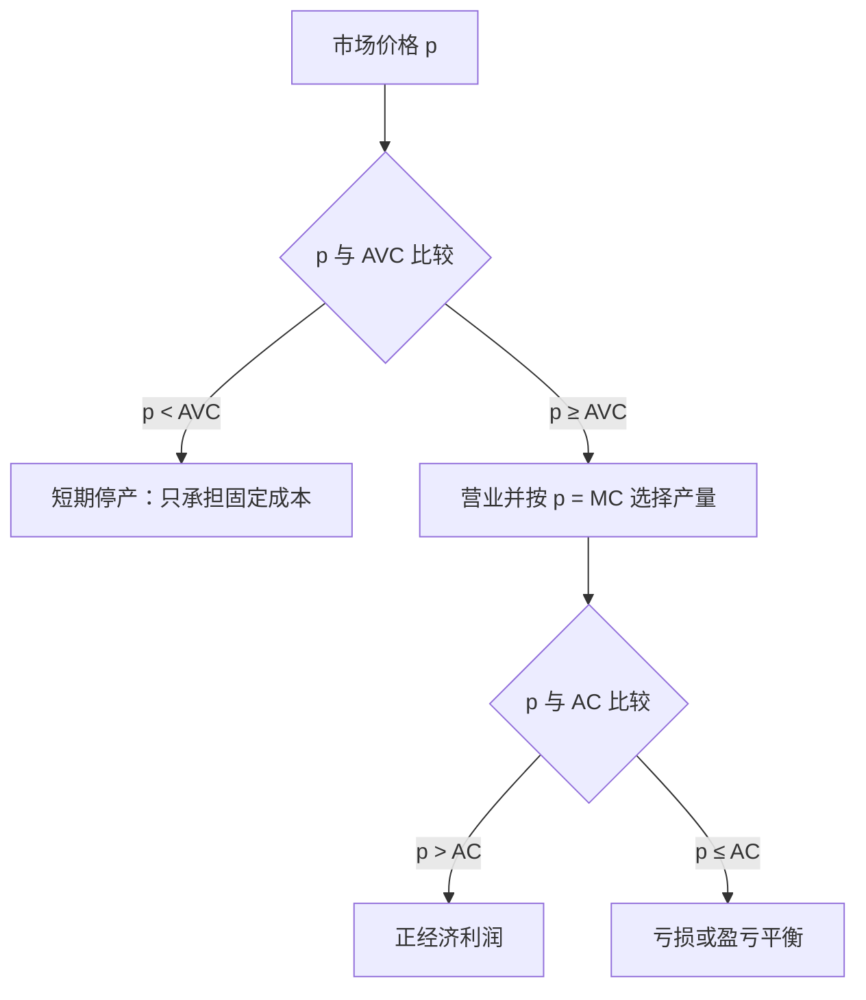

## 完全竞争市场

## 竞争性企业的供给

**完全竞争市场**的假设：企业众多、每家规模很小、生产的产品完全相同、信息完全、长期无进入与退出壁垒。这些假设合起来使每个企业成为价格接受者：任何单个企业的决策对市场价格几乎无影响。

**竞争性企业面对的需求曲线**：定价高于市场价格 $p^*$ 时销量为 0；定价等于 $p^*$ 时可卖出任意数量；定价低于 $p^*$ 时面对全部市场需求。竞争性企业把价格看作数量的函数：不管销量如何，市场价格都不变。

**利润最大化**：$\max_y\ py - c(y)$，一阶条件 $p = MC(y)$。一般市场结构条件为 MR = MC，完全竞争下 MR = P，故简化为 p = MC。MC 曲线正是企业的供给曲线：每个市场价格对应一个使 p = MC 的产量。

**例外情形一：只取 MC 的上升段**。U 型 MC 与水平价格线可能有两个交点，在下降段处继续增产一单位，边际收入 p 大于边际成本 MC，利润还增加，故最优产量只能位于 MC 曲线的上升段。p = MC 是利润最大化的必要条件，一般不是充分条件。

**停产条件**：停产利润 $-F$ 大于生产利润 $py - c_v(y) - F$，化简得 $p < AVC(y)$。市场价格低于平均可变成本时停止营业，只支付固定成本。

完全竞争厂商先用价格与平均可变成本判断是否继续营业，再在营业条件下用价格等于边际成本确定产量。

**短期供给曲线**：MC 位于 AVC 最低点以上的那段；价格低于 AVC 最低点时供给量为 0。AVC 最低点（MC 与 AVC 交点）即停止营业点；AC 最低点（MC 与 AC 交点）即盈亏平衡点，该点以上正利润。价格介于 AVC 与 AC 之间时企业营业但亏损：收入覆盖全部可变成本与部分固定成本，亏损小于停产损失 $-F$。

**长期供给曲线**：$p = LMC(y)$，且位于 LAC 上方那段。长期没有固定与可变之分，厂商可自由退出、不会亏损，底线是价格不低于长期平均成本。长期供给曲线比短期更平缓、弹性更大：价格变动时长期调整余地更大（短期只能多买原材料、多请工人；长期可扩建厂房、增加机器）。

**生产者剩余（PS）**：生产者实际得到的价格与愿意接受的最低价格之差，等于 $py - c_v(y)$，也等于利润加固定成本 $\pi + F$。三种等价图示：总收入矩形减总可变成本矩形；价格线与 MC 曲线围成的面积；供给曲线左侧面积分段求和。只要固定成本为正，PS 不等于利润。

## 短期行业供给与均衡

**行业供给曲线**：行业内有 $n$ 家企业时，$S(p)=\sum_{i=1}^{n}S_i(p)$，是各厂商供给曲线的水平加总。价格过低时部分厂商供给量为 0、退出市场，此时行业供给曲线与仍在生产的厂商供给曲线重合。

**短期行业均衡**：市场供给曲线与市场需求曲线的交点决定均衡价格 $p^*$ 与均衡产量。单个厂商按 P = MC 的交点决定产量，利润为 $(P - AC) \cdot y$，即价格线与 AC 曲线之间的竖直距离乘以产量。

同一行业不同成本的企业可分别处于三种状态：P = AC 时利润为 0；P > AC 时正利润；AVC < P < AC 时负利润但仍继续生产，因为此时亏损已是最小。

## 长期行业均衡

**长期均衡前提**：假设行业内所有厂商具有完全相同的长期成本曲线，于是 LAC 最低点、最低点对应的产量 $y^*$ 与最低平均成本 $p^*$ 全体一致。

**$p^*$ 是市场能索要的最低价格**：价格低于 $p^*$ 则低于平均成本，厂商长期亏损并退出；价格恰为 $p^*$ 时企业在 $y^*$ 生产，盈亏平衡，经济利润为 0。

**长期利润趋向 0 的机制**：长期利润不能为负（负利润可自由退出）；正利润吸引新厂商自由进入，供给增加把价格拉低，直至利润为 0、新厂商停止进入。

**长期供给曲线的形状**：价格上升 $\Delta p$ 时每家厂商增产 $\Delta y$，有 $n$ 家相同厂商时总供给增加 $n\Delta y$；厂商数目足够多时，行业长期供给曲线近似为高度 $p^* = \min AC$ 的水平线。该水平线恰好也是规模报酬不变厂商的长期供给曲线。

**短期征税**：短期厂商数目固定，行业供给曲线向右上方倾斜；对生产者征从量税 $t$，供给曲线垂直上移 $t$，消费者与生产者按各自弹性分担税负。

**长期征税**：行业长期供给曲线水平，税后供给曲线上移 $t$，均衡价格上升恰好 $t$，全部税负由消费者承担；生产者净价格不变。依据：水平供给曲线表示供给弹性无穷大，税负由弹性小的一方承担。

## 零利润与经济租金

**零利润指经济利润为 0**：长期均衡中的零利润是经济利润而非会计利润；会计口径下企业主仍因劳动时间与投资获得报酬。零利润时一切生产要素均按市场价格支付，厂商仍在赚钱，只是赚的钱恰好全部用于支付各种要素（含机会成本）。农民自耕时，自有土地的租金与自身劳动工资都是机会成本。

**不变要素**：供给量固定、即使从长期全局角度看也固定的生产要素。资源类：石油、天然气、可耕作土地；才能类：体育运动员、表演艺术家；法律类：出租车牌照、酒类许可证。

**经济租金**：支付给生产要素的报酬超出为获得该要素而必须支付的最低报酬的部分。均衡租金是使利润趋于 0 的数额：$租金 = p^*y^* - c_v(y^*)$，即收入减去可变成本。租金与生产者剩余是同一个概念的不同角度。市场均衡价格高则生产者剩余大，租金相应高；租金内生调整到使经济利润等于 0。

**寻租**：政府或法律限制进入时，人为稀缺的受益人会花费大量财力物力维持既有地位，如行业协会游说、宣传、贿赂官员。这些资源不增加任何产量，从社会角度看纯粹是浪费。
