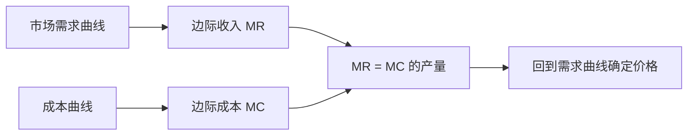

## 垄断与价格歧视

## 垄断定价

**垄断**：市场唯一卖者，是价格制定者，不再是价格接受者；定价后卖出多少仍由市场决定。垄断问题为 $\max_y p(y)y - c(y)$，一阶条件 MR = MC。多生产一单位增加收入 MR、增加成本 MC，两者相等时企业才没有动机改变产量。

垄断厂商先以 MR 与 MC 相等选择产量，再沿需求曲线读取价格，通常形成 P > MC 的价格加成。

**边际收入的两重效应**：$r(y) = p(y) \cdot y$，增产时 $\Delta r = p\Delta y + y\Delta p$。卖出更多产品收入增加 $p\Delta y$；为多卖必须压低价格，且全部产品按新低价出售，收入减少 $|y\Delta p|$。除以 $\Delta y$ 得 $MR = p + y \cdot \frac{\Delta p}{\Delta y}$，利用弹性定义得：

$$MR(y) = p(y)\left[1 - \frac{1}{|\varepsilon(y)|}\right]$$

**不在缺乏弹性段生产**：$|\varepsilon| < 1$ 时 MR 为负，与 MR = MC > 0 矛盾；该段提价使收入增加、成本减少，利润必增。垄断厂商只在 $|\varepsilon| > 1$ 的富有弹性段生产。

**线性需求情形**：$p(y) = a - by$，$MR = a - 2by$。MR 的斜率是需求曲线斜率的两倍，MR 位于需求曲线下方。求 MR 必须把收入写成数量的函数再对数量求导，不能对价格求导。

## 加成定价

**加成定价**：由 MR = MC 得 $p(y) = \frac{MC(y)}{1 - 1/|\varepsilon(y)|}$。垄断厂商在 $|\varepsilon| > 1$ 段生产，价格是 MC 的一个加成。弹性越小加成越大：消费者对价格不敏感，厂商敢于收取远高于 MC 的价格；完全竞争弹性无穷大，加成消失，P = MC。加成使 P 偏离 MC，是一种价格扭曲，弹性越小扭曲越严重。

## 税收与效率

**从量税对垄断的影响**：MC 为常数 $c$、需求线性时，征从量税 $t$ 后边际成本变为 $c+t$，MC 线上移 $t$，价格上升 $\Delta p = t/2$，消费者与生产者各承担一半。"各担一半"源于 MR 斜率是需求斜率两倍这一线性假设，不具一般性。常数弹性需求下 $p = \frac{c + t}{1 - 1/|\varepsilon|}$，对 $t$ 求导得 $\frac{\Delta p}{\Delta t} = \frac{1}{1 - 1/|\varepsilon|} > 1$：税额上升 1 元，价格上升超过 1 元，消费者承担多于全部税收。

**利润税**：企业最大化 $(1 - \tau)[p(y)y - c(y)]$，$(1 - \tau)$ 与产量无关，利润税不影响产量决策。这是理想情形，现实中税率过高会打击生产积极性。

**垄断的低效率**：对比完全竞争，竞争行业在 P = MC 处生产，垄断行业在 P > MC 处生产，$p_m > p_c$ 且 $y_m < y_c$。低效率主要来自产量太少：$y_m$ 处 P > MC，额外多生产一单位的社会价值为 P - MC > 0，但垄断没有生产这些单位。

**净损失**：从完全竞争转向垄断，消费者剩余减少 A + B，生产者剩余减少 C、增加 A（价格提高获得转移）；总剩余净减少 B + C。A 从消费者转移到生产者，有人获得，不计入净损失；B + C 蒸发，无人获得。

**自然垄断**：高额固定成本与较低边际成本共存（煤气、自来水、电话、地铁等公用事业）。第二家企业进入需重新承担高额固定成本却难以获得足够市场份额覆盖成本，主动选择不进入。规制困境：强制 P = MC 时 P < AC，企业亏损退出；替代方案有政府补贴、政府直接经营（P = MC，亏损由财政承担）、规定 P = AC（零利润收回成本，但产量仍低于有效水平）。

**垄断成因**：最小有效率规模（MES）相对市场规模大且市场规模难增；卡特尔串谋限制产量提高价格；历史的偶然——某企业率先进入市场，凭借先行优势与成本优势阻止其他企业进入。

## 一级价格歧视

**价格歧视**：按不同价格销售不同单位产品的做法。不同质量的产品定不同价格也属于价格歧视；同样的产品收同样的价格，若该价格没有准确反映卖给每个消费者的成本，同样是价格歧视。

**三级分类**：一级价格歧视（完全价格歧视）把全部消费者剩余拿走；二级价格歧视的关键特征为消费者自我选择，消费者从厂商提供的多个套餐中自己选；三级价格歧视由厂家人为把消费者分成不同市场或群体，对不同群体收不同价格。

**一级价格歧视**：垄断企业把每单位产品卖给支付意愿最高且愿意购买的消费者，每单位索价等于该消费者的保留价格。市场消费者剩余为 0，全部被生产者攫取。生产者拿走全部剩余，有激励把总剩余做大，产量定在 P = MC 处，与完全竞争产量相同，产量是帕累托有效的。与完全竞争的差别仅在剩余归属，总剩余不变，无效率损失。

实现形式：逐单位差别定价，最后一个单位价格恰好等于 MC；出售套餐，Q 定在保留价格 = MC 处，R 等于该消费者的全部消费者剩余；两部收费制。前提是厂商知道每个消费者的需求曲线与保留价，识别不了消费者身份时一级价格歧视无法实施。

## 二级价格歧视

**二级价格歧视**（非线性定价）：单位价格随购买数量变化，典型例子有零售价与批发价、电力价格、大宗购买折扣。厂商想做一级价格歧视但做不到——不知道来者是谁，只能提供一组套餐让消费者自己选。

**自我选择机制**：高支付意愿消费者有动机伪装成低支付意愿者享受低价；厂商设计一组套餐，诱使高端消费者恰好选择为其设计的套餐。厂商还降低低端产品质量（经济舱不能太舒服、免费视频网站有广告），保护高端市场销量。若没有低端市场，高端市场的剩余也将为 0；正因为存在低端市场作为退出选项，厂商必须给高端消费者留正剩余。

**通用优化模型**（两类消费者 A、B，$v^B(q) > v^A(q)$，B 为高端）：目标函数为 $\max r^A + r^B − c(q^A + q^B)$；参与约束为 $v^A(q^A) \ge r^A$、$v^B(q^B) \ge r^B$；激励相容约束为 $v^A(q^A) − r^A \ge v^A(q^B) − r^B$、$v^B(q^B) − r^B \ge v^B(q^A) − r^A$。真正起作用的只有两条：低端消费者的参与约束、高端消费者的激励相容。利润最大化时两条约束取等号，一阶条件为 $MU^B(q^B) = MC$、$2MU^A(q^A) − MU^B(q^A) = MC$。高端消费者获得社会最优数量；低端数量被向下扭曲。

## 三级价格歧视

**三级价格歧视**：垄断者把消费者分为不同市场或群体，对不同群体收不同价格，同一群体内每人价格相同。分组靠厂商易辨认的标签：学生证、年龄、国家或地区，无消费者自我选择。例子：学生票、老年人折扣、同一商品在不同国家不同价格。区分要点：同一本书在中国与美国售价不同为三级；同一本书分平装、精装、收藏版为二级。

**模型**：两个群体反需求函数 $p_1(y_1)$、$p_2(y_2)$，成本 $c(y_1 + y_2)$，对 $y_1$、$y_2$ 分别求导得 $MR_1(y_1) = MC$、$MR_2(y_2) = MC$——把每个市场当成一个独立垄断市场处理。

**弹性规则**：由 $MR = p[1 − 1/|\varepsilon|]$ 与 $MR_1 = MR_2 = MC$，推出价格较高的市场需求价格弹性必然较小。对价格不敏感（弹性小）的群体收高价，对价格敏感（弹性大）的群体收低价。学生群体价格敏感，收低价；非学生群体敏感度低，收高价。

## 捆绑销售与两部收费制

**捆绑销售**：把相关产品组成产品包一起销售，如 Office 软件包。动机：节省成本、产品间存在互补性、降低消费者支付意愿的分散性。数字例：消费者 A 对文字处理软件支付意愿 120、对电子表格软件 100，消费者 B 相反，边际成本为 0。分开卖两个软件都只能定价 100，总收入 400；捆绑卖套餐价 220，总收入 440。捆绑把分散的支付意愿加总，厂商得以收取更高总价。

**两部收费制**：总支付 $T = p_0 + p_1 \cdot Q$，即固定费加线性单价。例子：门票与摩天轮乘坐费、相机与胶卷、会员费与商品价。

**单一（类）消费者情形**：若单价定为 $p^*$，消费者乘坐 $x^*$ 次，企业从每次乘坐获得利润，消费者剩余为浅蓝色三角形；门票 $p_0$ 最高可收走全部消费者剩余。把单价降为 $p_1 = MC$，消费者乘坐至需求曲线与 MC 的交点，每次乘坐无利润，但消费者剩余三角形变大，门票可收走整个"需求曲线与 MC 之间的大三角形"，总利润 = 总剩余，实现最大化。最优两部收费 = 线性价格等于边际成本，固定费用拿走全部消费者剩余。现实中游乐园普遍只收门票、园内设施免费：每次设施运营的 MC 很低，单独收费有交易成本，权衡后令 $p_1 = 0$，用门票攫取剩余。

**两类消费者情形**：厂商只知道存在低端 A、高端 B 而不知具体身份，制定统一两部价格 $(p_0, p_1)$，消费者自选数量。低端 A 的参与约束取等号（剩余恰好为 0），高端 B 保留正剩余。一阶条件为 $p_1 = MC − (q^B − q^A)/(dq^A/dp_1 + dq^B/dp_1)$、$p_0 = v^A(q^A) − p_1q^A$。资源配置存在扭曲 $p_1 \ge MC$，总产量小于完全竞争水平；消费者 A 被完全价格歧视。
