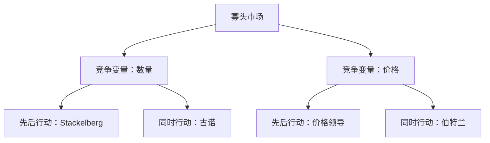

## 寡头与垄断竞争

## 垄断竞争与产品差异化

**垄断竞争**：介于垄断与竞争之间的市场结构，既含竞争因素又含垄断因素，现实中非常普遍。

**产品差异化**：每家厂商试图把自己的产品与行业中其他企业的产品区分开来。差异化越成功，需求曲线越缺乏弹性，垄断力量越大；推到极致即完全垄断。例：矿泉水 2 元与百岁山 3 元并存。

**垄断竞争行业特征**：每个企业面临向下倾斜的需求曲线，可指定自己产品的价格，在价格与产品两方面竞争；新企业进入没有限制，自由进入使原有企业的需求曲线向内移动且变得更平缓。

**长期均衡的三个条件**：每家企业的价格-销量组合位于自身需求曲线上；给定需求曲线已实现利润最大化；自由进入迫使利润为零。由此，需求曲线与平均成本曲线必定相切。相切处 MR = MC 且 P = AC，均衡价格 P > MC，增加产量是帕累托改进，垄断竞争的产量小于完全竞争，存在效率损失。

**产品差异化不足与过剩**：厂商可能过度模仿（差异化不足，都往中间挤）；若市场不重合，小贩乐于散布两端（差异化过剩）。差异化过剩时，企业让消费者相信产品与众不同，借市场力量收取较高价格。

## 寡头模型的框架

**寡头**：少数厂商主导的市场结构。竞争变量可为价格或数量，行动时序可同时或先后（序贯博弈），组合出四种模型：产量领导（Stackelberg）、价格领导、同时决定产量（古诺）、同时决定价格（伯特兰）。

寡头模型由竞争变量和行动时序共同决定，求解方式随市场参与者的战略互动而变化。

**模型选择依据**：厂商率先进行生产能力投资，是产量领导者；厂商分发价目表、由大型主导企业定价，是价格领导者。做题时题目直接说明存在价格或产量领导者。

## 产量领导（Stackelberg）

**Stackelberg 模型**：一家主导企业先决定产量，追随者观测后决定自己的产量。求解用逆向归纳，从最后一步开始推。

第一步（追随者）：$\max p(y_1 + y_2)y_2 − c_2(y_2)$，此时 $y_1$ 为给定常数，对 $y_2$ 求一阶导得 $y_2 = f_2(y_1)$，即反应函数。

第二步（领导者）：把反应函数代入自身利润，$\max p(y_1 + f_2(y_1))y_1 − c_1(y_1)$，对 $y_1$ 求一阶导。

**线性例题**：反需求 $p = a − b(y_1 + y_2)$，成本为 0。追随者 $MR_2 = a − by_1 − 2by_2 = 0$，得 $y_2 = (a − by_1)/(2b)$；领导者代入后得 $y_1^* = a/(2b)$，回代得 $y_2^* = a/(4b)$。领导者利润高于古诺均衡处，具有先动优势。

## 价格领导

**价格领导**：领导者定价，追随者按 P = MC 供给。

追随者：价格已由领导者给定，自身为价格接受者，由 $P = MC$ 得到追随者供给曲线 $S(p)$。

领导者：剩余需求 $R(p) = D(p) − S(p)$，每个价格下市场总需求减去追随者供给、余下归领导者；把剩余需求写成反函数，按普通垄断问题求解，由 MR = MC 定产量，再回到需求曲线定价。

**例题**：$D(p) = a − bp$；追随者成本 $c_2(y_2) = y_2^2/2$（$MC_2 = y_2$），领导者成本 $c_1(y_1) = cy_1$。追随者供给曲线 $y_2 = S(p) = p$；剩余需求 $R(p) = a − (b+1)p$，反函数 $p = (a − y_1)/(b+1)$；$MR = MC$ 解得 $y_1^* = (a − c(b+1))/2$。关键提醒：此后是普通垄断问题，一切函数据产量写出、对产量求导；对价格求导会把成本函数搅乱。

## 古诺模型

**古诺模型**：两家厂商同时决定产量，无法观测对方产量，只能预测对方产量并据此决策。均衡时每家厂商都发现自己对另一家厂商产量的信念得到证实，即两条反应曲线的交点。

**线性例题（零成本）**：$p = a − b(y_1 + y_2)$，反应函数 $y_1 = (a − by_2^e)/(2b)$、$y_2 = (a − by_1^e)/(2b)$。两家完全相同的对称厂商可令 $y_1 = y_2$，解得 $y_1^* = y_2^* = a/(3b)$，行业总产量 $2a/(3b)$。

**多家厂商**：$n$ 家厂商时 $p(Y) + \frac{\Delta p}{\Delta Y}y_i = MC(y_i)$。3 家对称厂商每家 $a/(4b)$、总产量 $3a/(4b)$；$n$ 无限增大时市场份额趋于 0，厂商面临的需求曲线弹性趋于无穷，结果趋近完全竞争（p = MC）。

## 伯特兰模型

**伯特兰模型**：两家厂商同时设定价格，市场决定销售量。完全同质产品下消费者全部去最低价厂商，价格相等时平分市场。

**相同边际成本**：MC = c 恒定，均衡 $p_A = p_B = c$，利润为零。均衡论证：给定对方价格 c，己方涨价失去全部顾客、利润为零；己方降价吸引全部顾客但价格低于平均成本、利润为负；任何单方偏离均无法改善。该均衡在假设下唯一。

**成本异质性例题**：$Q = 100 − P$，$C_A(q) = c_Aq^2$、$C_B(q) = c_Bq^2$，均衡要求 $p = MC_A = MC_B$，结合市场需求与 $Q = q_A + q_B$，解得 $p^* = 200c_Ac_B/(2c_Ac_B + c_A + c_B)$。

## 串谋与卡特尔

**卡特尔**：厂商串通，先选择使整个行业利润最大化的产量、再在成员间瓜分利润，如同单个垄断厂商：$\max p(y_1 + y_2)[y_1 + y_2] − c_1(y_1) − c_2(y_2)$。最优条件为 $MC_1 = MC_2$：产量分配须使两厂商边际成本相等，有成本优势的厂商生产更多；卡特尔无"平均分配产量"的规定。

**背叛动机**：卡特尔最大化的是总利润；给定对方产量不变，单方增产的边际利润 $= −(\Delta p/\Delta Y)y_2^* > 0$，每家总有增产作弊的诱惑。

**惩罚策略**：威胁"对方背叛则自己永远按古诺均衡产量生产"。重复博弈下折现因子满足 $r < \frac{\pi_m − \pi_c}{\pi_d − \pi_m}$ 时，威胁足以稳定卡特尔；合作期限、企业耐心等其他条件仍可能使卡特尔不稳定。

**各种解的比较**：合谋（卡特尔=垄断）产量最小、价格最高；伯特兰均衡价格最低、产量最高（价格等于边际成本，同完全竞争）；古诺等其余模型介于两者之间。利润分配以威胁点（不合作时各自的古诺利润）为下限谈判，取决于双方议价能力。
