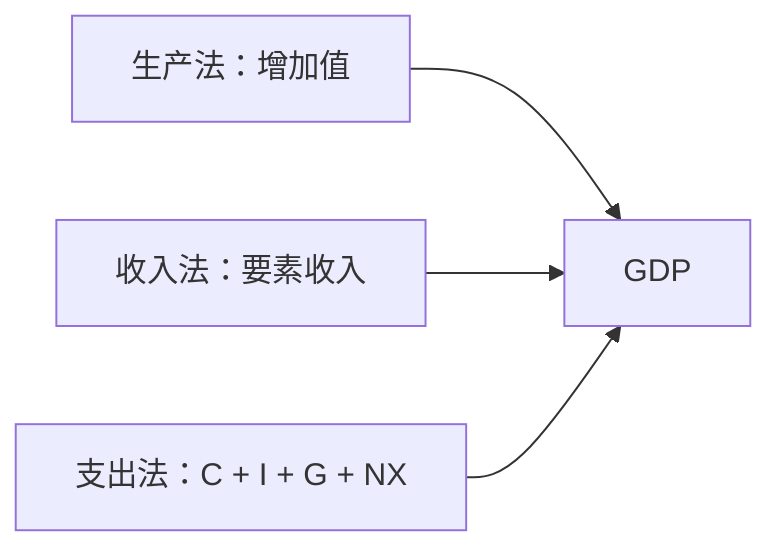

## 国民收入核算与基本指标

## 国内生产总值

**国内生产总值（Gross Domestic Product，GDP）**：一定时期内在一国（或地区）境内生产的所有最终产品与服务的市场价值总和。这是宏观经济学中最核心的定义，是观察一国经济首先要看的指标。

GDP 定义包含四个关键词。**一定时期内**对应时间维度，可以是一年、一个季度或一个月。**一国（或地区）境内**对应空间维度，按生产地归属而非企业国籍，即国土原则：美国特斯拉在上海生产并销售，产出计入中国 GDP；阿里巴巴在美国的子公司在美国生产，计入美国 GDP。**最终产品与服务**对应产品属性，中间产品不计入。**市场价值**对应价值衡量，用产品数量乘价格作为加总各种异质产品的共同尺度。

**中间产品与服务（intermediate goods and services）**：一家企业生产、被另一家企业当作投入品的产品与服务。中间产品不计入 GDP，以免重复计算：电动车整车企业定价时已包含车轮价格，把车轮再计一次就计算了两遍。中间产品到达消费者手中即转为最终产品，计入 GDP。

## 三种核算方法

GDP 有生产法、收入法、支出法三种核算方法。**生产法（production approach）**又称增值法，按生产环节的增加值核算；**收入法（income approach）**从要素收入角度核算；**支出法（expenditure approach）**从最终产品和服务的购买支出角度核算。理论上总产出等于总收入等于总支出，三种方法计算的 GDP 应完全一致；现实存在少量误差，统计上会做调整。

三种核算方法从生产、分配和最终支出三个角度交叉验证同一国民经济总量。

支出法把全社会购买最终产品和服务的总支出分为家庭、企业、政府、国外四个部门：**消费（C）**为耐用品、非耐用品与服务消费支出；**投资（I）**为企业厂房设备存货支出与家庭住宅支出，总投资等于净投资加折旧，折旧又称重置投资；**政府购买（G）**不含社会保障和福利等转移支付；**净出口（NX）**为出口减进口。支出法恒等式：

$$\text{GDP} = C + I + G + NX$$

收入法按生产要素成本核算：GDP 等于工资、利息、租金、利润、折旧、间接税之和减去补助金。

**名义 GDP**按当期价格计算，**实际 GDP**按一组不变价格计算，2024 年中国 GDP 增长 5.0% 即按不变价格衡量。**人均 GDP**为 GDP 除以人口。**国民生产总值（GNP）**按国民原则计算：GNP 等于 GDP 加来自国外的要素报酬减支付给国外的要素报酬。

## 价格水平与失业的衡量

**通货膨胀（inflation）**：总体价格水平普遍、持续地上升；单个商品涨价不构成通胀。**通货膨胀率**为价格水平变动的比例，离散形式 $\pi_t=(P_t-P_{t-1})/P_{t-1}$，连续形式 $\pi_t=\dot{P}_t/P_t$。**通货紧缩（deflation）**与通胀相反，价格总体持续下跌。

价格水平的衡量工具包括：**GDP 平减指数**等于名义 GDP 除以实际 GDP 乘 100，其篮子随当年产品构成变化，权重逐年变动；**消费价格指数（CPI）**按固定商品篮子编制，步骤为确定商品篮子、调查记录篮子价格、计算 CPI，篮子权重在相当长时间内固定；**生产者价格指数（PPI）**衡量工业企业产品出厂价格变动。**同比**与上年同期比较，**环比**与上一期比较。

失业统计有明确口径。**就业者**包括有报酬、无报酬家庭帮工与临时缺勤者；**失业者**为愿意工作、此前四周内力图寻找工作而找不到的人；**非劳动力**包括因长期找不到工作而放弃求职的沮丧劳动者。劳动力等于就业人数加失业人数，失业率为失业人数除以劳动力。失业分为**摩擦性失业**（匹配过程引起的暂时不匹配）、**结构性失业**（技能与工作要求持续不匹配）、**周期性失业**（随经济周期波动的失业）。充分就业指没有周期性失业，此时失业率为**自然失业率**；**潜在 GDP** 为充分就业下的 GDP。

## 指标评析

GDP 存在四方面缺陷：不能反映收入分配；忽略家庭劳动和地下经济；不能反映经济增长付出的环境代价；不能反映人民生活质量。

**CPI 的缺陷**：只基于一个固定商品篮子，篮子外消费未计入；产品质量变化难以调整——价格不变而质量下降（包子变小）或质量大幅提高（手机）都被忽略；某商品涨价后消费者转向替代品，固定权重篮子高估生活成本上升；新产品出现后篮子更新滞后。

**失业率的缺陷**：经济衰退时更多劳动者灰心丧气、退出劳动力市场，不再统计为失业者，失业率反而下降，并不必然表示经济好。

为弥补 GDP 缺陷，联合国开发署从 1990 年起发布人类发展指数（HDI），把经济、社会、环境、生活、文化等纳入指标体系；世界银行从 1997 年起运用绿色 GDP 核算体系衡量一国真实财富，把环境代价计入后中国 GDP 会损失很多。诺德豪斯（William D. Nordhaus）因把气候变化整合进长期宏观经济分析获 2018 年诺贝尔经济学奖，主张从排放许可制转向征收碳排放税。
