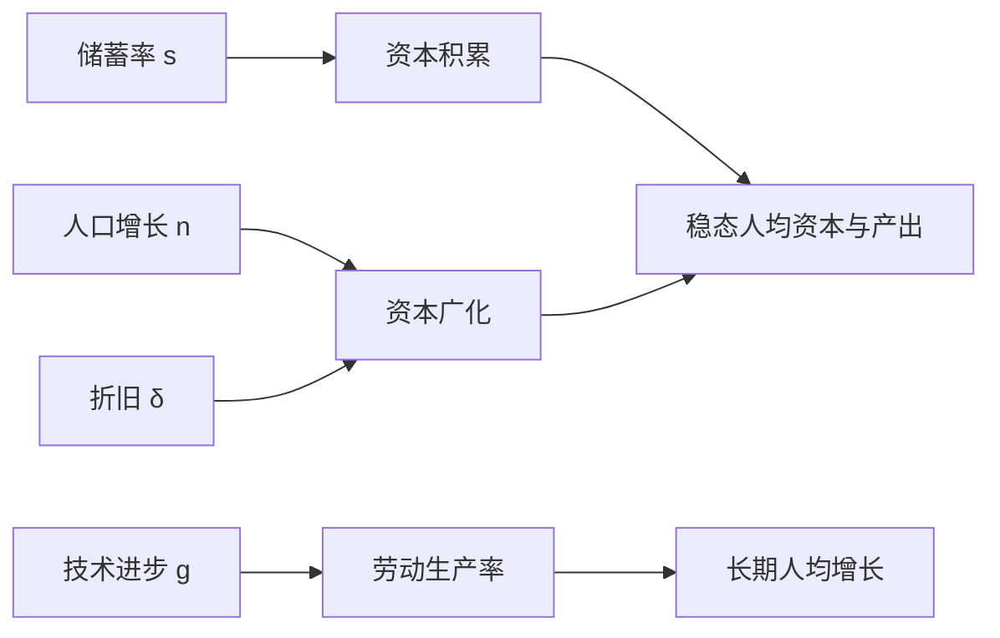

## 经济增长

## 增长的定义与度量

**经济增长（economic growth）**：长期中产量的增加。增长问题与凯恩斯理论处理的短期波动问题对应。衡量产出用实际 GDP，分析福利水平更常用人均 GDP。

增长率公式：单期 $g = (Y_{t+1}-Y_t)/Y_t$；平均 $\bar{g} = (Y_{t+n}/Y_t)^{1/n} - 1$；连续形式为 $\dot{Y}/Y$。增长率低于 10% 时近似 $g \approx \ln Y_{t+1} - \ln Y_t$。**经济增长与经济发展不同**：发展还关心识字率、社会治理、环境等更多维度。

## 国别事实与 70 法则

两大国别事实：各国人均 GDP 差异巨大，2023 年美国人均 GDP 82715 美元、埃塞俄比亚仅 1293.78 美元，前者为后者 64 倍；各国增长率差异很大，1960-2000 年新加坡年均增长 7.0%-7.5%，负增长一端多为非洲国家。

**复利效应**使微小增长差别积累出巨大差距：初始人均收入同为 1000，增长率 1% 与 5% 的两个国家 50 年后分别为约 1640 与 11470，相差约 7 倍。**70 法则**：翻一番所需年数约为 70 除以增长率百分数，增长率 7% 时约 10 年翻一番。1960 年菲律宾人均 GDP 高于韩国，2000 年韩国为菲律宾的 4 倍多，韩国跨越了**中等收入陷阱**而菲律宾没有。

## 增长的决定因素

生产函数 $Y = A \cdot F(K, L)$，A 为技术水平即**全要素生产率（TFP）**。生产函数具有边际收益递减与规模报酬不变的性质。规模报酬不变下欧拉定理成立：$Y = F_K K + F_L L$，完全竞争下 $r = F_K$、$w = F_L$，产出被要素报酬完全分走。柯布-道格拉斯生产函数 $Y = A K^\alpha L^{1-\alpha}$ 中，$\alpha$ 为资本报酬份额、$1-\alpha$ 为劳动报酬份额。

增长的直接原因：生产要素增加与技术进步。人均形式 $y = A f(k)$，人均产出提高靠人均资本增加或技术进步。克鲁格曼 1993 年指出亚洲四小龙的增长主要靠要素投入增加、技术水平改善有限，要素驱动的增长难以持续，技术进步是持续增长的关键。

增长的根本原因是制度、文化与地理。诺斯认为资本积累与技术进步是增长本身而不是增长的原因，制度才是根本原因。反例：朝鲜与韩国分裂前地理环境相似，如今人均收入天差地别；诺加利斯小镇横跨美墨边境、两边文化相同而增长差距巨大。

## 哈罗德-多马模型

哈罗德-多马模型是增长理论的第一次数学化。假设生产函数为固定比例（里昂惕夫）形式 $Y = \min(AK, BL)$，资本与劳动完全互补、不可替代。由产品市场均衡 $I = S$ 得人均资本增长率：

$$\frac{\dot{k}}{k} = \frac{s}{v} - n$$

其中 v 为资本产出比、外生常数。稳态条件为 $s/v = n$。模型均衡呈**刀刃上的均衡**：储蓄率升高则资本过剩、人口增长率升高则劳动失业，要素完全互补使偏离无法自动修复，经济大起大落。

## 索洛模型

索洛把固定比例生产函数改为资本与劳动可替代的新古典生产函数，因此获 1987 年诺贝尔经济学奖。人均生产函数 $y = f(k)$ 满足 $f'(k) > 0$、$f''(k) < 0$ 与稻田条件，保证稳态存在且唯一。

**基本方程**：

$$\dot{k} = s \cdot f(k) - (n + \delta) k$$

**资本广化** $(n+\delta)k$ 是为新增人口配齐人均资本并弥补折旧所需投资；**资本深化** $\dot{k}$ 为人均资本的实际增量。稳态条件 $s f(k^*) = (n+\delta)k^*$，人均资本与人均产出停止增长。稳态唯一且稳定：$k < k^*$ 时 $\dot{k} > 0$、$k > k^*$ 时 $\dot{k} < 0$，经济自动收敛。

引入劳动增强型技术进步 $Y = F(K, AL)$，AL 为有效劳动、技术进步率 g 外生。有效人均变量 $\\hat{y} = f(\\hat{k})$，新基本方程 $\\dot{\\hat{k}} = s f(\\hat{k}) - (n+g+\\delta)\\hat{k}$。稳态下人均产出增长率等于 g，总量产出增长率等于 n+g。**核心结论：长期中人均产出增长最终依靠技术进步，资本积累只能决定稳态水平**。

索洛模型中储蓄与人口增长主要改变稳态水平，持续的人均增长最终依赖技术进步。

## 比较静态与黄金律

储蓄率上升使 $sf(k)$ 曲线上移，均衡人均资本与人均产出上升，即**水平效应**；无技术进步时稳态增长率为 0，故没有**增长效应**。数学推导：

$$\frac{dk^*}{ds} = \frac{f(k^*)}{(n+\delta) - s f'(k^*)} > 0$$

人口增长率上升使 $(n+\delta)k$ 直线斜率变大、稳态左移，人均资本与人均产出下降；总产出增长率等于人口增长率，人口增长更快时总产出增长率更快而人均收入更低。

**资本的黄金律水平（golden rule level）**：使稳态人均消费最大的资本存量。人均消费 $c^* = f(k^*) - (n+\delta)k^*$，一阶条件：

$$f'(k_g) = n + \delta$$

若 $k^* > k_g$，社会储蓄过多、消费偏低；若 $k^* < k_g$，储蓄过少、应增加储蓄。

## 内生增长理论

索洛模型的最大缺陷是技术进步外生。现实中约 80%-90% 的技术进步由企业推动、是企业追求利润最大化的结果，即技术进步是**内生**的。

**AK 模型** $Y = AK$ 中资本边际收益不递减，代入积累方程得 $\dot{K}/K = sA - \delta$，只要 $sA > \delta$，人均资本与产出可持续增长，长期增长不再依赖外生技术进步。解释资本边际收益不递减的三条思路：资本含私人资本与公共资本，政府提供公共品提高私人资本收益；物质资本加人力资本，受教育水平不断提高抵消物质资本递减；**边干边学**（阿罗提出）——产量越大积累的生产经验越丰富。**卢卡斯两部门模型**把社会分为生产部门与教育部门，教育部门使人力资本不断提高，资本积累可持续。罗默 1986 年文章是内生增长理论的开山之作。

## 增长核算

**增长核算（growth accounting）**把可观测的产出增长率分解为要素贡献与技术进步贡献。柯布-道格拉斯生产函数下，两边取对数对时间求导：

$$\frac{\dot{Y}}{Y} = \frac{\dot{A}}{A} + \alpha\frac{\dot{K}}{K} + (1-\alpha)\frac{\dot{L}}{L}$$

$\dot{A}/A$ 即**全要素生产率**，又称**索洛残差**——产出增长中扣除要素贡献后的剩余。索洛 1957 年估计技术进步对美国经济增长的贡献约 70%。美国 1948-2013 年产出年均增长 3.5%，TFP 贡献 1.2；1972-1995 年 TFP 增长率异常低（0.5%）。丹尼森把增长源泉分为生产要素投入量与生产要素生产率两类，1929-1982 年美国国民收入增长 2.92% 中，要素投入贡献 1.90%、单位投入产量贡献 1.02%。

## 促进增长的政策

鼓励技术进步：专利制度授予垄断权激励研发（中国发明专利保护期 20 年），税收制度对高新技术企业征 15% 所得税、研发费用加计扣除（投入 100 万元按 200 万元扣除），教育培养工程师与科学家，政府支持基础研究。鼓励资本形成：鼓励储蓄与投资。增加劳动供给：降低个人所得税、加强人力资本投资。

**制度是根本原因**：制度是支配社会组织方式的正式与非正式规则，由人设计、对个体行为施加约束、影响激励。制度不同 → 创造不同类型的激励 → 激励决定要素积累与采用新技术的程度 → 增长差异。2023 年中国基础研究经费占 R&D 比重 6.77%，仍低于发达国家。内生增长理论的政策启示——鼓励教育、创新——值得借鉴；中国实施创新驱动战略，经济发展方式由粗放式转向集约式。
