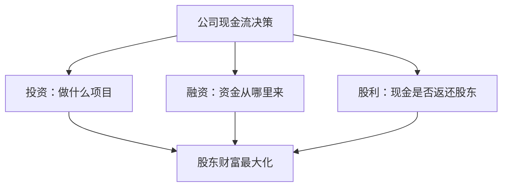
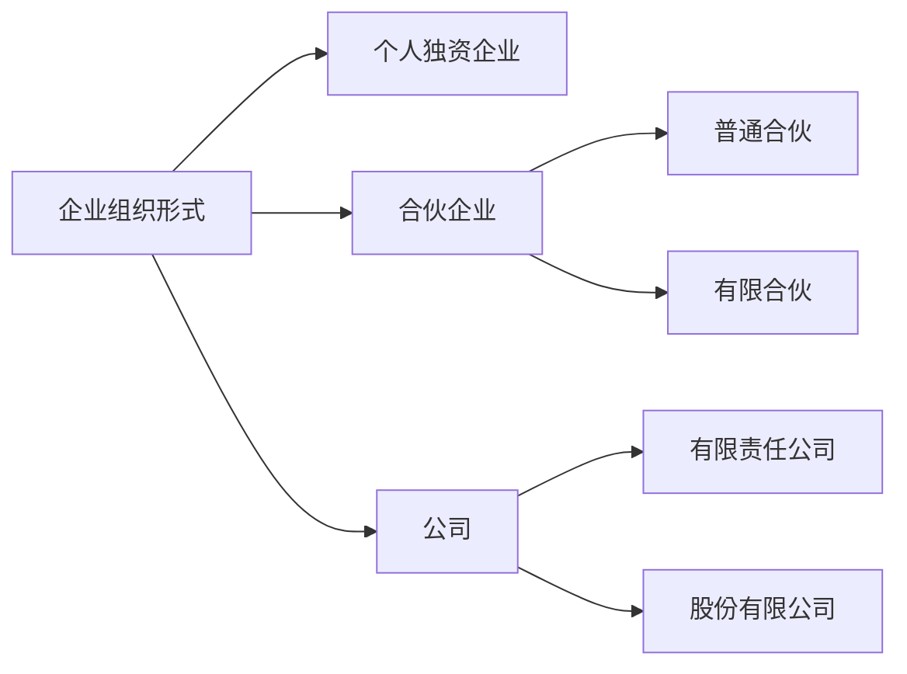
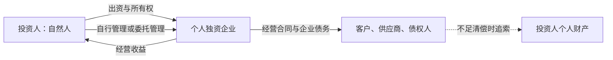
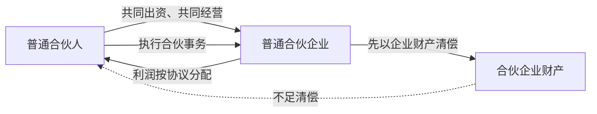
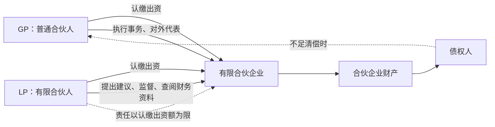
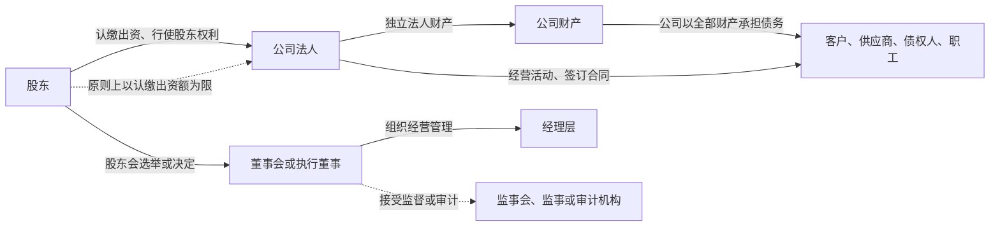
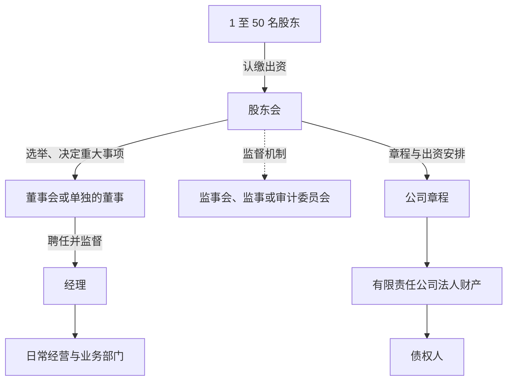
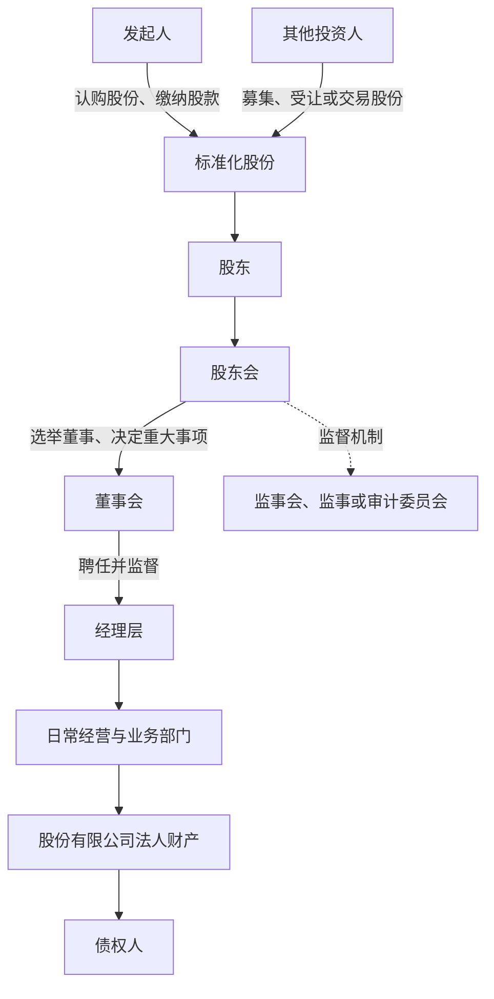

## 公司金融课程导论

## 公司金融的三大决策

**公司金融**（corporate finance）从公司角度研究投资、融资与股利分配三类决策。

投资、融资和股利决策共同决定现金流如何产生、筹集与分配，最终服务于股东财富最大化。

**投资决策**（investment decision）判断项目是否值得做，项目的好坏取决于成本与收益的比较，而收益与成本发生在不同时间点，不能直接相减。

**融资决策**（financing decision）又称资本结构（capital structure）决策，决定项目资金从哪里来。资金来源分两类：债务（debt），形式包括银行贷款、发行债券与银团贷款；股东权益（equity），形式包括发行股票与出售股份。负债率（debt ratio）= 债务 ÷ 资产。

**股利支付政策**（payout policy）决定项目完成后剩余的现金如何处理：留在公司账上，或以现金分红、股票回购（share repurchase）等形式返还股东。

## 财务管理目标：股东财富最大化

公司金融关注现金与现金流，会计关注利润表上的净利润。账面利润不等于钱：账上有一个亿净利润，钱可能还在客户手里（应收账款），拿到手的现金才算钱。

财务管理的目标是公司未来所有现金流的现在价值最大，即股东财富最大化。股价（stock price）由市场供求决定、短期波动大；股票价值（stock value）取决于公司未来现金流的折现。

## 货币时间价值与投资决策指标

**货币时间价值**（time value of money）：不同时间点上的现金流不能直接比较，须折算到同一时点。**现值**（present value, PV）是未来现金流在当前的价值：$PV = FV / (1+r)^t$。**终值**（future value, FV）是当前现金流在未来某时点的价值：$FV = PV \times (1+r)^t$。

判断项目好坏的常用指标有五类：**净现值**（NPV）为收益现值减成本现值，NPV > 0 是好项目；**内部收益率**（IRR）是项目自身的年回报率，高于资金成本则可行；**投资回收期**是累计收益收回初始投资的年数，没有考虑时间价值；**折现回收期**用折现后的现金流计算回收期；**盈利指数**是收益现值与成本现值之比。

一年期项目投 100、一年后收回 105、市场利率 6%：100 元存银行一年后变 106；$105 / 1.06 \approx 99.06 < 100$，净现值为负，IRR = 5% 低于资金成本 6%。项目应否决。

## 企业组织形式

企业组织形式决定谁拥有企业财产、谁对外承担债务、谁拥有经营控制权，以及企业如何筹集资本和把现金分配给投资人。公司金融不能只看项目回报率，还要把组织形式带来的责任边界、治理成本、融资能力、税收和退出机制纳入现金流与风险分析。

### 比较组织形式的六个维度

| 维度 | 要回答的问题 | 对公司金融的影响 |
| --- | --- | --- |
| 法律主体与财产 | 企业财产是否与投资人独立？ | 决定债权人追索范围和资产隔离程度 |
| 债务责任 | 亏损超过出资额后由谁承担？ | 影响投资人下行风险、债权人保护和融资成本 |
| 决策与治理 | 谁执行事务，谁监督管理者？ | 影响控制权、代理成本和决策效率 |
| 资本筹集 | 能否引入新投资人和外部资本？ | 影响企业规模、增长速度和资本结构选择 |
| 权益转让 | 投资人能否退出或转让份额？ | 影响投资流动性、估值和退出安排 |
| 税收与分配 | 企业收入和投资人所得分别如何纳税？ | 影响税后现金流与股利支付政策 |

### 个人独资企业：控制集中，责任不隔离

**个人独资企业**（sole proprietorship）由一个自然人投资设立。根据《中华人民共和国个人独资企业法》第二条，企业财产归投资人个人所有，投资人以个人财产对企业债务承担无限责任；投资人在登记时明确以家庭共有财产出资的，还要以家庭共有财产承担无限责任。

- **治理**：投资人可以自行管理，也可以委托或聘用他人管理。经营控制权集中，决策链条短，但监督和制衡机制较弱。
- **融资**：企业没有可供多个投资人持有的股权结构，外部股权融资和标准化权益转让能力较弱。扩张通常依赖投资人追加资金、经营现金流或债务融资。
- **风险**：企业债务可能追及投资人的个人财产。对高固定成本、高研发投入或经营不确定性较大的项目，个人资产暴露尤其重要。
- **税收**：个人独资企业不适用《中华人民共和国企业所得税法》，投资人按照适用的个人所得税和其他税收规则承担纳税义务。不能把这概括为固定的“只有一道税”，实际税负还取决于所得性质、税收优惠和具体政策。
- **适用场景**：业务规模较小、投资人希望保持完全控制、经营风险和外部融资需求有限的业务。

图中的核心关系是：投资人同时承担出资人、控制者和最终责任承担者的角色，企业经营资产与投资人的个人责任没有公司制下的完全隔离。

个人独资企业与一人有限责任公司不是同一种组织形式。一人有限责任公司具有独立法人财产，股东原则上以认缴出资额为限承担责任；个人独资企业的投资人则承担无限责任。两者在资产隔离、融资、治理和税务处理上都需要分别判断。

### 合伙企业：协议治理与责任分层

**合伙企业**（partnership）是自然人、法人和其他组织依照《中华人民共和国合伙企业法》设立的普通合伙企业或有限合伙企业。合伙企业拥有以企业名义取得的财产，但不是公司法意义上的企业法人；合伙协议是分配权利、义务、利润和亏损的重要文件。

**普通合伙企业**（general partnership）由普通合伙人组成。合伙企业不能清偿到期债务时，合伙人对企业债务承担无限连带责任。合伙人之间可以通过协议约定事务执行、利润分配和亏损分担，但对外责任的无限连带性不能仅靠内部约定消除。

普通合伙的组织核心是合伙协议和合伙人之间的相互信任。企业财产先用于清偿债务，仍不足时，债权人可以向承担无限连带责任的合伙人追偿；承担超过内部亏损分担比例的合伙人，再向其他合伙人追偿。

**有限合伙企业**（limited partnership）由普通合伙人（GP）和有限合伙人（LP）组成，至少有一个普通合伙人，通常由 2 至 50 个合伙人设立：

- **普通合伙人**：执行合伙事务，对合伙企业债务承担无限连带责任。
- **有限合伙人**：以其认缴的出资额为限承担责任，不执行合伙事务，也不得对外代表有限合伙企业；可以参与选择普通合伙人、提出经营建议、查阅财务资料和监督执行事务。
- **转让与退出**：普通合伙份额对外转让通常需要其他合伙人一致同意；有限合伙人可以按照合伙协议约定转让份额，但应遵守通知等规则。
- **出资**：普通合伙人可以以劳务出资；有限合伙人不得以劳务出资。

有限合伙将控制权、经营责任和资金提供分开：GP 管理企业并承担无限连带责任，LP 主要提供资本并保留法定监督权，原则上不执行合伙事务。LP 如果以普通合伙人身份对外交易，可能按照普通合伙人的规则承担责任。

有限合伙把经营控制权与主要资金提供者分开，常用于投资基金、创业投资等需要“管理者 + 出资人”分工的场景。它并不等于投资人可以无条件规避风险：普通合伙人的无限责任、有限合伙人的出资义务、合伙协议以及具体监管规则都会影响实际风险。

**税收**：合伙企业的生产经营所得和其他所得，按照税收规则由合伙人分别缴纳所得税；《企业所得税法》明确个人独资企业、合伙企业不适用该法。合伙人是个人、公司或其他组织时，适用的税种和税率可能不同。“穿透到合伙人纳税”表示纳税主体和计税路径不同，不表示合伙企业免税。

### 公司制：法人独立与有限责任

**公司**（corporation）是依照《中华人民共和国公司法》在中国境内设立的有限责任公司或股份有限公司。公司是企业法人，有独立的法人财产，以全部财产对公司债务承担责任；有限责任公司的股东以其认缴的出资额为限承担责任，股份有限公司的股东以其认购的股份为限承担责任。

有限责任是风险隔离的默认规则，不是对违法行为和资本责任的豁免。股东滥用公司法人独立地位和股东有限责任、逃避债务并严重损害债权人利益的，可能对公司债务承担连带责任；股东未按期足额缴纳出资，也可能承担补缴和赔偿责任。

公司制的基本结构是“股东出资—公司持有独立财产—治理机构作出决策—经理层执行经营”。股东不是公司财产的直接所有人，股东对公司享有资产收益、参与重大决策和选择管理者等权利；公司则以自己的名义对外承担经营责任。

#### 有限责任公司：封闭型股权与灵活治理

**有限责任公司**（limited liability company, LLC）可以由 1 个以上、50 个以下股东出资设立。股东通过公司章程约定出资额、出资方式、出资日期和组织机构。2023 年修订的《公司法》规定，有限责任公司的注册资本是全体股东认缴的出资额，股东认缴的出资额原则上应当自公司成立之日起 5 年内缴足；其他法律、行政法规或国务院决定另有规定的，从其规定。

有限责任公司的股东会、董事会或执行董事、经理层和监督机制可以按照公司规模与章程灵活配置。股权相对封闭，股东人数较少，控制权安排通常比股份有限公司更集中。

有限责任公司的股权通常具有较强的封闭性。股东对外转让股权时，其他股东在同等条件下通常享有优先购买权。它适合股东人数有限、需要明确控制权安排、暂不依赖公开市场大规模融资的企业，但股权转让限制可能降低投资人的退出流动性。

#### 股份有限公司：标准化股份与广泛融资

**股份有限公司**（joint stock company）以股份为资本单位。设立时可以采取发起设立或募集设立，发起人数量为 1 至 200 人。股份的标准化程度较高，适合引入较多投资人、进行股权激励、公开发行或在证券市场交易。

股份有限公司把出资拆分为可计量、可转让的股份。股东通过股东会参与重大决策，董事会负责经营决策，经理层执行日常经营，监督机构或审计委员会承担监督与审计职能。股份可以通过发行、转让和交易引入新的投资人，但公开发行、上市和信息披露还要满足证券监管规则。

上市不是独立于有限责任公司和股份有限公司之外的第三种公司组织形式，而是符合条件的股份有限公司经过发行上市等程序后获得的市场状态。上市公司需要遵守更严格的信息披露、关联交易、公司治理和投资者保护规则，合规成本和公众监督也相应提高。

公司制通常有更强的融资能力、持续经营能力和资产隔离能力，但也会带来章程与治理、财务会计、审计披露、合规和代理成本。股东数量增加、所有权与经营权分离后，经理人可能追求规模、薪酬或个人控制权，股东需要通过董事会、监事或审计、信息披露、股权激励等机制约束代理问题。

#### 公司制的税收与双层纳税

公司作为企业所得税纳税人，居民企业的企业所得税法定税率为 25%，但小型微利企业、高新技术企业和其他符合条件的主体可能适用优惠税率或其他优惠政策。公司向个人股东分配股息、红利时，个人股东的该类所得一般按 20% 的比例税率缴纳个人所得税；具体还要结合股东身份、持股方式、上市公司规则和税收优惠判断。

因此，对个人股东而言，公司利润分配可能形成“公司层面的企业所得税 + 股东层面的股息红利个人所得税”两层税负。假设公司税前应纳税所得额为 100 万元、适用 25% 企业所得税，税后全部向个人股东分红且不考虑其他优惠，简化计算为：公司缴税 25 万元，分红 75 万元，股东缴纳 15 万元个人所得税，股东最终取得 60 万元。这个例子只说明两层纳税机制，不代表所有公司的实际税负。

税收处理不能只看“公司制双重征税、合伙制单层征税”这样的标签。符合条件的居民企业之间股息、红利等权益性投资收益可以作为企业所得税免税收入；个人独资企业和合伙企业的合伙人身份、所得类型及经营所在地也会改变税务结果。项目估值应使用税后、可分配、可持续的现金流，而不是套用组织形式的固定税率。

### 组织形式如何影响公司金融决策

组织形式会通过五条路径进入公司金融模型：

1. **责任边界与风险溢价**：无限责任扩大投资人承担的尾部损失；有限责任减少个人资产暴露，但债权人可能要求更高利率、担保或契约约束。
2. **融资能力与资本结构**：股份标准化、股权可转让和信息披露有助于引入权益资本；封闭式股权和无限责任则可能限制外部投资人进入。
3. **控制权与代理成本**：集中控制提高决策速度，所有权与经营权分离则需要治理、激励和监督机制。
4. **税后现金流**：企业所得税、个人所得税、分红或留存收益的处理会改变项目的可分配现金流和资本成本。
5. **退出与持续经营**：股权转让、合伙人退伙、清算和上市交易规则影响投资期限、流动性折价和终值估计。

从财务角度选择组织形式，不能只问“哪一种税更低”，还要同时比较责任、融资、控制权、合规成本和退出价值。对于同一个项目，个人独资企业、有限合伙和股份有限公司可能对应完全不同的资本成本、现金流分配和投资人风险。

???+ warning "法律与税务说明"
    本节用于公司金融课程中的组织形式比较，不构成设立企业、融资、税务筹划或法律诉讼意见。

    组织形式、注册资本、股东责任和税收政策可能随法律法规、监管规则和地方政策变化，实际操作应以国家法律法规及主管机关最新文件为准。

### 来源说明

- [《中华人民共和国公司法（2023 年修订）》](https://www.cfachina.org/governmentrules/lawsandregulations/202401/t20240104_63448.html)，中国期货业协会法规栏目，访问日期：2026-09-03。重点参见第二条至第四条、第二十三条、第四十二条、第四十七条、第四十八条、第四十九条、第九十一条至第九十八条。
- [《中华人民共和国合伙企业法》](https://www.12371.cn/2020/06/28/ARTI1593275533251897.shtml)，共产党员网转载全国人大常委会法律文本，访问日期：2026-09-03。重点参见第二条、第六条、第三十八条至第三十九条、第六十一条至第六十八条。
- [《中华人民共和国个人独资企业法》](https://guangdong.chinatax.gov.cn/gdsw/zjfg/2025-12/31/content_13a728f4d8bc45198b4ad3179e42bf84.shtml)，国家税务总局广东省税务局政策法规库，访问日期：2026-09-03。重点参见第二条、第四条、第十七条至第十九条。
- [《中华人民共和国企业所得税法》](https://fgk.chinatax.gov.cn/zcfgk/c100009/c5193018/content.html)，国家税务总局政策法规库，访问日期：2026-09-03。重点参见第一条、第四条、第二十六条和第二十八条。
- [《中华人民共和国个人所得税法》](https://fgk.chinatax.gov.cn/zcfgk/c100009/c5193028/content.html)，国家税务总局政策法规库，访问日期：2026-09-03。重点参见第三条、第六条和第十二条。
