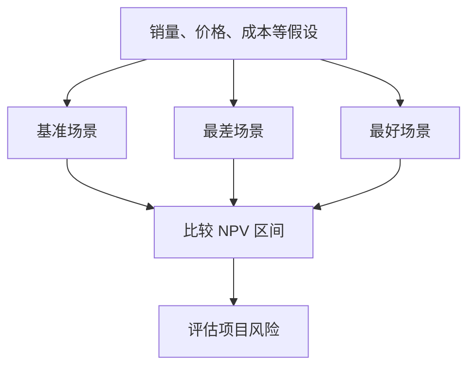

## 风险分析与实物期权

## 风险分析的动机

NPV 大于零只代表预测现金流下的结果。预测销量 2% 的误差传导到 NPV 可能是 2%、20% 或 1%，放大倍数与成本结构（经营杠杆）有关；误差传导越大，项目风险越大。

## 场景分析

**场景分析**（scenario analysis）让一组变量同时变动，构造基准、最差、最好三套场景，比较 NPV 区间。

场景分析观察多项假设共同变化时的价值区间，敏感性分析则进一步定位最影响 NPV 的单个变量。

新项目例：初始投资 200,000、5 年、直线折旧每年 40,000、要求回报率 12%、税率 34%。基准（销量 6000、价格 80）NPV = 15,565.62；最差（销量 5500、价格 75）NPV = −111,719.03；最好（销量 6500、价格 85）NPV = 159,504.33。NPV 区间从 −11.2 万到 +16 万，风险很大。

## 敏感性分析

**敏感性分析**（sensitivity analysis）一次只变一个变量，看 NPV 对该变量的敏感度。NPV 相对某变量的波动越大，该变量的预测风险（forecasting risk）越大，越要花精力估计。

销量敏感性：其他条件不变，销量从 6000 降到 5500 时 NPV 跌到 −8,225.91，升到 6500 时 NPV 升到 39,357.14。销量只变 8.3%，NPV 变动超过 100%，NPV 对销量高度敏感。

## 模拟分析

**模拟分析**（simulation analysis / Monte Carlo）让变量取连续分布并考虑相互间的联合概率分布，模拟大量结果，得到 NPV 的概率分布图。

判读只看分布相对 0 的位置：大概率在 0 右侧且左尾亏损不大就可做。无风险资产也有收益（时间价值），不能要求 100% 概率在 0 右侧。

## 盈亏平衡分析

**盈亏平衡分析**（break-even analysis）求「不亏本」的最低年销量，有三种口径。

**会计盈亏平衡**（accounting break-even）是净利润 = 0：

$$Q = \frac{FC + D}{P - v}$$

**现金盈亏平衡**（cash break-even）是 OCF = 0（忽略税）：

$$Q = \frac{FC}{P - v}$$

**财务盈亏平衡**（financial break-even）是 NPV = 0：先用年金公式求使 NPV = 0 的年现金流 OCF*，再反解 $Q = (FC + OCF^*) / (P - v)$。

算例：初始投资 500 万、5 年直线折旧到 0、P = 25,000、v = 15,000、FC = 100 万/年、要求回报率 18%。会计盈亏平衡 Q = 200 个；现金盈亏平衡 Q = 100 个；财务盈亏平衡先求 OCF* = 1,598,889（年金公式 N = 5、PV = 500 万、I/Y = 18%），再 Q ≈ 260 个。

会计盈亏平衡仍亏时间价值：净利润 = 0 时 OCF = 折旧，现金流为 −500 万然后每年 +100 万共 5 年，折现值小于 500 万。只有销量达到财务盈亏平衡点才是真正不亏不赚。

## 实物期权

**实物期权**（real options）是项目执行过程中的管理选择权。NPV 分析忽略了这些选择权，而公司在动态环境中经营，估值时应纳入。

三种选择权：

**扩张期权**（option to expand）在需求好时扩大规模。冰旅馆：单店初始投资 12 百万、年现金流 2 百万、永续、贴现率 20%，NPV = 2/0.2 − 12 = −2，不做。若乐观情景可将成功模式复制 10 家店，期望 NPV = 50% × 10 × 3 + 50% × (−7) = +11.5，值得做。局限：市场容量也许不够，复制会加剧竞争。

**放弃期权**（option to abandon）在需求差时提前终止止损。年现金流 50% 概率 6、50% 概率 −2；若第 1 年结果揭晓后差则终止，价值 = 50% × 18 + 50% × (−12 − 2/1.2) ≈ +2.17，值得做。提前止损把负 NPV 项目变成正 NPV。

**择机期权**（option to delay）在关键变量朝有利方向变化时选择最佳启动时机。启动年收益现值恒为 25,000，成本逐年下降，贴现率 10%；NPV_t = 25,000 − 成本，折现回今天后第 2 年末启动现值最大。晚启动的额外收益被折现抵消，不是越晚越好。

## 决策树

**决策树**（decision tree）把多个时间点的决策与结果画成分支图；每个决策点只保留最优分支，从期末逐期折回；已经花掉的钱在后续决策点是沉没成本，不再影响决策。

SEC 太阳能喷气发动机项目：0 点选择花 1 亿做原型开发与市场测试，或不做（价值 0）。测试结果第 1 年揭晓：75% 成功（若量产 NPV = 1517，不量产 0）、25% 失败（若强行量产 NPV = −3611，不量产 0）。第 1 年末期望值 = 0.75 × 1517 + 0.25 × 0 = 1138；0 点 NPV = −100 + 1138/1.15 = 890 > 0，应该做测试。
