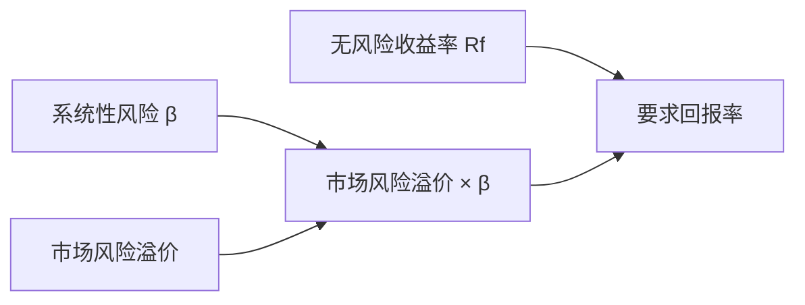

## 风险、收益与资本资产定价

## 单个资产的期望收益与风险

**期望收益率**（expected return）是各状态收益率按发生概率加权平均：E(R) = Σ pᵢRᵢ。

两资产例子：明年经济三种状态（衰退、正常、繁荣）概率各 1/3。股票型基金三状态收益率为 −7%、12%、28%，期望收益 11%；债券型基金为 17%、7%、−3%，期望收益 7%。

**方差**与**标准差**度量收益率围绕期望值的不确定性：Var(R) = Σ pᵢ[Rᵢ − E(R)]²。平方处理避免高估与低估相互抵消。股票基金 σ ≈ 14.3%；债券基金 σ ≈ 8.2%。11% 的期望收益现实中不会实现，必须用方差/标准差描述实际值偏离期望值多少。

## 资产组合与分散化

**组合收益率**是单个资产收益率的加权平均：r_p = X₁r₁ + X₂r₂。组合期望收益 = 单个资产期望收益的加权平均，收益不减少。

**组合方差公式**（两资产）：

$$Var(R_p) = X_1^2 Var(R_1) + X_2^2 Var(R_2) + 2X_1X_2 Cov(R_1, R_2)$$

协方差度量两资产同向变动程度，相关系数 ρ = Cov/(σ₁σ₂)，取值在 −1 到 +1 之间。50/50 组合：期望收益 9%，标准差 3.08%，不但小于股票基金的 14.3%，也小于债券基金的 8.2%。

分散化的核心结论：组合的期望收益 = 单个资产期望收益的加权平均；相关系数 ρ < 1 时组合标准差严格小于单个资产标准差的加权平均，ρ = 1 时组合无任何分散效果。实现分散化并不要求资产负相关，ρ = 0.9 的高正相关资产组合也会降低一点风险。完全负相关（ρ = −1）的两只股票 50/50 组合收益率恒为常数，风险全部抵消。

## 可行集、有效边界与资本市场线

**机会集/可行集**（opportunity set）是风险（横轴 σ）—收益（纵轴 E(R)）平面上所有可以实现的组合点。**有效集/有效边界**（efficient frontier）是可行集中给定风险水平下收益最高的组合集合，理性且风险厌恶的投资人只选有效边界上的点。

**无风险资产**在图上坐标为 (0, r_f)。无风险资产与风险组合的连线与有效边界相切的那条最优；切点组合称为市场组合（market portfolio），是市场上全部有风险资产按市值权重构成的组合。

**资本市场线**（capital market line, CML）：

$$E(R_P) = R_f + \frac{E(R_M) - R_f}{\sigma_M}\sigma_P$$

斜率 = [E(R_M) − R_f]/σ_M，是单位总风险的市场价格。CML 只对有效资产组合成立，单个股票位于 CML 下方。

## 系统性风险与非系统性风险

总风险分为两类。**系统性风险**（systematic risk）是影响大量资产的宏观风险（GNP、利率、通胀的不确定性），组合无法消除。**非系统性风险**（unsystematic risk）又称公司特有风险，只影响个别公司，组合里好公司与坏公司的冲击相互抵消。

市场只补偿无法分散的系统性风险；可分散的那部分风险，投资人通过无成本的资产组合即可消除，不应得到补偿。「高风险高回报」中的风险特指系统性风险。

## 贝塔系数

**贝塔系数**（beta, β）度量单个资产系统性风险的大小：

$$\beta_i = \frac{Cov(R_i, R_M)}{Var(R_M)} = \frac{\rho_{iM}\sigma_i}{\sigma_M}$$

含义：市场组合超额收益每变动 1%，该资产超额收益的期望变动百分比。市场组合自身 β = 1；β > 1 的系统性风险高于市场（如科技股），β < 1 低于市场（如公用事业）。β 由自身波动性 σ_i 与大盘相关性 ρ_iM 两个因素决定。β 与波动率不同：波动率衡量总风险，β 只衡量系统性风险。

## CAPM 与证券市场线

**资本资产定价模型**（capital asset pricing model, CAPM）：

CAPM 把投资者要求的回报拆为时间价值与承担系统性风险的补偿，非系统性风险可通过分散化消除。

$$E(R_i) = R_f + \beta_i \times [E(R_M) - R_f]$$

任何资产的期望收益率 = 无风险收益率 + 系统性风险溢价。与 CML 的区别：β 度量的系统性风险部分对任何资产都适用，CAPM 适用于所有资产，单个股票与组合均成立。

**证券市场线**（security market line, SML）以 β 为横轴、E(R) 为纵轴的正斜率直线，斜率 = 市场风险溢价。所有股票都落在 SML 上；β 相同的资产期望收益相同。CML 横轴是总风险 σ，仅适用于有效组合；SML 横轴是系统性风险 β，适用于所有证券。**资产组合的 β 是加权平均**：β_p = Σ xᵢβᵢ；总风险不是加权平均（可分散部分被抵消）。

微软例：市场收益率 60% 概率为 15%、40% 概率为 5%，无风险收益率 6%，微软 β = 1.18。E(R_M) = 11%，市场风险溢价 = 5%，E(R_微软) = 6% + 1.18 × 5% = 11.9%，即微软股权融资成本。

CAPM 推导依赖三条假设：市场无摩擦（无交易成本、无税，可按无风险利率自由借贷）；投资者理性，只持有有效组合；同质预期，所有投资人对未来收益与风险的预期一致。CAPM 是单因子模型，所有资产共用 R_f 与市场风险溢价，唯一区别是 β。
