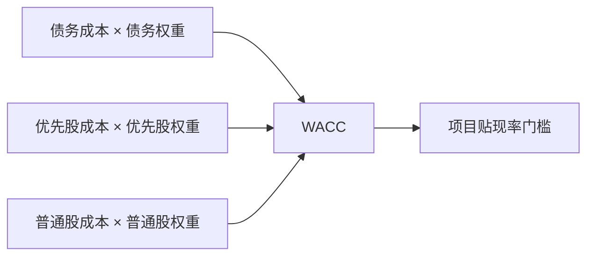

## 资本成本与长期融资

## 公司资金来源三渠道

公司做项目，钱从三个渠道来，对应资产负债表右侧的债务（debt）、优先股（preferred stock）、普通股（common stock）。

**优先股**是债务与普通股的混合物：发行时约定每年固定红利；红利在公司没钱时可拖欠、累积以后再付；分红时先付清优先股红利，剩钱才付普通股红利。三个渠道风险不同，要求的回报率不同：债务成本最低、优先股居中、普通股最高。

## 权益成本与 CAPM

**权益成本**用 CAPM 估计：

$$R_i = R_F + \beta_i (R_M - R_F)$$

三个输入：无风险收益率 R_F、市场风险溢价 R_M − R_F、公司贝塔。**无风险收益率**用短期国债收益率作代理。**市场风险溢价**是未来值：历史平均把 10-20 年大盘收益率均值作为预期；股利折现模型反推，由 $P_0 = D_1 / (R - g)$ 变形得 $R = D_1 / P + g$。

**贝塔的估计**：用个股收益率对大盘收益率回归，回归线斜率即贝塔，常用过去 3-5 年月度数据。实测斜率：宝洁 0.52、谷歌 1.20、美国银行 2.21。**行业贝塔**把行业内各公司贝塔取平均，抵消估计误差。

**贝塔的决定因素**：$\beta_i = \rho \times \sigma(R_i) / \sigma(R_M)$，自身波动大且与大盘相关高，贝塔才高。收入周期性强（零售、汽车）的公司贝塔高；经营杠杆高（高固定成本、低变动成本）的公司贝塔高；财务杠杆高把股东权益贝塔抬高：$\beta_{Equity} = \beta_{Asset} \times (1 + D/E)$。

项目决策画在 SML 图上：IRR 高于 SML 的项目是好项目。超过 SML 要求回报率的部分叫**阿尔法**（alpha），贝塔衡量按风险大小应得的回报，阿尔法衡量应得之外多拿的部分。

## 债务成本、优先股成本与 WACC

**债务成本**：银行借款取约定利率；发行债券取到期收益率 YTM。利息在税前利润中列支，产生税盾，税后成本 $R_D \times (1 - T_C)$。借 100 万、利率 10%、税率 20%：付银行 10 万利息，少缴税 2 万，税后实际成本 8 万。股东权益分红在税后支付，不作税盾调整。

**优先股成本**：优先股是永续年金，$R_P = C / PV$（年红利 ÷ 市价）。

**加权平均资本成本**（weighted average cost of capital, WACC）：

WACC 将不同资金来源的税后成本按目标资本结构加权，形成与公司整体风险匹配的项目回报门槛。

$$WACC = \frac{E}{V} R_E + \frac{P}{V} R_P + \frac{D}{V} R_D (1 - T_C)$$

V = E + P + D，各项权重取目标资本结构比重。优先股占比小，题目未给条件时按没有处理。算出的 WACC 是公司所有项目混合的平均融资成本，只适用于风险与公司整体一致、杠杆与公司一致的新项目。

## 发行成本与项目贴现率

多元化公司是多项目的资产组合，用一条公司水平的门槛做所有项目会出错：把高风险项目误收、把低风险项目误拒。处理办法：**纯玩方法**（pure play approach）找只做该业务的公司，算其贝塔取平均，套 CAPM 得到项目贴现率；**主观方法**（subjective approach）按项目相对公司风险的高低在 WACC 上加减。

**发行成本**（flotation cost）是发行证券付给券商、会计师、律师的费用，是项目增量现金流出，抬高初始投资、压低 NPV：

$$\text{融资额} = \frac{\text{项目需要资金}}{1 - f}, \quad f_A = \frac{E}{V} f_E + \frac{D}{V} f_D$$

Spatt 公司全权益、权益成本 20%、计划 1 亿美元扩张、股权发行成本 10%：需融资额 = 100 / (1 − 10%) = 111.11 百万美元。

## 普通股投票权与同股不同权

股东通过选举董事会控制公司。**多数投票制**（straight voting）每次只选一个席位，要保证自己人必须持股超 50%。**累积投票制**（cumulative voting）投票权 = 股数 × 席位，可集中给一人；选 N 名董事时持股比例大于 1/(N+1) 保证至少一人当选，让少数股东的声音有机会进入董事会。**代理投票**（proxy voting）中，积极型投资人游说小股东把投票权委托给他，汇集票数与现任管理层对抗。

**同股不同权**（dual-class shares）按股份类别分配不同投票权。谷歌 2004 年 IPO 时设 A 股（公众持有，1 股 1 票）与 B 股（创始人持有，1 股 10 票），防止短视投机者夺取控制权。2012 年推 C 股（1 股 0 票）：换股并购与股权激励使创始人投票权被稀释，发行 C 股让创始人卖掉 C 股变现不损失控制权；创始人签署转让限制协议，内含装订条款：卖 C 股须同时按数量卖 B 股或将 B 转成 A。市场对投票权定价极低：谷歌 A 股（GOOGL）与 C 股（GOOG）价格仅差约 0.06 美元。美国机构投资者委员会要求双重股权结构附带日落条款（sunset provision）：先实行若干年，到期后回归同股同权。

## 长期融资工具

**债券契约**（bond indenture）是公司与债券持有人之间的合同，包含基本条款、发行总量、用作担保的特定资产。**优先级**（seniority）是破产清算时债权受偿顺序：senior > junior > subordinated，次级债风险更高、要求回报率更高。

**赎回条款**（call provision）允许发行人提前买回债券。市场利率下降时公司用更低利率再融资替换旧债；赎回价高于面值，差额 call premium 是对投资人的补偿。可赎回债券价值 = 普通债券价值 + 公司提前赎回权利的期权价值，可赎回债券价格更低、投资人要求回报率更高。

**可转换债券**（convertible bond）持有人可按约定价格转股，价值 = 普通债券价值 + 转换权利价值。**可回售债券**（put bond）持有人可要求发行人提前收回，市场利率上升时行使。**收益债券**（income bond）利润达不到约定水平时有权不付当期利息，特征近似优先股。**银团贷款**（syndicated loan）由牵头行组织多家银行联合发放大额贷款，银行动机是分散风险。**国际债券**额外增加汇率风险：欧洲债券（Eurobond）以某货币计价、同时在多个国家发行；点心债是境外发行的离岸人民币债券，熊猫债是境外机构在境内发行的人民币债券。
