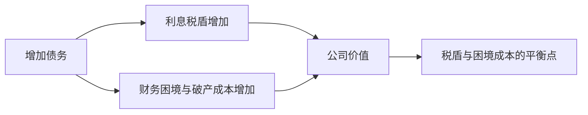

## 资本结构

## 财务杠杆

**财务杠杆**（financial leverage）是负债率的另一称呼。债务成本固定：无论景气与否，公司都要支付固定利息，EBIT 波动被固定利息放大后全部落在股东身上——经济好时股东分得更多（ROE 从 15% 升至 19.7%），经济差时更差（从 5% 降至 3%）。

同一项目不同资本结构下股东回报率不同，资本结构由股东决定，所以资本结构重要。

## MM 理论

**MM 理论**（Modigliani-Miller theorem）是资本结构领域最经典的理论。

**无税情形 Proposition I**：$V_L = V_U$，资本结构无关，公司价值不随杠杆变化。公司价值 = 未来自由现金流现值，由实体经营决定，与资金来源无关；贴现率（WACC）也不随资本结构变化。逻辑支撑是**自制杠杆**（homemade leverage）：公司不杠杆，投资人可借钱买股票自行加杠杆；公司杠杆太高，投资人可把钱存银行对冲。

**无税情形 Proposition II**：股东要求回报率随债务权益比上升而上升：

$$R_S = R_0 + \frac{B}{S}(R_0 - R_B)$$

R₀ 为零负债时股东要求的回报率，R_B 为债务成本；因股东风险高于债权人，R₀ > R_B，B/S 上升推高 R_S。

**有税情形 Proposition I**：$V_L = V_U + T_C B$，公司价值随债务增加而上升。来源是**利息税盾**（interest tax shield）：每年利息支出税前扣除少交税 $B \cdot R_B \cdot T_C$，公司永续存在时现值 = $B \cdot T_C$，前提是永续经营。

**有税情形 Proposition II**：$R_S = R_0 + \frac{B}{S}(1-T_C)(R_0 - R_B)$，股东要求回报率仍随杠杆上升，斜率比无税时小；WACC 随杠杆率上升而下降。

饼图理解：公司实体经营创造的现金流是一块固定大小的饼，分给股东、债权人、政府（税）；债务越多，税越小，股东与债权人的份额越大。

## 权衡理论

**权衡理论**（trade-off theory）考虑债务的好处（税盾）与坏处（破产成本），公司价值与债务量不再单调递增。

最优资本结构是在边际税盾收益与边际财务困境成本相等附近取得，而不是无限增加杠杆。

边际税盾恒为税率 T_C：每多 1 元债务省税现值 T_C。边际破产成本随债务量递增：债务少时破产可能性低，税盾主导；债务多时破产成本成为主要考量。存在**最优债务量** B*，价值曲线先升后降，B* 处价值最大、WACC 最低。

**财务困境成本**分两类：直接成本是破产过程中的律师费、会计师费与行政费用；间接成本是濒临破产时客户流失、销售与利润受损，难以量化。破产可能性本身不降低公司价值——两家业务相同、仅杠杆不同的公司，各状态下给投资人的总现金流相同，价值相同；破产时发生破产费用，投资人总现金流下降，公司价值才降低。

## 代理成本与自私策略

公司有债务时股东与债权人利益冲突，财务困境临近时冲突放大。控制权在股东手中，股东倾向采取三种利己策略：

**冒高风险**（风险转移）：股东选择波动大、预期收益反而低的项目。公司债务 100，项目 A 预期 150、项目 B 预期 145；股东层面选 B（预期 70 vs 50），债权人层面预期从 100 降到 75。有限责任使差状态股东价值截断为 0，上行收益全归股东、下行损失由债权人承担。

**投资不足**（债务积压）：正 NPV 项目因收益大部分归债权人、成本全由股东承担而被放弃。一年期项目投入 1000、产生 1700；公司现有债务 4000，股东出 1000 换 900，拒绝投资。债务仅 400 时项目增值全部归股东，股东愿意投资。

**撇脂**：债务到期前把资产变现、大额分红，股东全身而退，债权人颗粒无收；此类行为常违反债券契约。

降低债务成本的两条途径：**保护性条款**（protective covenants）限制公司行为（负面条款限制分红数额、不得抵押资产、不得并购；正面条款要求维持最低营运资本、定期报送财务报表）；**债务合并**减少债权人数量，降低破产协调成本。

## 信号理论与优序融资理论

**信号理论**（signaling theory）：外部投资人把公司的融资行为解读为内部人对未来盈利能力的判断。所有人知道高负债带来破产成本，公司会尽力避免；只有预期未来盈利能力增强时，公司才敢新增债务。leverage-increasing 行为（增发债务、回购股份）是好消息，leverage-decreasing 行为（还债、增发股份）是坏消息。

**第一类代理问题与资本结构**：外部股权融资稀释管理层持股比例，加剧两权分离；债务融资不稀释持股，可缓解第一类代理问题。**自由现金流假说**：账上现金充裕时管理层挥霍便利；多分红、多负债约束管理层浪费。

**优序融资理论**（pecking-order theory）：信息不对称下融资渠道按难易排序：内部融资（留存收益）→ 外部债务融资 → 外部股权融资。内部融资无发行成本、无需解释；债务融资比股权融资容易，银行信息收集能力强；债务借到一定程度后财务风险高，才转向外部股权融资。

优序融资的三个推论：不存在目标或最优负债率；盈利好的公司负债率低；公司偏好保留财务宽松（financial slack）。与权衡理论对比：权衡理论视负债率为目标，融资方式服务于目标；优序融资理论视融资方式为解决资金需求，负债率只是结果。

## 杠杆项目估值的三种方法

**调整净现值法**（adjusted present value, APV）：先算零负债时项目的净现值，再叠加债务的额外影响（以税盾为主）：

$$APV = NPV_0 + T_C \times B$$

**权益现金流法**（flow to equity, FTE）：初始投资用股东实际掏出的钱（总初始投资减借入金额），现金流用扣掉利息后的杠杆现金流，贴现率用随杠杆上升的权益要求回报率 R_S。**加权平均资本成本法**（WACC）：现金流用无杠杆现金流，贴现率用 R_WACC。

P. B. Singer 项目：税后 UCF = 92,400，初始投资 475,000，零负债成本 R₀ = 20%，零杠杆 NPV = −13,000，纯股权融资时项目被拒绝。改用 25% 债务/价值比融资：APV = −13,000 + 0.34 × 126,229.50 = 29,918；FTE 法：R_S = 20% + (1/3) × (1 − 34%) × (20% − 10%) = 22.2%，NPV = 84,068.85/0.222 − 348,770.50 = 29,918；WACC 法：R_WACC = (3/4) × 22.2% + (1/4) × 10% × (1 − 34%) = 18.3%，NPV = 92400/0.183 − 475,000 = 29,918。

三法一致的原因：债权人相关现金流的 NPV = 0（借 100、利率 10%、一年还 110：110/1.1 − 100 = 0），把债权人现金流并入或剔出都不改变项目价值。适用条件：目标债务/价值比固定时用 WACC 或 FTE，债务绝对额已知时用 APV。
