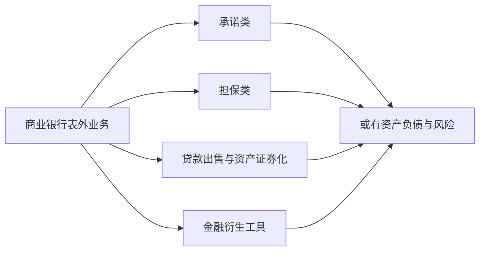

## 商业银行中间业务与表外业务

## 中间业务概述

**中间业务（intermediary business）**：商业银行不运用或不直接运用自己的资金，不占用或不直接占用客户的资金，以中间人的身份替客户代理收付和其他委托事项，提供各类金融服务并收取手续费的业务。传统中间业务加上表外业务即为广义的中间业务。手续费及佣金净收入是非利息收入的核心构成。

### 发展原因

中间业务迅速发展的原因有四：公众对商业银行多样化的需求（结算、理财、避险、财富传承）；同业竞争加剧——金融科技公司抢占支付结算场景，净息差收窄倒逼银行靠服务与中间业务赚钱；资本充足率监管加强——中间业务基本不占用资本；经营风险增加需要收入多元化。

### 分类、特征与趋势

三种分类口径。按功能与形式：结算类、担保型（银行承兑汇票、备用信用证、保函）、融资型（信托、租赁、代理融通）、管理型（保管箱、代客理财、债券承销）、衍生金融工具类及其他。按巴塞尔委员会口径：各种担保；贷款或投资的承诺业务；创新金融工具；其他中介服务。按风险口径：金融服务类与表外业务。

四特征：不运用或不直接运用自己的资金；以接受委托的方式开展业务；以收取手续费的形式获取收益；风险程度低于信用业务。

四趋势：向垫付资金转变——信用证、承兑、保函垫款后成为银行不良资产；向占用客户资金转变——结算资金沉淀形成低成本存款；向出售银行信用转变；向承担风险转变——表外担保、承诺类业务的或有负债上升。

## 主要中间业务

### 租赁业务

**融资性租赁（financial leasing）**：出租人出资购买承租人选定的设备并按协议出租使用，兼具融资与融物双重属性，是租赁业的主要形式。融物指出租人依法取得租赁物所有权，承租人违约时出租人可取回租赁物。

**经营性租赁（operating leasing）**：又称服务性租赁、维修租赁，侧重短期、临时使用与出租方附带的维修等服务。

### 结算业务

结算工具三大类：**汇票（bill of exchange）**——出票人签发、委托付款人在指定日期无条件支付确定金额的票据，分商业汇票和银行汇票；**本票（promissory note）**——出票人签发、承诺自己在见票时无条件支付确定金额的票据；**支票（cheque）**——存款人签发、委托开户行在见票时无条件支付确定金额的票据。

结算方式分同城结算与异地结算。异地结算主要采用汇款（电汇、信汇、票汇）、托收（光票托收与跟单托收）和信用证。

### 代理融通与现金管理

**代理融通（factoring）**：又称代收应收账款。商业银行或专业代理融通公司代客户收取应收账款，并向客户提供资金融通，属于应收账款的综合管理业务：代收账款、买方信用调查、债权管理催收及卖方周转性融资。分类：按有无追索权分为权益转让与权益售与；按是否出面收账分为公开代理融通和幕后代理融通。

**现金管理服务（cash management）**：协助大企业客户分析现金流量，确定合理的现金余额，将多余现金用于短期投资，增加企业收益。工作分三方面：恰当地保持流动余额；经济有效地控制应收款和应付款；把多余现金恰当地进行投资。

### 信用卡与财富管理

**信用卡业务**：减少现金流通及其费用支出；推动银行新服务方式发展；提供方便快捷的结算服务；增加银行收入。

**财富管理（asset management）**：内涵为受人之托、代人理财，核心职责包括管理价值和管理风险。商业银行向客户募集资金或接受客户委托，以客户财产保值增值为目的进行投资管理，收取管理费用及业绩报酬，投资人自担风险并获得收益。

财富管理业务不在商业银行资产负债表中体现，本质是表外业务。银行不为客户收益和本金担保，区别于储蓄业务；不使用自有资金，区别于自营证券投资业务。

理财产品分自营类与代销类。自营类按风险收益分为保证收益性、保本浮动型、非保本浮动型产品。截至 2023 年末，全国存续理财产品 3.98 万只，存续规模 26.80 万亿元，理财公司存续规模占全市场的 83.85%。

## 表外业务

表外业务（off-balance-sheet business，OBS）：商业银行从事的、按现行会计准则不计入资产负债表内、不形成现实资产负债、但有可能引起损益变动的业务，又称或然承诺、或然负债、或然合约。

表外业务不立即形成表内资产负债，但承诺、担保和衍生品在事件触发时可能转化为真实风险敞口。

### 四大类别

**承诺类**：贷款承诺——银行承诺在一定时期内按约定条件发放贷款并收取承诺费，分可撤销承诺（信用额度、信用透支）与不可撤销承诺（回购协议、票据发行便利、备用信用额度、循环信用额度）。**票据发行便利（NIF）**中银行承诺承购企业未能售出的短期票据，协议期限一般 5~7 年，所发票据期限 3-6 个月。

**担保类**：保函（投标保函金额通常为报价总额的 1%~5%）、商业信用证、备用信用证、银行承兑汇票。备用信用证一经开立即构成银行的支付承诺，债务具有第一性；保函项下担保债务具有第二性。

**贷款出售类**：银行把已发放的贷款出售给投资者，按有无追索权分类。**资产证券化**把流动性较差但可产生可预见现金流的资产汇集起来，以此为基础发行证券出售给投资者，通常引入信用增级手段提升证券等级。2008 年次贷危机是住房抵押贷款证券化链条过度扩张、底层资产质量恶化的结果。

**金融衍生工具类**：远期、期货、掉期（互换）、期权。

### 衍生工具与风险管理

**远期合约（forward contract）**：锁定未来交割汇率或利率，到期无论市价如何都必须履约。**远期利率协议（FRA）**：双方约定协议利率与参照利率，到期只按利差贴现结算，只约定名义本金额而不交换本金。

**互换（swap）**：分利率互换与货币互换，核心逻辑是利用双方比较优势分别融资再交换利息流，共同分享节省的利差。固定利差 1.5%、浮动利差 0.5% 时，利率互换总收益 1%，两家公司各得 0.5%。

**金融期货（financial futures）**：交易所内集中交易的标准化合约，实行保证金制度。**期权（option）**：买方支付期权费后获得是否行权的权利，分看涨期权与看跌期权、美式期权与欧式期权。

表外业务特点：方式灵活；成本低、杠杆效应强；透明度低；隐含风险多，包括信用风险、市场风险、流动性风险、国家风险、结算风险、经营风险与信息风险。

宏观管理五条：统一信息披露标准；规范会计标准；加强国际衍生品信息监管；落实资本充足规定；完善清算、结算与支付系统。微观管理四条：严格准入，选择高资信交易对手；健全内部规章制度；建立流动性与风险控制系统；坚持成本收益管理。
