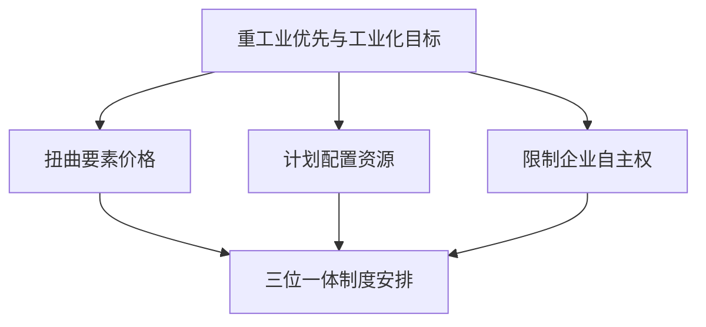

## 重工业优先发展战略

1949-1978 年，中国实施重工业优先发展战略（赶超战略）。这一战略及其内生的制度安排，可从目标函数与约束条件的理性选择来理解：革命时期与苏联目标相同而约束不同，故路径不同；建国后与苏联目标相同、约束也大致相同，故路径大致相同。学习苏联在当时是约束条件下的理性选择。

## 赶超战略的目标函数

**赶超战略**：迅速实现国家的工业化和现代化，并在经济上实现对发达国家的赶超。

确立赶超战略有三方面原因。其一，苏联经验的榜样作用：1930 年代西方深陷经济危机，苏联却靠快速农业集体化、工业国有化、计划经济实现快速工业化。其二，国际环境的封锁禁运：巴黎统筹委员会对社会主义国家封锁禁运，倒逼中国开发国内市场、整合国内资源，建立独立自主的完整工业体系。其三，党的执政目标与民族复兴理想。

优先发展重工业是二战后新独立发展中国家的普遍选择。受依附理论影响，边缘国认为出口自然资源、进口机械制造品遭受价格剪刀差剥削，因此普遍转向进口替代战略，自己生产原本要进口的工业品与机器设备，建立独立完整的工业体系，这就必然要求优先发展重工业。

## 约束条件：重工业特点与要素禀赋

重工业建设有三个特点：建设周期长、资金周转慢；关键的机器设备仍需进口，即使苏联援建的 156 项工程也只是项目援助，需要外汇；巨大的一次性投资，远高于轻工业。

建国初期的条件与此相反。剩余少且大多集中在农业部门，资金昂贵；可供出口产品少、外汇少，不利进口；资金分散在广阔农村，难以动员集中。

**要素禀赋结构**：资本、劳动、土地、自然资源、人力资本、技术等生产要素的相对丰裕程度，决定要素相对价格。中国当时资本稀缺、劳动丰裕，市场均衡下工资与资本价格之比偏低，企业会多用劳动、少用资本；而重工业是资本密集型产业，需要相反的组合。纯市场条件下大规模重工业项目不盈利，必须由政府干预。

## 三位一体的制度安排

林毅夫、蔡昉、李周（1994）《中国的奇迹》指出，重工业优先的目标函数与资本稀缺且分散的农业经济这一约束条件，内生推导出三位一体的制度安排。

在资本稀缺、资源分散的约束下，重工业优先战略通过价格、计划和企业控制三条渠道组织剩余与投资。

宏观上扭曲价格信号。压低资金、劳动力、原材料价格以压低要素成本：压低银行利率、人为高估本币汇率、压低工资与粮食等生活必需品价格；抬高产品价格与利润，给予已建成企业垄断地位。

行政上计划配置资源。价格被压至低于市场均衡价必然出现短缺，短缺的解决方式有排队、黑市、配给。中国选择中央计划式的配给，典型体现为票证制度：粮票、布票、豆腐票、结婚家具购买证。

微观上剥夺企业自主权。若企业自主决策，企业家会依据利润最大化把资金投向高利润的轻工业，故须剥夺企业自主权：公私合营把私营企业收归国有，政府掌握投资方向与对剩余的支配权；剥夺厂长、经理的自主权，"人、财、物，产、供、销"全部掌握在政府手中。原因在于垄断企业缺乏同行业竞争者作为参照，无法识别经理人的努力程度，道德风险严重。

## 农产品统购统销

1953 年农村开始实施统购统销。工业化要求压低农产品价格，把农村剩余转移到城市。压低收购价、抬高工业品价，人为制造工农业价格剪刀差，一买一卖之间资金从农村流向城市。

1953 年之前，共产党号召卖什么农民就抢先卖什么；1953 年后农民突然不愿把农产品卖给政府。原因在于社会主义改造尚未完成，民营企业按市场价收购粮食与棉花，理性农民自然卖给价高者。政府只能强制规定：农民须先交售满足政府购买任务的粮食与棉花，剩余产品才能卖给农贸市场。政策很快从粮食棉花扩大到所有农产品。

## 地区性粮食自给与城乡户籍

计划经济时期各省粮食必须自给自足。粮食价格被人为压低后，余粮省卖粮越多、交税越多；缺粮省调入越多、补贴越多。余粮省失去多产粮的积极性，缺粮省也不愿自己种，形成地区性粮食自给自足。该政策影响延续至今，关联国家的粮食安全与 18 亿亩耕地红线。

**户籍制度**：城乡隔绝、限制人口流动的户口登记与管理制度。重工业创造的就业岗位少，存在工农业剪刀差时，政府须限制农村人口向城市流动，以保护城市部门的"铁饭碗"和全方位企业办社会。农村承担剩余劳动力缓冲的"蓄水池"功能。1959 年后户籍管理严格，出县需公社盖章的介绍信。顶班制度（父母退休后子女顶替编制上岗）扭曲了子女积累人力资本的激励。

## 农业合作化运动

统购统销后农民种粮积极性下降，而工业化对粮食的需求持续增长。提高收购价违背压低原材料价格的初衷，增加基础设施投入又须优先保证工业，于是转向发挥规模经济：提高牲畜与农具的使用效率、推进农田水利和基础设施建设、增强抗风险能力、统一安排周期性农业生产、促进专业化分工。1952 年东北华北 40 个农业社抽样调查显示，合作社平均亩产超过互助组 16.4%、超过单干户 39.2%。

合作化组织逐步演进：1953-1954 年互助组，1954 年初级合作社（按生产资料分红加按劳分配），1956-1957 年高级合作社（生产资料转为集体所有，农民不再具有对农业剩余的支配权），1958 年人民公社（约 5000 家户，实行公共食堂）。1959-1961 年农业危机中，自然灾害、管理不当、规模过大导致激励下降等解释均不充分。**退出权假说**（林毅夫 1990）：农业合作化的优势在规模经济、缺点在劳动难以监督；有退出权时，个人可通过退出对搭便车者形成有效威胁，重复博弈解决个人理性与集体理性的矛盾。1958 年人民公社章程取消"入社自愿、退社自由"，退出权丧失，博弈退化为单次博弈，投入激励瓦解。1962 年后生产单位恢复为生产队。

## 传统体制的绩效与历史遗产

传统体制实现有效的剩余动员与高水平资本积累：资本积累率长期保持在 20%-30%，远超罗斯托经济起飞所需的 7%。基本建设投资中重工业占比始终居前。

传统体制为改革开放奠定基础：完整的国民经济工业门类与独立的装备制造能力；大规模基础原材料工业能力；大批工业技术人才与产业工人；改善全国工业布局（三线建设）；群众健康与教育水平快速提升（人均预期寿命从 1949 年的 35 岁提高到 1978 年的 67 岁，被称为"健康奇迹"）；以"两弹一星"为代表的国防科技成就。

传统体制也有明显局限：人民生活水平提高幅度有限，1978 年人均 GDP 约为撒哈拉以南非洲的三分之一；就业结构失衡；要素配置效率低；劳动者生产积极性未充分发挥。工业化还有一个社会代价：个体的原子化，个体脱离传统社会网络。

价格机制失灵后，国家采用榜样与精神激励替代物质激励：工业学大庆、农业学大寨、学雷锋。精神激励无法覆盖所有人，搭便车者大有人在。

计划经济的理想运行条件难以在一国经济范围内完全满足：微观主体的国有化改造、强大的统计机关、处理大数据的能力、计划者对经济规律的宏观把握、各方行动一致。中国事实上实行有弹性的计划经济——集中计划中保留分散性与灵活性，允许自由市场在一定程度、一定区域内存在，指令性计划与指导性计划结合。

哈耶克与兰格之争围绕计划经济的信息问题展开。哈耶克（奥地利学派）认为价格机制是信息传递机制，中央计划者无法及时完整地掌握信息；竞争既是配置机制也是发现机制，企业家居核心。兰格主张社会主义利用价格机制，由国家模拟市场、中央定价加试错调整，保留价格核算、掌握投资方向。苏联解体、中国转向市场经济看似哈耶克赢了；从生产关系与生产力相适应的角度理解，计划经济到 1978 年难以为继，根源或在于其与当时的生产力水平不相匹配；若未来生产力进一步发展、技术充分进步，某种程度的计划经济也许重获生机。
