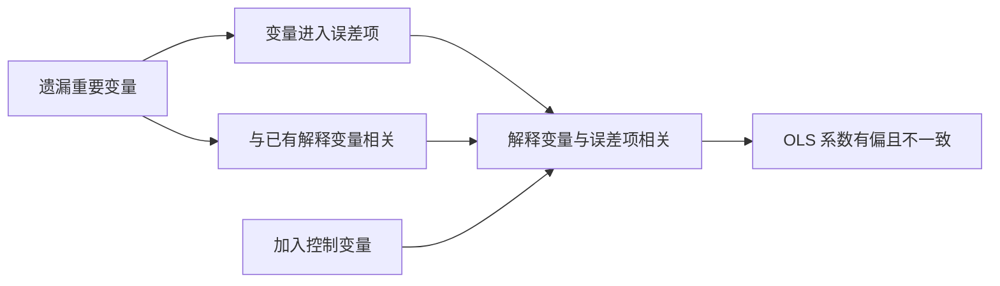

## 多元线性回归

## 从简单回归到多元回归

**遗漏变量偏差（omitted variable bias）**：简单回归把相关解释变量并入误差项，误差项与解释变量相关，违反外生性假设，OLS 估计量有偏。工资方程 $wage=\beta_0+\beta_1educ+u$ 中，工作经验被并入误差项；工作经验既影响工资又与受教育年限相关，导致教育系数估计偏离真实效应。把工作经验显式加入模型，$wage=\beta_0+\beta_1educ+\beta_2exper+u$，工作经验成为控制变量，$\beta_1$ 的含义变为在保持工作经验不变的条件下受教育年限每增加 1 年期望工资的变化量。凡同时影响被解释变量且与已有解释变量相关的因素都应纳入模型。

控制变量的作用是把与核心解释变量相关、且同时影响结果的因素显式纳入模型，减少遗漏变量偏差。

**遗漏变量偏差（omitted variable bias）**：简单回归把相关解释变量并入误差项，误差项与解释变量相关，违反外生性假设，OLS 估计量有偏。工资方程 $wage=\beta_0+\beta_1educ+u$ 中，工作经验被并入误差项；工作经验既影响工资又与受教育年限相关，导致教育系数估计偏离真实效应。把工作经验显式加入模型，$wage=\beta_0+\beta_1educ+\beta_2exper+u$，工作经验成为控制变量，$\beta_1$ 的含义变为在保持工作经验不变的条件下受教育年限每增加 1 年期望工资的变化量。凡同时影响被解释变量且与已有解释变量相关的因素都应纳入模型。

## 模型形式与矩阵表达

**多元线性回归模型的一般形式**：$Y=\beta_0+\beta_1X_1+\beta_2X_2+\cdots+\beta_kX_k+u$。$\beta_0$ 为截距项，所有解释变量取零时 Y 的均值；$\beta_1\sim\beta_k$ 为斜率参数，统称偏回归系数，表示在其他解释变量保持不变的条件下 $X_j$ 每变化 1 个单位引起 E(Y) 的变化量；u 为扰动项。

矩阵表达：$\mathbf{Y}=\mathbf{X}\boldsymbol{\beta}+\mathbf{u}$，Y 为 $n\times1$，X 为 $n\times(k+1)$（第一列全为 1），$\boldsymbol\beta$ 为 $(k+1)\times1$，u 为 $n\times1$。样本回归模型 $\mathbf{Y}=\mathbf{X}\hat{\boldsymbol\beta}+\hat{\mathbf{u}}$，残差 $\hat{\mathbf{u}}=\mathbf{Y}-\mathbf{X}\hat{\boldsymbol\beta}$。

## 基本假设

六条假设合并为五条。假设 1 模型正确设定；假设 2 解释变量具有变异性且无完全多重共线性，各解释变量之间不存在严格线性关系，矩阵形式 $\operatorname{rank}(\mathbf{X})=k+1$ 且 $\operatorname{plim}\mathbf{X'X}/n=Q$；假设 3 条件零均值 $E(\mathbf{u}|\mathbf{X})=0$，即严格外生性；假设 4 同方差与无自相关，写成 $\operatorname{var}(\mathbf{u}|\mathbf{X})=\sigma^2\mathbf{I}_n$；假设 5 正态性 $\mathbf{u}|\mathbf{X}\sim N(0,\sigma^2\mathbf{I}_n)$。

## OLS 估计

选择 $\hat\beta_0,\hat\beta_1,\dots,\hat\beta_k$ 使残差平方和 $\mathrm{SSR}=\hat{\mathbf{u}}'\hat{\mathbf{u}}$ 最小。一阶条件为正规方程组

$$\sum_{i=1}^{n}\hat u_i=0,\qquad \sum_{i=1}^{n}X_{ji}\hat u_i=0,\quad j=1,2,\dots,k$$

经济含义：残差之和为零，每个解释变量都与残差正交。由向量微分规则得正规方程组 $\mathbf{X'X}\hat{\boldsymbol\beta}=\mathbf{X'Y}$，满秩假定下唯一解

$$\hat{\boldsymbol\beta}=(\mathbf{X'X})^{-1}\mathbf{X'Y}$$

**两步估计（剔除法）**：第 j 个斜率系数 $\hat\beta_j=\dfrac{\sum\tilde X_{ji}Y_i}{\sum\tilde X_{ji}^2}$，其中 $\tilde X_{ji}$ 是 $X_j$ 对所有其他解释变量做 OLS 回归后的残差。第一步把 $X_j$ 对其余解释变量回归并保存残差，第二步让 Y 对残差做一元回归；先剔除其他解释变量对 $X_j$ 的影响，再用纯化后的 $X_j$ 变动解释 Y，等价于在控制其余变量的条件下度量 $X_j$ 的效应。

**离差形式**：利用 $\sum\hat u_i=0$ 与样本回归线过均值点，定义 $y_i=Y_i-\bar Y$、$x_{ji}=X_{ji}-\bar X_j$，模型改写为 $y_i=\hat\beta_1x_{1i}+\cdots+\hat\beta_kx_{ki}+\hat u_i$，矩阵形式 $\mathbf{y}=\mathbf{x}\hat{\boldsymbol\beta}+\hat{\mathbf{u}}$；截距单独恢复为 $\hat\beta_0=\bar Y-\hat\beta_1\bar X_1-\cdots-\hat\beta_k\bar X_k$。

**误差方差的无偏估计**

$$\hat\sigma^2=\frac{\hat{\mathbf{u}}'\hat{\mathbf{u}}}{n-k-1}=\frac{\sum\hat u_i^2}{n-k-1}$$

自由度损失来自估计了 k+1 个参数。无偏性证明用幂等矩阵 $M=\mathbf{I}_n-\mathbf{X}(\mathbf{X'X})^{-1}\mathbf{X}'$：$M'M=M$、$M\mathbf{X}=0$，残差 $\hat{\mathbf{u}}=M\mathbf{u}$，由矩阵的迹推得 $E(\hat{\mathbf{u}}'\hat{\mathbf{u}})=\sigma^2(n-k-1)$。

## 矩估计与极大似然估计

**矩估计（MM）**：矩即期望，一阶矩为 $E(Y)$、二阶矩为 $E(Y^2)$。原理是先根据理论写出总体矩条件，再用样本矩替代总体矩，解出参数。多元回归的总体矩条件来自外生性 $E(\mathbf{X}_i'u_i)=0$；对应样本矩条件 $(1/n)\mathbf{X}'(\mathbf{Y}-\mathbf{X}\hat{\boldsymbol\beta}_{MM})=0$，展开即 $\mathbf{X'X}\hat{\boldsymbol\beta}=\mathbf{X'Y}$，系数估计结果与 OLS 完全相同。

**极大似然估计（MLE）**：让"抽一次就抽到这份样本"的联合概率密度最大的那组参数最合理。假设 $u_i\sim N(0,\sigma^2)$，对数似然函数对 β、σ² 分别求导解出估计量。系数 $\hat{\boldsymbol\beta}_{ML}=(\mathbf{X'X})^{-1}\mathbf{X'Y}$ 与 OLS、矩估计相同；误差方差 $\hat\sigma^2_{ML}=\sum\hat u_i^2/n$，除以 n、不做自由度调整。差异仅在于是否做自由度调整；分布假设改变时（如泊松、二项）最终估计结果不同。

## 拟合优度与模型选择指标

SST、SSE、SSR 与 R² 的定义与一元回归相同，$R^2=\mathrm{SSE}/\mathrm{SST}=1-\mathrm{SSR}/\mathrm{SST}$。用 R² 比较模型有两点注意：因变量必须相同，$\ln Y$ 与 $Y$ 的 SST 量级不同、R² 不可比；增加解释变量必然使 R² 单调不减。

**调整的可决系数** $\bar R^2=1-\dfrac{\mathrm{SSR}/(n-k-1)}{\mathrm{SST}/(n-1)}$，把 SSR 与 SST 分别除以各自自由度。加变量时 SSR 变小推动其变大、k 增大推动其变小，方向相反，故未必随变量增加而增大。

**赤池信息准则 AIC**：对数形式 $\mathrm{AIC}=\dfrac{2(k+1)}{n}+\ln\left(\dfrac{\mathrm{SSR}}{n}\right)$，越小越好，加变量使 SSR 变小但惩罚项增大，防止无限制加变量。**贝叶斯信息准则 BIC**：$\mathrm{BIC}=\dfrac{k+1}{n}\ln(n)+\ln\left(\dfrac{\mathrm{SSR}}{n}\right)$，越小越好，惩罚随 k 增长更快。

**样本容量**：待估系数共 k+1 个，最小样本容量 $n\ge k+1$；满足基本要求的经验标准 $n\ge k+8$ 或 $n\ge30$ 或 $n\ge3(k+1)$。

## OLS 估计量的统计性质

**小样本性质**：线性，$\hat{\boldsymbol\beta}=(\mathbf{X'X})^{-1}\mathbf{X'Y}$ 是 Y 的线性组合；无偏，$E(\hat{\boldsymbol\beta}|\mathbf{X})=\boldsymbol\beta$，当且仅当严格外生性成立；有效性，满足基本假定时 OLS 是 BLUE，方差-协方差矩阵 $\operatorname{Var}(\hat{\boldsymbol\beta}|\mathbf{X})=\sigma^2(\mathbf{X'X})^{-1}$。方差最小性证明：任取线性无偏估计量 $b=CY$，其方差等于 $\sigma^2(\mathbf{X'X})^{-1}+\sigma^2DD'$，其中 $DD'$ 非负定。

**大样本性质**：一致性 $\operatorname{plim}\hat{\boldsymbol\beta}=\boldsymbol\beta$，由外生性保证；渐近有效性，样本容量增大时方差渐近最小。严格外生性满足时 OLS 既无偏又方差最小，应优先使用。

## t 检验、P 值与置信区间

单个参数显著性检验与一元回归一致。t 统计量

$$t=\frac{\hat\beta_j}{se(\hat\beta_j)}\sim t(n-k-1)$$

自由度 $n-k-1$，写错会导致临界值查错。双侧检验 $H_0:\beta_j=0$ vs $H_1:\beta_j\neq0$，$|t|>t_{\alpha/2}$ 拒绝；单侧检验 $H_1:\beta_j>0$ 时 $t>t_\alpha$ 拒绝，$H_1:\beta_j<0$ 时 $t<-t_\alpha$ 拒绝；检验具体值 $H_0:\beta_j=a_j$ 时分子为 $\hat\beta_j-a_j$。P 值双侧 $p=P(|T|>|t|)$，单侧取双侧的一半。置信区间 $\hat\beta_j\pm t_{\alpha/2}\,se(\hat\beta_j)$。

算例：α=5%、df=25、临界值 2.06，$\hat\beta_j=0.015$、$se=0.011$，$t\approx1.36$，不能拒绝，系数不显著；$\hat\beta_j=-0.083$、$se=0.026$，$t\approx-3.19$，落入左尾拒绝域，系数显著。

## F 联合检验

检验涉及多个约束、多个系数时，t 检验无法处理，改用 F 检验。

**无约束回归**为原模型；**受约束回归**把约束代入原模型消去多余参数。约束 $\beta_1+\beta_2=1$ 与 $\beta_{k-1}=\beta_k$ 时原模型改写为 $Y-X_2=\beta_0+\beta_1(X_1-X_2)+\cdots+u$。受约束模型的残差平方和不小于无约束模型，因为约束缩小了 β 的可行范围。

**F 统计量**（q 为约束个数）

$$F=\frac{(\mathrm{SSR}_R-\mathrm{SSR}_{UR})/q}{\mathrm{SSR}_{UR}/(n-k-1)}\sim F(q,\,n-k-1)$$

F 值只可能为正、分布不对称，拒绝域只在右尾，$F>F_\alpha(q,n-k-1)$ 时拒绝原假设。

**应用一：增加或减少解释变量**。检验 $H_0:\beta_1=\cdots=\beta_q=0$，受约束模型为去掉这 q 个变量的回归。不能做 q 次独立 t 检验代替：多个 t 检验的联合犯第一类错误概率远大于单个 α，且估计量之间相关、信息有重叠。

**应用二：方程整体显著性检验**。$H_0:\beta_1=\cdots=\beta_k=0$（不含截距），受约束模型只剩截距，此时 $\mathrm{SSR}_R=\mathrm{SST}$，F 统计量化为

$$F=\frac{\mathrm{SSE}_{UR}/k}{\mathrm{SSR}_{UR}/(n-k-1)}=\frac{R^2/k}{(1-R^2)/(n-k-1)}\sim F(k,\,n-k-1)$$

**一元回归中 F 与 t 等价：F = t²**。一元模型两检验的原假设同为 $H_0:\beta_1=0$，$F=[\hat\beta_1/se(\hat\beta_1)]^2=t^2$；自由度为 1 的 F 分布就是 t 分布平方。

**F 检验的 R² 形式**：$F=\dfrac{(R^2_{UR}-R^2_R)/q}{(1-R^2_{UR})/(n-k-1)}$，前提是两模型因变量相同。方程显著性检验中 $R^2_R=0$。由 $\bar R^2=1-\dfrac{n-1}{n-k-1+kF}$ 知 F 与调整 R² 同向变化。

两年制与四年制大学教育回报案例（N=6763）：$\log(wage)=\beta_0+\beta_1jc+\beta_2univ+\beta_3exper+u$，检验 $H_0:\beta_1-\beta_2=0$。无约束回归 $\mathrm{SSR}_{UR}=1250.54$，受约束模型 $\log(wage)=\beta_0+\beta_1(jc+univ)+\beta_3exper+u$ 的 $\mathrm{SSR}_R\approx1250.94$，$F=\dfrac{(1250.94-1250.54)/1}{1250.54/6759}\approx2.15<F_{0.05}(1,6759)=3.84$，不能拒绝，两年制与四年制大学教育回报无显著差异。

## 邹至庄稳定性检验

**邹至庄检验（Chow test）**考察不同组样本之间的回归函数是否有差异。设两组样本分别有参数 $\beta$ 与 $\alpha$，无约束模型为两组分别估计，$\mathrm{SSR}_{UR}=\mathrm{SSR}_1+\mathrm{SSR}_2$；原假设 $H_0:\boldsymbol\beta=\boldsymbol\alpha$ 约有 $k+1$ 个约束，受约束模型为合并样本回归。检验统计量

$$F=\frac{\left[\mathrm{SSR}_R-(\mathrm{SSR}_1+\mathrm{SSR}_2)\right]/(k+1)}{(\mathrm{SSR}_1+\mathrm{SSR}_2)/[n_1+n_2-2(k+1)]}\sim F(k+1,\,n_1+n_2-2(k+1))$$

农村与城市居民消费函数案例：农村回归 $\mathrm{SSR}_1=12{,}918{,}881$、城市回归 $\mathrm{SSR}_2=36{,}549{,}482$、合并回归 $\mathrm{SSR}_R=55{,}933{,}406$，$F\approx2.45<F_{0.05}(3,56)=2.77$，不拒绝原假设，城乡居民消费函数无显著差异。

## 函数形式

**自然对数形式**四种。level-level 模型 $Y=\beta_0+\beta_1X+u$，X 增 1 单位 Y 增 $\beta_1$ 单位；level-log 模型 $Y=\beta_0+\beta_1\log X+u$，X 增 1% Y 增 $\beta_1/100$ 单位；log-level 模型 $\log Y=\beta_0+\beta_1X+u$，X 增 1 单位 Y 变 $100\beta_1\%$；log-log 模型 $\log Y=\beta_0+\beta_1\log X+u$，X 增 1% Y 变 $\beta_1\%$，即弹性。

取对数的经验法则：严格为正的货币量（工资、销售额）、大的正整数（人口）取对数；年度量变量（受教育年限、工作经历）、比例变量（失业率、通胀率）通常不取对数；非负但可取 0 的变量用 $\log(1+Y)$ 变换。取对数使 $\log Y$ 更接近经典假设，缩小取值范围、对异常值不敏感。

住房价格与空气污染案例：$\widehat{\log(price)}=9.23-0.718\log(nox)+0.306\,rooms$。$\log(nox)$ 系数 -0.718 是弹性，nox 增加 1% 时 price 下降 0.718%；rooms 系数 0.306 是 log-level，每增加 1 个房间房价提高 30.6%，两类系数解释须分形式。

**平方项** $Y=\beta_0+\beta_1X+\beta_2X^2+u$：$\dfrac{dY}{dX}=\beta_1+2\beta_2X$，X 对 Y 的边际影响随 X 变动；$\beta_2<0$ 时呈倒 U 型。不能把 $\beta_2$ 解释成"保持 X 不变时 $X^2$ 的影响"，因为 $X^2$ 变化时 X 必然变化。拐点处 $X^*=-\beta_1/(2\beta_2)$。工作经验-工资案例 $\widehat{wage}=3.7254+0.2981\,exper-0.0061299\,exper^2$，边际影响先增后减，转折点约 24.3 年。

**交叉项** $Y=\beta_0+\beta_1X_1+\beta_2X_2+\beta_3X_1X_2+u$：$X_1$ 的偏效应 $\dfrac{\partial Y}{\partial X_1}=\beta_1+\beta_3X_2$ 取决于 $X_2$ 的大小，解释时须把交叉项算入。

## 预测

给定样本外解释变量取值 $\mathbf{X}_0=[1,X_{10},\dots,X_{k0}]$，预测值 $\hat y_0=\mathbf{X}_0\hat{\boldsymbol\beta}$。总体均值 $E(Y_0)$ 的置信区间

$$\hat y_0\pm t_{\alpha/2}\,\hat\sigma\sqrt{\mathbf{X}_0(\mathbf{X'X})^{-1}\mathbf{X}_0'}$$

个别值 $Y_0$ 的置信区间

$$\hat y_0\pm t_{\alpha/2}\,\hat\sigma\sqrt{1+\mathbf{X}_0(\mathbf{X'X})^{-1}\mathbf{X}_0'}$$

个别值区间总比均值区间宽，多出的 1 来自个体扰动项的方差。

## 关键算例

2013 年 31 个地区城镇居民消费数据：$\hat y=2599.145+0.4865x_1+0.6017x_2$，$x_1$ 为工资性收入、$x_2$ 为其他收入，标准误分别为 827.342、0.0576、0.1042，$R^2=0.9225$，$F(2,28)=166.55$。控制其他收入后，工资性收入每增加 1 元消费支出平均增加约 0.49 元；控制工资性收入后，其他收入每增加 1 元消费支出平均增加约 0.60 元，其他收入的边际消费倾向更高。
