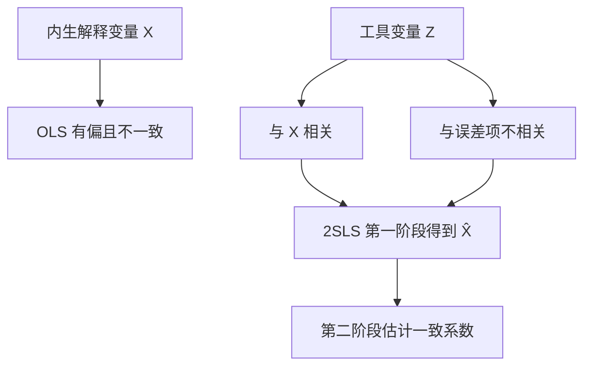

## 内生性与工具变量

## 内生性的定义与两种情形

**外生解释变量**：经典假设 $E(u_i|X_1,\dots,X_k)=0$ 的推论是 $\operatorname{cov}(u_i,X_j)=0$（$j=1,\dots,k$），与误差项不相关的解释变量称外生解释变量。**内生解释变量**：$\operatorname{cov}(u_i,X_j)\neq0$，与误差项相关的解释变量，会导致 OLS 失效。

内生性的两种情形：**同期无关、异期相关**，$\operatorname{cov}(u_i,X_{ij})=0$ 但 $\operatorname{cov}(u_{i-s},X_{ij})\neq0$（$s\neq0$），主要出现在时间序列数据中；**同期相关**，第 i 期误差项与第 i 期解释变量相关，截面数据中遇到的内生性大多属于这类，称同期内生变量。

## 内生性的三大来源

**遗漏重要解释变量**：内生性由两个条件同时满足而触发，一是遗漏了重要解释变量（或数据不可得、无法衡量而被迫遗漏），二是被遗漏变量与模型中其他解释变量相关；只遗漏但与其他解释变量不相关，不会导致内生性。工资方程 $wage=\beta_0+\beta_1educ+\beta_2exper+\beta_3abil+\epsilon$ 中个人能力无法测度，估计时并入误差项 $u=\beta_3abil+\epsilon$，因 $\operatorname{cov}(educ,abil)\neq0$，故 $\operatorname{cov}(educ,u)\neq0$，educ 成为内生变量。

**测量误差**：真实模型 $Y=\beta_0+\beta_1X^*+\epsilon$（$\operatorname{cov}(X^*,\epsilon)=0$），观测到的是 $X=X^*+u$，经典测量误差假定 $\operatorname{cov}(X^*,u)=0$、$\operatorname{cov}(\epsilon,u)=0$。实际估计模型为 $Y=\beta_0+\beta_1X+(\epsilon-\beta_1u)$，$\operatorname{cov}(X,\epsilon-\beta_1u)=-\beta_1\operatorname{Var}(u)\neq0$（$\beta_1\neq0$ 时），测量误差必然导致内生性。

**互为因果（联立因果）**：X 影响 Y，同时 Y 反过来影响 X。X 中含有 Y 的成分、Y 中含有误差项 u，故 X 与 u 同期相关。供给-需求联立方程中，需求方程 $P=\beta_0+\beta_1Q+\beta_2income+\epsilon$ 与供给方程 $Q=\alpha_0+\alpha_1P+\alpha_2labor+u$ 决定均衡量，把供给方程代入需求方程得简约式 $P=\gamma_0+\gamma_1labor+\gamma_2income+\eta$，其中 $\eta=(\beta_1u+\epsilon)/(1-\beta_1\alpha_1)$，P 是误差项 u 的函数，估计供给方程时价格 P 是内生解释变量。

## 内生性的后果：OLS 有偏且不一致

一元回归中 OLS 斜率估计量可写为

$$\hat\beta_1=\beta_1+\frac{\sum_i(x_i-\bar x)u_i}{\sum_i(x_i-\bar x)^2}$$

小样本下给定 X 求误差项期望不为 0，$E(\hat\beta_1|X)\neq\beta_1$，估计量有偏；大样本下 $\operatorname{plim}\hat\beta_1=\beta_1+\operatorname{Cov}(x_i,u_i)/\operatorname{Var}(x_i)\neq\beta_1$，估计量非一致，扩大样本量无法消除偏差。X 与 u 正相关时可能低估截距项、高估斜率项；负相关时方向相反。多元回归中只要有一个解释变量内生，不仅该变量系数有偏，其余所有系数都有偏且不一致。

## 工具变量估计

**工具变量 Z**需同时满足三个条件：工具变量外生性 $\operatorname{cov}(Z,u)=0$，Z 与误差项不相关；工具变量相关性 $\operatorname{cov}(Z,X_j)\neq0$，Z 与内生变量高度相关；Z 与其他解释变量无高度相关性，避免多重共线性。相关性可用数据验证，外生性无法直接验证（误差项不可观测），须依据经济理论与常识论证。

有效工具变量同时提供相关性与外生性，2SLS 用工具变量生成的外生变动替代内生变量的污染部分。

IV 估计量是矩估计的一种形式。总体矩条件 $E(u_i)=0$ 与 $\operatorname{cov}(Z_i,u_i)=E(Z_iu_i)=0$ 对应两个样本矩，联立求解。一元情形

$$\hat\beta_1^{IV}=\frac{\sum(z_i-\bar z)(y_i-\bar y)}{\sum(z_i-\bar z)(x_i-\bar x)},\qquad \hat\beta_0^{IV}=\bar y-\hat\beta_1^{IV}\bar x$$

与 OLS 对比，IV 估计量把分子中的 X 换成 Z，形式上等于把解释变量 X 换成工具变量 Z；等价理解为 $\hat\beta_1^{IV}$ 等于 Y 对 Z 回归的斜率除以 X 对 Z 回归的斜率。多元矩阵 $\hat{\boldsymbol\beta}_{IV}=(\mathbf{Z'X})^{-1}\mathbf{Z'Y}$。

IV 估计量性质：一致但不无偏。$\operatorname{plim}\hat\beta_1^{IV}=\beta_1+\operatorname{cov}(z,u)/\operatorname{cov}(z,x)=\beta_1$，外生性保证分子为 0、相关性保证分母不为 0；小样本下给定 X 求误差项条件期望不为 0，仍是有偏的。

## 两阶段最小二乘

**两阶段最小二乘（2SLS）**一元情形：第一阶段内生变量 X 对工具变量 Z 做 OLS，得拟合值 $\hat X$；第二阶段 Y 对 $\hat X$ 做 OLS，结果与 IV 估计完全相同。一个内生变量、多个工具变量时，IV 法无法直接使用，2SLS 把所有工具变量的信息都用起来：第一阶段内生变量对所有工具变量以及模型中所有其他外生变量做回归，得拟合值，拟合值是外生变量的线性组合、与误差项不相关；第二阶段被解释变量对该拟合值及其余外生变量做回归。

恰好识别（工具变量个数等于内生变量个数）时 2SLS 与 IV 估计量完全等价；过度识别（工具变量更多）时 2SLS 把多个工具变量的信息综合成对第一阶段的最优拟合。手动分两个阶段回归时，第二阶段输出的标准误与 R² 不可用，第二阶段 OLS 忽略了第一阶段估计带来的不确定性，须用软件一次性完成估计。

## Hausman 内生性检验

**Hausman 检验**比较 IV 估计结果与 OLS 估计结果，两者在统计上有显著差异则表明该变量内生。回归版检验分两步：第一步把待检验变量 $Y_2$ 对所有外生解释变量（含原模型中的外生变量以及工具变量）做回归，取出残差 $\hat v$；第二步把 $\hat v$ 加入原模型做 OLS，检验 $\hat v$ 的系数是否等于 0。拒绝 $H_0$ 说明 $Y_2$ 为内生变量；不能拒绝则视为外生。直观解释：$Y_2$ 被分解为外生变量的线性组合与残差 v 两部分，$Y_2$ 是否内生取决于 $\operatorname{cov}(v,u)$ 是否为零。

教育回报数据（N=428）案例：第一步 reg educ motheduc fatheduc exper expersq 取残差 v，第二步 reg lwage educ exper expersq v，v 的系数 0.0582、标准误 0.0348、$t=1.67$、p=0.095。5% 水平下不能拒绝原假设，教育可视为外生变量；10% 水平下则拒绝，认为教育是内生变量，检验结论依赖显著性水平的选择。

## 过度识别约束检验

适用条件：工具变量个数大于内生变量个数。步骤：用 2SLS 估计模型，预测残差 $\hat u$；把 $\hat u$ 对所有外生变量（模型中的外生解释变量加全部工具变量）作辅助回归，得拟合优度 $R^2$；计算 $J=nR^2$，在原假设"所有工具变量均外生"下 $J\sim\chi^2(m)$，自由度 m 为工具变量个数减内生变量个数；J 超过临界值则拒绝，说明部分工具变量与扰动项相关，需要更换工具变量。检验的只是"多余"工具变量的外生性，检验通过只说明样本信息与"全部外生"不矛盾，并不证明外生性成立。

## 弱工具变量

**弱工具变量（weak instrument）**：工具变量与内生解释变量的相关性很弱。经验法则：第一阶段回归中工具变量的联合 F 统计量小于 10，即认为存在弱工具变量。后果：即使样本量很大，2SLS 估计量也严重不一致，估计量方差很大，t 检验与置信区间不可靠，小样本下问题更严重。处理：寻找与内生变量相关性更强的工具变量，或改用对弱工具更稳健的 LIML（有限信息最大似然）估计。

## 应用案例

美国 48 个州 1995 年香烟人均消费数据：模型 $\ln Q=\beta_0+\beta_1\ln Y+\beta_2\ln P+u$，价格由供给与需求同时决定而内生，用州平均消费税 tax 与州特产税 taxs 作工具变量。OLS 得 $\ln P$ 系数 -1.406（$t=-5.60$）；IV（仅用 tax）得 -1.315，2SLS（tax 与 taxs）得 -1.277。改用工具变量后价格弹性的绝对值由 1.41 降到 1.28，OLS 与 IV/2SLS 的差异提示价格内生性对估计有实质影响。过度识别检验 $J=nR^2=48\times0.007=0.336<\chi^2_{0.05}(1)=3.84$，不拒绝原假设，tax 与 taxs 都是外生工具变量。

教育回报 OLS 与 2SLS 结果对比（MROZ.RAW，N=428）：模型 $\log(wage)=\beta_0+\beta_1educ+\beta_2exper+\beta_3expersq+u$，工具变量选母亲受教育年限 motheduc 与父亲受教育年限 fatheduc。OLS 得 educ 系数 0.1075（标准误 0.0141）；2SLS 得 0.0614（标准误 0.0313）。OLS 高估了教育回报、约是 IV 估计的两倍，因为教育是内生变量，OLS 系数不可靠。
