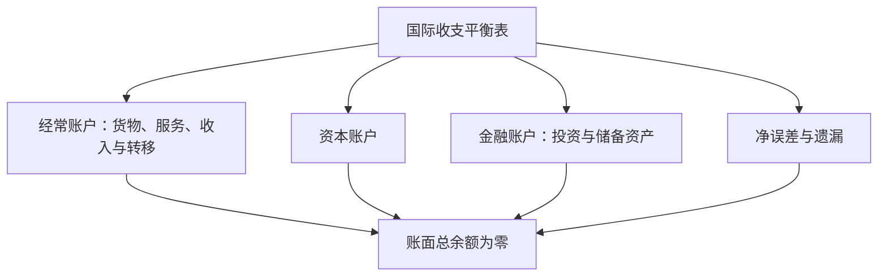

## 国际收支与国际收支平衡表

## 国际收支的定义

**国际收支**：一定时期内一国居民与非居民之间进行的全部经济交易的货币价值记录。国际收支概念经历三阶段演变：古典时期指一国的对外贸易差额；狭义口径以外汇收支为基础；二战以来的广义口径以国际经济交易为基础，包括易货贸易、补偿贸易等不涉及货币收支的交易，以及政府援助、私人赠与等非对等转移。

国际收支有三个解释维度。**一定时期内**：国际收支是事后概念，按会计季度、年度统计；是流量概念，记录一段时期内的发生额。**居民与非居民**：按居住地或注册地认定，与国籍无关。个人在所在国居住满 1 年即为该国居民，出国全日制学习、疾病治疗人员仍属出国前常住地的居民；法人按注册地认定；外交使节、驻外军事人员及其家属是所驻国的非居民；联合国、IMF、世界银行等国际机构是任何国家的非居民。我国口径中居民指内地（大陆）经济单位，不含港澳台。**全部经济交易**：包括商品和劳务与金融资产之间的各种组合交易，非货币性交易折算成货币记录。

## 国际收支平衡表的账户分类

**国际收支平衡表**：按特定账户分类和复式记账原则编制的会计报表，编制依据为 IMF《国际收支和国际投资头寸手册》第六版（BPM6）。

国际收支以复式记账记录居民与非居民交易，经常、资本和金融账户共同描绘对外资源与资产流动。

**经常账户**：记录实际资源在居民与非居民之间的流动，包括货物和服务、初次收入、二次收入。货物进出口均按离岸价（FOB）计价，CIF 中的运费与保险费记入服务；服务含运输、旅行、建设、保险和养老金服务、金融服务、知识产权使用费等 12 项。初次收入包括非居民雇员报酬、投资收益（股本收益与债务收益）及其他初次收入，资本损益记在金融账户下。二次收入又称经常转移，包括个人转移（如汇款）与政府间援助。

**资本和金融账户**：记录资产所有权在居民与非居民之间的流动。资本账户含资本转移与非生产非金融资产的取得和处置；金融账户含直接投资、证券投资、金融衍生工具、其他投资与储备资产。**储备资产**：一国货币当局掌握的、可随时动用的、在国际间被普遍接受的资产，包括货币黄金、特别提款权、在 IMF 的储备头寸与外汇储备。

**净误差与遗漏**：为使平衡表总余额为 0 而人为设置的科目。产生原因是统计数据来源多样、某些交易难以全面记录、数据真实性与准确性存在问题、统计时间和计价标准不一致及货币换算误差。人为的账面平衡不代表国际收支就是平衡的。

## 复式记账法

复式记账法的原则是有借必有贷、借贷必相等。借方为资金的运用，记外汇支出与资本流出，为负号；贷方为资金的来源，记外汇收入与资本流入，为正号。各科目汇总后，正余额为顺差，负余额为逆差。

编制例题：A 国企业出口价值 100 万美元设备，海外银行存款相应增加，借方记其他投资——银行存款 100 万美元，贷方记货物（出口）100 万美元。海外存款增加是对外资产增加，记借方。A 国居民到外国旅游花销 30 万美元，从其海外存款账户扣除，借方记服务——旅行 30 万美元，贷方记其他投资——银行存款 30 万美元。甲国企业海外投资所得利润 150 万美元，收益端整体记贷方初次收入 150 万美元；75 万当地再投资记借方直接投资，50 万购买当地商品运回记借方货物，25 万结售给政府记借方储备资产。

## 国际收支差额分析

由于复式记账，国际收支在会计意义上总是平衡的，不平衡是经济意义上的概念。按交易动机，国际交易分为自主性交易与补偿性交易。**自主性交易**：经济主体因逐利、旅游、赡养亲友等自主目的进行的交易，具有自发性、分散性。**补偿性交易**：货币当局为弥补国际收支不平衡进行的交易，如动用官方储备、借外债，具有被动性、集中性。理论上国际收支差额等于自主性交易差额，但两类交易在统计上难以精确区分。

实际分析用五大差额口径。**贸易收支差额**＝（货物出口＋服务出口）−（货物进口＋服务进口），综合反映一国的产业结构、产品质量、劳动生产率及分工地位。**经常账户差额**＝贸易差额＋初次收入＋二次收入，反映可交易实际资源的增减变化，IMF 以此作为预测经济发展与制定政策的重要依据。**资本和金融账户差额**反映资本输出输入与金融产品跨国交易状况。**基本账户差额**＝经常账户＋长期资本流动，自 BPM5 起不再使用。**综合账户差额**＝经常账户差额＋资本和金融账户差额−储备资产，即通常所说的国际收支盈余或赤字，反映国际收支对储备造成的压力，是判断汇率未来走势的重要依据。嵌套关系：贸易收支差额⊂经常账户差额⊂基本账户差额⊂综合账户差额。

## 分析方法

**静态分析法**：对一国某一时期的平衡表分析，逐一分析各差额的情况、形成原因及其对总差额的影响。**动态分析法**：对若干连续时期的平衡表纵向分析，揭示不同时期国际收支态势间的内在联系。**比较分析法**：将一国平衡表与主要经济大国横向比较，把握本国在世界经济中的地位。

## 不平衡的分类与影响

国际收支不平衡分六类。**临时性不平衡**：临时、程度较轻、持续时间不长、可逆。**周期性不平衡**：由经济周期波动引起，又称循环型不平衡。**结构性不平衡**：通常反映在贸易或经常账户上，由产业结构变动的滞后和困难引起，或由产业结构单一随外来冲击失衡，通常长期且逆转困难。**货币性不平衡**：在一定汇率水平下本国物价和成本高于他国导致失衡，由通货膨胀或通货紧缩引起，又称价格性不平衡。**收入性不平衡**：国民收入较大变动引致。其他因素包括国际债务与短期资本流动。

逆差对就业和经济增长产生负面影响；浮动汇率制下引起本币贬值，固定汇率制下政府为维持汇率稳定动用外汇储备，储备减少可能出现国际偿付困难；调整逆差的政策可能引起经济衰退。顺差会增加外汇储备、提升对外支付能力，但给本币带来升值压力，外汇储备增加使央行被动投放本币产生通货膨胀压力，资本账户开放条件下使本国金融市场受到冲击，并不利于国际经济关系。连续的、巨额的顺差和逆差都会损害本国经济的长期稳定，因此有调节的必要。
