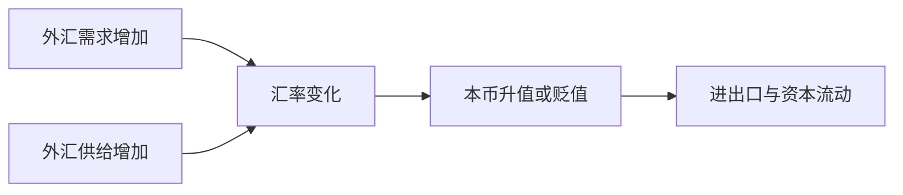

## 外汇与汇率

## 外汇的定义与特征

**外汇**：动态意义指国际汇兑这一活动；静态意义指以外币表示的、可用于国际结算和国际债务清偿的金融资产，实物资产与无形资产不构成外汇。**广义外汇**：IMF 定义为货币当局以银行存款、国库券、长短期政府债券等形式保有的、在国际收支逆差时可以使用的债权。**狭义外汇**：可直接用于国际结算的支付手段，如外币活期存款、汇票、本票、支票，不含外币有价证券。

一种外币成为外汇需要三个前提：**自由兑换**（可自由兑换成其他国家货币或购买其他信用工具进行多边支付）、**普遍接受**（在国际经济往来中被各国普遍接受和使用）、**可偿**（外币资产可保证方便地得到偿付）。可自由兑换货币的代表有美元、欧元、日元、英镑、瑞士法郎、港币、加元、澳元、新加坡元、卢布等。

## 人民币的可兑换性

人民币目前属于有限的或部分的可兑换货币。1996 年 12 月 1 日起，中国接受《国际货币基金组织协定》第八条款，成为第八条款国，基本实现经常账户交易的人民币自由兑换；出国旅游、留学等服务收支与侨汇、捐赠等转移支付仍有限制，个人每年购汇额度为 5 万美元。2016 年 10 月 1 日人民币纳入 SDR 货币篮子，被认定为可自由使用货币，即在国际交易支付中被广泛使用、在主要外汇市场被广泛交易，但离可自由兑换仍有距离。未完全开放兑换的原因是金融市场尚不成熟，加上东南亚金融危机的教训。在岸人民币记作 CNY，离岸人民币记作 CNH。

## 汇率的含义与三种标价法

**汇率**：又称汇价，是一个国家或地区的货币用另一个国家或地区的货币表示的价格，即两国货币的兑换比率或折算比价。

汇率是外汇供求的价格信号，变化会通过贸易、资本流动和国内价格影响宏观经济。

**直接标价法**：以一定整数单位的外国货币为标准，折合成若干单位本国货币。外币数额不变，汇率变化通过本币数额增减表示；数额增，外汇升、本币贬。世界上绝大多数国家包括中国采用。**间接标价法**：以一定整数单位的本国货币为标准折合若干单位外币，与直接标价法互为倒数。英国、美国、欧元区、澳大利亚采用。**美元标价法**：20 世纪 50 年代起西方大银行通行，以一定单位美元为标准表示各国货币价格（英镑、欧元除外），非美元货币间的汇率通过各自对美元的汇率套算得出。

## 汇率的分类

**按银行买卖角度**：买入汇率是银行买进外汇的汇率，卖出汇率是银行卖出外汇的汇率，买卖差价一般为 1‰—5‰，是银行手续费收入；中间汇率是两者的平均数，中国外汇交易中心公布的是中间价。

**按外汇支付方式**：电汇汇率以电传、电报、传真支付，最快、汇价最高，是外汇市场的基准汇率；信汇汇率与票汇汇率低于电汇汇率。

**按交割期限**：即期汇率成交当天或两天以内交割，又称现汇汇率；远期汇率事先签约、按合同汇率在未来指定期限交割，常见 30、60、90、180 天。远期高于即期为升水，低于即期为贴水，相等为平价。

**按制定方法**：基本汇率是本国货币对关键货币的比率；套算汇率据基本汇率套算而来。**按营业时间**：分开盘汇率与收盘汇率。**按管制程度**：官方汇率由货币当局规定并要求一切外汇交易采用，市场汇率由外汇市场供求决定；我国 1994 年 1 月 1 日实现汇率并轨。**按买卖对象**：银行间汇率又称同业汇率，价差很小；商业汇率是银行与客户之间使用的汇率，价差较大。**按汇率制度**：固定汇率维持固定比率、波动限制在一定范围内，浮动汇率由市场供求决定。**按测算方式**：名义汇率是未剔除通货膨胀的汇率；实际汇率剔除两国通货膨胀因素；有效汇率是一国货币对一篮子货币加权平均的汇率，常以贸易比重为权重，$E_A = \sum_{i=1}^{n}\left(e_i \times \dfrac{T_i}{T}\right)$。美元指数是有效汇率的应用。

## 汇率变动幅度的度量

直接标价法下，汇率变动幅度为 $\Delta E = \dfrac{e_1 - e_0}{e_0} \times 100\%$，结果为正表示本币贬值；间接标价法下为 $\Delta E = \dfrac{e_0 - e_1}{e_1} \times 100\%$。升值率与对方货币的贬值率数值不等，因为两者计算所用的基数不同。USD 100 从 682.82 元人民币（2009-12-31）跌到 634.49 元（2012-8-31），美元兑人民币贬值 7.078%，人民币兑美元升值 7.617%。

## 影响汇率的因素

中长期因素包括国际收支与外汇储备状况、相对经济增长率、相对通货膨胀率、财政收支状况及其他因素。短期因素包括相对利率、中央银行干预、心理预期、投机冲击，政治事件与突发事件带来临时性冲击。

**货币替代**：居民对本币币值稳定失去信心或本币资产收益率相对较低时，大规模用本币兑换外汇，外汇在价值贮藏、交易媒介、计价标准等货币职能上全面或部分替代本币的现象，典型形态是美元化。**资本外逃**：为避免因经济、政治等原因造成的经济损失，资金大规模逃离一国的行为。两者只有在一国货币实现自由兑换的条件下才会大规模发生。

## 汇率变动对经济的影响

以本币贬值为例，贬值对经济的影响通过六条渠道传导。**对国际收支**：贬值一般利于出口、抑制进口，并通过资本流动与外汇储备影响资本和金融账户。**对国内物价**：通过四条机制推高物价——货币工资机制（进口商品本币价升→消费支出升→名义工资升→物价升）、生产成本机制（进口原材料价升→成本升→物价升）、货币供应机制（工资成本升→货币供应量增→物价升）、产品供应机制（出口需求增→国内供应跟不上→物价升）。**对利率**：具有双重性，货币供应量增加使利率下降，物价上升使现金需求上升、利率上升。**对国民收入与就业**：贬值一般有利于扩大出口从而扩大就业，非充分就业时国民收入趋于增长，充分就业时主要表现为物价上升。**对产业结构**：汇率变动对国际贸易部门的影响远大于非国际贸易部门，引导资源在部门间重新配置。**对国际经济关系**：竞相贬值形成以邻为壑的汇率战并招致报复。

**广场协议**：1985 年 9 月签署后日元大幅升值，1986 年日本出现日元升值萧条。日本银行随后五次降息，贴现率从 5% 降至 2.5% 的历史最低水平。1985—1989 年日经股价上涨约 2.7 倍，1986—1990 年六大城市地价指数上涨三倍以上。1989 年 5 月至 1990 年 8 月五次加息，贴现率升至 6%，股价跌逾 40%、地价跌逾 46%，日本陷入长达 10 年的经济衰退。汇率大幅变动经由货币政策与资产价格传导，酿成泡沫并埋下长期萧条的隐患。
