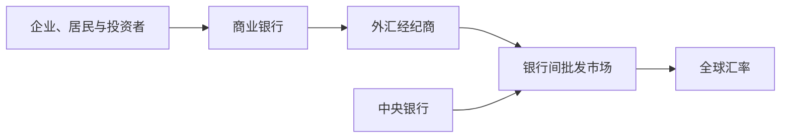

## 外汇市场与外汇交易

## 外汇市场的结构与特征

**外汇市场**：进行外汇买卖并决定汇率的场所或交易网络，包括本币与外币之间、外币与外币之间的买卖。按组织形式分有形市场与无形市场（目前的主要形式）；按管制程度分自由市场、官方市场与黑市；按交易主体分零售市场与批发市场。参与者包括商业银行（外汇银行，交易主体）、外汇经纪商（中间商）、非银行类客户（最终供求者）与中央银行（市场调控者）。银行同业之间及银行与中央银行之间的批发市场占交易量的 90% 以上，是市场最主要的构成部分。

外汇市场有四大特征：交易规模巨大，全球每日交易量从 2010 年的约 3.97 万亿美元增至 2025 年的约 9.51 万亿美元；市场集中度高，英国占 37.77%、美国占 18.59%、新加坡占 11.83%；全天候一体化运行、汇率全球趋同；交易日趋复杂，衍生品交易量高于即期且不断上升。

外汇市场以银行间批发交易为核心，客户需求、经纪撮合和央行干预共同影响汇率形成。

全球五大外汇市场为伦敦（规模最大、交易币种最多）、纽约（美元清算中心）、新加坡（亚洲美元市场）、香港（交易完全自由）与东京。中国外汇交易中心（CFETS）成立于 1994 年 4 月 18 日，受权发布人民币汇率中间价、Shibor 与 LPR。人民币对美元中间价的形成：每日开盘前向做市商询价，去掉最高和最低报价后加权平均。

## 即期外汇交易

**即期外汇交易**：买卖双方成交后在两个营业日内完成交割的外汇交易，又称现汇交易。交割日即清算日，交割日遇任何一国银行节假日则顺延。各地报价的中心货币是美元，采用双档报价，最小报价单位为基本点（万分之一）。

## 交叉汇率与套汇

**交叉汇率**：通过两种货币对第三种货币（通常为美元）的汇率，套算出这两种货币之间的汇率。两个报价中关键货币的位置相同（同为基准货币或同为报价货币）时交叉相除；位置不同时间边相乘，买价与买价配对、卖价与卖价配对。例如温哥华市场 USD1 = CAD1.2820—1.2840，悉尼市场 USD1 = AUD1.3440—1.3460，美元同为基准货币，交叉相除得 CAD1 = AUD1.0467—1.0499。

**套汇**：利用同一种货币在不同外汇市场的汇率差异，一地买进、另一地卖出以赚取汇差利润。**直接套汇**：利用两个市场的汇率差异，又称两地、两角、双边套汇。**间接套汇**：利用三个市场的汇率差异，又称三地、三角、三边套汇。间接套汇用连乘法判断：把三个市场的汇率统一为同一标价法并令被表示货币为 1，沿环路连乘，乘积等于 1 无套汇机会，不等于 1 可套汇。例：伦敦 GBP1 = USD1.4200，纽约 USD1 = CAD1.5800，多伦多 GBP100 = CAD220.00。套算交叉汇率 GBP/CAD = 2.2436，多伦多实际为 2.2000，存在套汇机会。在伦敦卖出 100 万英镑得 142 万美元，在纽约卖出 142 万美元得 224.26 万加元，在多伦多买回 101.9818 万英镑，获利 1.9818 万英镑。

## 远期外汇交易

**远期外汇交易**：买卖双方先签订合约，规定交易币种、金额、适用汇率与交割期限，到约定日期再按合约条款实际交割，交割期一般为 1、2、3、6 个月。远期交易属场外交易，非标准化，无保证金规定，凭交易对手信用。远期外汇交易有三种特殊形式：**远期择期外汇交易**（交割日由询价方在约定期限内任选）、**无本金交割远期**（到期按汇率差额结算，不交换本金）、**掉期外汇交易**（买进即期外汇的同时卖出同等金额的远期外汇，方向相反、锁定头寸）。

远期报价可用报点数法。**直接标价法**：点数小前大后为升水，远期汇率＝即期汇率＋升水；点数大前小后为贴水，远期汇率＝即期汇率−贴水。实用口诀与标价法无关：前低后高加，前高后低减。升贴水的对象是单位货币（基准货币）。

远期外汇交易的三大作用：**套期保值**（锁定成本或保障收益，是套期保值最常见的金融衍生工具）、**外汇投机**（预期汇率上升做多、下降做空）、**外汇套利**（利用短期利率差异，把低利率国货币换成高利率国货币）。套利分抵补套利（套利同时做掉期交易锁定汇率，收益确定）与非抵补套利（不做掉期，收益暴露于到期汇率的不确定性）。

## 外汇期货

**外汇期货**：标准化外汇期货合约的场内交易。产生背景是 1971 年布雷顿森林体系崩溃、浮动汇率出现；1972 年 5 月芝加哥商业交易所的国际货币市场（IMM）推出全球第一个金融期货品种外汇期货。

期货实行保证金制度：初始保证金一般不超过合约金额的 15%，维持保证金一般为初始保证金的 70%—80%，跌破维持线须补足到初始保证金水平，否则被强行平仓。实行日结算制度（逐日盯市），每日按结算价划转盈亏。现实中绝大多数头寸以对冲平仓了结，最终实物交割的合约不到 10%。

外汇期货与远期外汇交易的区别：期货为标准化合约、每份金额固定、场内交易、买卖双方都缴保证金、绝大多数现金交割、合约可流通转让；远期为非标准化合约、金额不固定、场外交易、一般无须缴纳保证金、绝大多数实物交割、合约不可转让。

**多头套期保值**：在卖出即期外汇的同时，买入同等金额的该外汇期货合约，适用于准备在未来买进某种外汇、担心汇率上升的交易者。**空头套期保值**：在买入或拥有即期外汇的同时，卖出同等金额的该外汇期货合约，适用于持有或未来将收到某种外汇、担心汇率下跌的交易者。套期保值本质上是一种对冲交易，现货亏损由期货盈利弥补，目标是少亏。

## 外汇期权

**期权**：持有者在规定的期限内，享有按交易双方商定的价格购买或出售一定数量某种资产的权利。买方支付期权费后获得权利但不承担义务，可以放弃行权；卖方收取期权费后必须无条件服从买方的选择。按性质分看涨期权（买方有权按协议价格买进）与看跌期权（买方有权按协议价格卖出）。按行权时间分欧式期权（只能在到期日当天行权）与美式期权（有效期内任何一天可行权，是期权交易的主要类型）。按协议价与即期价的关系分有利期权、无利期权与平价期权。

决定期权费高低的因素包括协议价格、有效期、现行汇价走势、预期波幅、利率波动、交割日期灵活性与供求关系。四种损益结构：买入看涨的最大损失为保险费，盈亏平衡点为协议价格＋保险费，超过平衡点后盈利随汇率上升无上限；卖出看涨的最大盈利为保险费，汇率上涨时损失无下限；买入看跌的最大损失为保险费，汇率跌破协议价格−保险费后盈利增大；卖出看跌的最大盈利为保险费。期权与期货的区别：期权仅卖方缴纳保证金，期权有保险费，期权买卖双方风险收益不对称。

## 外汇风险管理

**外汇风险**：又称汇率风险，以外币定价或衡量的资产、负债、收入与支出及未来经营活动的净现金流，用本币表示其价值时因汇率波动而产生损失或收益的不确定性。外汇风险本质是一种净值敞口，只有超买或超卖部分才承担风险，具有损失与获利的两重性。

外汇风险分三类。**交易风险**（买卖风险）：流量风险，已签外币合同的结算汇率与当前汇率存在差异，折算为本币金额不同。**经济风险**（经营风险）：潜在风险，未预期的汇率变化引起企业未来运营现金流变化，进而导致企业价值变化。**会计风险**（折算风险）：存量风险，合并资产负债表时货币转换产生的账面损益，不涉及现金流动。

交易风险管理方法包括：签约时合理选择计价结算货币，收款用硬币（汇率稳定且有升值趋势）、付款用软币（汇率不稳定且有贬值趋势）；签约后利用国际金融市场，即 **BSI 法**（借款—即期交易—投资）。外币应收账款：借入外币（金额为应收款折现值）→ 即期换成本币 → 投资本币，到期以收到的应收款归还外币借款本息。外币应付账款：借入本币 → 即期换成外币 → 投资外币，到期投资本利和用于支付。其他方法包括提前或延后收付法与购买外汇风险保险。经济风险管理涉及企业整体经营，包括营销策略、生产策略与财务策略调整。会计风险管理包括资产负债表保值、契约性保值与向公众申明合并收益受汇率波动的影响。
