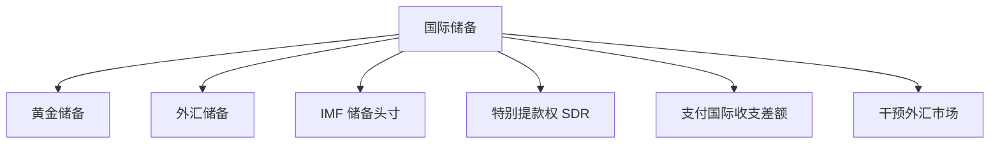

## 国际储备与汇率制度

## 国际储备的定义与构成

**国际储备**：一国货币当局持有的、随时可用来干预外汇市场、支付国际收支差额的金融资产。国际储备有三大特点：官方持有性、充分流动性、普遍接受性（自由兑换性）。国际储备不等于外汇储备，外汇储备只是国际储备的构成之一；居民手头持有的外币不是国际储备，主体必须是货币当局。

国际储备有三大作用：清算国际收支差额；干预外汇市场、维持汇率稳定；充当对外举债与偿债的信用保证。国际储备由四部分构成：**黄金储备**（货币当局拥有的货币性黄金，最传统、安全性高、流动性低、不生息）；**外汇储备**（以储备货币表示的储备资产，是国际储备的主体，使用频率最高、数额最大）；**在 IMF 的储备头寸**（普通提款权，由成员国以 25% 硬通货加 75% 本币缴纳份额形成）；**特别提款权**（IMF 1969 年创设的账面储备资产，俗称纸黄金，按货币篮子定值，2016 年 10 月 1 日人民币正式入篮，2022 年审查后权重为 12.28%）。

国际储备由多类官方流动资产组成，既提供对外支付能力，也为汇率干预和偿债信用提供缓冲。

**国际清偿力**：广义的国际储备，等于自有储备加借入储备。借入储备的来源包括备用信贷、互惠信贷和支付协议、商业银行对外短期可兑换货币资产。

## 国际储备管理

国际储备需求存在目标区，从高到低依次为最高限国际储备量、保险国际储备量、适度国际储备量（持有储备的边际成本等于边际收益之点）、经常国际储备量与最低限国际储备量。国际储备的供给来源中，国际收支顺差是最主要、最直接的来源。

国际储备管理遵循五原则：安全性、流动性、稳定性、保值性、盈利性，本质是在保持一定流动性的前提下获取尽可能多的收益。数量管理取决于五个因素：对外贸易状况（特里芬提出外汇储备占年进口总额的 20%—50% 较为合适）、汇率制度及外汇管制程度、持有储备的机会成本、国际货币合作状况及其他因素。结构管理对外汇储备的币种结构尤为重要，方法包括比例搭配控制法、资产多元组合法与市场预测调整法。

## 中国的国际储备

中国外汇储备 2014 年 6 月达峰值 39932.13 亿美元，2026 年 2 月为 34278.07 亿美元，占官方储备资产的 88.3%。中国国际储备存在三大问题：黄金储备偏少，低于发达国家一般水平；储备头寸与 SDR 合计占比不到 1%；外汇储备过高且币种结构不合理，美元资产约占 70%，其中大量为美国国债，我国成为美元铸币税的主要承担者并承担美元贬值风险。管理对策包括完善国际储备管理制度、促进收支平衡、进行外汇资产功能划分、增加储备资产多样性、探索外汇管理金融工具。

## 汇率制度的分类

**汇率制度**：一国货币当局对本国汇率水平的确定、汇率变动方式及调整原则等做出的一系列安排与规定。

**固定汇率制**：汇率平价相对固定、波动幅度相对固定。历史上三种形态：金币本位制下由铸币平价与黄金输送点自发维持；金块本位制与金汇兑本位制下由法定平价与外汇平准基金人为维持；布雷顿森林体系下实行双挂钩（美元与黄金挂钩、各国货币与美元挂钩），各国履行维持汇率稳定的义务。**浮动汇率制**：汇率由市场供求决定、不规定波动范围。按政府是否干预分自由浮动（清洁浮动）与管理浮动（肮脏浮动）；按浮动形式分单独浮动与联合浮动。

IMF 分类分四大类 10 小类：硬盯住（无独立法币的汇率安排、货币局制）、软盯住（传统盯住、稳定性安排、爬行盯住、类爬行安排、水平区间盯住）、浮动（浮动、自由浮动）与其他管理安排。中国的法定安排为管理浮动，但 IMF 按实际汇率行为将其归入其他管理安排。

## 固定汇率与浮动汇率之争

固定与浮动之争围绕三个焦点：实现内外均衡的自动调节效率、政策效率、对国际经济关系的影响。两种制度的比较，本质是内外均衡目标实现中可信性与灵活性的权衡。

固定汇率制的优点：避免汇率大幅波动，促进国际贸易与投资；限制政府不负责任的宏观政策；防止汇率战、货币战等恶性竞争；减少国际金融领域的投机。缺点：丧失货币政策独立性；易输入他国通胀；制度调整僵化。浮动汇率制的优点：国际收支自动调节，不会出现长期赤字或盈余；可实行独立货币政策；国际储备可以少持有；促进自由贸易、提高资源配置效率。缺点：增大外汇风险；助长外汇投机；央行缺乏纪律性，易产生通货膨胀偏向。

## 汇率制度的选择因素

选择汇率制度须考虑六个实际因素：经济规模越大越倾向浮动；经济越发达越可能选择浮动；经济开放程度越高通常越倾向固定；只有本币是自由兑换货币时才有可能采用浮动汇率；对大国政治经济依附程度越大越倾向钉住汇率制；冲击主要来自货币因素或国内因素时偏向固定汇率制。

## 外汇管制

**外汇管制**：又称外汇管理，指一国政府通过法令、规章等对国际结算、外汇买卖、国际借贷与投资以及外汇汇率等实行的限制性管理。目的包括维持国际收支平衡、保持汇率秩序、维持物价和金融稳定、促进本国竞争力。外汇管制分三类：严格型外汇管制（大多数发展中国家）、非严格型外汇管制（承诺遵守 IMF 协定第八条款、经常项目完全放开，中国属于此类）、松散型外汇管制（货币自由兑换、经济发达）。管制对象分对人的管制（对居民较严、对非居民较松）、对物的管制（外币、外币支付凭证、外币有价证券）与对地区的管制。管制方法分数量管制（贸易外汇、非贸易外汇、资本输出入、黄金现钞输出入）与价格管制（直接制订公布汇率、间接外汇干预），复汇率制是外汇管制的产物。管制有许多弊端，减少管制是政策发展的方向。

## 人民币汇率制度与人民币国际化

人民币汇率制度经历五个阶段：改革开放前（1949—1978）汇率由官方制定；官方汇率与内部结算汇率并存时期（1979—1984），1981 年起实行贸易内部结算汇率，开启汇率双轨制；官方汇率与外汇调剂市场汇率并存时期（1985—1993）；逐步走向市场化时期（1994—2005），1994 年 1 月 1 日实现汇率并轨，1997 年亚洲金融危机后人民币近乎盯住美元；汇率形成机制改革后（2005 至今），2005 年 7 月 21 日人民币不再盯住单一美元，实行以市场供求为基础、参考一篮子货币进行调节、有管理的浮动汇率制度。2015 年 8 月 11 日完善人民币中间价报价机制，做市商报价参考上日银行间外汇市场收盘汇率。2017 年 5 月引入逆周期因子，中间价报价模型调整为收盘价＋一篮子货币汇率变化＋逆周期因子；2020 年 10 月逆周期因子陆续淡出使用。

外汇管理体制沿革：1950—1978 年统收统支；1979—1993 年分成制，1981 年 3 月颁布《外汇管理暂行条例》；1994 年起实行结售汇制度改革，1996 年实现经常项目可兑换，2012 年 4 月强制结售汇制度退出历史舞台。

人民币国际化进程从 2009 年 7 月《跨境贸易人民币结算试点管理办法》发布起步。支付货币功能最好成绩为全球第四；2016 年人民币加入 SDR 货币篮子，截至 2024 年底人民币储备占比约 1.9%，居全球第七；2015 年 10 月 CIPS（人民币跨境支付系统）第一期投产，至 2025 年业务覆盖全球 189 个国家和地区。货币国际化的三种模式中，美元模式不可复制，欧元模式对人民币不可行，我国走的是日元模式——通过贸易自由化、资本流动自由化、利率与金融市场自由化，使本币成为国际活动中被广泛使用的货币。资本与金融项目未完全放开的原因包括防范国际游资的投机冲击、防止资本外逃和货币替代、避免内外部平衡冲突加剧。

香港实行联系汇率制度，属货币局制度。发钞银行发行港元纸币时，须按 1 美元兑 7.8 港元的固定汇率向外汇基金缴纳等值美元，即发行货币须有 100% 的美元准备金。优点是对汇率稳定有保证、可自动调节国际收支；弊端是削弱货币政策的独立性、固定汇率易招致游资冲击、无法使用汇率调节工具。
