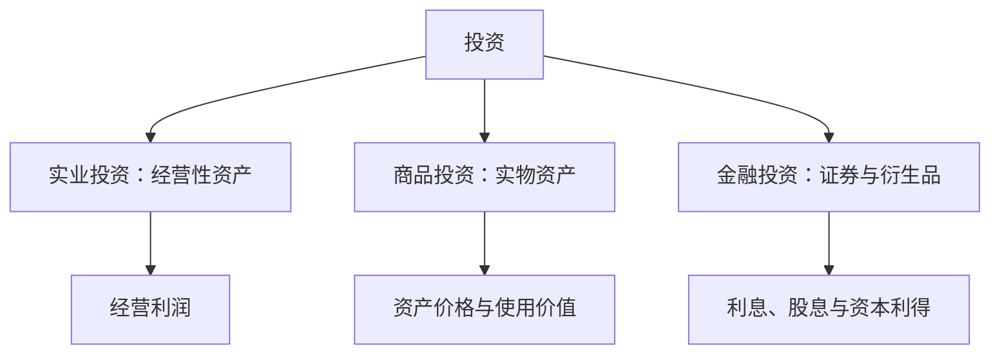

## 投资基础

## 三种投资领域

按投资对象划分，投资分为实业投资、商品投资与金融投资三种领域。

投资对象决定收益来源：实业投资依靠经营，商品投资依靠实物价值与价格变化，金融投资依靠金融资产现金流与估值变化。

**实业投资**：也称企业投资、经营投资，对经营性资产进行投入并从事经营，以获得经营利润。**商品投资**：持有有形实物资产，持有过程本身就是投资，动手加工处理则转为经营。**金融投资**：购买证券、外汇、金融衍生品等金融资产的投资，又称虚拟投资。

创设企业属于金融投资即股权投资，企业设立之后的经营属于实业投资。股权加上负债形成的资金，用于生产经营。

商品投资的范围包括大宗商品、房地产与收藏品。大宗商品涵盖农产品、能源与基础原材料。农产品中大豆、玉米、小麦易交割、特性稳定，适合做期货；大米易霉、保质期短，不适合做期货。黄金处于金融资产与大宗商品之间，仍是世界货币与国际最终清算手段，但已不履行普通货币职能。

金融资产的构成以债与股为基础，另有贷款资产、票据、应收账款，可通过资产证券化变为可交易金融资产。衍生品包括远期、期货、期权与互换。政府与个人在金融市场上仅提供债权，企业可同时拥有股权与债权。

## 金融资产与实业资产

金融资产是各种实业资产或商品的不同权益凭证。作为投资对象，金融资产较大程度替代实业资产或商品，这种替代并不完全，两者价值存在差异。

替代关系以黄金与房地产为例。实物黄金流动性差，可转向纸黄金、黄金期货，再转向黄金股。房地产金额太大，可转向 REITs 组合，再转向相关领域上市公司股票。

价值差异来自不同权利具有不同的价值分析体系。实业资产价值取决于生产能力与生产经营体系，按重置成本加未来盈利估值。债权价值是本金与利息按信用风险折现：

$$V=\sum_{t=1}^{n}\frac{C}{(1+r)^t}+\frac{F}{(1+r)^n}$$

折现率受 AAA/AA/A 等信用评级影响。股权价值是未来现金流折现：

$$V=\sum_{t=1}^{\infty}\frac{D_t}{(1+r)^t}$$

价值差异还来自市场流动性的价值差异。未上市股权与债权属场外批发交易，流动性低；上市后流动性价值被放大，产生股市的财富放大效应。股权代表净资产，股票赋予流动性价值，流动性溢价（liquidity premium）是上市带来的价值提升。

## 投资、投机与赌博

**投资**（investment）：承担适度风险，较长期持有，获得较稳定收益。**投机**（speculation）：承担较高风险，捕捉市场机会，短期买卖获取较高收益。**赌博**（gambling）：在公平前提下，依靠运气博取小概率的超额或巨额收益。

三种策略在预期收益、风险、收益来源、投资周期与分析重点上区分。投资收益来自长期资产孳息及增值，周期长，分析重点为内在价值水平。投机收益来自短期资本利得，周期短，分析重点为市场价格波动。赌博收益来自小概率的暴利，分析重点为游戏规则规律。

基本分析与技术分析存在交叉应用。基本分析存在短线应用，如利率波动、资金流向与政策短期影响；技术分析存在长线应用，如周线图与月线图。

## 投资三要素与金融工具属性

投资本身包含收益、风险、时间三要素。收益由孳息收益与资本利得构成。时间要素中时机把握最为关键，其次是投资周期的选择。投资决策的最终目标是投资效用最大化（utility maximization），而非收益最大化。

金融工具具有收益性、风险性、流动性三性。早期国债因流动性存在瑕疵，要求更高的收益性，票面收益高于银行存款。

风险是实际收益与预期收益的偏差。广义上正偏离为超额收益，负偏离为损失。理论假设收益率分布为正态分布，实际金融资产收益率分布呈尖峰肥尾，不完全对称。

## 系统性风险与非系统性风险

**系统性风险**（systematic risk）：由宏观经济、金融以及证券市场等整体性因素变化而对所有投资品产生影响的风险，又称不可分散风险，具有低频、周期性特征。宏观经济风险、金融风险、市场波动风险属于此类。**非系统性风险**（unsystematic risk）：由个别领域、行业或公司情况变化而对相关投资品产生影响的风险，又称可分散风险，发生频率高，可通过组合化分散对冲。行业风险、公司风险、变现风险属于此类。

行业风险的定位取决于投资策略。在行业内投资时，行业风险是系统性风险；站在宏观层面看，行业风险是非系统性风险。

风险应对有三类手段。**套期保值**（hedging）在远期或期货市场建立与现货市场相反的头寸，锁定未来现金流，防范系统性风险。期权以期权费为成本，转嫁风险、控制风险而保留收益。**多元化组合**（diversification）降低非系统性风险。

风险与收益正相关是基本逻辑，但正相关程度存在差异。同一只股票在低价位时风险较低、收益空间较大，高价位时风险较高、收益空间变小。

## 投资分析决策

投资分析决策包含两个步骤。第一步分析市场特征与发展趋势，确定盈利点与风险点。有把握的因素作为主要盈利点，明确难以掌握的因素作为主要风险点加以规避。第二步制定投资策略，选择投资工具，设定风险控制策略与市场操作策略，确定资产组合的限制策略。

三种投资分析方法并存。**基本分析法**（fundamental analysis）用经济与财务方法分析影响投资价值的宏观、产业与公司因素。**技术分析法**（technical analysis）对市场交易行为进行预测，采用图表与指标方法。**量化分析**把基本分析与技术分析的指标变化设定买卖点并程序化交易，或建立纯数学规律模型。

投资理论发展分三阶段。早期阶段形成现值原理、股息折现模型、效用理论、随机游走与正态分布假设。经典阶段（1950—1980 年代）出现马科维茨资产组合理论、市场模型、CAPM、APT 与有效市场假说。1980 年代以后出现金融市场微观结构理论与行为金融理论。

行为金融理论挑战经典理论的两大前提。其一，投资者理性不成立。其二，有效市场假说不成立，投资者仍会预判未来并采取行动，随机游走同样不成立。
