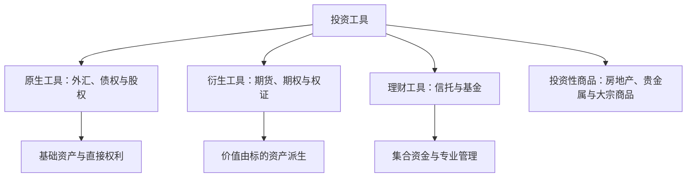

## 证券投资工具

## 投资工具分类

投资工具分为原生金融工具、衍生金融工具、投资理财工具与投资性商品四大类。

投资工具的分类以权利和价值来源为线索：原生工具提供基础权利，衍生工具派生价值，基金集合资金，商品保留实物属性。

**原生金融工具**：外汇、债权与债券、股权与股票，是投融资双方直接交易的基础工具。**衍生金融工具**：期货、期权与权证、资产证券化产品，价值由原生工具派生。**投资理财工具**：信托类工具与投资基金，集合众多投资者的资金交给专业机构运作。**投资性商品**：房地产、贵金属、大宗商品，具有实物属性，投资逻辑不同于证券。

## 四大投资特性

金融投资工具具有产权性、流动性、安全性、收益性四大投资特性。

**产权性**：投资工具代表对某项资产或实物的某种权利，是基本决定因素，产权性质决定其余三项特性的底色。**流动性**：可转让的程度与转让价值的稳定可控程度。上市流通股具有高转让性和低变现性，随时可卖但难以稳定价格卖出；限售流通股在解禁前基本非流动。**安全性**：投资工具所含风险的种类及程度，风险种类包括信用风险、市场风险、流动性风险与利率风险，收益率分布越发散风险越大、越收敛风险越小。**收益性**：收益的形式、波动性及水平。

预期收益的期望值水平由三重补偿构成：

$$\text{预期收益} = \text{无风险收益率} + \text{投资风险补偿} + \text{流动性风险补偿}$$

流动性差的工具要求更高的收益补偿，风险高的工具要求风险溢价。收益是对让渡资金使用权、承担风险与承担流动性损失的三重补偿，这是全课程定价思想的起点。

## 风险收益的匹配

债权、股权、期权与权证、可转换债券的投资风险收益具有非对称性。远期与期货的风险收益具有对称性。组合化投资安排实现风险收益的对称性。互换交易不存在风险的转嫁，互换双方交换的是现金流。

单项债权的分布左偏，最大损失率是 -100% 即违约损失率，最大收益率仅为违约罚息等有限值。债权资产组合的峰值在合同利率附近，左尾很长。股票投资分布右偏，最低收益率为 -100%，最大收益率可达 n 倍；组合化使分布变窄、向均值收敛。

## 证券与有价证券

按内容划分，证券分为商品证券与价值证券。商品证券代表商品所有权，如提货单、仓单。价值证券中，货币证券只作为支付与信用工具，不产生孳息；资本证券产生孳息，是投资工具主体。

按性质划分，证券分为证据证券与有价证券。**有价证券**（marketable securities）是权益凭证加市场化特征的结合，既代表一定的权益，又可在市场上公开转让，是证券投资的对象。

## 权证与衍生工具

**权证**（warrant）：赋予持有人按约定价格买卖标的股票权利的凭证，分为认购权证与认沽权证。权证与期权同属权利类工具，期权期限短、权证期限长，风险收益具有非对称性。我国权证大规模出现于 2005 年股权分置改革的对价支付，属历史特殊产物。

**期货合约**（futures）：在交易所达成的标准化远期合约，数量、质量、交货时间和地点既定，唯一变量是价格。金融期货包括利率期货、股指期货与外汇期货，股指期货只能现金结算。**期权**（option）：看涨期权赋予买方按约定价格买入的权利，看跌期权赋予买方按约定价格卖出的权利。买方支付期权费获得权利，损失以期权费为限、收益理论上无限；卖方收取期权费承担义务。

## 股票

股票分普通股、优先股与劣后股三类。**普通股**（common stock）是公司资本的基础，股东享有所有权、有限责任、剩余资产索取权、优先认股权与表决权五项权利。**优先股**（preferred stock）在盈利和剩余资产分配上享有优先权利，但在所有权、增资扩股权与表决权方面受限。**劣后股**（inferior stock）在分配上劣后于普通股，其余权利义务与普通股相同，主要用于公司发起人或政府控制公司。

税后利润的分配顺序为优先股股息、法定公积金、公益金、普通股利润。送红股是当年利润的分配，转增股是把往年资本公积金转增股本，不改变股东权益总量。资本利得不征税，股息红利缴纳 20% 个人所得税，因此高增长、低分红公司的股东通过股价上涨实现的收益免税复利更有利。

按投资价值划分，股票分蓝筹股、成长股、循环股与防守性股、投资性股与投机性股、垃圾股。蓝筹股（blue chips）是成熟行业内占支配地位、业绩优良、红利优厚的大公司股票。成长股（growth stock）当前业绩一般但未来增长幅度较大。

按发行与交易场所划分：A 股为境内上市、人民币计价；B 股以外币方式在境外发行、在境内交易所上市交易，上海以美元计价、深圳以港元计价；H 股为在香港上市的中国内地法人公司股票；红筹股（red chip）为在中国境外注册、在香港上市的中资企业股票。

类别股制度由 2024 年新《公司法》增设，章程可规定优先或劣后分配利润、表决权多于或少于普通股、转让受限等类别股。影响类别股股东权利的事项，须经股东会与类别股股东会议双重三分之二以上表决通过。科创板 2019 年率先允许特别表决权，主板 2024 年 4 月落地。

## 债券

按发行主体划分，债券分为政府债券、公司债券与金融债券。国债无信用风险但有利率风险。地方政府不能破产，国有企业可以破产，公司债与企业债的违约风险真实存在。

按期限划分，债券分短期、中期、长期与永续债券。永续债券（perpetual bond）无固定到期日，典型如次级债与混合资本债，兼具股债双重属性，可计入银行其他一级资本。AT1 是巴塞尔协议 III 框架下的损失吸收资本债权，银行经营恶化时先转股或减记吸收损失。

本息偿付方式分利随本清、息票债券、贴现债券与分期偿付。贴现债券（discount bond）折价发行、到期面值兑付，折价部分即利息。利率条款分固定利率、保值债券、浮动利率债券与分息债券，保值债券利率盯住 CPI，浮动利率债券利率盯住市场基准利率。

特殊条款方面，**可转换债券**（convertible bond）由上市公司发行，持有人可按约定转股价将债券转换为公司股票，内含转股期权，风险收益非对称，通常含提前赎回条款与回售条款。**可交换债券**（exchangeable bond）由股东发行，到期可交换为发行人持有的其他公司股票。

信用评级将债券分层为投资级、金边债券、投机级与垃圾债券。主权债也有信用等级，希腊国债 2012 年被标普降至 CCC 级垃圾级。

## 证券投资基金

基金是信托工具，具备组合投资、风险规避与专家理财三大功能。组合投资分散非系统性风险，组合化后基金主要承担系统性风险。

**契约型基金**（contractual fund）：由基金管理公司、托管银行和投资人三方订立信托契约，投资者兼具委托人与受益人身份，我国基金均属此类。**公司型基金**（corporate fund）：以投资公司的法律形式存在，投资者是公司股东，受公司法保护，美国主流。

**开放式基金**（open-end fund）随时申购赎回、按净值交易，是当前主流。**封闭式基金**（closed-end fund）份额固定、只能二级市场转让。**LOF** 既可在场外按净值申赎，又可在交易所买卖，打通场内外通道。**ETF** 跟踪指数、持有指数成分股的被动基金，二级市场买卖 T+0，一级市场申赎 T+1，一二级市场价差由机构套利消除。

**对冲基金**（hedge fund）：以对冲与杠杆获取绝对收益的私募形态，工具包括股指期货、商品期货、统计套利与期权对冲。策略分为方向性策略、相对价值策略与基金中的基金。

跨境投资通道方面，境外资金进入内地市场主要通过 QFII（合格境外机构投资者），境内资金配置境外市场通过 QDII（合格境内机构投资者），二者都是额度管理下的开口子，不是完全自由流动。

## 存托凭证与另类投资

**存托凭证**（depositary receipt）：在一国发行、代表境外公司基础证券的可流通凭证。美国存托凭证（ADR）由 J.P. 摩根 1927 年首创，按监管强度分为一、二、三级与 144A 私募发行。**中国存托凭证**（CDR）以境外证券为基础在境内发行。

另类投资包括私募股权、资产证券化与实物资产。**私募股权**（private equity）广义指全部非公开股权投资，狭义指后期投资；风险投资（venture capital）处于企业中期，天使与种子投资更早。不同阶段看重点不同：天使阶段看人，A 轮看技术创新前景，B 轮看商业模式，C 轮看规模与盈利。**资产证券化**以基础资产的现金流为支撑发行证券，常见产品包括 MBS、CDO 与 CDS。

黄金是避险资产，与美元、通胀正相关，与经济景气负相关。房地产的投资形态包括物业直接投资、房地产企业股票、REITs 与土地。
