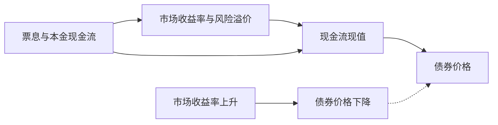

## 债券估值与久期

## 债券定价

债券价值是未来现金流的现值：

$$P=\sum_{t=1}^{n}\frac{C}{(1+r)^{t}}+\frac{F}{(1+r)^{n}}$$

债券价格由未来现金流折现得到，市场收益率变化会通过折现率引起价格反向变动。

折现率 r 是市场收益率，由无风险利率、信用风险溢价与流动性风险溢价构成。折现率是债券定价的主要变量。

债券行情遵循三条基本规律。第一，价值较稳定，行情波动较小。第二，价格波动具有最高界限，即票面价值或到期值。第三，行情的主要影响因素是市场收益率。

## 波动五原理

债券价格波动服从五条原理。第一，债券价格与市场收益率反向变动。第二，期限越长，价格波动越大。第三，期限增长时波动增大的速度递减。第四，收益率同幅升降，下降引起的涨幅大于上升引起的跌幅，即凸性（convexity）。第五，票面利率越低，对利率变化越敏感。

价格波动存在例外。1997 年发行的 3 年期国债 9703 券，票面利率 9.18%，2000 年 5 月 1 日到期，到期值 127.54 元。1999 年 8 月 2 日该券以最低价 127.56 元开盘、最高价 130.00 元收盘并放出天量，价格整体越过到期值。当时国债供给稀缺，投资者恐慌性抢购，买方愿意为确定性支付溢价，情绪因素突破定价规律的一般约束。

## 久期

**久期**（duration）是各期现金流支付时间按现值加权计算的平均时间，衡量债券或组合的利率风险。久期与到期收益率成反比，与剩余年限成正比。

久期遵循六大定理。第一，零息债券或一次性偿付债券的久期等于到期时间。第二，直接债券即固定利息债券的久期不超过到期时间。第三，统一永久公债的久期等于 $1+\dfrac{1}{r}$。第四，到期时间相同，息票率越高，久期越短。第五，息票率不变，到期时间越久，久期越长。第六，其他条件不变，到期收益率越低，久期越长。

久期越长对利率越敏感、价格波动越大。预期加息时债券价格将下跌，应缩短久期、持有短债。

## 免疫策略

**免疫策略**（immunization）让组合久期与投资期匹配，使利率变动的影响相互冲销，锁定组合价值、规避利率风险。免疫策略常用于养老金与保险等负债管理，即资产组合的久期与负债久期相匹配。

利率可预判时，预期利率下行则选择久期大的债券博取超额收益。利率不可预判时，用免疫策略对冲利率风险。硅谷银行 2023 年破产是久期管理失败的反面教材：存款成本约 0.25%，资产端配置收益率约 1% 的长期国债与 MBS，期限错配；美联储连续加息使债券价格大跌，账面巨额未实现亏损引发挤兑，被迫抛售实现亏损后资不抵债。国债没有信用风险，但利率风险与流动性风险真实存在。

## 到期收益率

**到期收益率**（yield to maturity，YTM）是使债券未来现金流现值恰等于当前市价的折现率，是内部收益率的精确版本。比较不同债券的 YTM 须保证可比性：信用评级相同、待偿期限相同、处于同一市场。到期收益率越高，债券越便宜。

## 可转换债券与收益率曲线

**可转换债券**的价值取纯债价值与转股价值的较大者：

$$V=\max(\text{纯债价值},\ \text{转股价值})$$

股价低迷时债底托底，股价高涨时跟随股性。内含转股期权使风险收益非对称，损失有限、上行放大。

收益率曲线由收益率与期限的关系构成，由三因素解释：市场预期、流动性偏好与市场分割。长端与短端收益率倒挂反映市场预期因素压过流动性偏好与期限溢价，即市场预期未来短期利率下行。

## 债券投资交易策略

债券投资分被动与主动两类策略。**被动策略**包括购买—持有策略与免疫策略。购买—持有是买入并持有至到期，获取票息与本金。免疫策略即久期匹配，锁定组合价值、规避利率风险。

**主动策略**包括利率预期、信用利差交易与杠杆策略。利率预期判断利率走向而调整久期，信用利差交易预期信用利差收窄或走阔，杠杆策略放大收益与风险。

收益率曲线交易有三种方式。**骑乘收益曲线**买入期限更长的债券，随收益曲线下滑即价格上升而获利。**曲线形态判断**遵循陡多短、平多长的规则：曲线陡峭时偏好短久期，曲线平坦时偏好长久期。**哑铃型组合**长短久期两端重、中间轻，兼顾长短久期。
