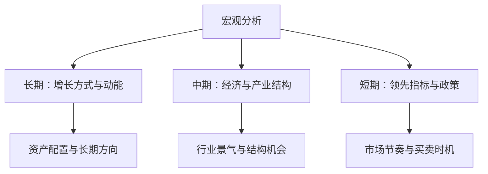

## 宏观经济分析

## 宏观分析的三个视角

宏观分析分为长期、中期与短期三个视角。长期看增长方式与增长动能，是投资判断的立足点。中期看经济结构与产业结构变迁。短期看领先指标，如 PMI、发电量与信贷。

宏观分析把长期方向、中期结构和短期节奏分层，分别服务于资产配置、行业选择和交易时机判断。

长期增长由总供给决定，供给能力等于劳动力、资本与全要素生产率（total factor productivity）。判断长期趋势就看这三类要素的数量与效率变化。

## 增长动能与长波周期

经济增长动能来自产业热点与新的增长点。新的增长点找得到，增长动能就存在；找不到，增长动能就丧失。

产业周期指单个产业从成长期进入调整。建筑业周期即库兹涅茨周期（Kuznets cycle）属于产业层面。长波周期即康德拉季耶夫长波（Kondratiev wave）由几个主导产业先后进入成长期、共同拉动整体增长，相对抽象、更具战略性。

产业之间不可能无缝衔接。市场经济中资本流向有钱赚的地方，只有少数有预见性的资本提前投入下一个产业并承受机会成本。先进入引领性产业不一定有利润，资本等旧产业过剩、饱和、调整之后不得不进入下一个产业群。因此产业之间存在时间上的窗，新产业迟迟发掘不出来，增长动能就暂时丧失。

## 宏观指标三分法

判断宏观经济增长时各指标反应快慢不同。股市超前于宏观经济，因为投资者通过领先指标预判经济前景并提前行动。

**领先性指标**（leading indicators）：在国民经济总体发展达到某种状况之前已经发生变化、对经济发展起预示作用的指标。货币政策指标包括央行基准利率、法定准备金率、再贴现规模与公开市场净投放，另有财政政策指标、工业产能利用率、住宅建设、商品新订货单、公司税后利润、波罗的海干散货指数（BDI）、PMI、消费者信心指数、货币数据与物价指标。

**同步性指标**（coincident indicators）与经济同步变化，如 GDP 与失业率。**滞后性指标**（lagging indicators）慢于经济变化，如投资规模。

政策是领先指标，但不是必然结果。逆周期调节意在撬动市场力量，市场力量与政策力量综合作用的最终结果才是经济增长水平。判断宽松还是紧缩要看最终结果 M1、M2 的同比增速，不能只看政策动作。

股价指数不是判断宏观的依据。分析宏观指标的目的是预测股价、决定买卖，再拿股价指数判断宏观构成互为因果的循环论证。

克强指数（Keqiang index）由英国《经济学人》2010 年推出，构成是工业用电量新增、铁路货运量新增与银行中长期贷款新增。用电量指标适合制造业占比高的中国，美国用电量多年平稳而 GDP 持续增长，该指标在美国不灵。

## 货币供给与总供需平衡

**费雪方程式**（Fisher equation）：

$$M \times V = Q \times P$$

货币供应量乘以货币流通速度等于商品数量乘以价格水平，即总需求 MV 与总供给 QP 的平衡。

货币供给量等于基础货币乘以货币乘数。基础货币投放途径包括公开市场操作、再贷款与再贴现，财政政策通过国债发行支持基础货币投放，外汇储备增长是另一条渠道。货币乘数受法定准备金率与转账结算程度影响。

货币流通速度由宏观经济增长决定。增长好时速度加快，萧条时若供给与需求结构不匹配则形成**流动性陷阱**（liquidity trap）：货币再多也扩大不了总需求。

中国出现货币大增但 GDP 与 CPI 都低迷的局面，因为资金没有进入总需求端，流向投资市场——房地产吸纳资金后价格下跌、资金被套，股票债券吸纳有限，黄金体量小。若没有投资市场，只能物价上涨形成恶性通胀。

## 中国增长模式与转型升级

中国过去三十多年以技术引进和低成本优势为基础、要素投入为动力实现增长。供给侧要素包括劳动力的人口红利、土地与环境的低成本、资本的高储蓄与国际资本、引进发达国家成熟生产加工技术。传统产业及其产业链形成充分扩张的产能。

增长路径有三块：消费、国内投资与出口。调整以主导产业的结构调整为主线，基于技术引进快速进入下一个增长周期，实现 V 型反转（V-shaped recovery）。1980 年代基础消费激活、1990 年代家电消费、1998—2007 年信息电子电器、汽车、房地产与出口拉动投资，都是 V 型反转的例证。

当前中国经济正处在转型升级的攻关期。成本优势基本丧失，创新优势与高品质优势尚未形成，旧动能减弱、新动能尚在培育。转型像一台大手术，手术过程中病人最虚弱，风险集中在这一阶段。

**中等收入陷阱**（middle-income trap）：人均收入达到中等水平后，既无法继续依靠低成本优势竞争，又未能建立创新与高附加值优势，导致增长停滞、迟迟不能进入高收入行列。拉美与东南亚许多经济体陷入其中，日本与亚洲四小龙成功跨越。

成功跨越者具有东亚模式（East Asian model）四特征：出口导向型工业化的经济发展模式、强力政府主导资源配置的体制模式、政府理性制度创新的制度模式、儒家文化与市场经济文化结合的文化模式。

当前阶段是增长速度换挡期、结构调整阵痛期、前期刺激政策消化期的三期叠加。目标框架为：争取 5 年左右完成增长方式转换，2030 年前后跨越中等收入陷阱，2035 年人均 GDP 达到 3.5 万美元以上成为中等发达国家，本世纪中叶建成社会主义现代化强国。

消费分级现象明显，高收入人群消费升级、中低收入人群消费降级。判断消费阶段的关键指标是恩格尔系数（Engel's coefficient），即食品支出占总支出比重，数值越低消费结构越高级。中国农村居民恩格尔系数 32.35、城镇居民 28.78，已进入享受型消费阶段，与美国 8.1%、日本 27.8% 相比仍有距离。

转型升级的方向是三大转变与三大转型：第二产业主导转为第三产业主导、传统产业调整升级、新兴产业快速增长；规模数量型转向质量效益型、要素投入主导转向自主技术创新主导、投资拉动主导转向消费拉动主导。供给侧结构性改革以去产能、去库存、去杠杆、降成本、补短板为核心。注册制以信息披露为核心，服务硬科技企业与创新型中小企业融资。
