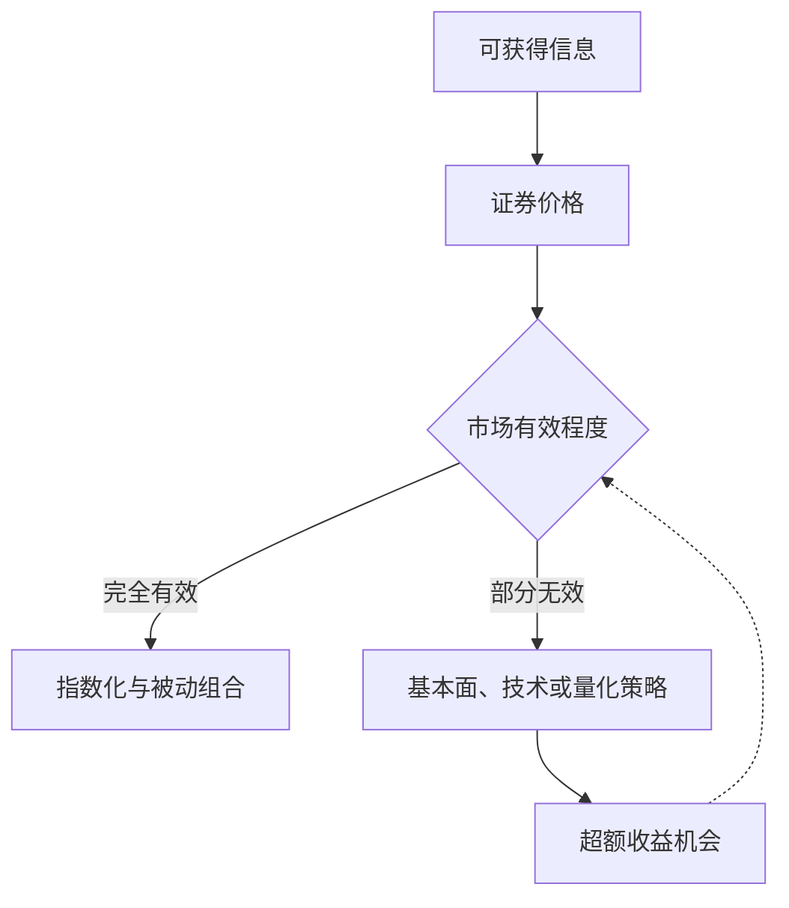

## 投资策略与行为金融

## 有效市场假说

**有效市场假说**（efficient market hypothesis，EMH）由法玛 1970 年提出：当证券价格充分反映投资者可获得的信息时，市场是有效的。此时证券价格的变化类似醉汉的随机漫步（random walk），难以分析判断下一步走向，投资者无论怎样选择证券，都只能获得与投资风险相当的投资收益。

有效市场假说有三种类型。**弱式有效市场**（weak-form）：历史信息已全面反映在价格中，无法据历史价格预测未来，技术分析无效。**半强式有效市场**（semi-strong form）：历史信息与公开信息已全面反映在价格中，无法利用公开信息获得超额收益，基本分析无效。**强式有效市场**（strong-form）：所有信息含内幕信息已全面反映在价格中，内幕交易没有意义。

有效市场的基本逻辑：市场没有记忆，价格涨跌与历史无关；相信市场价格，价格是投资者买卖行为共同作用下的均衡结果；市场没有幻觉，财务性重组与资本运作无法长期有效影响价格；股票价格弹性大；寻找规律者自己消灭了规律，不存在永久有效的套利模式。

市场有效程度决定投资分析的边际价值：完全有效时偏向被动配置，存在定价偏差时主动策略才可能获取超额收益。

市场有效与投资策略的关系：市场完全有效时任何投资分析都不能带来长期超额收益；市场无效或部分无效时投资分析或其中部分方法可能带来超额收益。

## 有限理性与行为金融

传统金融学的基本前提是理性投资者：唯一目标是追求且有能力追求自身预期效用的最大化，前提是完全知晓、完全行为能力、完全自立，形成途径是天赋能力、学习与市场淘汰。

**行为金融学**（behavioral finance）质疑这一前提。人的学习与分析能力有限，行为存在惰性、疏于调研分析，企业存在社会倾向。**有限理性**（bounded rationality）由 Herbert Simon 1955 年提出：人认知与信息处理能力有限，只能追求满意而非绝对最优。结论是学习不能保证最优化，非理性未必会被淘汰。

**噪声交易者**（noise trader）是按非理性偏差而非基本面进行交易的参与者，其存在使价格偏离价值、产生波动，也让套利者难以完全消除偏离。

索罗斯的放大失衡策略认为市场并非总是有效，价格与价值之间存在可被放大的失衡，主动寻找并顺势放大这种失衡即可获利。

## 投资决策要素与复利模型

投资决策三要素为收益、风险与时间。投资决策五要素为市场选择、资本即资金规模、收益、风险与时间。

资本市场的最终获利模型：

$$E = (A \times B \times C)^a$$

E 为投资收益，A 为资金规模，B 为获利速度即收益率，C 为风险系数，a 为复利次数。复利（compound interest）使收益随复利次数呈指数放大，在资金规模与获利速度确定后，时间与周转决定收益量级，这是滚雪球式长期获利的底层逻辑。

承担风险是获得收益的基础。风险的选择与防范：通过预测相关因素主动选择或规避；用套期保值在远期或期货市场建立与现货相反的头寸，防范系统性风险；用多元化的组合投资降低非系统性风险。

## 主要投资策略类型

投资策略按不同维度分类。按价值取向分价值型、趋势型与热点型：价值型寻找低估资产，趋势型顺应市场趋势，热点型追逐市场热点。按持仓结构分集中型与分散型：集中型精选重仓，分散型组合持有。按持有周期分长线持有、踏浪波段与短线。另有套利策略与量化策略。

投资与投机策略的区别有三方面：是否重视投资工具的真实价值、操作所需时间长短、可能承受的风险大小。投资重质，关键在于了解投资对象品质；投机重势，关键在于把握市场趋势。两者可相互转化。

## 指数化组合策略

理性投资者假设下的投资组合策略为组合理论（portfolio theory）。有效市场假设下的投资操作策略为中长线投资与指数化被动组合策略。指数化组合复制指数、被动持有、获取市场平均收益，是信息有限者的现实选择。理性投资者的理想状态应当是通过分析获得超额收益。

## 量化交易

**量化交易**（quantitative trading）依靠数学模型与计算机技术进行投资决策与交易执行，用海量历史数据统计规律寻找盈利机会。

量化交易有四个特征。**纪律性**：严格按模型执行、克服人性。**系统性**：多角度、多层次、多数据。**套利思想**：寻找被低估或高估的定价偏差。**概率取胜**：不以单次胜负论，以统计上的期望收益取胜。

量化交易的生命周期分五阶段：产生想法、策略构建、回测检验、实盘交易、策略失效。策略终会失效，需持续迭代。量化策略的构建内容包括选股、择时、仓位管理与止盈止损。

## 股票投资决策

投资组合模式分四类：积极型的精选集中组合、基于 CAPM 与套利定价等模型构造的计量模型组合、保守型的指数化 ETF 组合、工具型组合。

品种选择有四条思路。宏观层面区分周期性与趋势性行业，参考美林投资时钟（Merrill Lynch investment clock）按经济增长与通胀四象限配置资产。基本分析从公司内在价值出发。计量分析用模型筛选。技术分析讲究牛市看势、熊市看质。

行情发展分三个阶段：底部做大、过程踏浪、顶部撤离。底部做大是在底部区域充分布局收集筹码，过程踏浪是在趋势途中顺应做波段，顶部撤离是见顶果断退出。
