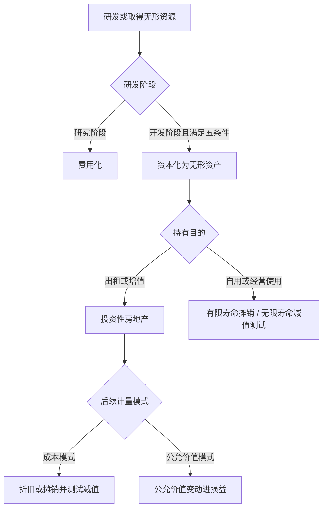

## 无形资产与投资性房地产

> 核心关系：研发阶段决定资本化边界，持有目的与后续计量模式决定无形资产或投资性房地产的后续处理。

## 无形资产的定义与初始计量

**无形资产（intangible asset）**：可辨认、无实物形态、非货币性的长期资产，由企业拥有或控制。主要类别包括专利权、非专利技术、商标权、著作权、土地使用权、特许经营权。

软件归属看可分离性：软件是硬件不可分割的组成部分时计入固定资产（如电脑的操作系统、空调的嵌入式系统）；与硬件可分离、独立使用的软件确认为无形资产。商誉不能与企业分离、不可辨认，不确认为无形资产。

无形资产以成本计量，包括购买价款、相关税费与直接归属于使资产达到预定用途的支出（软件测试费、专业服务费）。广告费、管理费等推广费用不计入成本。分期付款购买与固定资产处理相同，按购买价款现值确定成本，差额确认为未确认融资费用。

中国土地使用权：土地所有权公有，企业购买的是使用权。自建地上建筑物时，土地使用权作为无形资产单独摊销，建筑物作为固定资产单独折旧。房地产开发企业为对外销售而开发的土地使用权计入存货；土地与建筑物用于出租或持有待增值时归入投资性房地产。

## 研究与开发

研究阶段为获取新科学或技术知识进行的探索性调查，特征是探索性，成功与否不确定，支出全额费用化计入当期损益。开发阶段把研究成果应用于新产品的大规模生产或使用，特征为目标明确、成功可能性高，支出满足资本化条件的确认为无形资产。

资本化五条件：技术可行性；有意图完成该无形资产并用于出售或使用；能够带来未来经济利益（产品或资产本身存在市场）；有足够的技术、财务与其他资源支持开发；开发阶段支出能够可靠计量。

分录：归集时借 研发支出——费用化支出/资本化支出，期末费用化部分转入管理费用，资本化部分在达到预定用途时转入无形资产。

## 无形资产的后续计量、处置与披露

只对有限寿命资产摊销；无限寿命资产不摊销，但每年必须做减值测试。使用寿命不得超过合同或法律规定的受益期，两者都规定时取较短者；都无法合理确定时视为无限寿命。

摊销基数 = 成本 − 预计净残值 − 累计减值准备。无形资产净残值通常为零，除非第三方承诺回购或存在活跃市场可取得残值信息。摊销方法包括直线法、产量法与加速摊销法，摊销应反映经济利益预期实现方式。

减值：可收回金额 = max（公允价值 − 处置费用，未来现金流现值），低于账面价值时借 资产减值损失，贷 无形资产减值准备，一经确认不得转回；后续摊销以扣除减值后的新账面价值为基础。

处置分三种：出租计入其他业务收入，累计摊销计入其他业务成本；出售的售价与账面价值差额计入资产处置损益；报废转销账面价值计入营业外支出，典型情形是被新技术取代（如诺基亚手机系统被触屏时代颠覆）。

## 投资性房地产：范围与初始计量

**投资性房地产（investment property）**：为赚取租金收入、资本增值或两者兼有而持有的房地产，可单独计量和出售。范围包括已出租的土地使用权、已出租的建筑物、持有以备增值后转让的土地使用权。自用房地产与房地产开发企业的待售存货不属于投资性房地产。判断标准是持有目的而非当前是否产生收益。

确认时点：出租的按租赁合同约定的租赁期开始日；持有待增值的按自用终止、准备增值或转让之日。

初始计量按成本 = 购买价款 + 相关税费 + 直接归属支出。自建成本包括土地开发费、建筑安装费与达到预定可使用状态前的必要支出、资本化的借款利息；建设期间的非常损失计入当期损益。

## 投资性房地产：后续计量两种模式

成本模式：按月计提折旧或摊销，租金收入与折旧分别计入其他业务收入与其他业务成本；期末计提减值准备，减值不得转回。

公允价值模式：每期末把账面价值调整为公允价值，差额计入公允价值变动损益；不折旧、不摊销、不提减值。使用条件：资产所在地存在活跃的房地产交易市场，能从活跃市场取得同类房地产的市场价格。公允价值取成交价而非挂牌价。公允价值模式下设投资性房地产——成本明细科目，为后续公允价值变动明细留接口。

计量模式一经确定不得随意变更。成本模式可转为公允价值模式，按会计政策变更处理，差额计入期初留存收益；反向变更不允许。

## 投资性房地产：转换与处置

用途改变（管理层书面文件 + 实际用途改变）引起资产类别转换。成本模式转换按转换前账面价值对倒，不产生损益。

公允价值模式转换（非投资性 → 投资性）：转换日公允价值高于账面价值的差额计入其他综合收益，不确认当期损益——防止企业借转换虚增利润；低于账面价值的差额计入公允价值变动损益。投资性房地产 → 非投资性：入账价值 = 转换日公允价值，与账面价值的差额一律计入公允价值变动损益。

处置：处置价款计入其他业务收入，账面价值计入其他业务成本。公允价值模式下需把累计公允价值变动与转换日 OCI 余额转入其他业务成本，合计损益 = 处置收入 − 原始成本，已确认过的浮盈不得重复计入当期损益，处置时只是重分类。
