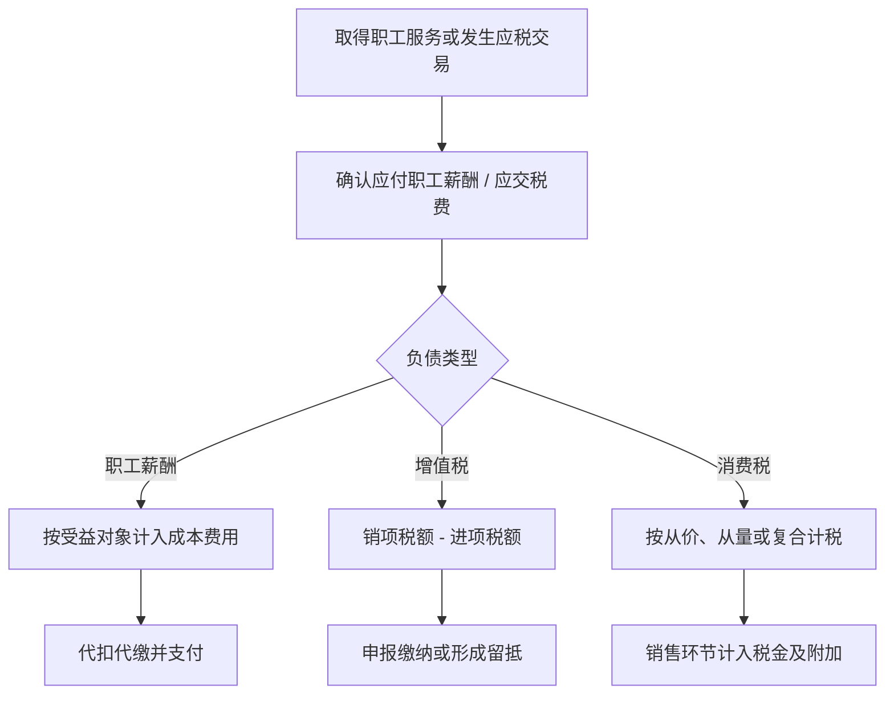

## 流动负债

> 核心关系：流动负债按义务来源分流，薪酬强调受益对象分配，税费强调计税环节与抵扣链条。

## 负债的定义与职工薪酬分类

**负债（liability）**：由过去交易或事项形成的现时义务，预期将导致经济利益流出企业。未来承诺不必然构成负债，可能本期不确认、未来再确认。**资产**由过去事项所控制的现时经济资源，关键词是控制而非拥有——融资租入设备出租方拥有法律所有权但承租方有效控制，设备确认为承租方资产。

**职工薪酬（employee benefits）**：企业为换取职工提供的服务或解除劳动关系而给予的各种形式的报酬。分四类：短期薪酬、离职后福利、辞退福利、其他长期职工福利。

短期薪酬指预计在报告期结束后 12 个月内全部结清的薪酬，包括工资奖金、职工福利费、社会保险费、住房公积金、工会经费、职工教育经费、带薪缺勤、短期利润分享计划与非货币性福利。离职后福利分设定提存计划（按固定金额缴入独立基金，中国普遍）与设定受益计划（退休后按年金领取固定待遇，美国大公司与我国体制内流行）。辞退福利为提前解除劳动关系或鼓励自愿裁减而付，一次性计入当期管理费用。

## 短期薪酬核算与代扣代缴

薪酬按受益对象分配：生产工人计入生产成本，车间管理人员计入制造费用，总部与工厂经理计入管理费用，销售人员计入销售费用，工程施工人员计入在建工程，研发人员计入研发支出。

代扣代缴：医疗、工伤、失业保险与住房公积金按员工工资一定比例由个人负担，个人所得税由企业按月代扣代缴。计提时按受益对象借记成本费用、贷记应付职工薪酬；发放时实发部分贷记银行存款，代扣部分贷记其他应付款与应交税费；缴付时再冲转。代扣部分只是负债内部的划转，这解释了为何每月实发工资低于合同约定。

工会经费与职工教育经费分别按工资总额 2% 与 1.5% 计提。短期利润分享计划基于团队整体业绩，在经营成果归属期间确认，而非发放期间。

## 带薪缺勤

带薪缺勤分累积与非累积。累积带薪缺勤当期未用完可结转以后年度；非累积带薪缺勤当期未用完即作废、离职时不折算现金。

累积带薪缺勤的负债与费用在提供服务当期确认：应付职工薪酬 = 员工人数 × 未休天数 × 日工资。员工提供服务的同时获得了未来休假的权利，负债已形成，遵循权责发生制在服务当期确认。次年实际休假时不再确认新费用，而是冲减上年已确认的负债与成本，因为休假期间员工并未提供额外服务。

## 非货币性福利

**非货币性福利**：向职工发放自产或外购产品、无偿提供资产使用权。

发放自产产品视同销售，按公允价值计量应付职工薪酬，同时确认营业收入与销项税额、结转成本。发放外购商品用于职工福利属非增值税应税活动，进项税额不得抵扣；若购入时已先抵扣，发放时做进项税额转出（贷 应交税费——进项税额转出）。无偿提供自有资产按折旧确认福利成本，租赁资产按租金确认。

## 应交增值税

**增值税（VAT）**：对销售货物、提供劳务的增值额课征的流转税，是我国主体税种。一般计税方法：应交增值税 = 当期销项税额 − 当期进项税额。销项随销售确认、进项随采购确认，购买方付出的进项税正是销售方收取的销项税，环环抵扣、仅对增值部分课税，避免重复征税。进项大于销项形成留抵税额，可结转以后期间继续抵扣。

简易计税方法针对小规模纳税人：应交增值税 = 含税销售额 ÷（1 + 征收率）× 征收率，不再区分销项与进项，征收率低，扶持小微企业，选定后 36 个月内不得变更。

## 应交消费税

**消费税（consumption tax）**：对生产、委托加工、进口应税消费品征收，目前共 15 个税目，多属奢侈品、环境不友好或健康危害品，兼具收入与调节功能。

三种计税方法：从价定率 = 销售额 × 税率；从量定额 = 销售数量 × 单位税额；复合计税 = 销售额 × 税率 + 销售数量 × 单位税额（白酒、卷烟）。消费税是价内税，税额包含在售价中，与增值税的价外税相对。

会计处理：对外销售借 税金及附加，贷 应交税费——应交消费税。自产应税消费品用于非应税产品生产、在建工程、行政管理部门、集体福利、对外投资、无偿捐赠等视同销售情形，移送时均须计税；用于连续生产应税消费品时移送不再计征，最终产品才征税，避免重复课税。进口所缴消费税计入存货成本；委托加工由受托方代收代缴，收回后直接出售的消费税计入加工物资成本，用于连续生产且可抵扣的计入应交税费——应交消费税借方。

## 案例：五粮液与白酒消费税

白酒在生产环节课征消费税，含从价与从量两部分。五粮液以约 140 元/瓶的内部转移价格卖给集团内关联进出口公司，再由其以约 469 元/瓶对外销售。若按 140 元计税，每瓶从价消费税 = 28 元，利润从生产环节转移到销售环节，税基被压低。

最低计税价格规则：白酒生产企业销售给销售单位的计税价格低于其外部售价 70% 的，税务机关可核定最低计税价格，一般按外部售价的 60%—70% 核定。按 60% 核算：469 × 60% = 281.4 元，281.4 × 20% = 56.28 元，税负约为原 28 元的两倍。关联方交易的定价安排会系统性影响税基，最低计税价格规则防止生产企业借低转让定价压减消费税。
