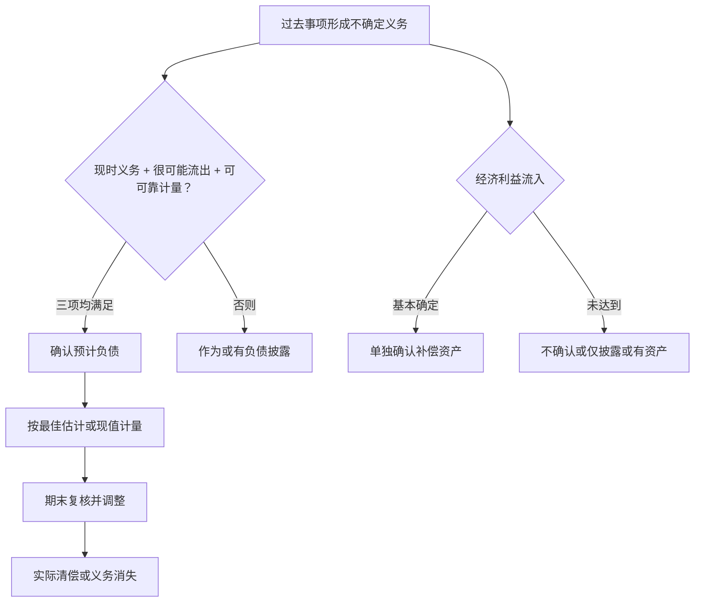

## 或有事项与预计负债

> 核心关系：预计负债以三项确认条件为分界，或有负债与或有资产主要承担披露和谨慎性约束。

## 或有事项与三类结果

**或有事项（contingencies）**：由过去交易或事项形成、其结果取决于未来事项发生或不发生的不确定事项，常见如未决诉讼、债务担保、产品质量保证。特征三条：由过去交易或事项引起；结果不确定；最终结果取决于未来事项。

或有事项的三种结果：或有负债、或有资产、预计负债。

**或有负债**：潜在义务（其存在与否需通过未来不确定事项证实）或现时义务，但经济利益流出很可能不满足或金额不能可靠计量。或有负债不确认、只在附注披露；除极小可能外一律披露，对发生频繁或影响重大的即使极小可能也须披露。

**或有资产**：由过去交易或事项形成的潜在资产，其存在只能靠未来事项证实。依谨慎性原则，或有资产通常既不确认也不披露；若有确凿证据表明经济利益很可能流入，在附注中披露形成原因与预期财务影响。确认的不对称：预计负债满足条件立即确认，或有资产要基本确定才可能确认。

概率四级（会计口径）：基本确定 95% < p < 100%；很可能 50% < p ≤ 95%；可能 5% < p ≤ 50%；极小可能 0 < p ≤ 5%。日常说的"不太可能"在会计上仍可能是"可能"，标准是是否超过 50%。

## 预计负债的确认与计量

确认三条件同时满足：现时义务；经济利益很可能流出；金额能可靠计量。三条都满足才确认预计负债，否则归为或有负债。

初始计量按清偿义务所需支出的最佳估计数，货币时间价值影响重大时按未来现金流出折现后的现值计量。最佳估计数三种情形：连续区间且区间内各结果等概率，取区间中点；单项事项（未决诉讼、债务担保）取最可能发生金额，不用统计期望值；多项事项（产品质量保证）按各种可能结果及其概率加权计算期望值。

账务处理：对外担保、未决诉讼借 营业外支出，贷 预计负债；产品质量保证借 销售费用，贷 预计负债；实际清偿借 预计负债，贷 银行存款。

预期可获得补偿：清偿负债的支出预计可向第三方追偿的，只有基本确定能收到时才单独确认为资产（借 其他应收款，贷 营业外支出），补偿金额不能与预计负债抵销，且不得超过预计负债账面价值；确认前提是相关预计负债已先确认。

## 弃置义务

**弃置义务（asset retirement obligations）**：因法律法规要求，资产退役时需承担的环保与生态恢复义务，如核电站退役拆除与辐射治理、油气井封堵与场地清理。金额大、距将来远，未来应付款与现值差异大，按现值入账：现值计入固定资产成本，同时确认预计负债。

资产使用期内每期按期初摊余成本 × 实际利率确认利息费用（借 财务费用，贷 预计负债），滚计至义务到期，期末预计负债滚至实际支付金额。这与债券的利息摊销逻辑一致，区别是债券分期付息，弃置义务期末一次性支付本息。

## 亏损合同

**亏损合同（onerous contracts）**：履行合同义务不可避免的成本超过预期经济利益的合同。合同未执行或已部分执行、预计成为亏损合同时，若满足确认条件，确认预计负债。

计量基础：退出合同的最小净成本，即履行合同成本与违约赔偿（违约金）两者孰低；涉及多期支付时按现值计量。每期确认利息费用并按约支付款项，逐年滚算与债券摊余成本逻辑一致。

## 后续计量与披露

资产负债表日复核预计负债，有确凿证据表明账面价值未反映当前最佳估计的，调整至当前最佳估计。报表上按预计结算时点列示为流动或非流动负债。附注披露类型、形成原因、未来经济利益流出的不确定性、期初与期末余额及变动、当期确认的预期补偿金额。

披露的实例：沃尔玛在美国各地经营大量药店、销售处方类镇痛药物，涉及阿片类药物滥用诉讼风险，虽个别诉讼可能性极小，但因该类或有负债发生频繁、对财务状况与经营成果影响重大，公司须在附注中披露。主动披露好于问题爆发后被动解释。
