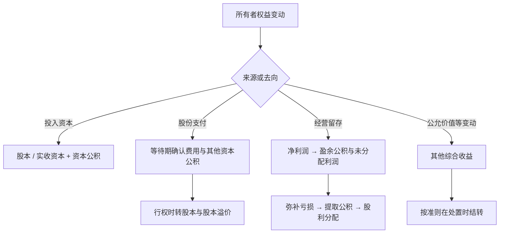

## 所有者权益

**所有者权益（owner's equity）**：资产减负债后的所有者剩余权益。中国构成：实收资本（股本）、资本公积、其他综合收益、盈余公积、未分配利润；盈余公积与未分配利润构成留存收益。

> 核心关系：所有者权益由投入、留存、股份支付和 OCI 等渠道共同形成，并通过利润分配或处置完成内部流转。

## 实收资本的增加与减少

**实收资本（paid-in capital）/ 股本（share capital）**：所有者投入的资本。股份公司设股本科目按面值记账，非股份公司设实收资本科目。

增加实收资本的四种渠道：

- 接受所有者投资：股份公司发行股票，面值部分记股本，溢价部分记资本公积——股本溢价，发行费用直接冲减股本溢价。非股份公司接受非货币资产投资按公允价值入账，增值税进项税额单独确认。
- 公积转增资本：盈余公积、资本公积经股东会决议按现有持股比例结转，转增后法定盈余公积余额不得低于转增前注册资本的 25%。
- 可转换债券转股：按债券面值、利息调整、其他权益工具与新增股本、股本溢价之间的勾稽结转。
- 发放股票股利：以新增股份代替现金分配，不改变资产、负债与权益总额，只把留存收益转为股本；股东持股比例不变，不改变控制结构。

减少实收资本：股份公司减资的典型方式是回购本公司股份。回购时借 库存股，贷 银行存款。库存股是已发行又回到公司、暂未注销的股份，不是资产，在资产负债表中作为所有者权益的减项列示。注销时对比回购成本与面值：回购成本高于面值，差额先冲减股本溢价（以发行溢价为限），不足依次冲减盈余公积、未分配利润；回购成本低于面值，差额贷记资本公积——股本溢价。非股份公司减资直接借 实收资本，贷 银行存款。

## 其他权益工具与资本公积

**其他权益工具（other equity instruments）**：股份有限公司发行的、分类为权益的除普通股以外的金融工具，包括优先股、永续债和可转换公司债券的转换权价值。优先股股息固定、无到期日、通常不具表决控制权，故不记入股本而列入其他权益工具。

**资本公积（capital reserve）**：投资者投入但不构成实收资本的资本，明细科目三个：资本溢价（非股份公司出资超过注册资本份额的差额）、股本溢价（股份公司发行价与面值之差）、其他资本公积（主要来自股份支付）。

## 股份支付

**股份支付（share-based payment）**：企业为获取职工服务而以权益工具（如股票期权）作为对价。关键日期：授予日、等待期、可行权日、行权日。

权益工具按授予日公允价值计量。有等待期的，授予日不作账，等待期内每个资产负债表日按最佳估计的可行权数量 × 授予日公允价值 × 已过等待期比例确认费用，估计数变化要修正，可行权日累计金额调整为实际可行权数，可行权日后不再调整总额。

确认费用：借 管理费用等，贷 资本公积——其他资本公积。行权日：借 银行存款（行权价 × 股数）、资本公积——其他资本公积（累计已确认金额），贷 股本（面值）、资本公积——股本溢价（差额）。员工提供的服务是资本投入的一部分，行权后员工成为股东，累计的其他资本公积转入股本溢价。

## 其他综合收益

**其他综合收益（OCI）**：按会计准则规定不确认为当期损益的利得与损失。一般由特定资产的估值变动引起；处置相关资产时关联的 OCI 一并转出；OCI 不得用于转增资本。

三类来源：

- 其他债权投资与其他权益工具投资的公允价值变动。
- 自用房地产或存货（开发产品）转换为以公允价值计量的投资性房地产时，转换日公允价值高于账面价值的差额（谨慎性，不得确认当期利润）。
- 权益法核算的长期股权投资按持股比例确认的被投资单位 OCI 变动份额。

## 留存收益与利润分配

**留存收益（retained earnings）**：历年经营实现、留存在企业内部的利润，含盈余公积与未分配利润。

盈余公积分法定盈余公积（按税后利润 10% 提取，累计达到注册资本 50% 后不再提取）与任意盈余公积。未分配利润 = 期初未分配利润 + 本年度税后利润 − 本年已分配利润。

利润分配顺序：弥补以前年度亏损；提取法定盈余公积；按章程或决议提取任意盈余公积；按持股比例向股东分配剩余利润。未补亏、未提法定盈余公积前不得分配。

盈余公积两大用途：弥补亏损（借 盈余公积，贷 利润分配——盈余公积补亏）与转增资本。用税前或税后利润补亏不需做分录，年末本年利润借方余额与利润分配——未分配利润贷方余额自然抵销。

利润分配账户体系：期末各损益类科目余额结转入本年利润，年末本年利润余额转入利润分配——未分配利润；利润分配各明细科目（提取盈余公积、应付现金股利、转作股本的股利等）年末全部结转至利润分配——未分配利润。

现金股利宣告日借 利润分配——应付现金股利，贷 应付股利；支付日借 应付股利，贷 银行存款。股票股利借 利润分配——转作股本的股利，贷 股本。
