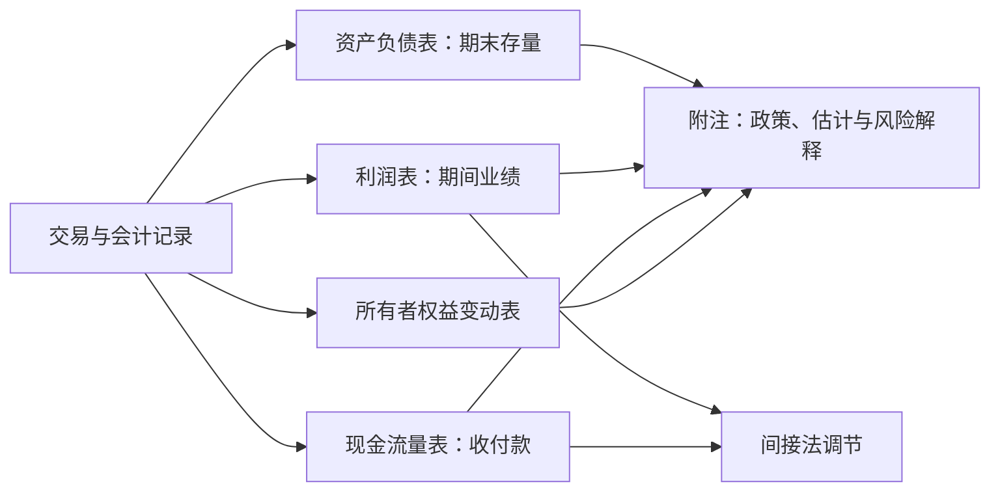

## 财务报表

**财务报表（financial statements）**：由资产负债表、利润表、现金流量表、所有者权益变动表和附注组成，附注是财务报表的组成部分。上市公司年报可查巨潮资讯网，美国公司可查 SEC EDGAR 电子申报系统。按报告主体分个别报表与合并报表，分析集团时一般以合并报表为准。

> 核心关系：四张主表从存量、业绩、现金与权益四个角度反映同一套记录，附注负责补充口径与风险。

## 资产负债表

**资产负债表（balance sheet）**：反映企业在某一特定日期的财务状况，是静态报表，只给出资产负债表日当天的快照。基本关系：资产 = 负债 + 所有者权益；流动资产 − 流动负债 = 营运资本。

列报顺序：资产按流动性递减排列，负债按到期日递增排列，所有者权益按永久性递减：实收资本、其他权益工具、资本公积、其他综合收益、盈余公积、未分配利润。

填列六种方法：

- 按总账科目余额直接填列：其他权益工具投资、递延所得税资产或负债、应付票据、实收资本、资本公积、盈余公积等。
- 几个总账科目余额加总：货币资金 = 库存现金 + 银行存款 + 其他货币资金。
- 按明细科目余额计算：应收账款 = 应收账款明细借方余额 + 预收账款明细借方余额 − 坏账准备；应付账款 = 应付账款明细贷方余额 + 预付账款明细贷方余额。
- 总账余额加明细分类：长期借款、应付债券、长期应付款中一年内到期部分转入一年内到期的非流动负债；债权投资中一年内到期部分转入一年内到期的非流动资产。
- 净值法：固定资产减累计折旧与减值准备，无形资产减累计摊销与减值准备，长期应收款减未实现融资收益，长期应付款减未确认融资费用。
- 综合运用：存货 = 原材料、库存商品、发出商品、材料采购、在途物资等账户合计 ± 材料成本差异 − 存货跌价准备。

流动与非流动以一年（或一个营业周期）为界，一年内到期的长期负债重分类为流动负债，一年内到期的长期资产重分类为流动资产。

## 利润表与每股收益

**利润表（income statement）**：反映企业在某一会计期间的经营业绩，是动态报表。

多步式利润表分三步：营业利润；利润总额 = 营业利润 + 营业外收入 − 营业外支出；净利润 = 利润总额 − 所得税费用。净利润之下列示税后其他综合收益，净利润 + 其他综合收益 = 综合收益总额。OCI 不进入净利润与每股收益的计算。

**基本每股收益** =（净利润 − 优先股股利）÷ 加权平均普通股股数。加权平均 = 期初股数 + 增发股数 × 发行后流通月数 / 12 − 回购股数 × 回购后月数 / 12。

资本结构复杂（存在可转换债券、股票期权等潜在普通股）时计算**稀释每股收益**：假设潜在普通股全部转换后，调整净利润与股数再相除。净利润增加 = 负债成分账面价值 × 市场利率 ×（1 − 税率）（税后利息节省），股数按转换比例加计。稀释 EPS 是更保守的盈利指标。

## 现金流量表

**现金流量表（statement of cash flows）**：反映企业一定会计期间现金及现金等价物的流入和流出。现金 = 库存现金 + 随时可支付的银行存款。现金等价物：期限短、流动性强、易于转换为已知金额现金、价值变动风险很小的投资。股票不算现金等价物（市价波动大、价值不确定），货币市场基金属于，三年期定期存款不是。现金与现金等价物之间的转换不构成现金流量表收支。

三类活动：经营活动（销售、采购、提供或接受服务、缴税，是决定企业能否不依赖外部融资的主渠道）；投资活动（长期资产与除现金等价物以外投资的取得、构建与处置）；筹资活动（导致资本与债务规模、结构变动的活动）。

**直接法**：按现金收支的主要类别直接列报经营活动现金流量。销售收现 = 营业收入 + 销项税额 −（期末应收 − 期初应收）+（期末预收 − 期初预收）−（坏账核销 + 坏账收回）− 销售退回付现。购货付现 = 购货成本 + 进项税额 +（期初应付 − 期末应付）+（期末预付 − 期初预付），购货成本 = 销货成本 + 期末存货 − 期初存货。

**间接法**：以净利润为起点，调整不涉及现金的收入与费用、剔除投资与筹资活动影响，得到经营活动现金流量。调整逻辑：不涉及现金但已计入损益的项目（折旧、摊销、减值）加回；属于投资或筹资活动的损益（处置损益、公允价值变动、投资收益、财务费用）剔除；经营性应收、应付与存货变动反向调整。

间接法调整项目（附注对账）：净利润加资产减值准备、固定资产折旧、无形资产与长期待摊费用摊销、处置长期资产损失、固定资产报废损失、公允价值变动损失、财务费用、投资损失；递延所得税资产减少（增加调减）、递延所得税负债增加（减少调减）；存货减少（增加调减）、经营性应收减少（增加调减）、经营性应付增加（减少调减）。

中国准则要求主表用直接法编制，同时在附注中披露净利润调节为经营活动现金流量的间接法对账。

## 附注披露

附注披露内容包括：企业基本情况；编制基础（持续经营）；重要会计政策与会计估计；政策与估计变更的说明；重要项目说明；或有事项；资产负债表日后事项；非常事项；关联方关系及其交易。

**会计政策**是确认与计量的原则方法，如存货发出计价方法、折旧方法；**会计估计**是年限、残值、比例等判断，如坏账准备的具体百分比、固定资产预计使用年限。估计变更情形：估计的基础发生变化或取得新信息。监管与审计对通过改变估计使利润上升的情形高度警惕。

## 盈余管理案例

蓝田股份：收入端把产品销售收入虚增至 5.29 亿元，称交易在鱼塘边与个体商户现场现金完成、无送货单；同时虚增主营业务成本，否则毛利率会露馅。资产端把虚增收入带来的"多余现金"投入在建工程再结转固定资产："鱼塘升级改造"项目每年投入超 2 亿元、无结算单据。2001 年追溯调整后 2000 年主营业务收入从 18.41 亿元调至 3,809 万元，净利润从 4,316 万元调为亏损 1,069 万元。

鞍钢与达美航空：航空公司飞行设备使用年限与残值估计差异巨大（达美航空 25—34 年，新加坡航空 12—15 年）。延长使用年限直接减少当年折旧并增加利润：鞍钢 2011 年延长使用年限使净利润增加 1.21 亿美元，达美 2008 年延长使税后净利润增加约 6,900 万美元。会计准则对使利润上升的会计估计变更有严格限制。

新赛股份：2014—2017 年归母净利润为 1,435 万元、负 1.10 亿元、负 4.74 亿元、1,110 万元。连续两年亏损将被 ST，公司 2017 年必须盈利。2015—2016 年"反正无望盈利"，把商誉一次性全额减值（"洗大澡"），既降低被审计师反复质询的风险，又让 2017 年轻装上阵保住盈利。商誉每年末须做减值测试，测试高度依赖管理层判断。
