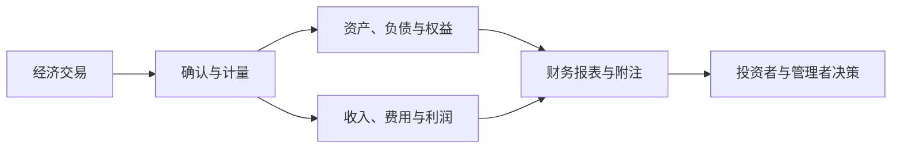

## 中级财务会计学

> 以对外报告为核心，从总论到财务报表讲授资产、负债、所有者权益、收入费用利润与报告体系

> 核心关系：中级财务会计把交易转成要素确认、后续计量和报表披露，最终服务外部决策与问责。

## 课程简介

- [中级财务会计学课程导论](00-intro.md)：AI 时代为什么学会计、会计的功能、信任机制与问责、财务会计基本框架

## 资产核算

- [存货](01-inventory.md)：存货定义与所有权判定、实际成本原则、计划成本法、委托加工物资、成本与可变现净值孰低与跌价准备、獐子岛造假案例
- [应收款项](02-receivables.md)：应收票据计量与贴现、应收账款折扣与坏账准备、保理融资、其他应收款与披露
- [金融工具：债务工具](03-financial-instruments-debt.md)：债权投资摊余成本、实际利率法摊销、提前赎回、预期信用损失减值、其他债权投资 FVOCI
- [金融工具：权益工具与交易性金融资产](04-financial-instruments-equity-and-trading.md)：金融工具分类与计量政策、其他权益工具投资、交易性金融资产核算
- [长期股权投资](05-long-term-equity-investments.md)：控制共同控制重大影响、同一与非同一控制初始计量、成本法与权益法、减值处置与披露
- [固定资产](06-fixed-assets.md)：外购与自行建造初始计量、折旧四种方法、后续支出资本化与费用化、减值与处置
- [无形资产与投资性房地产](07-intangibles-and-investment-property.md)：无形资产初始与后续计量、研发支出资本化、投资性房地产两种模式与转换处置

## 负债、权益与损益

- [流动负债](08-current-liabilities.md)：职工薪酬四分类、短期薪酬代扣代缴、带薪缺勤、非货币性福利、应交增值税与消费税、五粮液案例
- [非流动负债](09-non-current-liabilities.md)：长期借款、应付债券、可转换债券拆分与转股、借款费用资本化
- [或有事项与预计负债](10-contingencies-and-provisions.md)：或有事项三类结果、预计负债确认计量、弃置义务与亏损合同
- [所有者权益](11-owners-equity.md)：增资减资、其他权益工具与资本公积、股份支付、其他综合收益、留存收益与利润分配
- [收入确认与所得税会计](12-revenue-recognition-and-income-tax.md)：收入五步法、附退货售后回购分期收款特殊销售、费用与利润、资产负债表债务法与递延所得税
- [财务报表](13-financial-statements.md)：资产负债表填列、利润表与每股收益、现金流量表直接法与间接法、附注披露与盈余管理案例
