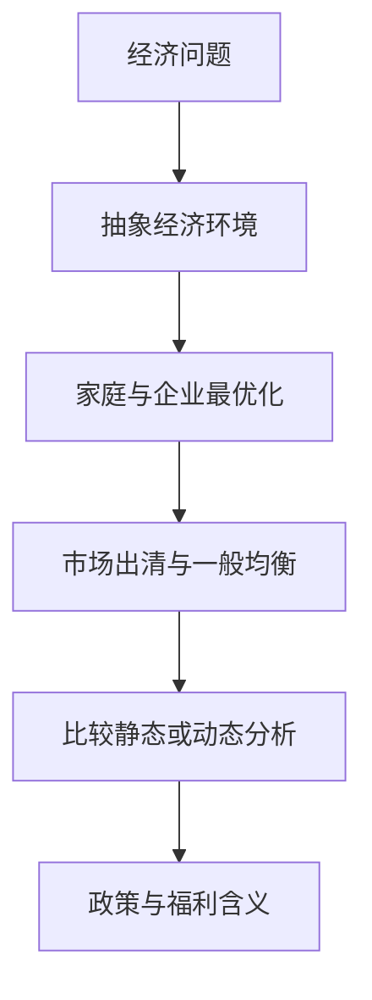

## 中级宏观经济学课程导论

> 核心关系：宏观模型把现实问题压缩为可求解的主体、约束与均衡，再由均衡结果回答政策问题。

## 现代宏观经济学的分析方法

传统宏观经济学只研究少数几个宏观变量的统计规律，并据此预测。政策干预改变经济运行状态，基于旧数据得到的统计规律随之失效。现代宏观经济学从微观基础出发，把宏观问题还原为家庭、企业等微观主体的最优化决策及其加总，借助模型这一"人工世界"进行虚拟实验。

**卢卡斯批判**：评估宏观政策效果必须基于微观基础与前瞻性预期。菲利普斯曲线描述通胀与失业率负相关的统计规律，政府曾据此用宽松政策压低失业率。1970 年代石油危机后，央行继续宽松，失业率不降反升，出现滞胀。市场主体是理性且前瞻的，预判宽松政策后减少支出、企业减少雇佣，政策目标因此落空。政策预期本身改变行为轨迹。

宏观经济学传统上无法做真实实验。直升机撒钱是教科书式思想实验，真实实施的社会成本巨大。构建模型成为替代方案：模型是用数学表达的正式理论，是一个"人工的世界"。所有模型都是假的，但有些是有用的——模型要有用就必须简单，一张完整复制现实细节的地图一文不值。参数过多会过拟合，但大数据与机器学习理论发现，参数增大到一定阈值后模型解释力反而单调上升。

## 宏观与微观的界限

1980 年代以前，宏观经济学的研究方法与微观经济学明显区别。此后，微观经济学的标准理论——效用最大化、利润最大化、供求均衡、一般均衡——全部被引入宏观分析，两学科方法论趋同。宏观与微观的界限按研究的问题划分，分析方法不再作为划分标准。微观经济学关注个体行为细节：博弈、机制设计、信息披露。宏观经济学关注大量微观主体最优决策加总后的宏观动态运行规律。

## 经济模型的一般特征

任何经济模型都含有不同类型的行为主体，他们在约束下做决策。构建模型要描述清楚：行为人做什么决策、受什么约束、拥有什么信息。

**家庭**：描述偏好与要素禀赋，在约束下最大化效用。**企业**：交代投入如何转换为产出的技术状况，选择要素投入以最大化利润。**政府**：交代政策工具及约束，本课把政府政策视为外生给定，考察政策变化对家庭与企业最优化行为的影响。

## 模型的三个层次与两个基本假定

经济模型由三个层次构成。第一层用数学函数描述决策前的经济环境：效用函数描述嗜好，生产函数描述生产条件，预算约束描述制度环境。第二层用最优决策理论分析自利行为，结果是比较静态分析。第三层用均衡概念分析自利行为交互作用的结局，分为局部均衡与一般均衡。三个层次若考虑时间因素，分别为动态决策与动态均衡分析。

使模型运转的两个基本假定：其一，消费者和企业都追求最大化，在给定约束下尽力做到最好；其二，消费者与企业通过竞争均衡结合，单个主体是价格接受者，所有市场的价格确保供给等于需求。

## 一般均衡与时间

学习宏观经济学要抓住两条主线。第一条是一般均衡：劳动市场、商品市场、信贷市场相互依存、相互影响，单看一个市场是局部均衡，三个市场联动是宏观分析的基本框架，分析出发点永远是经济中个体的最优化行为。第二条是时间：宏观经济学绝大多数问题都是动态问题，静态一般均衡、动态一般均衡、动态稳定一般均衡构成串联各讲模型的基本线索。

## 本课定位

本课面向经济学拔尖班与数字金融班，以理论为主，讲授重点是建模、分析模型、求解模型、解读模型。课程内容七个部分：导论、单期一般均衡模型、两期与三期模型、动态规划、无限期动态模型、RBC 与新凯恩斯模型、宏观金融模型。教学目标为：从微观基础出发分析宏观经济问题，梳理宏观经济分析的基本思路与方法，克服对数学的敬畏。
