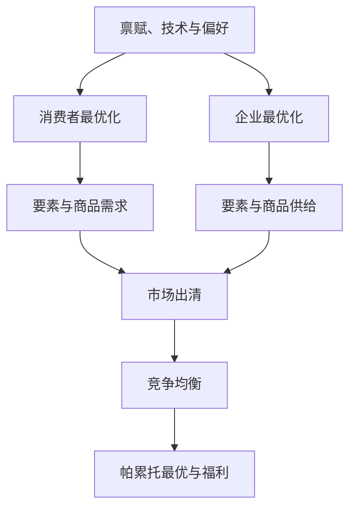

## 代表性行为人模型

> 核心关系：代表性行为人模型用家庭和企业的一阶条件加市场出清条件共同确定竞争均衡。

## 异质性与完备市场

真实经济中的行为人在收入、财富、偏好、信息上各不相同，宏观经济学研究的是全体行为人行为加总后的总量规律。加总对象是 10 亿量级的异质个体，个体特征差异可用概率分布刻画，但分布函数是无穷维对象，直接加总不可行。

代表性行为人模型假定经济中只有一个代表性消费者和一个代表性企业。该假设有理论依据：在完备市场中，个体风险可通过阿罗-德布鲁证券的交易对冲，均衡时所有人的收入与偏好相同，异质性被抹平。两位同学互发"成绩挂钩证券"，成绩高者向对方付钱，均衡下无论谁考第一，两人最终收入相同。总体风险无法通过内部交易消除：两人能否都考过 80 分取决于共同因素。

## 决策环境

经济活动只进行一期，一个代表性消费者加一个代表性企业，双方都是价格接受者。消费者拥有 $k_0$ 单位资本与 $h$ 单位时间禀赋，时间可用于劳动或闲暇；企业用资本与劳动生产。经济中只有一种商品，可消费也可作为资本。

效用函数 $u(c,l)$ 刻画偏好，$c$ 为消费、$l$ 为闲暇。效用函数严格凹、二次可微、对每个变量严格递增，满足稻田条件：$\lim_{c\to 0}u_1(c,l)=\infty$、$\lim_{c\to\infty}u_1(c,l)=0$。稻田条件保证内点解。

生产函数 $y = zf(k,n)$，$z$ 为全要素生产率。生产函数严格准凹、二次可微、一次齐次、对每个变量严格递增，并满足稻田条件。一次齐次即规模报酬不变：对任意 $\lambda>0$ 有 $\lambda y = zf(\lambda k,\lambda n)$。

凹函数与严格准凹函数的选择有规则。无约束优化只需准凹即可保证唯一全局最大，因此企业利润最大化问题中的生产函数只需严格准凹；有约束优化需要凹函数加凸约束集，因此消费者效用函数设为严格凹。单调变换保持准凹性而不保持凹性，更符合序数效用只关心排序的性质。

## 消费者最优化

经济中没有货币，所有价格都是相对价格，选一种商品把价格标准化为 1，该商品为计价物。消费品价格为 1，闲暇价格为工资 $w$，资本租金为 $r$。若同一种商品出现两个价格，就出现套利；套利与均衡不相容。

消费者把 $w$ 和 $r$ 视为给定，在预算约束下最大化效用：

$$\max_{c,l,k_s}\ u(c,l)\quad s.t.\quad c\le w(h-l)+(1+r)k_s$$

由于效用随消费递增，消费者把全部资本租出，$k_s=k_0$。拉格朗日法一阶条件给出：

$$\frac{u_2}{u_1}=w$$

闲暇与消费的边际替代率等于工资率。劳动供给函数 $n_s(w,r)=h-l(w,r)$ 从最优化行为推出，有微观基础。工资上升对闲暇的影响取决于替代效应与收入效应的对比，方向不确定，劳动供给曲线可能向后弯曲。

## 企业最优化与零利润

厂商利润为 $\pi = zf(k_d,n_d)-(1+r)k_d-wn_d$，折旧率取 $\delta=1$，资本使用后完全报废。厂商把 $w$、$r$ 视为给定，无约束最大化利润，一阶条件：

$$zf_1=1+r,\qquad zf_2=w$$

资本边际产出等于资本租金成本，劳动边际产出等于工资。边际产出递减意味着劳动边际产出曲线就是劳动需求曲线，资本边际产出曲线就是资本需求曲线。

一次齐次函数满足欧拉定理：$zf(k,n)=zf_1k+zf_2n$。结合一阶条件，完全竞争加规模报酬不变推出均衡利润为零。零利润是最大化行为之后的均衡结果，厂商仍在按边际条件优化。由此得出两个结论：无需关注厂商利润分配；厂商最优规模不确定，厂商数目不影响竞争均衡解。

## 竞争均衡与瓦尔拉斯定理

竞争均衡是数量解 $(c,l,n,k)$ 与价格解 $(w,r)$ 的组合，满足消费者最优、企业最优、市场出清。三个市场为劳动市场 $h-l=n_d$、消费品市场 $y=c$、资本租赁市场 $k_s=k_0=k_d$。

三个出清方程只有两个价格未知数。由消费者预算约束与厂商利润归消费者所有，整个经济的超额需求总额恒等于零：

$$c-y+w[n_d-(h-l)]+(1+r)(k_d-k_0)=0$$

三个出清方程的系数向量线性相关，任意两个成立时第三个自动成立。**瓦尔拉斯定理**：整个市场的超额需求总额恒等于零，$M$ 个市场只需 $M-1$ 个出清，最后一个自动出清。求解时可省略任意一个出清条件。

代表性行为人模型刻画大量恰好相同的个体，经济中并非只有一个人。个体变量与总量变量在均衡中数值相等，但经济含义不同：个体是无穷小的，其决策改变不了由总量决定的企业利润，求解个体问题不能对利润求导。

## 帕累托最优与福利经济学定理

均衡解保证每个行为人福利最大，但是否保证整个社会福利最大需要判断标准。

**帕累托最优**：不存在另一可行的分配使所有人都不比原来差且至少一人严格变好。社会最优使社会福利即总效用和最大，社会最优蕴含帕累托最优，反之不然。代表性行为人模型中人人相同，二者等价。

社会计划者问题设想一个没有市场的计划经济：全部决策由仁慈且万能的社会计划者作出，不存在价格。计划者最大化 $u(c,l)$，受资源约束 $c = zf(k_0,h-l)$。计划经济中没有价格，因此没有预算约束，该约束称为资源约束。一阶条件 $zf_2(k_0,h-l)u_1-u_2=0$。

生产可能性边界（PPF）刻画经济可达的商品组合集合的边界，PPF 斜率为负的劳动边际产出，边际转换率等于劳动边际产出。社会最优的几何刻画是最高无差异曲线与 PPF 相切，切点条件 $MRT=MRS$。

福利经济学第一定理：竞争均衡是帕累托最优。市场均衡方程与计划者一阶条件完全相同，竞争均衡解与社会最优点重合。福利经济学第二定理：任意帕累托最优分配都能被某个市场经济支持，存在相应的相对价格向量使之成为竞争均衡结果。第二定理由阿罗与德布鲁证明。

定理成立的限制条件：不存在外部性、完全竞争、不存在扭曲税。外部性是行为对他人福利的未定价影响，负外部性导致过度排污，正外部性导致公共品供给不足。科斯定理指出外部性的根本原因是产权界定不明晰。扭曲税按比例改变相对价格，总额税不扭曲行为。

## 比较静态与政府行为

数值例子取 CRRA 效用 $u(c,l)=\frac{c^{1-\theta}-1}{1-\theta}+l$ 与 Cobb-Douglas 生产函数 $y=zk^{\alpha}n^{1-\alpha}$。先解社会计划者问题，得到只含 $l$ 的一元优化问题，再经市场出清与厂商一阶条件得到全部均衡量。

对全要素生产率 $Z$ 做比较静态：消费与产出是 $z$ 的增函数，均衡工资与利率也是 $z$ 的增函数。$z$ 对就业的影响不确定：$z$ 提高使实际工资上升、闲暇变贵，替代效应增加就业，收入效应减少就业，总效应取决于相对风险回避系数 $\theta$ 与 1 的大小。经验上就业顺周期，要求替代效应大于收入效应。

政府以总额税 $\tau$ 融资购买 $g$，预算约束 $g=\tau$。总额税不扭曲，竞争均衡与帕累托最优仍等同。政府购买增加使资源约束线下移，私人消费与闲暇均下降，形成挤出效应；消费减少量小于政府购买增加量，属于部分挤出。
