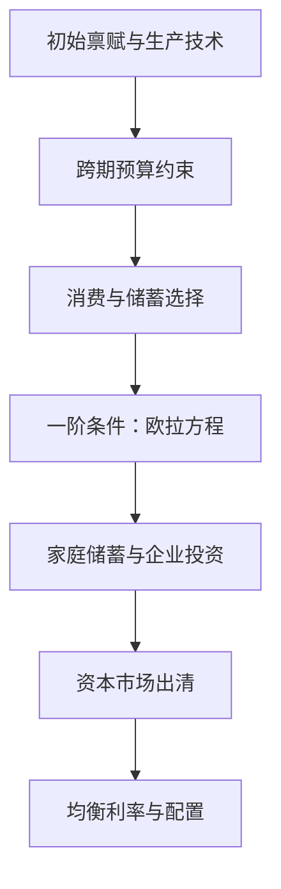

## 两期动态模型与欧拉方程

> 核心关系：欧拉方程连接相邻时期的边际效用，市场出清则把个体跨期选择转化为均衡利率。

## 纯交换两期模型

经济中有 $N$ 个消费者、没有企业、信息完全、不存在不确定性。消费者是异质的：每个消费者两期总收入相等，但两期之间的分布不同。分布不同的目的是引入债券市场，若人人相同，则要么都想借、要么都想贷，不存在交易对手。

偏好为时间可分离形式：

$$U = u(c_1) + \beta u(c_2)$$

$\beta$ 为贴现因子，$\beta=1/(1+\rho)\in(0,1)$，反映消费者更看重当期消费。期效用函数 $u(\cdot)$ 严格递增、严格凹、满足稻田条件。

消费者以购买债券储蓄，$b_t$ 为 $t$ 期购买的债券量，$b_t<0$ 表示净借入者。第一期 $c_1+b_1=y_1$，第二期 $c_2=(1+r)b_1+y_2$。合并预算约束消去 $b_1$ 得跨期预算约束：

$$c_1+\frac{c_2}{1+r}=y_1+\frac{y_2}{1+r}$$

今天消费与明天消费是两种商品，明天消费的相对价格为 $1/(1+r)$。利率上升使明天消费变便宜，同时贴现总收入上升，两个效应同向，第二期消费必然增加。

消费者最优化得到欧拉方程：

$$u'(c_1)=\beta(1+r)u'(c_2)$$

欧拉方程刻画跨期消费-储蓄的取舍：多存 1 元，当期损失边际效用 $u'(c_1)$，下期多得 $(1+r)$ 元、经贴现折回为 $\beta(1+r)u'(c_2)$，最优时边际损失等于边际收益。

## 一般均衡与均衡利率

市场出清条件为商品市场 $\sum_i(c_1^i+c_2^i)=\sum_i(y_1^i+y_2^i)$ 与债券市场 $\sum_i b_1^i=0$。按瓦尔拉斯定理忽略商品市场，由债券市场出清得均衡利率：

$$1+r^*=\frac{y_2}{\beta y_1}$$

记 $1+g=y_2/y_1$ 为总产出增长率，$1/\beta=1+\rho$，则 $1+r=(1+\rho)(1+g)$，一阶近似得 $r\approx\rho+g$：均衡利率约等于时间贴现率加 GDP 增长率。发达国家增长率低，长期利率低于发展中国家。

## 引入资本的两期模型

研究经济增长必须考虑资本积累。生产函数只有资本：$y=zf(k)$，消费者拥有 $k_0$ 单位资本禀赋。初始资本只能租给企业，消费者把全部 $k_0$ 租出。不假设规模报酬不变，均衡时厂商利润可能不为零，利润归消费者所有。

消费者把利润视为外生变量，预算约束 $c_1+s_1=(1+r_1)k_0+\pi_1$、$c_2=(1+r_2)s_1+\pi_2$。欧拉方程 $u'(c_1)=\beta(1+r_2)u'(c_2)$ 隐含给出储蓄函数即资本供给函数。

企业两期各解一次利润最大化，一阶条件 $zf'(k^d)=1+r$：资本边际产出曲线就是资本需求曲线。

市场均衡中个体变量与总量变量数值相等但经济含义不同。个体是无穷小的，决策改变不了由总量决定的企业利润，求解个体问题不能对利润求导。

社会计划者问题在资源约束下最大化效用，代入约束后只剩一个决策变量，直接求导即可。其一阶条件正是欧拉方程。由福利经济学第一定理，竞争均衡解与计划最优解一致，动态模型中福利定理同样成立。

## 引入资本与劳动的综合两期模型

引入劳动力市场形成完整宏观模型。效用函数必须纳入闲暇，否则没有劳动选择：

$$v(c_1,c_2,l_1,l_2)=u(c_1)+u(l_1)+\beta u(c_2)+\beta u(l_2)$$

技术 $y=zf(k,n)$ 严格准凹、一次齐次、满足稻田条件。消费者预算约束含工资性收入，时间禀赋约束 $n_t^s+l_t=h$。

最优化得到三个最优方程。欧拉方程 $u'(c_1)/u'(c_2)=\beta(1+r_2)$ 刻画跨期消费-储蓄取舍；期内条件 $u'(l_1)/u'(c_1)=w_1$、$u'(l_2)/u'(c_2)=w_2$ 分别刻画两期的消费-闲暇取舍。

企业一阶条件与一期模型相同：$zf_1(k^d,n^d)=1+r$、$zf_2(k^d,n^d)=w$。五个市场出清，14 个方程解 14 个未知数。期数增加则计算量暴增：两期 14 个方程，三期 28 个，四期 42 个，若每个行为人都不同还要叠加个体维度，即维度的诅咒。

社会计划者问题 5 个方程解 5 个未知数，计算量大幅减少。但以市场摩擦为主题的研究中福利定理不成立，必须解市场均衡。

## 欧拉方程与马尔可夫结构

动态模型每一期包含两类选择：期内的消费-闲暇选择与静态模型相同，跨期的消费-储蓄选择为动态模型特有。$N$ 期模型必有 $N-1$ 个欧拉方程，分别指导相邻两期之间的消费选择。消费的动态取舍只与相邻两期有关，与整个历史无关，类似随机过程中的马尔可夫过程。这一观察是动态规划递归思想的数学根基。

## 三期模型与递归求解的开端

把两期模型扩展到三期：效用函数 $u(c_1)+\beta u(c_2)+\beta^2 u(c_3)$，生产函数只含资本 $y=f(k)$，资源约束 $c_t+k_t=f(k_{t-1})$，$t=1,2,3$。与两期模型不同，$k_1$ 是决策变量，储蓄让未来产量更高。经济只进行三期，$k_3=0$ 必成立，否则浪费资源。

三期模型的价值不在多算一期，而在借此理解处理任意期乃至无穷期问题的标准工具。行为人的动态选择只与相邻两期有关，配合倒推即可处理任意期限。跨期配置遵循与两期模型相同的欧拉方程逻辑，方法的一般化由动态规划完成。
