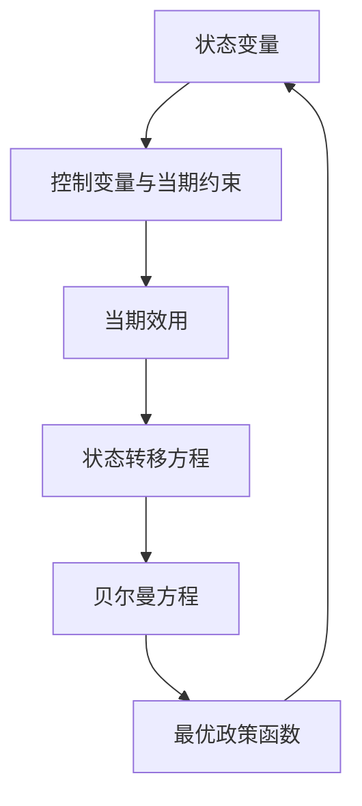

## 动态规划

> 核心关系：动态规划把跨期问题递归化，用当前状态概括过去信息，并由政策函数决定下一期状态。

## 从三期模型到递归方法

三期模型的计划最优问题：

$$\max_{c_1,k_1,c_2,k_2,c_3}\ u(c_1)+\beta u(c_2)+\beta^2 u(c_3)\quad s.t.\quad c_t+k_t=f(k_{t-1}),\ t=1,2,3$$

标准拉格朗日法对 5 个决策变量求导，得到 2 个资本供给函数加 3 个资源约束。为理解处理任意期乃至无穷期问题的方法，改用递归方法。行为人的动态选择只与相邻两期有关，这一观察配合倒推构成动态规划的基础。

现代宏观经济学的大部分模型是无穷期优化问题。若行为人知道自己何时死亡，行为会大受影响；现实中个人与企业都不知道，都假设生命将继续。无穷期最优化问题的标准工具就是动态规划。

## 状态变量与控制变量

同一变量站在不同时间点看属性不同。对第三期，$k_2$ 是提前决定的，但从更早看是内生的，称为内生的状态变量。

**状态变量**：期初给定、影响后续决策的变量。状态变量对应存量，变化平稳。**控制变量**：行为人在当期选择的变量，对应当期决策，可以跳跃。**政策函数**：状态变量到控制变量的映射，反映最优决策与状态的对应关系。**值函数**：给定状态时所能获得的最大总折现效用。

## 逆向归纳求解

第三期子问题：给定状态 $k_2$，最大化 $u(c_3)$。由终端条件 $k_3=0$ 得 $c_3^*=f(k_2)$，第三期值函数 $V_3(k_2)\equiv u(f(k_2))$。政策函数 $g(k_2)=0$ 是常数函数。

第二期子问题：$\max\ u(c_2)+\beta V_3(k_2)$，约束 $c_2+k_2=f(k_1)$。一阶条件：

$$u'(c_2)=\beta u'(c_3)f'(k_2)$$

即欧拉方程，隐含给出政策函数 $k_2=g(k_1)$，回代得 $V_2(k_1)=u(c_2^*)+\beta V_3(k_2^*)$。

第一期子问题：$\max\ u(c_1)+\beta V_2(k_1)$，约束 $c_1+k_1=f(k_0)$，欧拉方程为 $u'(c_1)=\beta u'(c_2)f'(k_1)$，解出 $k_1=g(k_0)$ 与 $V_1(k_0)$。

欧拉方程的经济学直觉：今天少消费一单位，损失边际效用 $u'(c_t)$；把这一单位存成资本，明天多产出 $f'(k_t)$，带来折现边际效用 $\beta u'(c_{t+1})f'(k_t)$。最优配置时两者相等，否则可跨期再配置提高总效用。

第二期与第三期的政策函数形式不同：有限时间下最后一期有终端条件，不再留资本；若时间无限且各期结构相同，则存在时不变的政策函数 $k_{t+1}=G(k_t)$，模型变得可处理。这是动态规划最关键的洞见。

## 包络定理

对 $V_2(k_1)$ 关于状态变量 $k_1$ 求导，除直接效应 $u'(c_2^*)f'(k_1)$ 外，还有通过最优控制变量 $k_2^*$ 产生的间接效应。由第二期欧拉方程，间接效应中的中括号项恰好为零。由此：

$$\frac{\partial V_2}{\partial k_1}=u'(c_2^*)f'(k_1)$$

**包络定理**：值函数对状态变量求导时，所有经最优控制变量的间接导数均为零，只考虑直接效应。包络定理在微观与宏观的最优化分析中通用，是推导值函数对状态导数与欧拉方程的标准工具。

## 贝尔曼方程

把三期问题的最大总折现效用记为 $v(k_0)$，逐层代入后发现它只依赖初始资本。一般地，任意期限的问题满足贝尔曼方程：

$$v(k_t)=\max_{c_t,k_{t+1}}\{u(c_t)+\beta v(k_{t+1})\},\qquad c_t+k_{t+1}=f(k_t)$$

未知量是整个函数 $v(\cdot)$ 而非某个数，贝尔曼方程是泛函方程。离散时间下表现为差分方程形式。

动态规划由贝尔曼创立，核心思想是把一个具体问题嵌入一族问题：对每个可能的初始状态都定义同一类问题，解出这一族中的问题等于解出整族。必要性在于逆向归纳的每一步都需要从下一期各状态出发的最优值，必须预先掌握整张值函数表。

**最优性原理**：最优路径的任何尾段仍是最优的。五阶段最短路问题中，若 $E\to H\to J\to Z$ 是 $E$ 到 $Z$ 的最短路，则 $H\to J\to Z$ 必是 $H$ 到 $Z$ 的最短路。求 $A\to Z$ 的最短路必须对每个中间节点标注该节点到 $Z$ 的最短距离，从终点逆向逐阶段推进。

值函数是间接效用函数性质的泛函，满足函数方程，是"函数的函数"。数值求解贝尔曼方程有两条路径。时间迭代先假设有限期界，从初值 $V_0$ 不断迭代得到 $V_1,V_2,\dots$，时间维度推向无穷时函数序列可能收敛到方程的解。算子法把方程右端定义为算子 $T$，方程化为 $TV=V$，即求不动点，与一维例子 $f(x)=x$ 迭代到 45 度线交点的几何直观一致。

## 吃蛋糕问题

吃蛋糕问题给出贝尔曼方程的显式求解。蛋糕初始规模 $A_0=1$、$\beta=0.5$、对数效用、三期吃完：$\max\sum_{t=1}^{3}\beta^{t-1}\ln c_t$，约束 $c_t=A_{t-1}-A_t$。

第三期 $A_3=g(A_2)=0$、$c_3=A_2$、$v_3(A_2)=\ln A_2$。第二期一阶条件 $-1/(A_1-A_2)+\beta/A_2=0$ 解得 $A_2=\frac{\beta}{1+\beta}A_1$、$c_2=\frac{1}{1+\beta}A_1$。第一期同理解得 $A_1=\frac{\beta+\beta^2}{1+\beta+\beta^2}A_0$。

数值结果：$A_1=3/7\approx0.429$、$A_2=1/7\approx0.143$、$A_3=0$；$c_1=4/7\approx0.571$、$c_2=2/7\approx0.286$、$c_3=1/7\approx0.143$。$0<\beta<1$ 意味着越晚的消费折现越重，最优消费路径逐期递减，剩余蛋糕按 $1/(1+\beta)$ 比例几何收缩。
