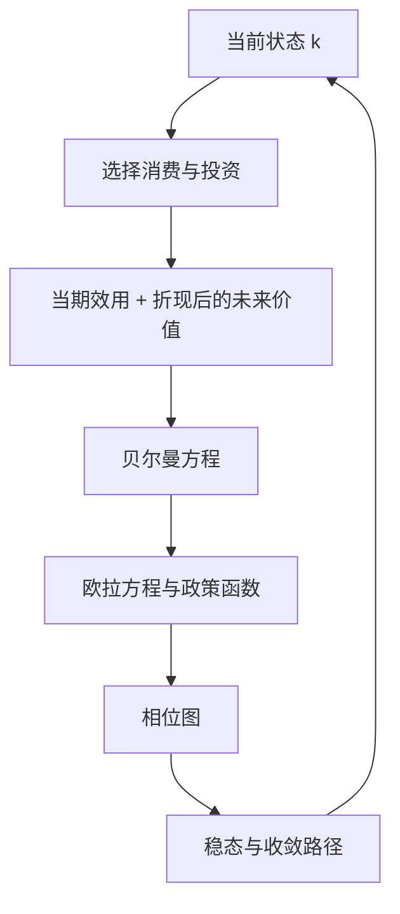

## 无限期动态模型

> 核心关系：无限期模型在贝尔曼递归下同时产生最优条件、状态转移和稳态动态。

## 社会计划者问题

封闭经济中一个寿命无限的代表性消费者与一个代表性企业，时间离散 $t=0,1,2,\dots$。偏好为 $\sum_{t=0}^{\infty}\beta^t u(c_t)$，效用函数连续可微、严格递增、严格凹、满足稻田条件。技术 $y_t=F(k_t,n_t)$ 一次齐次、严格准凹，资本按 $k_{t+1}=(1-\delta)k_t+i_t$ 积累，资源约束 $c_t+i_t\le y_t$，人口约束 $n_t\le 1$。

横截性条件为 $\lim_{t\to\infty}\beta^t k_t=0$：时间趋于无穷时不再持有资本。欧拉方程是二阶差分方程，仅有初始资本 $k_0$ 得不出唯一解，横截性条件帮助确定具体解。动态规划保证优化问题解的存在唯一，横截性条件配合初始条件保证模型动态解的确定，两者是不同的概念。

社会计划者问题：

$$\max\sum_{t=0}^{\infty}\beta^t u(c_t)\quad s.t.\quad c_t+k_{t+1}=f(k_t),\ k_0\ \text{给定}$$

其中 $f(k_t)\equiv F(k_t,1)+(1-\delta)k_t$ 表示当期所有可用于消费与投资的产品总量。效用函数不含劳动，多工作不带来负效用，计划者必取 $n_t=1$。依据福利经济学第一定理，竞争均衡的数量解等于帕累托最优数量解，先求数量后求价格。

## 贝尔曼方程与猜解法

从任何一期重新开始的无穷期问题结构都与第 0 期完全相同，值函数对所有期取统一函数形式。贝尔曼方程：

$$V(k_t)=\max_{c_t,k_{t+1}}\{u(c_t)+\beta V(k_{t+1})\},\qquad k_{t+1}=f(k_t)-c_t$$

转换方程给定 $k_t$ 后决定 $c_t$ 即决定 $k_{t+1}$。状态变量 $k_t$ 是过去所有决策的凝结，控制变量 $c_t$、$k_{t+1}$ 由行为人在当期决定。

三种求解方法：猜解法、值函数迭代、政策函数迭代。猜解法只适用于极小部分情形。

猜解法实例：$u(c)=\ln c$、$F(k,n)=k^\alpha n^{1-\alpha}$、$\delta=1$。猜测 $V(k_t)=A+B\ln k_t$，代入猜测、对 $k_{t+1}$ 求一阶条件得含 $B$ 的政策函数，代回原方程比较 $\ln k_t$ 项与常数项，解出 $B=\alpha/(1-\alpha\beta)$。政策函数：

$$k_{t+1}=\alpha\beta k_t^\alpha$$

计划者把总产出的固定比例 $\alpha\beta$ 储蓄起来，其余消费掉，储蓄率与资本存量水平无关。该结论依赖对数效用加柯布-道格拉斯技术，一般形式不成立，猜出的解的唯一性由压缩映射定理保证。

猜解法的标准流程：代入猜测的函数形式，对控制变量求一阶条件得到含待定系数的政策函数，把政策函数代回原方程，按 $\ln k_t$ 项与常数项合并同类项，解出待定系数。该流程依赖对数效用这一特殊函数形式，换用其他效用函数猜解不成立。同类问题是无限期吃蛋糕问题：第一期期初有 $A_0$ 单位消费品，结构与上述例题完全一致。

## 欧拉方程

把约束代入贝尔曼方程后对 $k_{t+1}$ 求一阶条件：$u'(f(k_t)-k_{t+1})=\beta V'(k_{t+1})$。由包络定理 $V'(k_t)=u'(c_t)f'(k_t)$，其中 $f'(k_t)=F_1(k_t,1)+1-\delta$。把包络结果前推一期并替换一阶条件中的 $V'(k_{t+1})$，得欧拉方程：

$$u'(c_t)=\beta u'(c_{t+1})[F_1(k_{t+1},1)+1-\delta]$$

方括号内是资本的边际回报。欧拉方程刻画消费与投资跨期动态取舍的决策法则，是考试重点。拉格朗日法推出同一方程。

## 相位图与稳态

资本运动方程 $k_{t+1}=f(k_t)-c_t$ 与欧拉方程构成二维一阶非线性差分方程组。宏观经济学家最关心模型是否存在稳态均衡、达到稳态后的特征，分析工具是相位图。

$c$ 的动态学：令 $c_{t+1}=c_t$，由欧拉方程得 $F_1(k,1)=\rho+\delta$。$F_1$ 关于 $k$ 单调递减且满足稻田条件，与水平线 $\rho+\delta$ 恰有一个交点 $k^*$，$c_{t+1}=c_t$ 轨迹是过 $k^*$ 的垂直线。$k<k^*$ 时消费向上运动，右侧反之。

$k$ 的动态学：令 $k_{t+1}=k_t$，得 $c_t=F(k_t,1)-\delta k_t$，该轨迹是倒 $U$ 形抛物线。顶点 $F_1(k,1)=\delta$ 对应黄金律资本存量 $k^{**}$，使稳态消费达到最大值。由于 $\rho+\delta>\delta$ 且 $F_1$ 递减，恒有 $k^*<k^{**}$：稳态资本低于黄金律资本，只要贴现率 $\rho>0$，理性的社会不会把资本积累到黄金律水平。

两轨迹交于稳态点 $E$，把平面分成四个区域。左下与右上区域沿鞍点路径收敛到 $E$，左上与右下区域发散。稳态资本存量满足 $F_1(k^*,1)=1/\beta-1+\delta$，仅与贴现因子、折旧率有关，与效用函数形式无关。

## 竞争均衡

消费者把资本租给企业并向企业出售劳动，问题是：

$$\max\sum_{t=0}^{\infty}\beta^t u(c_t)\quad s.t.\quad c_t+k_{t+1}=w_t+(1+r_t)k_t$$

与社会计划者问题仅两处不同：预算约束含价格，即工资收入加资本性收入；横截性条件用利率表述而非 $\beta^t$。横截性条件为 $\lim_{t\to\infty}k_t/\prod_{i=0}^{t-1}(1+r_i)=0$。同样流程得消费者欧拉方程 $u'(c_t)=\beta u'(c_{t+1})(1+r_{t+1})$。

企业每期最大化利润，一阶条件 $F_1(k_t,n_t)=r_t+\delta$、$F_2(k_t,n_t)=w_t$。由企业一阶条件得 $r_t=F_1(k_t,1)-\delta$，代入消费者欧拉方程即得社会计划者的欧拉方程，消费变动路径完全相同，与福利经济学第一定理相互印证。给定 $k_0$，由政策函数迭代出资本序列，再由约束求出消费序列，代回一阶条件即得实际利率与工资序列。
