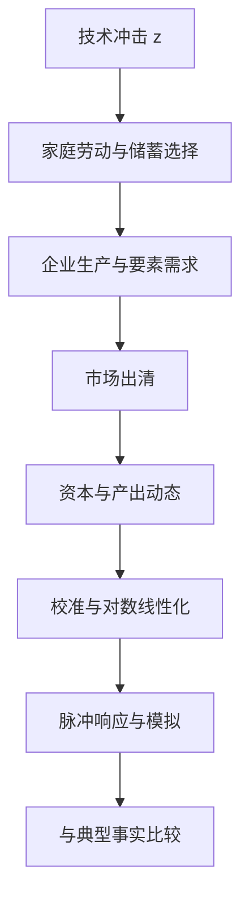

## 真实经济周期模型

> 核心关系：RBC 模型把技术冲击经由家庭、企业和市场出清传导到产出、资本与劳动的周期波动。

## 模型主张与结构

真实经济周期模型（RBC）基于新古典随机增长模型（Brock-Mirman 模型）并加入劳动-闲暇选择，主张经济周期波动是经济主体对技术进步随机变化的最优反应。货币因素与金融因素不解释波动，因此称"真实"经济周期。货币、金融摩擦、信息不对称、财政货币政策变化也带来短期波动，RBC 提供的是基本解释框架。

模型由大量相同的无限期生命家庭与大量相同企业组成。代表性家庭：

$$\max_{c_t,h_t}\ E_0\left[\sum_{t=0}^{\infty}\beta^t u(c_t,1-h_t)\right]\quad s.t.\quad k_{t+1}+c_t=w_t h_t+(1+r_t)k_t$$

与确定性模型的唯一差别是期望算子 $E_0$，模型带有不确定性。理性预期指家庭用正确概率计算条件数学期望。只有总体冲击，没有个体冲击，个体冲击被完备市场抹平。无市场摩擦，第一福利定理成立，可解社会计划者问题。

外生增长源：劳动增强型技术 $A_{t+1}=(1+g_A)A_t$ 与人口 $N_{t+1}=(1+g_N)N_t$。唯一随机项为全要素生产率冲击 $Z_{t+1}=Z_t^{\rho}e^{\varepsilon_{t+1}}$，取对数得 $\log z_{t+1}=\rho\log z_t+\varepsilon_{t+1}$，即一阶自回归 AR(1) 过程。$\rho<1$ 平稳，$\rho=1$ 随机游走。生产函数取 Cobb-Douglas 型：$Y_t=Z_tK_t^{\alpha}(A_tN_th_t)^{1-\alpha}$。

## 去趋势与滤波

经济周期定义为对长期增长趋势的偏离。若 $Y_t=(1+g)^tY_0$，取对数得 $\log Y_t=\log Y_0+t\log(1+g)$，$g$ 很小时 $\log(1+g)\approx g$，对数产出为线性趋势。

三种滤波方法。线性去趋势假设趋势确定性，$Y_t=(1+g)^tY_0e^{u_t}$，用 OLS 估计，周期成分为残差；该假设被 Nelson-Plosser (1982) 时间序列文献挑战，确定性趋势法得到的波动高达 8%-10%，已基本无人使用。一阶差分滤波假设趋势随机，周期成分为对数产出的一阶差分减样本均值，隐含常数平均增长率假设。HP 滤波最小化拟合优度加平滑惩罚项之和，$\lambda=0$ 时趋势等于原始数据，$\lambda\to\infty$ 时退化为线性趋势，季度数据惯例 $\lambda=1600$。

真实数据与模型模拟数据必须用同一种滤波，季度数据要先做季节性调整。

## 经济周期典型事实

刻画经济周期关注三个维度：波动幅度、与产出的共动程度、相对周期的相位。同期相关系数为正即顺周期，为负即逆周期，序列前移后相关为正即领先变量。就业与 GDP 正相关是顺周期变量，政策利率与产出负相关是逆周期变量。

美国数据（1954:I-1991:II）典型事实：消费与资本存量的波动远小于产出；投资的波动远大于产出，总投资标准差 8.24%，约为 GNP（1.72%）的 5 倍；总工时波动几乎与产出一样大（1.59%）；实际工资与实际利率非常平缓，工资与产出的相关性很小；消费、投资、工时高度顺周期。

## 平衡增长路径

平衡增长路径指人均产出、人均资本、人均消费以相同恒定速率增长的长期稳态。用增长率因子 $\gamma_V\equiv V_{t+1}/V_t$ 与人均变量 $y_t\equiv Y_t/N_t$。

由资源约束推出人均资本增长率。BGP 上 $\gamma_k$ 为常数，可证明 $y_t/k_t$、$c_t/k_t$ 必须为常数，故 $\gamma_k=\gamma_y=\gamma_c$。令 $X_t\equiv A_th_t/k_t$，由规模报酬不变得 $\gamma_k=\gamma_A\gamma_h$。$\gamma_h$ 大于 1 则劳动时数无限增加、小于 1 则递减为零，均非最优，故 $\gamma_h=1$。最终结论：$\gamma_k=\gamma_y=\gamma_c=\gamma_A$ 且 $\gamma_h=1$。

工资与技术进步同速增长，资本回报为常数。消费以恒定速率增长要求跨期替代弹性与消费水平无关，这构成对效用函数形式的限制。

## 效用函数与期内最优

与平衡增长路径相容的效用函数，课堂采用：

$$u(c_t,1-h_t)=\frac{(c_t(1-h_t)^{\theta})^{1-\sigma}-1}{1-\sigma}$$

期内消费-闲暇取舍为 $\theta c_t/(1-h_t)=w_t$。CRRA 情形下风险厌恶系数与跨期替代弹性是同一个系数 $\sigma$。工资永久性增长的两股力量：替代效应使闲暇更贵、劳动更多，收入效应使收入更高、闲暇更多。静态情形下两者恰好抵消，因此 BGP 上工资持续增长而劳动供给不变。

平稳化变量去除增长趋势：$\tilde{k}_t=K_t/[(1+g_A)^t(1+g_N)^t]$。平稳版本社会计划者问题导出两个关键方程。欧拉方程（跨期选择）：

$$1+g_A=\tilde{\beta}E_t\left[\left(\alpha Z_{t+1}\tilde{k}_{t+1}^{\alpha-1}h_{t+1}^{1-\alpha}+1-\delta\right)\left(\frac{\tilde{c}_t}{\tilde{c}_{t+1}}\right)^{\sigma}\left(\frac{1-h_{t+1}}{1-h_t}\right)^{\theta(1-\sigma)}\right]$$

期内劳动-闲暇取舍：

$$\frac{\theta\tilde{c}_t}{1-h_t}=(1-\alpha)Z_t\tilde{k}_t^{\alpha}h_t^{-\alpha}$$

两个方程分别对应跨期选择与期内选择。

## 参数校准

校准方法论：先令确定性版本与长期增长事实一致，再检验模型能否复制短期周期波动。用周期特征校准参数是自问自答式的循环论证。校准不是严格的统计估计，不计算标准误。模型一期为一个季度。

课堂校准参数：人口增长率 $g_N\approx0.0027$（年增 1.1% 的季度值），人均 GDP 增长率 $g_A\approx0.0055$（年增 2.2%），风险厌恶系数 $\sigma=1$（文献估计 1-3，经济周期文献常用对数效用），资本份额 $\alpha=0.4$（资本收入份额 30%-40%），折旧率 $\delta\approx0.012$（由年度投资-资本比 0.076 与增长率反解），贴现因子 $\beta=0.987$（由资本-产出比约 3.32 与欧拉方程反解），闲暇权重 $\theta\approx1.78$（由 $h=0.31$、$\tilde{y}/\tilde{c}=1.33$ 反解）。中国消费占 GDP 约 40%，国别参数不同。

## 对数线性化

基本 RBC 模型是非线性随机差分方程组，一般无显式解，相位图方法失效。对数线性化的实质是在稳态附近做一阶泰勒展开。对数偏离 $\hat{x}_t\equiv\log x_t-\log\bar{x}$ 近似等于离开稳态的百分比偏离，核心替换式 $x_t\approx\bar{x}(1+\hat{x}_t)$。宏观经济波动小，一阶近似已相当精确。

任何方程对数线性化后不出现常数项：稳态关系恒成立，展开式的常数部分恰好被稳态关系消掉。操作步骤：写出约束与一阶条件、求稳态、对数线性化必要条件、待定系数法解递归运动规律、脉冲响应与模拟。

含期望的方程不能直接取对数减稳态：$E_t\log\neq\log E_t$（琴生不等式）。做法是先用精确恒等式 $x_t=\bar{x}e^{\hat{x}_t}$ 代入，再做一阶泰勒展开，一阶展开丢弃的二阶项恰好包含琴生不等式的偏差。

## 待定系数法求解

线性化后得到四方程线性差分系统（$\hat{k}$、$\hat{c}$、$\hat{z}$、$\hat{r}$），控制变量写成状态变量的线性函数，猜测 6 个待定系数：

$$\hat{k}_{t+1}=\nu_{kk}\hat{k}_t+\nu_{kz}\hat{z}_t,\quad \hat{c}_t=\nu_{ck}\hat{k}_t+\nu_{cz}\hat{z}_t,\quad \hat{r}_t=\nu_{rk}\hat{k}_t+\nu_{rz}\hat{z}_t$$

代入四个方程并匹配 $\hat{k}_t$ 与 $\hat{z}_t$ 的系数。利率方程不含 $t+1$ 项，直接解出 $\nu_{rk}=-(1-\beta(1-\delta))(1-\alpha)$、$\nu_{rz}=1-\beta(1-\delta)$。欧拉方程代入后系数相乘出现二次方程 $0=\nu_{kk}^2-\gamma\nu_{kk}+\frac{1}{\beta}$，取 $|\nu_{kk}|<1$ 的稳定根，否则资本路径爆炸、违反横截性条件。

校准参数代入后得带内生劳动的政策函数：$\hat{k}_t=0.97\hat{k}_{t-1}+0.08\hat{z}_t$、$\hat{c}_t=0.63\hat{k}_{t-1}+0.31\hat{z}_t$、$\hat{h}_t=-0.27\hat{k}_{t-1}+0.81\hat{z}_t$。

## 脉冲响应与模拟

校准技术冲击用索洛剩余估计：对生产函数取对数，$\log Z_t$ 为资本与劳动解释不了的部分，即全要素生产率度量，用 AR(1) 回归估计持续性 $\rho\approx0.95$、冲击标准差 $\sigma\approx1\%$。

脉冲响应给出一单位暂时性技术冲击后各变量的反应路径：投资上升最多、超过 6%，与数据中投资波动大匹配；产出上升约 1.2%，大于冲击本身，存在放大；劳动上升不到 1%；消费非常平滑；利率变动很小。$\rho$ 从 0.95 降到 0.8 时冲击衰减更快、回落更快，投资出现超调。

模拟用随机冲击序列驱动模型生成人造经济数据。模拟数据的矩匹配：GDP 标准差 1.25%、消费 0.29%、劳动 0.69%、投资 5.49%、利率 0.03%、技术 0.84%；与产出的当期相关消费 0.9、劳动 0.99、利率 0.99、投资与技术高达 1。各变量波动率的排序和顺周期性基本正确，但相关度过高。

## 劳动供给机制与模型评价

放大机制由劳动供给响应决定。代表作家庭的两条一阶条件：期内取舍 $\theta c_t/(1-h_t)=w_t$ 与欧拉方程 $1=\beta E_t[R_{t+1}c_t/c_{t+1}]$。劳动供给响应强度取决于跨期替代弹性，此处取 IES=1。若消费与闲暇可加可分，劳动供给的跨期替代弹性等于弗瑞希劳动供给弹性，微观数据估计小于 0.5，与模型设定冲突。真实就业由劳动力市场景气、岗位匹配决定，须用搜寻与匹配模型刻画。

模型评价（Kydland & Prescott 1982，2004 年诺贝尔经济学奖）。成功处：产出波动与数据接近，消费、投资、劳动高度顺周期，投资波动远大于其他变量，要素价格平滑。弱点：所有变量与产出的相关性过高；生产率波动与产出几乎同幅，模型内部传播机制不足；技术冲击太持久导致劳动波动过小；劳动供给弹性与微观证据冲突；没有失业概念。缺失成分：没有货币与财政政策、金融中介、价格黏性，TFP 冲击是否真外生存疑。

模型作为现代宏观的第一个标准模型提供了有微观基础、可匹配数据、严谨科学的研究范式。后续文献在它基础上逐项加入搜寻匹配、金融摩擦、新凯恩斯等成分，成就了现代宏观经济学。
